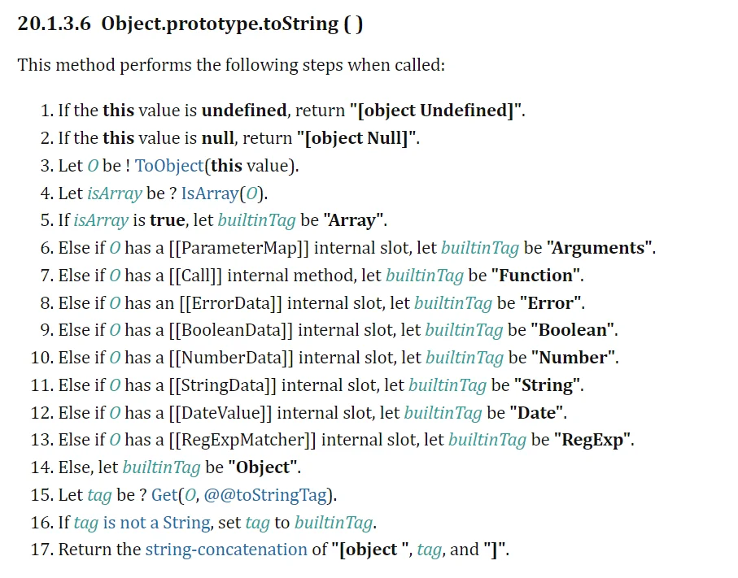

## 深入JavaScript数据类型

JavaScript包含以下几种数据类型：

- Number 数字
- String 字符串
- Boolean 布尔值
- Symbol 符号 （ES6新增）
- Object 对象
  - Function 函数
  - Array 数组
  - Date 日期
  - RegExp 正则表达式
  - ...
- null 空
- undefined 未定义

从语言底层值的可变与不可变，可以将JS中的数据分为两种：不可变值（原始类型）和可变值（引用类型）

除了Object及继承自Object的特殊对象，其他的类型都为**原始类型**。

## typeof运算符

除了null，所有**原始类型**都可以通过`typeof`运算符得到不同的结果

而null与object通过`typeof`运算符得到的结果都为`'object'`

```javascript
// 除了 null 其他原始类型的变量都可以通过 typeof 得到其类型
// 而 null 与 object 通过 typeof 运算得到的都是 'object'
const targets = [18, 'Ziu', true, Symbol(''), {}, null, undefined]

for (const t of targets) {
  console.log(typeof t) // number string boolean symbol object object undefined
}
```

### `typeof null === 'object'`

这里援引MDN的解释：

> 在 JavaScript 最初的实现中，JavaScript 中的值是由一个表示类型的标签和实际数据值表示的。对象的类型标签是 0。
> 
> 由于 null 代表的是空指针（大多数平台下值为 0x00），因此，null 的类型标签是 0，typeof null 也因此返回 "object"。

### 关于new操作符

所有使用 new 操作符调用的构造函数，都将返回非基本类型（object 或 function）

- 大多数返回的是一个对象，即 `object`
- 而构造函数Function返回的是 `function`

```javascript
// 针对普通构造函数
const str = new String('Ziu')
const num = new Number(100)

console.log(typeof str) // 'object'
console.log(typeof num) // 'object'

// 针对 Function 构造函数
const fun = new Function()
console.log(typeof fun) // 'function'
```

### 字符串原始值和字符串对象

typeof 操作符区分 `String` 对象和原始字符串值：

```javascript
const s1 = ''
const s2 = new String('')
const s3 = String('')

console.log(s1 instanceof String) // false
console.log(s2 instanceof String) // true
console.log(s3 instanceof String) // false
```

通过new操作符创建的是一个对象，它将被添加到原型链上（详见new一个对象时发生了什么）

而直接调用 String 函数，返回的是一个字符串原始值，本质上 `s3` 和 `s1` 是相同的

而`s1`变量自创建之初，就是原始类型，没有挂载到原型链上，自然也就无法通过`instanceof`检查一个对象

而之所以能够在`s1`上调用字符串的方法，是因为**包装类型**（见下文）

> instanceof 运算符用于检测构造函数的 prototype 属性是否出现在某个实例对象的原型链上。
> 
> 在本例中，instanceof用于检查s1变量的原型链上，是否包含构造函数String的显式原型（String.prototype），即：s1是否由String创建

## 包装类型

除了null和undefined，所有**原始类型**都有其相应的**对象包装类型**，例如`18`的对象包装类型是`Number`，而`'Ziu'`的对象包装类是`String`

这为处理原始值提供可用的方法，例如，`Number`对象提供了`toFixed()`这样的方法。

当我们在原始值上访问属性时，JavaScript会**自动将值包装到相应的包装对象中**，并访问对象上的属性：

```javascript
console.log((18.8).toFixed()) // '19'
console.log('Ziu'.toUpperCase()) // 'ZIU'
```

## 使用toString检查对象类型

由Object派生的每个特殊对象类型都有 `toString` 方法，而且他们都被不同程度的改写：

```javascript
// 注意，不应当在null或undefined上调用任何方法，这将抛出错误，因为他们没有对应任何包装类型
const targets = [18, 'Ziu', true, Symbol(''), {}, new Date()]

for (const t of targets) {
  console.log(t.toString()) // '18' 'Ziu' 'true' 'Symbol()' '[object Object]' Sat Feb 18 2023 20:49:31 GMT+0800 (GMT+08:00)
}
```

这个 `toString` 方法定义在 Object.prototype 上，被其他特殊对象类型所继承。

- 如果我们直接调用 `Object.prototype.toString()` 那么得到的是 `[object Object]` 因为这是在Object上调用得到的结果
- 如果我们在各自不同的对象上调用 `toString` ，得到的是不同对象改写后的结果

因为Object是所有子类的父类，所以任何类型的对象都可以通过this绑定的方式，调用`Object.prototype.toString()`方法，返回该对象的类型的字符串表示

这也是大多数情况下判断对象类型的方法：

```js
function classof(target) {
  const res = Object.prototype.toString.call(target) // [object xxx]
  return res.slice(8, -1)
}

console.log(classof({})) // Object
```

### 核心原理

[深入Object.prototype.toString](https://juejin.cn/post/6844903477940846600)

参考ECMA6规范文档：[Object.prototype.toString()](https://tc39.es/ecma262/multipage/fundamental-objects.html#sec-object.prototype.tostring)

#### ES5标准下 `Object.prototype.toString` 执行原理

- 如果 `this` 是 `undefined`
  - 返回 `[object Undefined]`
- 如果 `this` 是 `null `
  - 返回 `[object Null]`
- 令 `O` 为以 `this` 作为参数调用 `ToObject` 的结果
- 令 `class` 为 `O` 的内部属性 `[[Class]]` 的值
- 返回三个字符串 `"[object"` `class` 以及 `"]"` 拼接而成的字符串。

#### ES6标准下 `Object.prototype.toString` 执行原理

`Object.prototype.toString()`被调用时，会进行如下步骤：



在ES6里，之前的内部属性 `[[Class]]` 不再使用，取而代之的是一系列的 internal slot

