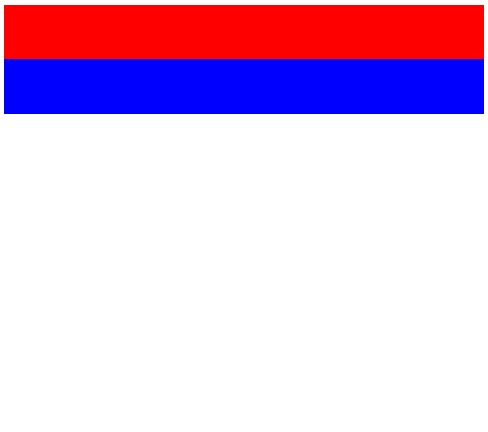
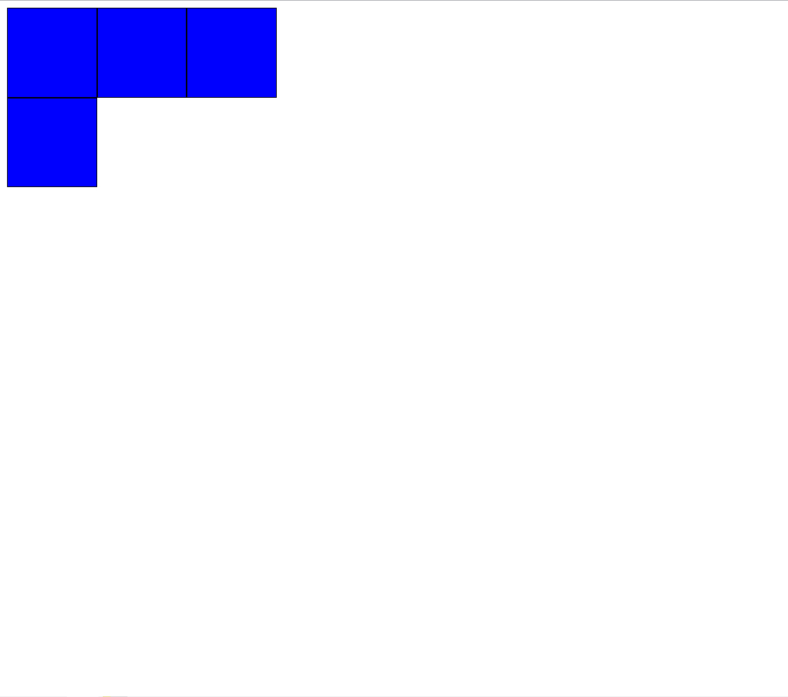
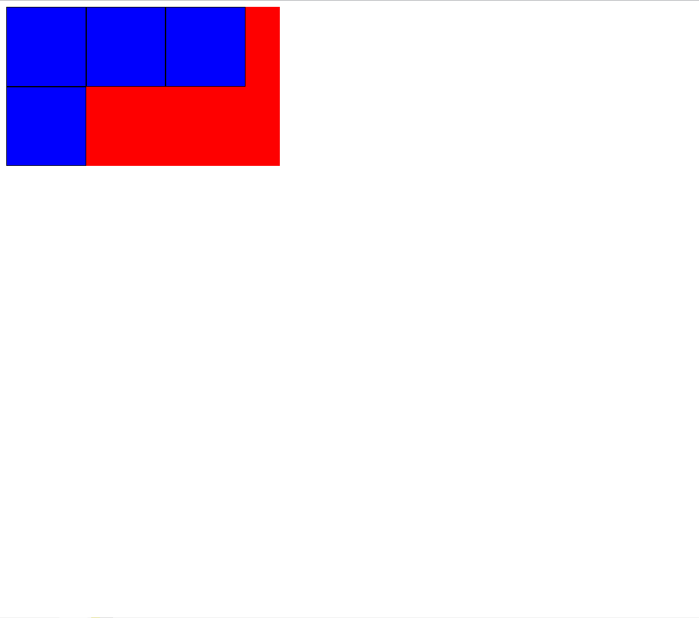

# CSS基础

CSS提供了三种方法，可以将CSS样式应用到元素上：

- 内联样式
  - 直接将样式写到元素的`style`属性上
- 内部样式表
  - 将样式通过`<style>`标签写在`<head>`标签中，通过选择器应用到元素上
- 外部样式表
  - 将样式写在外部文件如`style.css`中，再通过`<link>`标签引入

## 文本样式(text)

- text-decoration 框线样式
  - line-through 删除线
  - overline 上划线
  - underline 下划线
  - none 不设置装饰线
- text-transform
  - `text-transform` 属性指定如何将元素的文本大写。
  - 它可以用于使文本显示为全大写或全小写，也可单独对每一个单词进行操作。
- text-indent
  - `text-indent` 属性能定义一个块元素首行文本内容之前的缩进量。
- text-align
- word/letter-spacing

### text-align（重要）

行内内容（例如文字）如何相对它的块父元素对齐，`left`靠左 `center`居中 `right`靠右 `justify`两端对齐

默认值为`left`

需要注意的是，当子元素是`div`时，对父元素设置`text-align`是不生效的：

```css
.box {
  height: 500px;
  text-align: center;
  background-color: red;
}
.inner {
  height: 200px;
  width: 200px;
  background-color: blue;
}
```

然而此时`.inner`并没有在`.box`里居中对齐

`text-align`决定了**行内级元素在父元素中是如何对齐的**，而`<div>`元素默认的`display`属性是`block`块级元素，不属于行内级元素

可以将`.inner`的特性改掉：`display: inline-block;` 这样就可以通过`text-align`实现居中对齐了

另外的，如果为`.inner`设置`margin: 0 auto;`也可以实现居中对齐

### letter-spacing word-spacing（了解）

分别用于设置字母、单词之间的间距

默认为`0`，可以设置为负数

## 字体样式(font)

- font-size
- font-family
- font-weight
- line-height
- font缩写属性

### font-size

单位有`px` `em` `%` 可以被继承

- `px` 像素 `15px`
- `em` **相对父元素**字体大小的倍数 `1.5em`
- `%` **相对父元素**字体大小的倍数 `150%`

浏览器默认的字体大小是`16px`，这个值是因浏览器而异的，也与用户设置有关

### font-family（了解）

用于设置字体名称

- 可以设置1个或多个字体名称
- 浏览器会选择列表中第一个计算机中安装有的字体
- 或者是通过@font-face指定的可以直接下载的字体

### font-weight（重要）

用于设置文字的粗细

- 取值范围：1~1000
- normal：400
- bold：700

不同的浏览器展示效果是不同的

### font-style（了解）

设置文本样式

- normal：常规展示
- italic：斜体（可以使用字体自带的斜体字体）
- oblique：斜体（让文字倾斜展示）

### font-variant（了解）

可以改变小写字母的显示样式

- normal：常规战士
- small-caps：将小写字母替换为缩小后的大写字母

### line-height（重要）

`line-height`用于设置文本的行高：一行文本占据的高度

> 行高 = 文本占据的高度 + 平分剩余的空隙

#### 利用line-height实现垂直居中

行高 = **两行文字基线（baseline）之间的间距**

```css
.box {
  height: 200px;
  line-height: 200px;
  color: red;
}
```

此时`.box`内的文字将会垂直居中，如果是文本可以通过此方式

### font 缩写属性

font属性可以将上述所有属性表示出来：

- `font-style` `font-variant` `font-weight` `font-size/line-height` `font-family`
- 其中，前三个（`font-style` `font-variant` `font-weight`）可以随意调换顺序，也可以省略
- ` line-height`可以省略，如果不省略则必须跟在`font-size`后面
- `font-size`font-family` 不可以调换顺序，不可以省略

```css
.box {
  font: italic small-caps 700 30px/30px serif;
}
.box {
  font: 30px/1.5 serif;
}
```

需要注意的是，`font-size/line-height`中的`line-height`在书写时，不必一定要有单位，例如`30px/1.5`表示的是字体大小为30px 而行高为30px的1.5倍，即45px

## CSS选择器

- 通用选择器
- 简单选择器
  - 元素选择器 `img`
  - 类选择器 `.`
  - ID选择器 `#`
- 属性选择器 `h2[title=something]`
  - `*=` 属性包含某个值
  - `^=`属性以某值开始
  - `$=`属性以某值结尾
- 组合
- 伪类
- 伪元素

### 后代选择器

选择`.box`元素内的所有标签为`span`的子元素

```css
.box span {
  color: red;
}
```

匹配`div`元素下的所有**子元素**

```css
div * {
  color: red;
}
```

### 直接子代选择器

选择`.box`中为`span`的所有子元素，且该子元素是直接子代

```css
.box > span {
  color: red;
}
```

### 兄弟选择器

#### 相邻兄弟选择器

使用符号`+`连接

相邻的`.bro`兄弟元素的颜色为红色：

```css
.brother + .bro {
  color: red;
}
```

#### 普遍兄弟选择器

使用符号`~`连接

所有的`.bro`兄弟元素的颜色都为红色：

```css
.brother ~ .bro {
  color: red;
}
```

### 选择器组

#### 交集选择器

同时符合两个选择器条件，可以实现精准选择某一个元素

1.元素类型为`div` 2.类名为`.box`

```css
div.box {
  color: red;
}
```

#### 并集选择器

同时匹配多个元素，可以给多个元素设置相同的样式

```css
body, p, div, h2, span {
  margin: 0;
}
```

### 伪类

伪类是选择器的一种，它用于选择处于特定状态的元素

```css
div:hover {
  color: red;
}
```

#### 常见伪类

- 动态伪类
  - `:link` `:visited` `:hover` `:active` `:focus`
- 目标伪类
  - `:target` 匹配URL上的fragment
- 语言伪类
  - `:lang()`
- 元素状态伪类
  - `:enabled` `:disabled` `:checked`
- 结构伪类
  - `nth-child()` `:nth-last-child()` `nth-of-type()` `nth-last-of-type()`
  - `:first-child` `:last-child` `:first-of-type` `:last-of-type`
  - `:root` `:only-child` `:only-of-type` `:empty`

### 结构伪类

#### :nth-child

- `:nth-child(1)`
  - 父元素的**第一个子元素**
- `:nth-child(2n)`
  - `n`代表任意`正整数` 和 `0`
  - 是父元素中的第偶数个子元素（2 4 6 8 ···）
  - 与`:nth-child(even)`同义
- `:nth-child(2n+1)`
  - `n`代表任意`正整数` 和 `0`
  - 是父元素中的第奇数个子元素（1 3 5 7 ···）
  - 与`nth-child(odd)`同义
- `:nth-child(-n+2)`
  - 代表**前2个子元素**

#### :nth-last-child

- `:nth-last-child(···)`
  - 规则与`:nth-child`相同，但是是**从后向前数**

#### :nth-of-type

与`:nth-child`不同的是，`:nth-of-type`只会在相同类型的元素中计数并选中，忽略掉其他类型的元素

#### 其他常用结构伪类

上述结构伪类的简化写法

- `:first-child` 等同于 `:nth-child(1)`
- `:last-child` 等同于 `:nth-last-child(1)`
- `:first-of-type` 等同于 `:nth-of-type(1)`
- `:last-of-type` 等同于 `:nth-last-of-type(1)`

- `:only-child` 是父元素中唯一的子元素
- `:only-of-type` 是父元素中唯一的这种类型的子元素

- `:root` 根元素 也就是html元素
- `:empty` 代表里面完全空白的元素（没有子节点）

```css
:root {
  font-size: 16px;
}
```

等价于

```css
html {
  font-size: 16px;
}
```

#### 否定伪类

`:not(···)`

- `···`中填写的是一个简单选择器
- 元素选择器 通用选择器 属性选择器 类选择器 id选择器 伪类

### 伪元素

用于选中某个特定的元素

- `::first-line`
  - 对首行文本进行设置属性
- `::first-letter`
  - 对首个字母进行设置属性
- `::before`
  - 向目标元素前加入内容
- `::after`
  - 向目标元素后加入内容

伪元素采用`::`作为前缀用于和伪类作区分

`content`属性可以是字符串，可以是图片/SVG，也可以借助伪类插入图形

```css
.box::after {
  content: 'Something';
}
.box::before {
  content: url(../assets/icon.svg);
}
.box::after {
  content: '';
  /* 8*8正方形 */
  display: inline-block;
  height: 8px;
  width: 8px;
  background-color: red;
}
```

## CSS特性（重要）

- CSS属性的继承
- CSS属性的层叠
- HTML元素的类型
- display属性
- 元素的隐藏
- overflow属性

### 属性的继承

CSS的某些属性具有继承性

- 如果一个属性具备继承性，那么在该元素上设置后，它的后代元素都可以继承这个属性
- 如果后代元素自己设置有该属性，则会优先使用自己的属性

```css
.box {
  color: red;
}
```

```html
<div class="box">
  <span> Span1 </span>
  <span> Span2 </span>
  <span> Span3 </span>
</div>
```

上例中的`color`属性可以被`.box`的每个子元素继承，所有的`<span>`都为红色

常见的属性都是具有继承性的，不必特意去记忆

需要注意的是：子元素从父元素继承来的`font-size: 2em;`继承的是计算值，而不是原始值，如果父元素设置了`font-size: 2em;`，此时子元素再设置`font-size: 2em;`达到的效果实际上是在父元素的基础上的`2em`，实质上是`font-size: 4em;`

 #### 强制继承

当某些属性不具备继承性，但是我们希望子元素能直接继承时：

```css
.father {
  border: 2px soild red;
}
.child {
  border: inherit;
}
```

将属性值设置为`inherit`即可直接继承来自父元素的样式

### 属性的层叠

CSS的翻译是：层叠样式表，那么什么是层叠？

- 对于一个元素来说，相同的一个属性我们可以通过不同的选择器对它进行多次设置
- 那么属性会被一层层覆盖上去
- 但是最终只有一个会真正生效

多个样式属性覆盖上去，生效的顺序

- 选择器的权重，选择器权重更高的生效
- 先后顺序，权重相同时，后设置的生效

权重值：

CSS样式优先级：内联样式 > **ID选择器 > 类选择器 > 标签选择器** > 通配符

- !important 10000
- 内联样式 1000
- id选择器 `#` 100
- 类选择器、属性选择器、伪类 `.` `[]` `:hover` 10
- 元素选择器、伪元素 `button` `::before` 1
- 通配符 `*` 0

### HTML元素的类型

`<div>`是块级元素，会独占一行，而`<span>`是行内元素，会在同一行显示

HTML元素有很多，当把元素放到页面上时，元素被设置的CSS `display`属性决定了它占据页面中一行多大的空间

- 某些元素很重要，需要独占一行：块级元素（block-level）如 `h1` `div` `p`
- 某些元素属于内容的一部分，没有必要独占一行，与其他内容在同一行显示：行内级元素（inline-level）如 `span` `a` `img` `strong` `i`
- 块级元素会独占父元素的一行
- 多个行内级元素可以在父元素的同一行中显示

例如，我们手动修改`div`元素`display: inline-block;`那么它此时也会在行内显示，而不再独占一行

#### display属性

CSS的`display`属性可以修改元素的显示类型，有四个常用值

- `block` 让元素显示为块级元素
  - 块级元素 独占一行 可以设置宽度和高度
  - 如 `h1` `div` `p`
- `inline` 让元素显示为行内级元素
  - 行内级元素 和其他行内级元素在同一行显示 **不能设置宽度和高度** 其宽高由包裹的内容决定
  - 如 `span` `a` `img` `strong` `i`
- `inline-block` 让元素同时具备行内级、块级元素的特征
  - 行内块级元素 可以和其他行内级元素在同一行显示 **可以设置宽度和高度**
- `none` 隐藏元素

当我们为一个`div`元素设置了更小的宽度，它将仍然独占一行，剩余的宽度会被浏览器分配给了`margin-right: auto`填满一行

我们为`span`设置宽高时不会生效，但是为`img`设置宽高时则会生效，这是因为`img`元素是一个**行内替换元素**（官方文档），它具有以下特点：

- 和其他行内元素在同一行显示
- 可以被设置宽度和高度
- 类似的`video` `input`标签也是一个行内替换元素

#### 编写HTML时的注意事项

- 块级元素、`inline-block`元素
  - 一般情况下，可以包含其他任何元素，比如块级元素、行内级元素、inline-block元素
  - 特殊情况：p元素不能包含其他块级元素
- 行内级元素
  - 一般情况下，只能包含**行内级元素**

## CSS技巧

### 元素隐藏方法

- 方法一：display设置为none
  - 元素显示不出来 也不占据位置 **不占据任何空间**（和不存在此DOM元素一样）
- 方法二：visibility设置为hidden
  - 设置为hidden 虽然元素不可见 但是仍然**会占据元素应该占据的空间**
  - 默认值为visible 元素是可见的
- 方法三：rgba设置颜色 将a的值设置为0
  - rgba的a代表alpha值 可以设置透明度为0 **不影响子元素**
- 方法四：opacity设置透明度 设置为0
  - 设置整个元素的透明度 **会影响所有子元素**

### 样式不生效

- 选择器优先级太低
- 选择器未选中目标元素
- CSS属性使用形式不对
  - 元素不支持此CSS属性 比如`span`默认不支持width与height
  - 浏览器不支持此CSS属性 比如旧版本的浏览器不支持一些CSS Module3的某些属性
  - 被同类型的CSS属性覆盖 比如`font`覆盖了`font-size`

## CSS盒子模型

HTML中的每个元素都可以看做是一个盒子，可以具备以下四个属性：

- 内容 content
  - 元素的内容 width/height
- 内边距 padding
  - 元素和内容之间的间距
- 边框 border
  - 元素自己的边框
- 外边距 margin
  - 元素和其他元素之间的间距

### 内容 width / height

设置内容是通过width / height实现的，需要注意的是，对行内非替换元素来说，设置宽高是无效的

- `min-width` 最小宽度 无论内容为多少 宽度都大于等于 `min-width`
- `max-width` 最大宽度 无论内容为多少 宽度都小于等于 `max-width`
- 在移动端适配时 可以设置最大宽度和最小宽度

当我们不给元素手动设置`width`时，其默认值为 `width: auto;` 由浏览器决定其宽度

- 对于`div`这类块级元素 `auto` 代表其独占一行
- 对于`span`这类行内级元素 `auto` 代表其宽度与内容相同

### 内边距 padding

- padding包含四个方向：top right bottom left
- `padding: 5px 6px 7px 8px;` 对应上右下左
- `padding: 10px 20px 30px;` 缺少`left`，`left`使用`right`的值
- `padding: 10px 20px;` 上下`10px`，左右`20px`
- `padding: 10px;` 上下左右都为`10px`

### 边框 border

- 宽度 `border-width`
- 样式 `border-style`
- 颜色 `border-color`
- 圆角 `border-radius`
  - 值：具体数值或百分比
  - 百分比：相对于border-box的宽度/高度
  - `border-box`： 内容 + `pending` + `border`

缩写属性 `border: 1px soild red;`

### 外边距 margin

特性：上下的`margin`重叠部分会被折叠，但左右的`margin`不影响

`margin`同样由上下左右组成 可以缩写 规则同`padding`

当`margin-left`或`margin-right`的值为百分比时，它是相对于父元素宽度的偏移量

### 额外知识点

#### margin与padding比较

考虑嵌套元素：

```html
<div class="container">
  <div class="child"></div>
</div>
```

要将`.child`相对父元素下移10px 可以通过为`.container`设置`padding-top: 10px;` 也可以为`.child`设置`margin-top: 10px;`实现

但是需要注意的是，为`.container`设置`padding`时，其自身的宽度也会跟着改变，此时可以为`.container`设置`box-sizing: border-box;`来修正其宽度的改变

当为`.child`设置`margin`时，实际效果却是连带着父元素`.container`一起移动了，这时需要为`.container`设置`overflow: auto;`创建`BFC`

- margin 一般是用来设置兄弟元素之间间距的
- padding 一般是用来设置父子元素之间的间距

#### margin的传递和折叠

- `margin-top`的传递
  - 如果块级元素的顶部线和父元素的顶部线重叠，那么这个块级元素的`margin-top`值会传递给父元素
  - 左右`margin`是不会传递的
  - 这也是上例中为子元素设置`margin-top`时不生效的原因
- `margin-bottom`的传递（不常见 不常用）
  - 如果块级元素的底部线和父元素的底部线重叠，并且父元素的高度是`auto`，那么这个块级元素的`margin-bottom`值会传递给父元素
- 如何规避`margin`传递导致的问题
  - 给父元素设置`padding-top` / `padding-bottom`来实现相同的效果（推荐）
  - 给父元素设置带宽度的`border` 中止`margin`的传递（不好用）
  - 触发父元素的`BFC`：块级格式化上下文，给当前盒子建立一个独立的空间，不会再受外界属性的影响

- `margin`的折叠
  - 垂直方向上相邻的`margin-bottom` 与 `margin-top` 可能合并为1个`margin` 这种现象称为折叠
  - 水平方向上的`margin`不会发生折叠
  - 折叠的计算规则：两个值进行比较，取其中较大的值
  - 防止`margin`折叠：只设置其中一个元素的`margin`
  - 另外的 父子块级元素之间设置的`margin`也会发生折叠（不常见）

#### 块级元素的水平居中问题

问题：`text-align`只对行内级元素起作用，如果非要用此属性实现水平居中，可以将`div`改为`display: inline-block;`

块级元素一定占据父元素的整行，浏览器是依靠设置`margin: auto;`实现的，如果我们手动设置了`margin: 0;`那么该元素将无法整行显示，剩余的宽度空间会被默认分配给`margin-right`，让元素居左显示。

这时，我们可以为元素指定`margin: 0 auto;`让浏览器自动决定左右边距的大小，此时元素就可以居中显示了

### 外轮廓 outline

`outline`表示元素的外轮廓

- 不占用空间
- 默认显示在`border`的外面
- 例如通过Tab键选中`<a>`，或焦点位于`<input>`时的外轮廓 都是通过`outline`属性实现的

### 盒子阴影 box-shadow

`box-shadow`属性可以设置一个或多个阴影

- 每个阴影用`<shadow>`表示
- 多个阴影之间用逗号 `,` 隔开，从前到后叠加

参数说明：

- `offset-x` 水平方向偏移量 向右偏移
- `offset-y` 垂直方向偏移量 向下偏移
- `blur-radius` 模糊半径
- `spread-radius` 延伸半径
- `color` 阴影颜色 如果未设置 则会跟随`color`前景色
- `inset` 外框阴影变成内框阴影（不常用）

### 行内非替换元素的注意事项

盒子模型属性在某些**行内非替换元素**上不生效或具有特殊的特性：

- 例如对`<span>`设置`padding: 30px;`此时`padding`虽然会将`span`的背景颜色撑开，但是实际却不占用空间（上下不占用空间，但左右正常占用空间）
- 对`span`设置`border`也是一样的，会将背景颜色撑开，但是上下不占用空间，左右正常
- 对其设置的`margin`上下不会生效，左右正常

这是因为行内非替换元素本来就是在一个段落中和其他内容在一行里显示的，如果对某个元素设置了上下移动，整个段落布局将会被破坏

## CSS元素定位

- 标准流布局
- 相对定位
- 固定定位
- 绝对定位
- 粘性定位
- z-index

### 标准流

默认情况下，元素都是按照 Normal Flow 进行排布的（标准流、常规流、正常流、文档流 document flow）

- 从左到右、从上到下按顺序排好
- 默认情况下，互相之间不存在层叠现象

在标准流中想要调整元素之间的间距，可以使用`margin` 或 `padding`对元素进行定位

- 设置某一个元素的`margin` 或`padding` 就会影响到标准流中其他元素的定位效果
- 不便于实现元素层叠的效果

如果希望能实现层叠，将某个元素从标准流中移出，实现层叠的效果，需要设置元素的`position`属性，将元素**脱离标准流**

例如，为某个元素设置了`display: fixed;` 那么以后对这个元素设置的定位都不再对标准流中的其他元素造成影响了

### 认识元素的定位

定位允许你从正常的文档流布局中取出元素，并使它们具有不同的行为：

- 例如放在另一个元素的上面
- 或者始终保持在浏览器视窗的同一个位置

###  position属性取值

- `static` 静态定位 **默认值**

当`position`被设置为以下四个属性时，元素将变为定位元素

- `relative` 相对定位
- `absolute` 绝对定位
- `sticky` 粘性定位
- `fixed` 固定定位

#### static 静态定位

是`position`的默认值

- 元素按照normal flow布局
- `left` `right` `top` `bottom`均不起作用

#### relative 相对定位

- 元素仍然按照normal flow布局 （在标准流中）
- 可以通过`left` `right` `top` `bottom`进行定位
  - 定位参照对象是元素自己原来的位置（左上角）
- 当设置了`left`属性 元素将发生移动 但是原来占据的大小仍然被占据（仍然在标准流中）

应用场景：在不影响其他元素位置的前提下，对当前元素位置进行微调

```css
.span {
  font-size: 10px;
  position: relative;
  bottom: 8px;
}
```

```html
<div>
  2<span>3</span> = 8
</div>
```

这样最终的样式就成为了：$2^3=8$

>  绝对定位是相对于最近的一个定位元素

#### fixed 固定定位

- 元素脱离normal flow 
- 可以通过`left` `right` `top` `bottom`进行定位
- 定位的参照对象是视口（viewpoint）
- 当画布滚动时，固定不动

**当元素祖先的 transform  属性非 none 时，容器由视口改为该祖先。**

- 视口（ViewPort）：文档的可视区域
- 画布（Canvas）：渲染文档的区域 文档内容超出视口范围 则可以滚动查看
- 画布 >= 视口

#### absolute 绝对定位

- 元素脱离 normal flow
- 可以通过`left` `right` `top` `bottom`定位
  - 定位参照对象是**最邻近的定位祖先元素**
    - 定位元素：`position`值不为`static`的元素，即：`relative` `absolute` `fixed`
  - 如果找不到这样的祖先元素 参照对象是视口

`position: absolute;`一般与`position: relative;`共同使用，让父元素变成定位元素的同时不脱离标准流，还能让其中的子元素实现在父元素内的绝对定位。

#### sticky 粘性定位

- 可以看做是**相对定位和固定(绝对)定位的结合体**
- 它允许被定为的元素表现得像相对定位一样，直到它滚动到某个阈值点
- 当达到这个阈值点时，就会变成固定(绝对)定位

```css
.nav-bar {
  position: sticky;
  top: 0; /* 滚动出scrollport后元素固定的位置 */
}
```

`sticky`是相对于最近的滚动祖先包含视口的（the nearest ancestor scroll container's scrollport）

### 绝对定位元素的特点

此处的绝对定位 （*absolutely positioned element*）：`absolute` `fixed` 在某些情况下 二者的特性是相同的

- 可以随意设置宽高 `width` `height`
  - 即使这个元素是行内级元素 `span` `strong`
- 默认宽高由内容决定 （如果没有设置宽高 那么包裹元素）
  - 这个特性很像`inline-block` 行内级元素但是可以设置宽高（**但是实际上并不是**）
- 不再受标准流的约束
  - 不再严格按照从上到下、从左到右排布
  - 不再严格区分块级、行内级元素，很多元素特性都会消失
- 不再向父元素汇报宽高数据
  - 如果父元素没有设置宽高，子元素设置了绝对定位，那么此时父元素就会因失去高度而消失

|            | 脱离标准流 | 定位元素 | 绝对定位元素 | 定位参照物                                                   |
| :--------- | :--------: | :------: | :----------: | :----------------------------------------------------------- |
| `static`   |     ❌      |    ❌     |      ❌       | ❌                                                            |
| `relative` |     ❌      |    ✔     |      ❌       | 元素自身原来的位置                                           |
| `absolute` |     ✔      |    ✔     |      ✔       | 最临近的定位**祖先元素**（如果找不到这样的元素 参照对象为视口） |
| `fixed`    |     ✔      |    ✔     |      ✔       | 视口                                                         |

- 对于绝对定位元素来说
  - 定位参照对象的宽度 = `left` + `right` + `margin-left` + `margin-right` + 绝对定位元素的实际占用宽度
  - 定位参照对象的高度 = `top` + `bottom` + `margin-top` + `margin-bottom` + 绝对定位元素的实际占用高度

#### 例子1

下例中，`margin`的左右值被设置为了`auto` 

> 父元素的宽度 = 块级子元素自身宽度 + `margin-left` + `margin-right`

那么左右间距由浏览器决定，将剩余的宽度平均分配给`margin-left`和`margin-right`

```css
.container {
  width: 800px;
  height: 300px;
  background-color: red;
}
.box {
  height: 100px;
  background-color: green;
  
  width: 200px;
  margin: 0 auto;
}
```

```html
<div class="container">
  <div class="box"></div>
</div>
```

#### 例子2

在上例的基础上修改属性，此时子元素`.box`的相对定位相对的是父元素定位元素`.container`

此时满足公式

> .container width = .box width + `left` + `right` + `margin-left` + `margin-right`

```css
.container {
  position: relative;
}
.box {
  position: absolute;
  width: auto;
  left: 0;
  right: 0;
}
```

此时`.box`的`width`被修改为了默认值`auto` 且`left`和`right`被设置为了0，那么剩余的宽度将由`ml` `mr`的默认值决定，他们的默认值都为0，这时公式可以写作：`800px = auto + 0 + 0 + 0 + 0`，此时`.box`将占据100%

这和下面的代码是同等效果的：

```css
.container {
  position: relative;
}
.box {
  position: absolute;
  width: 100%;
}
```

#### 例子3

下例中，我们明确设置`.box`的宽度为`200px`，公式变为`800px = 200px + 0 + 0 + 0 + 0`，这时浏览器会默认将剩余的值都分配给`mr`（由不同浏览器决定）

```css
.container {
  position: relative;
}
.box {
  position: absolute;
  width: 200px;
  left: 0;
  right: 0;
}
```

在此基础上，我们修改代码，将`mr` `ml`都修改为`auto`，此时公式就变成了 `800px = 200px + 0 + 0 + auto + auto`，浏览器会将剩余值平均分配给`ml`与`mr` 即可实现水平居中

```css
.container {
  position: relative;
}
.box {
  position: absolute;
  width: 200px;
  left: 0;
  right: 0;
  margin: 0 auto;
}
```

水平方向是如此，那么同理，垂直居中也是一样的，在高度上也符合公式

> outer box height = inner box height + `top` + `bottom` + `margin-top` + `margin-bottom`

修改代码，为其添加上`top` `bottom`为0 并指定所有的`margin`都为`auto`（height在先前的代码设置过，此处只展示修改的代码）

公式变为 `300px = 100px + 0 + 0 + auto + auto`，`mt` `mb`由浏览器平均分配，可以实现垂直居中

```css
.container {
  position: relative;
}
.box {
  position: absolute;
  width: 200px;
  left: 0;
  right: 0;
  top: 0;
  bottom: 0;
  margin: auto;
}
```

至此，我们实现了元素的水平垂直居中：父元素设置相对定位，子元素设置绝对定位，子元素`left` `right` `top` `bottom`设置为`0`，`margin`都设置为`auto` 由浏览器平均分配

#### 总结

- 如果希望绝对定位元素的宽高和定位参照对象一样，可以给绝对定位元素设置以下属性
  - `left` `right` `top` `bottom`都为0，`margin`为0
- 如果希望绝对定位元素在定位参照对象中剧中展示，可以给绝对定位元素设置以下属性
  - `left` `right` `top` `bottom`都为0，`margin`为`auto`
  - 另外，还需要设置具体的宽高值，让宽高小于定位参照对象的宽高

#### auto值解读

为元素的属性设置`auto`并不代表着让这个元素居中，而是**交给浏览器处理，让浏览器决定其展示效果**

例如设置`800px = 200px + ml0 + mr0 + left(auto) + right(auto)`时并不会居中，浏览器对`left` `right`属性的`auto`值给出的默认行为是：该元素原来在哪里，那么就仍然放在哪里

以`width`属性为例：`width: auto;`

- 行内非替换元素：包裹内容
- 块级元素：包含块的宽度
- 绝对定位元素：包裹内容

### z-index解析

- `z-index`属性用来设置定位元素的层叠属性（仅对**定位元素**有效）
  - 只有定位元素才可能发生层叠，所以只有定位元素才能被设置`z-index`
  - 取值可以是**正整数、负整数、0** 默认值为 `auto`（`0`）
- 比较原则
  - 如果是**兄弟关系**
    - `z-index`越大，层叠在越上面
    - `z-index`相等，写在后面的那个元素层叠在上面
  - 如果不是**兄弟关系**
    - 各自从元素自己以及祖先元素中，找出最临近的2个定位元素进行比较
    - 而且这两个定位元素必须设置有`z-index`的具体数值

## 浮动布局

- 认识浮动
- 浮动的规则
- 浮动的案例
- 清除的问题
- 清除浮动
- 布局方案对比

### 认识浮动布局

float属性可以指定一个元素**沿其容器**的**左侧**或者**右侧**放置，允许**文本和内联元素环绕它**

- float属性最初只用于在一段文本内浮动图像，实现文字环绕的效果
- 但是早期CSS标准中并没有提供好的左右布局方案，因此在一段时间里面它成为网页多列布局的最常用工具
- 绝对定位、浮动都会让元素脱离标准流，以达到灵活布局的效果
- 可以通过`float`属性让元素产生浮动效果
  - 常用取值：`right` `left` `none`(默认值)

### 浮动案例

小问题：行内级元素如`<span>`之间的空格：

以下内容展示在浏览器上时，中间会出现间隙，这是因为浏览器将`<span>`之间的空格识别为了换行符

```html
<div class="box">
  <span>123</span>
  <span>asd</span>
  <span>www</span>
</div>
```

这样书写的时候，就不会有间隙了，但是代码的可阅读性大打折扣：

```html
<div class="box">
  <span>123</span><span>asd</span><span>www</span>
</div>
```

可以通过这样的方法解决，换行符的字体大小为0，自然就不再展示出来了：

```css
.box {
  font-size: 0;
}
.box span {
  font-size: 16px;
}
```

上述的方法不优雅，通过浮动来实现更优雅，所有的`<span>`都脱离标准流并且紧挨着：

```css
.box span {
  float: left;
}
```

### 浮动规则

- 元素一旦浮动 将脱离标准流
  - 朝着向左或向右方向移动，直到自己的边界紧贴着包含块（**一般是父元素**） 或者其他浮动元素的边界为止
  - 定位元素会层叠在浮动元素上面
  - 普通元素(`static`) < `float` < `!static`
- 如果元素是向左浮动，浮动元素的左边界不能超过**包含块**的左边界（右边界亦然）
  - 例如如果`div`设置了`padding` 那么浮动元素将至多浮动到`padding`的边缘 不会超过
- 浮动元素之间不能层叠
  - 如果一个元素浮动，另一个浮动元素已经在那个位置了，后浮动的元素将紧贴着前一个浮动元素
  - 如果水平方向剩余的空间不够显示浮动元素，浮动元素将向下移动，直到有充足的空间为止
  - 利用这个特性，可以实现元素基本的水平排布
- 浮动元素不能与行内级内容层叠，行内级内容将会被浮动元素推出
  - 比如行内级元素、`inline-block`元素、块级元素的内容
  - 浮动只能**在当前行**向左或向右浮动，而不能上下浮动
  - 可以利用这个规则实现图文混排 图文环绕效果

### 通过清除浮动实现布局(TODO)

**TODO: 案例 缺视频**

## Flex布局

- 认识flex布局
- flex布局的理解
- flex-container属性
- flex-item属性

### 认识Flex布局

- flexbox 弹性盒子
  - 弹性盒子是一种用于按行或按列(`flex-direction`)布局元素的一维布局方法(`grid`二维布局)
  - 元素可以膨胀以填充额外的空间 收缩以适应更小的空间（弹性 `flex-grow`拉伸元素）
  - 通常我们使用flexbox来进行布局的方案称之为 Flex布局（flex layout）
- flex 布局是目前web开发中使用最多的布局方案
  - flex布局 flexible布局 弹性布局
  - 目前特别在移动端已经完全普及
  - 在PC端也几乎完全普及和使用，少数网站仍然在用浮动布局
- 为什么需要Flex布局
  - 长久以来 CSS布局唯一可靠且跨浏览器兼容的布局工具只有floats和positioning
  - 这两种方法本身具有很大局限性 且属于无奈之举

### flex布局的重要概念

- 开启了flex布局的元素交 flex container
- flex container 里面的**直接子元素**叫 flex item

当flex container中的子元素变成了 flex item时，具备以下特点

- flex item的布局将受 flex container属性的设置来进行控制和布局
- flex item不再严格区分块级元素和行内级元素
- flex item默认情况下是包裹内容的，但是可以设置宽度和高度

设置 `display` 属性为 `flex` 或者 `inline-flex` 时，元素可以成为flex container

- `flex`: flex container以**block-level**的形式存在
- `inline-flex`: flex container以**inline-level**形式存在

主轴与交叉轴

- `flex-direction`: 设置主轴的方向`row` `row-reverse` `column` `column-reverse`
- 元素默认沿着主轴排列，主轴排列不下时沿着交叉排列

### flex相关的属性

#### 应用在 flex container 上的CSS属性

- `flex-flow`
  - 是`flex-direction`和`flex-wrap`的简写 顺序随意 且都可以省略
  - `flex-direction: column wrap;`

- `flex-direction`
  - items默认都是沿着main axis（主轴）从main start 向 main end方向排布的
  - flex-direction决定了 main axis的方向 有四个取值
  - `row` `row-reverse` `column` `column-reverse`
- `flex-wrap`
  - 当flex item放不下时会被自动压缩，填充满一行，即使我们设置了`width`属性，这是因为flex item的宽度和很多因素有关
  - flex-wrap属性决定了 flex container 是单行还是多行
    - `no-wrap` （默认值） 单行显示
    - `wrap` 多行显示
    - `wrap-reverse` 多行显示但是从下向上显示（沿着主轴的排列顺序不变）

- `justify-content`
  - 决定了 flex items在main axis上的对齐方式
    - `flex-start` （默认值） 与 main start 对齐
    - `flex-end` 与 main end 对齐
    - `center` 居中对齐
    - `space-between`
      - flex items之间的距离相等
      - 与 main start、main end 两端对齐

    - `space-around`
      - flex items之间的距离相等
      - flex items与main start 、 main end之间的距离是flex items之间距离的一半（左右距离等于items间距一半）

    - `space-evently`
      - flex items之间的距离相等
      - flex items与main start、main end之间的距离 等于flex items之间的距离（将剩下的距离全部等分）

- `align-items`
  - 决定了 flex items 在 cross axis 上的对齐方式
    - `normal` 在弹性布局中，效果和stretch一样
    - `stretch` 当 flex items 在 cross axis 方向的 size 为 `auto` 时，会自动拉伸至填充 flex container
      - `stretch` 要想生效，高度（宽度）必须为`auto`

    - `flex-start` 与 cross start 对齐
    - `flex-end` 与 cross end 对齐
    - `center` 居中对齐
    - `baseline` 与基准线对齐

- `align-content` (不常用)
  - 决定了多行 flex items 在 cross axis 上的对齐方式，用法与`justify-content`类似


#### 应用在 flex item 上的CSS属性

- `flex-grow`
  - 决定了 flex items 如何扩展（拉伸/成长） 
    - 可以设置任意非负数字（正小数 正整数 0） 默认值为0（不拉伸）
    - 当flex container在max axis 方向上有剩余size时，flex-grow属性才会生效

  - 给某一个item设置了grow时，那么剩余的空间都将分配给这个item 此item获得剩余空间并拉伸
  - 如果所有 flex items 的 `flex-grow` 属性总和超过1，每个flex item扩展的size为
    - flex container的剩余size * flex-grow / sum
    - flex items扩展后的最终size不能超过max-width / max-height

- `flex-basis` 
  - 用来设置flex items在main axis方向上的base size
  - auto（默认值）、具体的宽度数值（100px）

- `flex-shrink`
  - 决定 flex items 如何收缩
    - 可以设置任意非负数字（正小数、正整数、0）默认值为1，这也是为什么items填满一行后会自动压缩
  - 决定flex items最终的base size的因素，优先级从高到低：
    - max-width max-height min-width min-height
    - flex-basis
    - width height
    - 内容本身的size

- `order` (不常用)
  - 重新指定元素顺序，值越小排列越靠前，值越大排列越靠后
  - 支持正整数、负整数、0，默认值为0

- `align-self`
  - 指定某一个元素在 cross axis 上的对齐方式

- `flex`
  - 是一个缩写属性
  - `none`: 相当于设置了`flex: 0 0 auto` 分别代表`flex-grow` `flex-shrink` `flex-basis`
  - `auto`: 相当于设置了 `flex: 1 1 auto`
  - 如果只设置了一个值：
    - 无单位：`flex-grow`
    - 有单位：`flex-shrink`
  - 设置了两个值：
    - `flex: 1 1` `flex-grow` `flex-shrink`
    - `flex: 1 10px` `flex-grow` `flex-basis`

  - 设置了三个值
    - 对应设置即可 `flex: 1 1 10px;`


### 案例：解决布局问题

列表元素在向下排列时，如果遇到最后一行元素不能填满整行的情况，此时设置的`justify-content: space-between;`就会导致最后一行显示异常，要让最后一行能够居左对齐，可以采用这种方法：

```html
<div class="box">
  <div class="item"> Item </div>
  <div class="item"> Item </div>
  <div class="item"> Item </div>
  <div class="item"> Item </div>
  <div class="item"> Item </div>
  <span></span>
  <span></span>
</div>
```

```less
.box {
  width: 500px;
  display: flex;
  justify-content: space-between;
  flex-wrap: wrap;
  .item {
    width: 110px;
    height: 140px;
  }
  & > span {
    width: 110px;
  }
}
```

在列表元素末尾添加若干个`<span>`元素（行内级元素，数量为列数-2），并且为其设置宽度（不设置高度），当最后一行没被`.item`填满时，就由`<span>`补充，而其他的`<span>`由于没有高度，不会被展示，所以自然就会隐藏起来

## CSS中的函数

在前面我们使用过一些CSS函数：

- `rgb rgba translate rotate scale` 等
- CSS函数通常可以帮助我们更加灵活的来编写样式的值

下面我们再学习几个非常好用的CSS函数：

- `var` 使用CSS定义的变量
- `calc` 计算CSS值 通常用于计算元素的大小或位置
- `blur` 毛玻璃（高斯模糊）效果
- `gradient` 颜色渐变函数

### var  变量

CSS中可以自定义属性

- 属性名需要以两个减号（--）开始
- 属性值可以是任何有效的CSS值

```css
/* 两种方式皆可 */
/* 只在其后代元素内可以使用 */
.html {
  --primary-color: #fff;
}
:root {
  --primary-color: #0f0;
}
```

```css
.box {
  color: var(--primary-color);
}
.title {
  color: var(--primary-color);
}
```

规则集定义的选择器，是自定义属性的**可见作用域**（只在选择器内部有效）

所以推荐给自定义属性定义在`html`中，也可以使用`:root`选择器选中`html`，这样变量可以在全局使用

### calc 计算

```html
<div class="container">
  <div class="left-box"></div>
  <div class="right-box"></div>
</div>
```

```less
.container {
  width: 300px;
  .left-box {
    width: 50px;
  }
  .right-box {
    width: calc(100% - 50px)
  }
}
```

要让右侧的`.right-box`实现占满`300px - 50px`的剩余空间，且考虑左侧块宽度的动态伸缩

此处的`100%`代表了`width`属性的`100%`，而`width`的`100%`则代表相对于**包含块**（父元素）宽度的百分比

### blur 高斯模糊

blur函数可以将高斯模糊应用于输出图片或元素

- `blur(radius)`
- `radius` 模糊的半径 用于定义高斯函数的偏差值 偏差值越大 图片越模糊

通常会和这两个属性一起使用：

- `filter` 将模糊或颜色偏移等图形效果应用于元素
- `backdrop` 为元素后面的区域添加模糊或者其他效果

例如音乐歌词的背景展示的一般是音乐封面模糊+遮罩后的样式：

```css
.box {
  position: relative;
}
.cover {
  position: absolute;
  height: 100%;
  width: 100%;
  /* 添加模糊的同时 添加黑色半透明遮罩 */
  background-color: rgba(0, 0, 0, .2);
  backdrop-filter: blur(10px);
}
```

### gradient 颜色渐变

`gradient`是一种`<image>` CSS数据类型的子类型

- CSS 的 `<image>` 数据类型描述的是2D图形
- 比如`background-image list-style-image border-image content`等
- `<image>` 常见的方式是通过URL来引入一个图片资源

设置颜色渐变，本质上是设置了一张图片的颜色渐变。重点了解线性渐变的使用：

```css
.box {
  width: 100px;
  height: 100px;
  
  background-image: liner-gradient(to right, red, blue); /* 由红变蓝线性渐变 方向从左到右 */
  background-image: liner-gradient(to right top, red, blue); /* 方向右上角 */
  background-image: liner-gradient(45deg, red, blue); /* 方向45度 */
}
```

其他渐变函数：

- `radial-gradient()`
- `repeating-linear-gradient()`
- `repeating-radial-gradient()`

## CSS求值过程

- DOM树、样式规则
- filtering 对应用到该页面的规则用一下条件进行筛选：选择器匹配、属性有效、符合当前media等
  - 声明值 Declared Values 一个元素的某个属性可能有0 到多个声明值，比如 `p { font-size: 16px; }` 和 `p.text { font-size: 1.2em; }`
- cascading 按照来源、!important、选择器特异性、书写顺序等选出优先级最高的**一个属性值**
  - 层叠值 Cascaded Value 在层叠的过程中，赢得优先级比赛的那个值 比如`1.2em`
- defaulting 当层叠值无效或为空时，使用继承或者默认值
  - 指定值 Specified Value 经过cascading 和 defaulting 之后，保证指定值一定不为空
- resolving 将一些相对值或者关键字转化成绝对值，比如em转为px，相对路径转为绝对路径
  - 计算值 Computed Value 一般来说是浏览器在不进行实际布局的情况下，所能得到的最具体的值，比如60%
- formatting 将计算值进一步转化，比如将`inherit`、百分比转为绝对值
  - 使用值 Used Value 进行实际布局时使用的值，不会再有相对值或关键字，比如400.2px
- constraining 将小数像素值转为整数
  - 实际值 渲染上实际生效的值 比如400px

## 移动端开发

- 原生App开发
  - iOS Android RN uniapp Flutter
- 小程序开发
  - 原生小程序 uniapp Taro
- Web页面
  - 移动端的Web页面 可以使用浏览器或WebView浏览

自适应和响应式

- 自适应：根据不同的设备屏幕大小来自动调整尺寸、大小
- 响应式：会随着屏幕的实时变动而自动调整 是一种自适应

在PC端是不区分视口宽度的，在移动端可以通过`<meta>`标签设置布局视口的宽度：

`width`设置布局视口的宽度

```html
<meta name="viewport" content="width=980px">
<meta name="viewport" content="width=device-width">
```

为了避免布局元素放到不同宽度设备上展示会出现缩放，所以一般不会直接指定布局视口的宽度为某一值

而是设置为`device-width`等于设备的宽度

## 额外知识补充

### 浏览器前缀

有时候可能会看到：一些CSS属性名前带有前缀

`-o-* -xv-* -ms-* mso-* -moz-* -webkit-*`

```css
.box {
  -o-transform: translate(100px);
  -ms-transform: translate(100px);
  -webkit-transform: translate(100px);
  -moz-transform: translate(100px);
}
```

官方文档中称之为：vendor-specific extensions 供应商特定扩展

为什么需要浏览器前缀？ CSS属性在制定之初并没有成为标准，浏览器为了防止后续会修改名字，给新的属性添加了浏览器前缀

浏览器私有前缀，只有对应的浏览器才能解析

- -o-*  -xv-*  Opera等
- -ms-* mso-*  IE等
- -moz-  Firefox等
- -webkit-*  Safari  Chrome等

模块化打包工具会自动添加浏览器前缀

### 深入理解BFC（重点）

FC全称是 Formatting Context， 译作格式化上下文。元素在标准流里面都是属于一个BFC的

> Boxes in the normal flow belong to a formatting context, which may be block or inline, but not both simultaneously. Block-level boxes participate in a block formatting context. Inline-level boxes participate in an inline formatting context.
>
> 标准流中的元素属于格式化上下文，它可以是块级或行内级的，但不能同时是块级和行内级的。块级元素参与块级格式化上下文。行内级元素参与行内级格式上下文。

- 块级盒子都是在BFC (Block Formatting Context)中布局的（`div p h1 h2`）
- 行内元素都是在IFC(Inline Formatting Context)中布局的（`a span i`）

#### 在哪些具体情况下，会创建BFC呢？

> Floats, absolutely positioned elements, block containers (such as inline-blocks, table-cells, and table-captions) that are not block boxes, and block boxes with 'overflow' other than 'visible' (except when that value has been propagated to the viewport) establish new block formatting contexts for their contents.
>
> 浮动、绝对定位元素、不是块级元素的块容器（例如内联块、表格单元格和表格标题），以及`overflow`值不为`visible`的块级元素（除非该值已被传播到视口）为其内容建立新的块格式化上下文。

- 根元素 `<html>`
- 浮动元素 `float`不为`none`
- 绝对定位元素 `position`为`absolute`或`fixed`
- 行内块元素 `display`为`inline-block`
- 表格单元格 `display`为`table-cell` `table-caption`（表格单元格&表格标题默认值）
- 匿名表格单元格元素 `display`为`inline-table table table-row table-row-group table-header-group table-footer-group` （ HTML table 默认属性）
- `overflow`计算值 不为`visible`的块元素
- 弹性元素 `display`为`flex` `inline-flex`元素的直接子元素
- 网格元素 `display`为`grid` `inline-grid`元素的直接子元素
- `display`值为`flow-root`的元素

#### 形成BFC有什么作用？

> In a block formatting context, boxes are laid out one after the other, vertically, beginning at the top of a containing block. The vertical distance between two sibling boxes is determined by the 'margin' properties. Vertical margins between adjacent block-level boxes in a block formatting context collapse.
>
> 在块格式化上下文中，框从包含块的顶部开始一个接一个地垂直放置。两个同级框之间的垂直距离由“边距”属性确定。块格式化上下文中相邻块级框之间的垂直边距折叠。
>
> In a block formatting context, each box's left outer edge touches the left edge of the containing block (for right-to-left formatting, right edges touch). This is true even in the presence of floats (although a box's line boxes may shrink due to the floats), unless the box establishes a new block formatting context (in which case the box itself may become narrower due to the floats).
>
> 在块格式上下文中，每个框的左外边缘接触包含块的左边缘（对于从右到左的格式，右边缘接触）。即使存在浮动也是如此（尽管框的行框可能会因浮动而缩小），除非框建立了新的块格式上下文（在这种情况下框本身可能会因浮动而变窄）。

 在BFC中，所有的块级元素都会遵循BFC的规则排列：

- 块级元素在BFC中，会在垂直方向上一个接一个地放置
- 相邻块级元素之间的垂直边距会被折叠（`margin`的折叠特性`collapse`）
- 在BFC中，每个元素的左边缘紧挨着包含块的左边缘

**根据文档中的这段描述，就可以解释：为什么BFC可以解决`margin`的折叠问题、浮动高度塌陷的问题了**

#### BFC如何解决margin折叠问题

两个位于`body`下的块级元素在正常情况下按照BFC的排布规则，从上至下依次排列，二者之间没有距离

```html
<body>
  <div class="box1"></div>
  <div class="box2"></div>
</body>
```

```css
.box1 {
  height: 100px;
  background-color: red;
}
.box2 {
  height: 100px;
  background-color: blue;
}
```



我们为两个元素分别设置垂直方向的`margin`，此时BFC的规则就被触发了：**在同一个BFC中**，垂直方向的`margin`会发生折叠，取二者较大的值，真正的边距变成了`20px`，而不是臆想中的`30px`

```css
.box1 {
  height: 100px;
  background-color: red;
  margin-bottom: 10px;
}
.box2 {
  height: 100px;
  background-color: blue;
  margin-top: 20px;
}
```


这两个盒子位于同一个BFC之中进行布局：`<html>`标签形成的BFC

**那么我们让这两个盒子中的某个盒子形成一个新的BFC，让盒子在两个不同的BFC中进行布局，就可以解决`margin`的折叠问题**

我们在`.box1`外面包裹一个`.container`，并且为`.container`设置`overflow: auto;`。此时`.container`内就形成了一个新的BFC，`.box1`在这个新的BFC中进行布局，这样两个盒子就不会再出现`margin`折叠的问题了

```html
<body>
  <div class="container">
    <div class="box1"></div>
  </div>
  <div class="box2"></div>
</body>
```

```css
.container {
  overflow: auto;
}
.box1 {
  height: 100px;
  background-color: red;
  margin-bottom: 10px;
}
.box2 {
  height: 100px;
  background-color: blue;
  margin-top: 20px;
}
```

需要注意的是：

- 不要给`.box1`设置`overflow: auto;`，这是无效的，这只代表了`.box1`内形成了一个新的BFC，其中元素将在这个新的BFC中布局，而`.box1`仍然在`<html>`内的BFC中并未改变。
- 此时如果我们为`.container`设置了垂直方向的`margin`，`.container`仍然会与`.box2`发生边距折叠

#### BFC如何解决浮动高度塌陷问题

浮动布局元素没有高度，需要清除浮动

实质上，通过BFC来“清除浮动”的说法是存在误解的，我们此次从原理上解释：为什么BFC可以做到清除浮动的效果

下例中`.container`宽度为`350px`，其中包裹了四个浮动元素，一行最多容纳三个浮动元素，第四个浮动元素将换到下一行，可以发现`.container`的高度发生了塌陷，在页面上不可见，这是因为**浮动元素由于脱离了标准流，不会向父级元素汇报高度**

```html
<body>
  <div class="container">
    <div class="item"></div>
    <div class="item"></div>
    <div class="item"></div>
    <div class="item"></div>
  </div>
</body>
```

```css
.container {
  width: 350px;
  background-color: red;
}
.item {
  width: 100px;
  height: 100px;
  background-color: blue;
  border: 1px solid black; 

  float: left;
}
```



我们不能简单的从现象归纳本质：*BFC让浮动元素向父级元素汇报了高度，所以解决了高度塌陷的问题*

绝对定位元素`position: absolute | fixed;`也脱离了标准流，也不会向父元素汇报高度，相应的也会产生同样的父元素高度塌陷的问题

但是BFC能解决`float`的父元素高度塌陷问题，却无法解决绝对定位元素的高度塌陷问题

要通过清除浮动的方式解决，可以修改以下代码：

```html
<div class="container clear-fix">
  <div class="item"></div>
  <div class="item"></div>
  <div class="item"></div>
  <div class="item"></div>
</div>
```

```css
.clear-fix::after {
  content: '';
  display: block;
  clear: both;
  height: 0;
  visibility: hidden;
}
```

相当于给父元素内部创建了一个新元素，这个元素在浮动元素的下面。

如果要使用BFC解决此方案，也十分简单：

```css
.container {
  width: 350px;
  background-color: red;
  overflow: auto;
}
```

给`.container`设置`overflow: auto;`，让`.container`创建一个新的BFC，这样之前的高度塌陷问题也能够被解决



官方文档中是这样解释的：

> In certain cases (see, e.g., sections 10.6.4 and 10.6.6 above), the height of an element that establishes a block formatting context is computed as follows:
>
> 在某些情况下（例如，参见上文第10.6.4和10.6.6节），建立块格式化上下文的元素的高度计算如下：
>
> If it only has inline-level children, the height is the distance between the top of the topmost line box and the bottom of the bottommost line box.
>
> 如果它只有内联级别子级，则高度是最上面的线框顶部和最下面的线框底部之间的距离。
>
> If it has block-level children, the height is the distance between the top margin-edge of the topmost block-level child box and the bottom margin-edge of the bottommost block-level child box.
>
> 如果它有块级子框，则高度是最上面的块级子盒的上边距边缘与最下面的块级个子盒的下边距边缘之间的距离。
>
> Absolutely positioned children are ignored, and relatively positioned boxes are considered without their offset. Note that the child box may be an anonymous block box.
>
> 绝对定位的子对象被忽略，相对定位的框被认为没有偏移。请注意，子框可能是匿名块框。
>
> In addition, if the element has any floating descendants whose bottom margin edge is below the element's bottom content edge, then the height is increased to include those edges. Only floats that participate in this block formatting context are taken into account, e.g., floats inside absolutely positioned descendants or other floats are not.
>
> 此外，如果元素有任何浮动子体，其底部边距边缘低于元素的底部内容边缘，则会增加高度以包括这些边缘。仅考虑参与此块格式化上下文的浮点数，例如，绝对定位子体内的浮点数或其他浮点数。

从原理上解释，要实现这样的效果必须同时满足两个条件：

- 浮动元素的父元素触发BFC，形成独立的块级格式化上下文
- 浮动元素的父元素的高度值为`auto`（`height`的默认值即为`auto`）

BFC的高度是`auto`的情况下，是按照如下方法计算高度的：

- 如果只有`inline-level`元素，是行高的顶部和底部的距离
- 如果有`block-level`元素，是由最底层的快上边缘和最底层块盒子的下边缘之间的距离
- 如果有绝对定位元素，它的高度将被忽略（`display: absolute | fixed;`）
- **如果有浮动元素，那么会增加高度以包括这些浮动元素的下边缘**

将`overflow`设置为`auto`是开发中较为常用的创建BFC的方法之一，这个方法的优点是简单且没有副作用（`overflow`默认值为`visibile`）

[W3C 9.4.1 Block formatting contexts](https://www.w3.org/TR/CSS2/visuren.html#block-formatting)

[W3C 10.6.7 'Auto' heights for block formatting context roots](https://www.w3.org/TR/CSS2/visudet.html)

### 媒体查询

媒体查询是一种提供给开发者针对不同设备需求进行定制化开发的一个接口，可以根据特定的特性比如屏幕的宽度来修改你的页面

媒体查询的使用方式主要有三种：

- 方式一：通过`@media @import`使用不同的CSS规则（常用）
- 方式二：使用`media`属性，为`<style> <link> <source>`和其他HTML元素指定特定的媒体类型
- 方式三：使用`Window.matchMedia()`和`MediaQueryList.addListener()`方法来测试/监控媒体状态

在日常开发中更为常用的是通过`@media`来应用不同的CSS规则

当屏幕宽度小于`800px`时，应用`miniScreen.css`的样式

```css
@import url(./css/miniScreen.css) (max-width: 800px);
```

```html
<link rel="stylesheet" media="(max-width: 800px)" href="./css/miniScree.css" />
```

```css
@media (max-width: 800px) {
  body {
    background: orange;
  }
}
```

#### 媒体类型

在使用媒体查询时，必须指定要使用的媒体类型

- 媒体类型是可选的，并且会隐式地应用`all`类型
  - 在书写`@media`时，后面的条件可以省略掉，省略时其值为`all`
- 常见的媒体类型值
  - all 适用于所有设备
  - print 适用于在打印预览模式下载屏幕查看的分页材料和文档
  - screen 主要用于屏幕（掌握）
  - speech 主要用于语音合成器

#### 媒体特性

媒体特性描述了浏览器、输出设备的具体特征

- 通常会将媒体特性描述为一个表达式
- 每条媒体特性表达式都用括号括起来

常用的媒体特性

- width 宽度
- height 高度
- color 颜色
- device-aspect-ratio 设备比例
- device-width 设备高度
- device-height 设备宽度
- orientation 方向：例如用户屏幕的旋转方向，根据横屏/竖屏应用不同的CSS样式
- resolution 分辨率

除了方向`orientation`，其余媒体特性都支持设置最大/最小值 `min-* max-*`

#### 逻辑操作符

当媒体特性中包含多个特性表达式，他们之间通过逻辑操作符连接起来

```css
@media (max-width: 800px) and (min-width: 200px) {
  body {
    color: red;
  }
}
```

- `and` 组合多个媒体查询规则
- `not` 否定媒体查询
- `only` 仅在整个查询都匹配时才应用样式
- `,` 逗号用于将多个媒体查询合并为一个规则

#### 常见的移动端适配

根据屏幕尺寸，动态修改`font-size`以优化文字在不同屏幕的展示效果

```css
@media (min-width: 320px) {
  body {
    font-size: 10px;
  }
}
@media (min-width: 768px) {
  body {
    font-size: 15px;
  }
}
@media (min-width: 1025px) {
  body {
    font-size: 20px;
  }
}
```

### link元素的使用

`link`元素是外部资源链接元素，规范了文档与外部资源的关系，通常位于`head`标签中

常见的应用：

- 最常用的链接是样式表（CSS）
- 用来创建站点图标（favicon）

常见的属性：

- `href`：此属性指定被链接资源的URL 可以是绝对的，也可以是相对的
- `rel`：指定链接类型，常见的链接类型：
  - `icon`：站点图标
  - `stylesheet`：CSS样式
  - （拓展）`dns-prefetch`：对链接指向的资源进行DNS预解析与协议握手

### CSS颜色的表示方式

CSS中的颜色为RGB表示法，每个位置的值的范围为`0~255`

```css
.div {
  /* 红色 */
  color: rgb(255, 0, 0);
  /* 黑色 */
  color: rgb(0, 0, 0);
  /* 白色 */
  color: rgb(255, 255, 255);
}
```

此处的`rgb()`是一个CSS函数，RGB颜色也可以用十六进制的方式表示：

```css
.div {
  /* 红色 */
  color: #ff0000;
  /* 黑色 */
  color: #000000;
  /* 白色 */
  color: #ffffff;
}
```

每2位数字代表了一个颜色的数值，当值为`255`时，即对应十六进制中的`FF`

除了使用RGB格式表示颜色，还有RGBA表示法，其中的A代表透明度

### 网络字体

 设置的`font-family`只有当字体在系统中存在才会被展示，如果要使用自定义的字体就需要用到网络字体

- 保存字体文件`xxx.ttf` 并放到对应的目录中
- 在CSS中通过`@font-face`引入字体，并设置格式
- 在CSS代码中使用该字体
- 部署静态资源时 将`HTML/CSS/Javascript/Font` 一起部署在静态服务器中

``` css
@font-face {
  font-family: 'ziu';
  src: url('./fonts/ZiuFont.ttf');
}
.box {
  font-family: 'ziu';
}
```

- 用户浏览一个网页时，因为代码中有引入字体文件，字体文件会被一起下载下来
- 浏览器会根据使用的字体，在下载的字体文件中查找、解析、使用对应的字体
- 在浏览器中使用对应的字体显示内容

#### 网络字体的兼容性

- 在上文中使用的字体文件是`.ttf` 它是TrueType字体
  - 在开发中某些浏览器可能不支持该字体 所以为了浏览器兼容性问题 我们需要有对应其他格式的字体
- TrueType字体 拓展名 `.ttf`
  - OpenType / TrueType 字体
    - 拓展名 `.ttf` `.otf`
    - 建立在TrueType字体之上
  - Embedded OpenType 字体
    - 拓展名是 `.eot` 
    - 是OpenType字体的压缩版
  - SVG 字体
    - 拓展名是`.svg` `.svgz`
  - WOFF 字体
    - 表示 WebOpenFontFormatWeb 开放字体
    - 拓展名是`.woff` 建立在TrueType上

### 字体图标

将字体直接设计为图标的样子

- 放大不会失真
- 可以任意切换颜色
- 用到很多图标时 文件相对图片较小

用例：在iconfont中收藏图标，到个人中心中下载代码，其中就包含字体图标文件，以`ttf`为后缀

```css
@font-face {
  font-family: 'iconfont';
  src: url(./fonts/iconfont.ttf);
}
i {
  font-family: 'iconfont';
}
```

```html
<i>\e63e</i>
```

在HTML中以`字体图标的Unicode`的方式引入，即可显示图标

更常见的做法，是通过伪元素引入字体图标

```css
.icon-video:before {
  content: '\e63e';
}
```

### 精灵图 雪碧图

CSS Sprite 是一种CSS图像合成技术 将各种小图片合并到一张图片上 然后利用CSS的背景定位 来显示指定位置的图片部分

- 减少网页的http请求数量 加快网页的响应速度 减轻服务器压力
- 减小图片总大小
- 解决了图片命名困扰 只需要针对一张集合的图片命名

将精灵图保存下来后，在代码中通过`background-image`引入

```css
i.hot-icon {
  /* background: url('../asset/topbar.png') no-repeat -192px 0; */
  background-image: url('../asset/topbar.png'); /* 引入精灵图 */
  background-repeat: no-repeat; /* 不重复显示 */
  background-position: -192px 0; /* 偏移到目标元素的位置(x,y) */
  
  /* 改为inline-block展示 使能width与height */
  display: inline-block;
  
  /* 宽高调整为要展示小图标的宽高 */
  width: 26px;
  height: 13px;
}
```

[SpriteCow 获取元素位置](http://spritecow.com)

### white-space

由于以下这段文字中包含空格、换行符，但是实际展示中空格和换行符会被合并，遇到完整单词时会发生换行

```html
<div class="box">
  我是Ziuuuuu         ziu Ziuuuuuuuu
  你好你好你好你好        你好你好 my name is ziu
</div>
```

```css
.box {
  white-space: nowrap; /* 不换行 */
}
```

`white-space`用于设置空白处理和换行规则

- normal 不换行 合并
- nowrap 不换行 不合并
- pre 换行 不合并
- pre-wrap 换行 合并

空格、Tab、

### text-overflow

text-overflow通常用来设置文本溢出时的行为

- clip 溢出的内容直接裁减掉（字符可能会显示不完整）
- ellipsis 溢出的那行结尾处用省略号表示

`text-overflow`生效的前提是`overflow`不为`visible`，例如`overflow: auto;`

**常用写法：**将超出部分隐藏，并且在末尾缀上`...`

```css
.title {
  width: 150px;
  
  overflow: hidden;
  white-space: nowrap;
  text-overflow: ellipsis;
}
```

### 水平垂直居中方案

#### margin: auto

> 父级设置为相对定位，子级绝对定位 ，并且四个定位属性的值都设置了0，那么这时候如果子级没有设置宽高，则会被拉开到和父级一样宽高
>
> 这里子元素设置了宽高，所以宽高会按照我们的设置来显示，但是实际上子级的虚拟占位已经撑满了整个父级，这时候再给它一个`margin：auto`它就可以上下左右都居中了

```css
div {
  width: 600px;
  height: 600px;
  position: relative;
}
img {
  position: absolute;
  margin: auto;
  top: 0;
  left: 0;
  right: 0;
  bottom: 0;
}
```

#### flex

> 利用flex，`align-items:center`是控制垂直方向居中，`justify-content:center`是控制水平方向的居中。

```css
div {
  width: 600px;
  height: 600px;
  display: flex;
  align-items: center;
  justify-content: center;
}
img {}
```

#### 负margin

> 通过百分比将图片移动到容器中心，再对齐中心点就行了。

```css
div {
  width: 600px;
  height: 600px;
  position: relative;
}
img {
  width: 400px;
  height: 400px;
  position: absolute;
  top: 50%;
  left: 50%;
  margin-top: -200px;
  margin-left: -200px;
}
```

#### translate

> 与负margin方法原理相同，只不过用到了`translate(-50%, -50%);`来移动自身的50%

```css
div {
  width: 600px;
  height: 600px;
  position: relative;
}
img {
  position: absolute;
  top: 50%;
  left: 50%;
  transform: translate(-50%, -50%);
}
```

#### margin: 0 auto;

```css
.child {
  width: 200px;
  height: 200px;
  margin: 0 auto; /* 定宽块级元素 */
  background-color: red;
}
```

### 内联元素居中布局

水平居中

- 行内元素可设置：**text-align: center**
- **flex** 布局设置父元素：**display: flex** ; **justify-content: center**

垂直居中

- 单行文本父元素确认高度：**height === line-height**
- 多行文本父元素确认高度：**disaply: table-cell**; **vertical-align: middle**

### 块级元素居中布局

水平居中

- 定宽: **margin: 0 auto**
- 绝对定位 + **left:50%** + **margin:** 负自身一半

垂直居中

- **position: absolute** 设置 **left**、**top**、**margin-left**、**margin-top**(定高)
- **display: table-cell**
- **transform: translate(x, y)**
- **flex** (不定高，不定宽)
- **grid**(不定高，不定宽)，兼容性相对比较差


## HTML5新增内容

### 语义化元素

在HTML5之前，网站分布层级通常包括以下内容：

- `header nav main footer`
- 过多的使用`div`标签，通过id或class来区分元素
- 对浏览器来说 这些标签不够语义化，对于搜索引擎来说，不利于SEO的优化

HTML5新增了语义化的元素

- `header` 头部元素
- `nav` 导航元素
- `section` 定义文档某个区域的元素
- `article` 内容元素
- `aside` 侧边栏元素
- `footer `尾部元素

### video标签

HTML5增加了对媒体类型的支持：

- 音频 `audio`
- 视频 `video`

使用方式一般有两个：

- 可以通过元素使用`<video>`和`<audio>`
- 可以通过JavaScript的API对其进行控制

```html
<video src="./assets/video.mp4"></video>
```

#### 常见的属性

- `src` 视频播放的URL地址
- `width` `height` 设置视频宽高
- `controls` 是否展示控制栏
- `autoplay` 是否自动播放
- `muted` 是否静音播放
- `preload: none | metadata | auto` 是否需要预加载视频，`metadata`表示预加载元数据（比如视频时长）
- `poster` 一海报帧的URL

#### 兼容性写法

可能有些视频格式当前浏览器不支持，可以预设好多个地址，浏览器会自动加载直到加载到支持的格式

```html
<video src="./assets/video.mp4">
  <source src="./assets/video.ogg" />
  <source src="./assets/video.webm" />
</video>
```

### audio标签

```html
<audio src="./assets/music.mp4" controls></audio>
```

### input元素

#### 扩展属性

- `placeholder` 占位文本
- `multiple` 多选标签
- `autofocus` 自动聚焦输入框

#### 扩展type属性的值

- `date`
- `time`
- `number`
- `tel`
- `color`
- `email`
- ···

### 全局新增属性 data-*

在HTML5中，新增了一种全局属性的格式`data-*` 用于自定义数据属性

- data设置的属性可以在JavaScript的DOM操作中通过`dataset`轻松获取到
- 通常用于HTML和JavaScript数据之间的传递
- 在小程序中，就是通过`data-*`来传递数据的

```html
<div class="item" age="18" data-name="ziu" data-age="18"></div>
```

```js
const el = document.querySelector('.item')
console.log(el.dataset.age) // 18
console.log(el.dataset.name) // 'ziu'
```


 