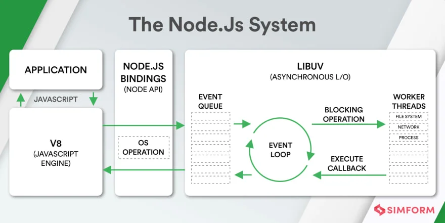
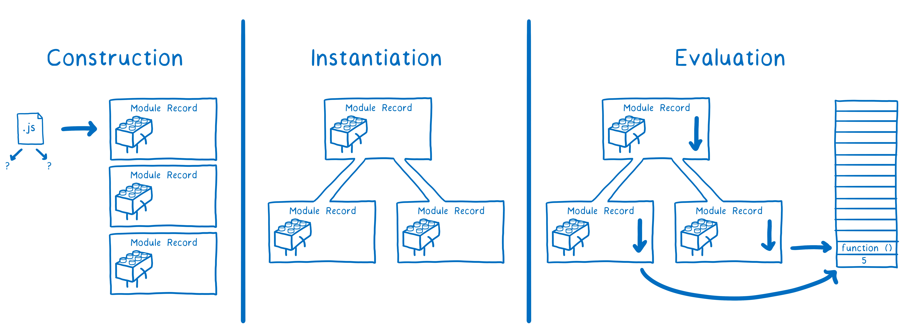
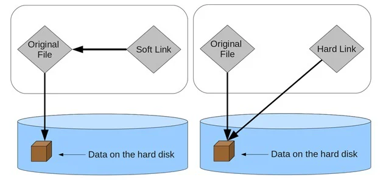
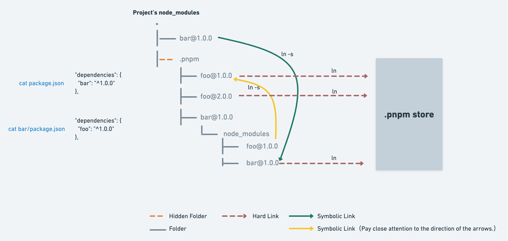

# 前端工程化

## Node.js

- 什么是Node.JS Node的应用场景
- JS代码执行
- Node的输入和输出
- Node的全局对象

### 什么是Node.js

Node.js是一个基于**V8 JavaScript引擎**的**JavaScript运行时环境**

- V8可以嵌入到任何C++应用程序中，无论是Chrome还是Node.js，事实上都嵌入了V8引擎来执行JavaScript代码
- 在Chrome浏览器中，还需要解析、渲染HTML、CSS等相关渲染引擎，另外还需要支持浏览器操作的API、浏览器自己的事件循环
- 在Node.js中我们也需要进行一些额外操作：文件系统读写、网络IO、加密、压缩解压文件等

可以简单总结出Node.js和浏览器的区别

- Chrome浏览器

  - Blink负责解析HTML文档，遇到JavaScript标签时将内容交给V8引擎

  - > Blink 是 Google Chrome 浏览器的渲染引擎，V8 是 Blink 内置的 JavaScript 引擎

    - 预分析：检查语法错误但不生成AST树
    - 生成AST：语法分析、词法分析后，生成抽象语法树（AST）
      - AST 为每一行代码定义键值对。初始类型标识符定义 AST 属于一个程序，然后所有代码行将定义在主体内部，主体是一个对象数组。
    - 生成字节码：基线编译器（Ignition）将 AST 转换为字节码
    - 生成机器代码：优化编译器 (Turbofan) 将字节码转换为优化的机器代码。另外，在逐行执行字节码的过程中，**如果一段代码经常被执行，V8会直接将这段代码转换并保存为机器码**，下次执行不需要经过字节码，优化了执行速度

- Node.js

  - 只处理JavaScript代码 内部V8引擎负责JS代码的执行
  - JavaScript代码 -> V8 -> Node.js Bindings -> LibUV
  - LibUV是使用**C语言编写的库**，提供了**事件循环、文件系统读写、网络IO、线程池**等等内容



### Node.js的应用场景

- 前端开发的库都是以node包形式管理的
- npm yarn pnpm成为前端开发使用最多的工具
- 使用Node.js作为Web服务器开发、中间件、代理服务器
- 借助Node.js完成前后端渲染的同构应用
- 编写脚本工具 构建项目 打包代码等
- Electron桌面应用程序

### Node.js的参数传递

#### `process.argv`

`process.argv`返回一个数组

- 在代码中通过`process.argv[2]`读取来自命令行的额外参数
- `process.argv[0]` `process.argv[1]`分别为`node.exe`的绝对路径和`目标文件`的绝对路径

```js
// sum.js
const x = process.argv[2]
const y = process.argv[3]
console.log(x + y)
```

```sh
# 通过命令行运行node执行脚本 并传入参数
node sum.js 5 10 # 15
```

#### console

- `console.log` 打印内容到stdout并加上换行符
- `console.clear` 清空当前stdout中的内容
- `console.trace` 打印字符串`Trace: `到stderr
  - 将堆栈跟踪打印到代码中的当前位置

#### REPL

在浏览器的控制台选项卡中，我们可以通过输入JS代码与之交互，在Node.js中同样提供了类似的功能

- REPL是Read-Eval-Print Loop的简称，翻译为：读取-求值-输出循环
- REPL是一个**简单的、交互式的编程环境**
- 在命令行窗口中输入`node`即可进入

### Node中的全局对象

在浏览器中，我们可以在JS代码中访问全局对象`window`，代表当前标签窗口

在Node.js中的全局对象名为`global`，在控制台输出`global`对象：

```sh
> global
<ref *1> Object [global] {
  global: [Circular *1],
  clearInterval: [Function: clearInterval],
  clearTimeout: [Function: clearTimeout],
  setInterval: [Function: setInterval],
  setTimeout: [Function: setTimeout] {
    [Symbol(nodejs.util.promisify.custom)]: [Getter]
  },
  queueMicrotask: [Function: queueMicrotask],
  performance: Performance {
    nodeTiming: PerformanceNodeTiming {
      name: 'node',
      entryType: 'node',
      startTime: 0,
      duration: 2245.9675999991596,
      nodeStart: 1.7120999991893768,
      v8Start: 7.749699998646975,
      bootstrapComplete: 56.47019999846816,
      environment: 28.44789999909699,
      loopStart: 97.62589999847114,
      loopExit: -1,
      idleTime: 2070.0206
    },
    timeOrigin: 1675854922619.539
  },
  clearImmediate: [Function: clearImmediate],
  setImmediate: [Function: setImmediate] {
    [Symbol(nodejs.util.promisify.custom)]: [Getter]
  }
}
```

#### 常见的全局对象

- `Buffer`
- `clearImmediate`
- `clearInterval`
- `clearTimeout`
- `console`
  - 和控制台交互
- `process`
  - 提供了Node进程中相关的信息
  - Node的运行环境、系统环境变量、参数等
- `queueMicrotask(callback)`
- `setImmediate(callback, [, ...args])`
- `setInterval(callback, delay[, ...args])`
- `setTimeout(callback, delay[, ...args])`
- `TextDecoder`
- `TextEncoder`
- `URL`
- `URLSearchParams`
- `WebAssembly`

#### 特殊的全局对象

`__dirname` `__filename` `exports` `module` `require()`

- 这些变量看起来是全局的，其实并不是（它们仅存在于模块范围内），只是每个模块中都有
- 它们在命令行交互中是不可使用的
- `__dirname` 当前模块的目录名
- `__filename` 当前模块的文件名
- `exports` `module` `require()`将在模块章节中讲解

#### `global`对象

`global`是一个全局对象

- 在Node.js环境下，之前的 `process` `console` `setTimeout`等都有被放入到`global`中
- 而在浏览器中，这些全局API是被放到`window`对象上的

这无异于增加了开发者的心智负担，所以在最新的ECMA标准中出现了`globalThis`，指向全局对象

- 在浏览器中的`globalThis`指向`window`对象
- 在Node.js中的`globalThis`指向`global`对象

两个全局对象的区别：在浏览器中通过`var`定义的变量会被放到`window`对象上，而Node.js不会

## 模块化开发

- 认识模块化开发
- CommonJS和Node
- require函数解析
- AMD和CMD（已经被时代淘汰 了解即可）
- ESModule用法详解
- ESModule运行原理

### 模块化的初衷

- 将大的程序拆分成一个个小的易于维护的代码
- 每个模块负责程序中的一部分逻辑，拥有**自己的作用域**、**定义变量名时不会发生冲突**
- 模块可以暴露**变量、函数、对象**等导出
- 模块可以导入其他模块的**变量、函数、对象**

```js
// moduleA.js
const moduleA = (function(){
  const name = "Ziu"
  const age = 18
  const run = () => {
    console.log(name + age + 'is running.')
  }
  return {
    name,
    age,
    run
  }
})()

// moduleB.js
console.log(moduleA.name) // 在其他模块中调用
```

### CommonJS

CommonJS是一种**规范**，当初命名为ServerJS，旨在浏览器以外的地方使用，后为体现其广泛性，改名为CommonJS，简称CJS

**规范 是用来指导 实现的**

- `Node` 是CommonJS在服务端的代表**实现**
- `Browserify` 是CommonJS在浏览器中的一种**实现** （正在被淘汰）
- `WebPack` 打包工具具备支持CommonJS的支持和转换

所以，Node.js对CommonJS进行了支持和实现，让JavaScript在Node上运行时可以实现模块化开发

- 每个`.js`文件都是一个单独的模块
- 每个模块中都包含变量`exports` `module.exports` `require`

::: code-group

```js [env.js]
// env.js
exports.name = 'Ziu'
exports.age = 18
```

```js [utils.js]
// utils.js
module.exports = {
  sum: function(x, y) {
    return x + y
  }
}
```

```js [index.js]
// index.js
const utils = require('utils.js')
utils.sum(1, 2) // 3

const { sum } = require('utils.js')
sum(1, 2) // 3

const { name, age } = require('env.js')
console.log(name, age) // Ziu 18
```

:::

#### `exports`的本质

`exports`和`require`在Node中的本质

- `exports`是一个对象，我们可以在这个对象中添加很多属性，添加的属性则会被导出
  - 在没有向该对象添加任何属性之前，它是一个空对象
- 当通过`require`导入时：`const env = require('env.js')`
  - `env`这个变量等于`env.js`中的`exports`对象
  - 本质上是`env`是`exports`对象的引用赋值
  - `{ id: '...', exports: { ... }, loaded: true, ... }`
- 后续即使再次执行`require`导入模块，模块中的代码也不会重新执行（`module.loaded`属性）
  - 当从模块中取值时，会从已经加载的`exports`对象缓存上取值


::: code-group

```js [utils.js]
// utils.js
exports.a = 0

// 1s后修改a值
setTimeout(() => {
  exports.a = 1
}, 1000)

// 2s后检查a值
setTimeout(() => {
  console.log(exports.a) // 2
}, 2000)
```

```js [index.js]
// index.js
const utils = require('./utils')

console.log(utils.a) // 0

setTimeout(() => {
  console.log(utils.a) // 1
  utils.a = 2 // 反过来修改a值
}, 1500)
```

:::

在上述代码中，`utils`对象中的属性`a`在一秒后被赋值为`1`，因此在index.js中输出`utils.a`得到了两次不同的结果

反过来，在index.js中修改导入的`utils.a`的值后，修改结果也会反映在`exports.a`上，输出的值为`2`

实际开发中不要修改导入模块中的变量，改变原模块中变量的值并不规范

#### `module.exports`

在Node.js中，真正常用的导出方式是`module.exports`

- `module.exports`本质上就是`exports`对象（同一个内存地址）
- 可以直接给`exports`对象赋值，将需要导出的内容统一导出
- 给`module.exports`重新赋值，即改变了`exports`对象的指向，**后续的修改不再影响原模块中的变量**

```js
const name = 'Ziu'
const run = () => console.log(name + 'is running.')

module.exports = {
  name,
  run
}
```

#### 二者的区别

既然如此，为什么还要存在`exports`这个概念呢？

- 在CommonJS中是没有`module.exports`的概念的
- 为了实现模块的导出，Node.js使用的是`Module`类，每一个模块都是`Module`的实例，也就是`module`
- 所以在Node.js中真正用于导出的并不是`exports`，而是`module.exports`
- `module`对象中的`exports`属性是`exports`对象的一个引用
  - `module.exports === exports === utils`

如果`module.exports`不再引用`exports`对象了，修改`exports`对象也就没有意义了

::: code-group

```js [utils.js]
// utils.js
module.exports = {
  name: 'Ziu'
}
exports.age = 18
```

```js [index.js]
// index.js
const utils = require('utils.js')
console.log(utils.name) // Ziu
console.log(utils.age) // undefined
```

:::

当使用`module.exports = { ... }`后，模块中原有的`exports`不再被导入识别，导入的内容将变为`module.exports`指定的对象内容

#### `require`的本质

`require`是一个函数，可以帮助我们导入一个文件（模块）中导出的对象

- 为什么可以省略掉`.js`后缀，直接使用`require('./utils')`
- 为什么可以省略掉`index.js`，直接使用`require('./tools')`导入`tools/index.js`

这涉及到`require`在匹配路径后的查找规则：

分为三种情况：**内置模块、自定义路径、包名**

- 导入Node.js内置的模块，如`const path = require('path')`
  - 直接返回该内置模块 并停止后续的查找
- 根据路径导入自定义的模块，如`const utils = require('./{filename}')`
  - 按照路径寻找该模块`./` `../` `/`
  - 如果指定了后缀名，则按照后缀名查找
  - 如果未指定后缀名，则：
    1. 直接查找该文件
    2. 查找`{filename}.js`文件
    3. 查找`{filename}.json`文件
    4. 查找`{filename}.node`文件
  - 如果按照上述方式没找到文件，则**将`{filename}`作为路径继续查找**
  - 查找目录下的`index`文件 `{filename}/index`
    1. 查找`{filename}/index.js`文件
    2. ··· ···
  - 没找到：报错`Cannot find module 'xxx'`
- 包名，如`const lodash = require('lodash')`
  - 到项目根目录的`node_modules`中查找
  - `node_modules/{package_name}/index.js`
  - 当前项目目录的`node_modules`找不到则继续向上查找，直到查找到根目录的`node_modules`


#### 模块的加载过程

- 模块在被第一次引入时，模块中的JS代码会被运行一次
  - 代码执行顺序与`require`的位置相关
- 模块如果被多次引入，会被缓存，最终只加载一次
  - 这是因为每个模块对象`module`上都有一个属性`loaded`
  - `loaded === false`表示该模块尚未被加载
  - 第二次被`require`引入时会检查该属性是否为`true`
- 如果有循环引用，加载顺序如何？
  - 数据结构：图结构（graph）遍历时有深度优先搜索（DFS）、广度优先搜索（BFS）两种算法
  - Node采用的是深度优先算法

#### CommonJS的缺点

- 加载模块是同步加载的
  - 只有等到对应的模块加载完毕，当前模块中的内容才能被执行
  - 当然，在服务器中加载JS文件都是本地文件，加载速度非常快，不会受影响
- 但是在浏览器中使用CommonJS
  - 需要先从服务器下载JS文件，后加载运行
  - 阻塞JS执行 阻塞页面加载
- 在WebPack中使用CommonJS
  - CommonJS会被WebPack解析
  - 将CommonJS代码转化为bundle 浏览器可以直接运行

### ESModule

- ES6 模块采用**编译时加载**，使得**编译时就能确定模块的依赖关系**，有助于**静态优化**
- CommonJS模块在运行时加载，且必须借助对象加载模块内容

#### `export`和`import`用法概览

ESModule借助`export`和`import`导入导出内容，需要注意的是导入导出的并不是对象

`export`定义的是当前模块导出的**接口**，`import`可以导入来自其他不同模块的**接口**

- `export default`可以设置默认导出对象
- `export { ... }`可以统一导出多个内容
- `export`和`import`都可以使用`as`关键字重命名导出/导入的接口
- `import * from 'xxx'` `export * from 'xxx'`批量导入/导出

::: code-group

```js [utils.js]
// utils.js
export function sum(a, b) {
  return a + b
}
export function sub(a, b) {
  return a - b
}
export default function log(...args) {
  console.log(...args)
}
export {
  name: 'Ziu',
  age: 18
}
export const ENV_VARIABLE = 'Hello, World!'
```

```js [index.js]
// index.js
import { sum, sub, name, age, ENV_VARIABLE } from './utils'
import log from './utils.js'

sum(1, 2) // 3
sub(2, 3) // -1
log(name, age, ENV_VARIABLE) // 'Ziu' 18 'Hello, World!'
```

:::

需要注意的是，在浏览器中要使用ESModule，需要为`<script>`标签添加`module`标记：

`<script src="index.js" type="module"></script>`

- 当浏览器解析到`type="module"`的JS代码后，会**分析模块中导入的ESModule模块**
- 每导入一个ESModule模块，**浏览器都会发起一个HTTP请求去加载它**
- 在本地运行时加载不同协议头的文件会遇到跨域问题，需要开启本地Web服务器

另外，**`export`与`import`必须位于模块的顶层**，如果位于作用域内会报错，因为这就**无法对代码进行静态分析优化了**

#### `export`详解

`export`有两种导出方式：

- 命名导出 `export const name = 'Ziu'` `export { v1, v2 } export * from 'xxx'`
  - 导出时需要指定名字
  - 导入时也需要知道对应的名字
- 默认导出 `export default AGE = 18`
  - 在从其他位置导入时需要为此默认导出指定新的名字
  - 给用户方便：不必阅读文档就可以加载模块

#### 值的动态绑定

- ESModule模块通过`export`语句输出的接口，与其对应的值是**动态绑定关系**，即通**过该接口，可以取到模块内部实时的值**
- CommonJS模块输出的是值的缓存，不存在动态更新

我们援引之前介绍CJS时的案例，**将后缀名改为`mjs`即可在Node中运行ESModule模块代码**

初始获得的`a`值为0，经过1s后，在`utils.mjs`中修改了a的值，这时导入`utils.mjs`模块的其他模块可以获取到`a`最新的值

::: code-group

```js [utils.mjs]
// utils.mjs
export let a = 0

// 1s后修改a值
setTimeout(() => {
  a = 1
}, 1000)
```

```js [index.mjs]
// index.mjs
import { a } from './utils.mjs'

console.log(a) // 0

setTimeout(() => {
  console.log(a) // 1
}, 1500)
```

:::

- 需要注意的是，导入的其他模块的变量是不允许被修改的，因为`index.mjs`导入的本质是一个接口
- 如果从其他模块导入的是一个对象，也不推荐修改导入内容的任何值，最好将其当做完全只读

拓展阅读：CommonJS与ESModule加载模块的异同

#### `import`详解

检查下述代码：

```js
foo()

import { foo } from 'foo'
```

- `import`命令具有提升效果，会提升到整个模块的顶部
- `import`的执行早于函数的调用，`import`命令是在编译阶段执行的，在代码运行之前
- 由于`import`是静态执行，所以不能使用表达式和变量（只有运行时才有值）

```js
import 'lodash'
import 'lodash'
```

- 如果仅仅导入了一个模块，那么该模块的代码会被执行，但是没有任何变量被导入
- 如果同一模块被导入多次，那么导入操作只会被执行一次

```js
import * from 'utils'
add(1, 2)

export * from 'utils'
```

- 可以通过`*`一次性导入模块中所有导出的变量、函数、类
- 也可以实现二者的复合操作：导入全部模块的同时导出全部模块

#### `import()`函数

通过`import`命令导入的模块是静态的，会被提升到模块顶部，并不支持条件导入

ES2020引入了`import()`函数，可以通过`import()`函数实现条件导入，动态加载ESModule模块

```js
const main = document.querySelector('main');

import(`./section-modules/${someVariable}.js`)
  .then(module => {
    module.loadPageInto(main);
  })
    .catch(err => {
    main.textContent = err.message;
  })
```

- 返回值是一个Promise对象，可以通过`await`同步地操作它
- `import()`函数可以在模块外的JS脚本中使用，用于**在运行时加载外部模块**，类似于`require()`
- 区别于`require()`，`import()`是异步加载模块

通过`.then`函数处理导入的模块时，行为和`import`是相同的：

- 如果有默认导出对象，则`.then`入参为默认导出对象
- 可以通过解构直接取到模块中导出的变量或函数：`.then(({ add, sub }) => { ... })`

**应用场景**

按需加载：按钮点击后才加载相关的JS文件

```js
btn.addEventListener('click', () => {
  import('./dialogBox.js')
    .then(dialogBox => {
      dialogBox.open()
    })
    .catch(err => console.log(err))
})
```

条件加载：根据主题色加载不同JS文件

```js
if(darkMode) {
  import('dark.js').then(() => ...)
} else {
  import('light.js').then(() => ...)
}
```

传入动态值

```js
let moduleName = () => ['Home', 'History', 'User'][0]
import(`./${moduleName()}.js`)
```

#### `import.meta`

ES2020引入了`import.meta`，它仅能在模块内部使用，包含一些模块自身的信息，即模块元信息

- `import.meta.url` 返回当前模块的URL路径
  - 浏览器加载ESModule都是通过HTTP发起请求
    - 例如当前模块为`fetchData.js`，要在模块内引入一个名为`data.json`的数据：
    - `import( new URL('data.json', import.meta.url) )`
  - Node.js环境下，该值都是`file://`协议的链接
- `import.meta.scriptElement`
  - 浏览器特有的属性
  - 返回加载模块的`<script>`标签，相当于`document.currentScript`

规范中并未规定`import.meta`中包含哪些属性，一般包括上面两个属性

### 深入理解模块加载

#### ESModule的解析过程

ESModule的解析过程可以分为三个阶段：

- 构建 `Construction`
  - 根据地址查找JS文件，并发起HTTP请求下载，将其解析为模块记录 `Module Record`
- 实例化 `Instatiation`
  - 对模块记录进行实例化，并为其分配内存空间
  - 解析ESModule模块的**导入和导出**语句，将模块指向对应的内存地址
  - 例如`export const name = 'Ziu'`，会将变量`name`添加到模块环境记录中 `Module Enviroment Record`
- 运行 `Evaluation`
  - 运行代码，计算值，并且将值填充到内存地址中
  - 将导入导出的**值**赋给对应的变量`name = 'Ziu'`



文章推荐：[ES modules: A cartoon deep-dive](https://hacks.mozilla.org/2018/03/es-modules-a-cartoon-deep-dive/)

#### MJS和CJS的区别

- **CommonJS模块输出的是值的拷贝，而ESModule模块输出的是值的引用**
  - CJS导出的变量，其值如果在模块内发生变化，外部导入是不会同步更新的，除非导出的是一个取值函数
  - MJS导出变量，外部模块每次访问时都会得到该变量最新的值，即使变量在模块内被修改了
- **CommonJS模块是运行时加载，而ESModule是编译时输出接口**
  - CJS是**通过对象实现**的导入导出，它**在运行时才被确定依赖关系**和其值
  - MJS则是**通过静态定义**，在代码运行之前的**静态解析阶段即可确定模块的导入导出内容**
- **CommonJS模块的`require()`是同步加载模块，而ESModule模块的`import`命令是异步加载模块**
  - `import`命令拥有一个独立的模块依赖的解析阶段

#### CJS中的循环加载

设想有以下两文件 `a.js`与`b.js`：

::: code-group

```js [a.js]
// a.js
exports.done = false
const b = require('./b.js')
console.log('在 a.js 之中，b.done = %j', b.done)
exports.done = true
console.log('a.js 执行完毕')
```

```js [b.js]
// b.js
exports.done = false
const a = require('./a.js')
console.log('在 b.js 之中，a.done = %j', a.done)
exports.done = true
console.log('b.js 执行完毕')
```

```js [main.js]
// main.js
const a = require('./a')
const b = require('./b')
console.log('在 main.js 之中, a.done=%j, b.done=%j', a.done, b.done)
```

:::

执行脚本`main.js`，先执行`a.js`：

- 第一行 导出`done`值为`false`
- 第二行 `a.js`的代码暂停执行 进入`b.js`并等待其执行完毕

在`b.js`中：

- 第一行 导出`done`值为`false`
- 第二行 执行`a.js` 从`a.js`模块中取`exports`对象
- **取到其缓存值为`false`（`a.js`执行已经执行的部分）**
- 随后`b.js`继续向下执行 执行完毕后 将执行权交还给`a.js`

回到`a.js`中：

- 继续向后执行 直到代码执行完毕

最终输出：

```sh
在 b.js 之中，a.done = false
b.js 执行完毕
在 a.js 之中，b.done = true
a.js 执行完毕
在 main.js 之中, a.done=true, b.done=true
```

总结：

- CJS的模块导出是输出值的拷贝，而不是引用，值的变化不是动态的，而是会被缓存的
- 循环加载时，CJS模块导出的值是当前已经执行部分代码产生的结果的值，而不是模块代码完全执行完后的最终值

#### MJS中的循环加载

ESModule的导入和导出与CommonJS有本质不同：

::: code-group

```js [a.mjs]
// a.mjs
import { bar } from './b.mjs'
console.log('a.mjs')
console.log(bar)
export let foo = 'foo'
```

```js [b.mjs]
// b.mjs
import { foo } from './a.mjs'
console.log('b.mjs')
console.log(foo)
export let bar = 'bar'
```

:::

执行`a.mjs`后发现报错了：`ReferenceError: Cannot access 'foo' before initialization`，变量`foo`未定义

- MJS模块在代码执行前会进行静态分析
- 分析`a.mjs`的依赖关系时，发现其依赖了`b.mjs`
- 于是加载`b.mjs`并解析它的依赖关系
- 解析`b.mjs`的过程中，发现它又依赖了`a.mjs`
- 这时引擎不会再去加载`a.mjs` 而是认为`a.mjs`这个模块的`Module Record`已经存在了
- 继续向下执行，执行到`console.log(foo)`时发现`foo`未定义 抛出错误

要实现预期效果，可以将`foo`与`bar`改写为取值函数，这时执行就不会报错了：

::: code-group

```js [a.mjs]
// a.mjs
import { bar } from './b.mjs'
console.log('a.mjs')
console.log(bar())
export function foo() {
  return 'foo'
}
```

```js [b.mjs]
// b.mjs
import { foo } from './a.mjs'
console.log('b.mjs')
console.log(foo())
export function bar() {
  return 'bar'
}
```

:::

这是因为函数`function`具有提升作用，在`a.mjs`中执行`import { bar } from './b.mjs'`之前，`foo`就有定义了。

因此在进入`b.mjs`执行`console.log(foo())`时可以取到`foo`，代码可以顺利执行

另：如果将`foo`定义为函数表达式`export const foo = () => 'foo'`，由于没有变量提升，代码仍然会报错

#### 内部变量差异

ESModule和CommonJS另一个重要区别就是：

ESModule模块是在浏览器与服务端通用的，之前在解读CommonJS时介绍了它拥有的一些内部变量（模块变量）：

- `arguments`
- `require`
- `module`
- `exports`
- `__filename`
- `_dirname`

这些变量在ESModule模块中都是不存在的，且顶层的`this`不再指向当前模块，而是`undefined`

### 拓展内容

#### 在Node.js中使用ESModule

在Node.js中，普通的`.js`文件会被默认解析为CommonJS，要使用ESModule有两种方式：

- 所有ESModule的后缀名都使用`.mjs`并且不可省略
  - 这样引擎在解析到`.mjs`结尾的文件时，将按照ESModule的规则解析其导入导出关系
- 将`package.json`中的`type`字段修改为`module`
  - 此时项目中所有`.js`文件都将被作为ESModule模块解析
  - 要在此项目中使用CommonJS，则需要将后缀名修改为`.cjs`

#### 解读`package.json`中的字段

- 


## 包管理工具

- npm包管理工具
- package配置文件
- npm install原理
- yarn cnpm npx
- 发布自己的npm包
- pnpm使用和原理

### npm

- Node Package Manager 包管理工具，方便管理项目依赖、管理代码版本、分发代码
- 目前不仅管理Node的包了，前端项目的依赖包都可以由它管理
- 安装Node.js会自动为我们安装npm

全局安装、局部安装、开发依赖、生产依赖

### package.json

`package.json`用来记录项目的配置信息，包括项目名、版本、项目入口、脚本、依赖项

通过`npm init -y`初始化项目，会为我们生成一个`package.json`文件

强烈建议阅读官方文档对`package.json`的解读：[package.json](https://docs.npmjs.com/cli/v9/configuring-npm/package-json)

#### `main`与`exports`字段

- `main`字段
  - 指定一个npm包的`main`字段为一个JS模块
  - 当我们从其他位置通过`import { something } from 'es-module-package'`导入时
  - Node.js将从`main`字段指定的模块查找导出内容

- `exports`字段

  - `exports`字段优先级高于`main`字段，它具有多种用法：
  - 子目录别名
    - 假设如是定义`exports`字段：`exports: { "./submodule": "./src/submodule.js" }`
    - 当执行`import submodule from 'es-module-package/submodule'`时，会按照以下路径查找模块：
    - `./node_modules/es-module-package/src/submodule.js`
  - `main`的别名
  - 条件加载

参考：[package.json 的 exports 字段](https://es6.ruanyifeng.com/#docs/module-loader#package-json-%E7%9A%84-exports-%E5%AD%97%E6%AE%B5)

#### `dependencies`和`devDependencies`的区别

- `dependencies`应当包含依赖的最小集，在此之上添加的文档、测试、调试、构建等的依赖，都应当被放进`devDependencies`
- 当别人安装你发布的npm包时，执行`npm install xxx`后，只会安装包本身以及其中的`dependencies`运行时依赖
- 如果使用打包工具如Webpack，不论依赖放在哪一个里面，只要项目中有引入就会被打包进生产，除非配置了`external`

官方对两个字段的定义：

> dependencies: Dependencies are specified in a simple object that maps a package name to a version range. The version range is a string which has one or more space-separated descriptors. Dependencies can also be identified with a tarball or git URL.

> devDependencies: If someone is planning on downloading and using your module in their program, then they probably don't want or need to download and build the external test or documentation framework that you use.

**总结：将与代码运行时无关的依赖放入`devDependencies`，可以让他人在使用你开发的库时，少安装一些不必要的依赖。**

#### 依赖版本号中的`~1.2.0`和`^1.2.0`有什么区别

版本号简要说明：`[major 主要版本].[minor 次要版本].[patch 补丁版本]-[alpha | beta 测试阶段].[测试版本号]`

- `~` Allows patch-level changes if a minor version is specified on the comparator. Allows minor-level changes if not.
  -  如果指定了次要版本，则允许补丁级别的更改，否则允许进行较小级别的更改
  - 如`~1.2.0`：允许安装`1.2.0 - 1.3.0`的版本
  - 如`~1.2`：允许安装`1.2.0 - 1.3.0`的版本
  - 如`~1`：允许安装`1.x`的版本，不允许上升到`2.0.0`

- `^` Allows changes that do not modify the left-most non-zero element in the `[major, minor, patch]` tuple.
- 允许对`1.0.0`及更高版本进行补丁和次要更新，对版本`0.x >=0.1.0`进行补丁更新，对版本`0.0.x`不进行更新。
  - 如`^1.2.3`：允许安装`1.2.3 - 2.0.0`的版本
  - 如`^0.2.3`：允许安装`0.2.3 - 0.3.0`的版本
  - 如`^0.0.3`：允许安装`0.0.3 - 0.0.4`的版本


参考：[node-semver](https://github.com/npm/node-semver#versions)

Allows patch-level changes if a minor version is specified on the comparator. Allows minor-level changes if not.

devDependenciesAllows changes that do not modify the left-most non-zero element in the [major, minor, patch] tuple.

允许对版本 1.0.0 及更高版本进行补丁和次要更新，对版本 0.X >=0.1.0 进行补丁更新，对版本 0.0.X 不进行更新。

### npx

`npx`命令用来在项目路径下执行`node_modules/.bin`下的命令，默认这些命令都位于`node_modules/.bin`中，如果不cd进去shell找不到它们，在项目根目录调用它们自然会报未知命令的错误。

以webpack为例：

- 直接在控制台输入`webpack`会报错：未知命令
- 必须通过`npx webpack`来替我们调用
  - 这相当于在控制台执行了`./node_modules/.bin/webpack`
- 通过在`package.json`中定义`script`
  - 执行`npm run xxx`后，会为我们将`.bin`中的命令添加进系统的PATH中
  - 这样就相当于直接在项目根目录下直接调用`.bin`中的命令了
- 如果全局安装了webpack那么在系统任意路径下都可以用`webpack`命令了

#### 解读`package.json`中的`bin`字段

`.bin`目录下的可执行文件从何处来？由npm官方文档中对`package.json/bin`字段的介绍可以知道：

> A lot of packages have one or more executable files that they'd like to install into the PATH. npm makes this pretty easy (in fact, it uses this feature to install the "npm" executable.)
>
> To use this, supply a `bin` field in your package.json which is a map of command name to local file name. When this package is installed globally, that file will be either linked inside the global bins directory or a cmd (Windows Command File) will be created which executes the specified file in the `bin` field, so it is available to run by `name` or `name.cmd` (on Windows PowerShell). When this package is installed as a dependency in another package, the file will be linked where it will be available to that package either directly by `npm exec` or by name in other scripts when invoking them via `npm run-script`.

如果第三方包在`package.json`中声明了`bin`字段：`命令名称 -> 本地文件名`的映射，如`bin: { "webpack": "bin/webpack.js" }`

在执行安装`npm i xxx`时，会由包管理工具创建`.bin`目录，并创建一个可执行命令并将其**软链接**到目标文件

推荐阅读：[三面面试官：运行 npm run xxx 的时候发生了什么？](https://juejin.cn/post/7078924628525056007)

### npm包的发布

如果你希望发布自己的npm包，主要涉及到的命令有：

```sh
npm init -y # 初始化项目 生成package.json
npm login # 登录自己的npm账号
npm publish # 将包发布到npm上 后续版本更新也使用此命令
npm unpublish # 取消发布 删除发布的npm包
npm deprecate # 让发布的npm包过期
```

执行`npm init -y`后，为我们生成的默认`package.json`如下：

```json
{
  "name": "my-project",
  "version": "1.0.0",
  "description": "",
  "main": "index.js",
  "dependencies": {},
  "devDependencies": {},
  "scripts": {
    "test": "echo \"Error: no test specified\" && exit 1"
  },
  "keywords": [],
  "author": "",
  "license": "ISC"
}
```

其中`keywords` `author` `license`都会展示在此包的npm网站上，除此之外还可以定义`homepage` `repository`字段

### npm包的开发调试

在npm包的开发过程中，如果要调试代码，那我们不可能每次修改代码都通过*提交到npm后，重新下载到本地*来调试代码

一般来讲有三种解决方案：

- 直接修改导入路径 简单粗暴
  - 如：将之前的`import lodash from 'lodash-es'`修改为`import lodash from '... debug/lodash-es'`
  - 也可以修改`package.json`中的依赖版本为`file:包的路径`
  - 纯人工操作，容易误操作，不推荐
- 通过`npm link`命令 软连接
  - 首先在本地**开发中的包项目**根目录执行`npm link`，将提示：`success Registered "my-project".`成功注册名为`my-project`的包
  - 随后，在**引入了此包的项目**根目录下执行`npm link "my-project"` 即可将当前项目的`node_modules`中的此包软连接到正在开发中的包的路径
  - 在许多情况下可能有效，但它通常会带来严重的限制和依赖关系解决、文件系统之间的符号链接互操作性等问题
- yalc模拟发布npm包
  - yalc可以将模拟发布的npm包存放在全局存储中，这样可以得到类似于发布-安装的效果
  - 可以避免`npm link`导致的依赖关系问题
    - 全局安装`npm i yalc -g` 模拟发布`yalc publish`
    - 引入方法1 `yalc link my-project`：向`node_modules`创建指向包内容的**符号链接**，并且不会修改`package.json`中的内容
    - 引入方法2 `yalc add my-project`：将包拉到当前项目根目录`.yalc`中，并将 `file:.yalc/my-project` 依赖关系注入到`package.json`中（`file:包的路径`）

### PNPM

#### 解决了哪些痛点

传统包管理工具如npm yarn都有以下两个痛点：

- `node_modules`太重 硬盘压力较大
- 幽灵依赖（为了复用 所有的包都被铺平在`node_modules`中 导致即使某些间接依赖虽然没有被安装 却能正常引入）

PNPM（performant npm）有以下优点：

- 比其他包管理器更快
- `node_modules`中的文件链接自特定的内容寻址存储库
- 支持 monorepos（单仓多包）
- PNPM创建了一个非平铺的`node_modules` 代码无法访问任意包（避免了幽灵依赖）

#### 硬链接和软链接

- 硬链接 （hard link）
  - 电脑文件系统中的多个文件平等地共享同一个文件存储单元
  - 删除一个文件名字后，还可以通过其他名字继续访问该文件
- 符号链接 （软链接 soft link、Symbolic link）
  - 符号链接 是一类特殊的文件
  - 其包含有一条以绝对路径或者相对路径的形式**指向其他文件或者目录的引用**



操作系统使用不同的**文件系统**，**对真实的硬盘读写操作做了一层抽象**，借由文件系统，我们得以方便地操作和访问文件的真实数据

- 软链接例：你为一个文件创建了一个快捷方式，这个快捷方式本质上保存着目标文件的路径
  - 访问快捷方式的本质是通过路径访问原文件
  - 删除快捷方式时，不会对原文件的数据产生影响
- 硬链接例：`F:/Video/abc.mp4` 和 `F:/Video/cba.mp4`指向了同一片硬盘数据空间
  - 在文件系统中删除`abc.mp4`或`cba.mp4`之一，并**不会影响到其他文件对该片数据空间的读取**
  - 注意：硬链接不是拷贝，文件拷贝意味着**有新的数据空间在硬盘上被开辟**，拷贝出的文件和原文件指向不同的数据空间

#### 实操硬链接和软链接

- 文件的拷贝
  - Windows: `copy foo.js foo_copy.js`
  - MacOS: `cp foo.js foo_copy.js`
- 文件的硬链接
  - Windows: `mklink /H aaa_hard.js aaa.js`
  - MacOS: `ln foo.js foo_hard.js`
- 文件的软链接
  - Windows: `mklink aaa_soft.js aaa.js`
  - MacOS: `ln -s foo.js foo_copy.js`

打开符号链接文件，会直接跳转到原文件，且符号链接文件不可写

#### PNPM的工作细节

##### 硬链接

- 当使用npm或yarn时，如果有100个项目，且每个项目都有一个相同的依赖包
  - 此依赖包将会在你的硬盘上存储100份，占据100份硬盘数据空间
- 当使用pnpm时，此依赖包将被存储在一个统一的位置
  - 所有其他项目引用该版本的依赖，将使用这同一份文件
  - 如果依赖有不同版本，则不同版本的依赖包分别存储

这样，多个项目之间可以方便地共享相同版本的依赖包，减小了硬盘的压力。

以安装`axios`为例，我们在某个项目中执行了`pnpm add axios`

- PNPM拉取Axios的代码 将其保存在**全局仓库**`.pnpm/axios`中，并且**硬链接**到硬盘中的数据文件
- 在**当前项目**中的`node_modules`创建文件夹`axios`，将其中的文件**硬链接**到硬盘中的相同位置
- 硬链接是不能操作目录的 目录需要创建 而其中的文件可以使用硬链接
- 以后如果有其他项目也用到了相同版本的`axios`，在执行`pnpm add axios`后：只需要在各自的`node_modules`创建硬链接到那片数据空间即可

##### 非扁平的node_modules

- 使用npm或yarn Classic安装依赖包时 所有包都将被提升到`node_modules`的根目录下
  - 这是为了防止依赖之间多层嵌套，才想出的解决方案
  - 这就导致：源码可以访问到间接依赖，访问到本不属于此项目的依赖包，导致幽灵依赖问题
- 而PNPM仅有项目依赖会放在`node_modules`目录下
  - 这些在`node_modules`根目录中的依赖包，是`node_modules/.pnpm`中硬链接文件的的**符号链接**
  - 在`node_modules/.pnpm`中，包含了附加版本信息的真实文件（硬链接到硬盘数据的文件）
  - 所有间接依赖，都通过软链接的方式，链接到被铺平在`.pnpm`文件夹中对应版本的硬链接文件上



#### 常用命令

- `pnpm === npm init -y` 项目初始化
- `pnpm install === npm i` 安装项目依赖
- `pnpm add <pkg> === npm install <pkg>` 安装npm包
- `pnpm remove <pkg> === npm uninstall <pkg>` 移除npm包
- `pnpm <script> === npm run <script>` 执行项目脚本

#### 存储Store的位置

- 在PNPM 7.0之前，统一的存储位置是`~/.pnpm-store`
  - 例如`C:/Users/Ziu/.pnpm-store`
    - `~/path === $HOME/path` 用户目录
    - `./path` 相对路径
    - `/path` 根目录
- 在7.0版本之后，统一存储位置在`<pnpm home directory>/store`
  - Linux: `~/.local/share/pnpm/store`
  - Windows: `%LOCALAPPDATA%/pnpm/store`
  - MacOS: `~/Library/pnpm/store`

可以通过命令行，获取到这个目录：

```sh
pnpm store path # 获取到硬链接store的路径
```

如果当前目录创建了很多项目，尽管PNPM已经节省了空间，但是由于所有依赖都通过硬链接存放在同一个store中

随着文件数量增长，导致store越来越大，可以通过命令行，移除冗余文件造成的体积占用

```sh
pnpm store prune # prune修剪 从store中删除当前未被引用的包 以释放store的空间
```

## 系统学习Webpack

- 认识webpack工具
- webpack基本打包
- webpack配置文件
- 编写和打包CSS文件
- 编写Less文件
- PostCSS工具处理CSS

 ### Node内置模块 path

- path模块用于对路径和文件进行处理
- 在不同系统上，文件路径的分隔符是不同的
  - MacOS和Linux的分隔符是`/`
  - Windows上的分隔符是`\` `\\` 目前也支持 `/`

可以通过Node的path模块来抹平不同平台的差异

常用API

- `path.extname` 后缀名

- `path.basename` 文件名

- `path.dirname` 文件夹名

- `path.join` 拼接多个路径
  - 下例中，由于`p2`通过`../`指定了上一级路径，所以从`abc`紧接着就是`why`了


```js
const path = require('path')
const p1 = 'abc/cba'
const p2 = '../why/kobe/james.txt'
console.log(path.join(p1, p2)) // \\abc\\why\\kobe\\james.txt
```

- `path.resolve` 将多个路径片段解析、拼接为一个绝对路径
  - **从右往左**处理传入的路径序列，每个路径依次被解析，直到构造完成一个绝对路径
  - 如果在处理完所有给定path的段之后，还没有生成绝对路径，则使用当前工作目录
  - 生成的路径被规范化并删除尾部斜杠，零长度path段被忽略
  - 如果没有传递path段，则`path.resolve()`将返回当前工作目录的绝对路径

### 初识Webpack

path模块在webpack的使用中有较大作用，所以预先介绍了一下，下面正式进入Webpack的学习

- Webpack能够帮助我们进行模块化开发
- 高级特性提升开发效率和代码安全性、可维护性，如 ES6+ TypeScript SASS Less 等都需要构建工具
- 实时文件监听（开发热更新）、代码压缩合并等


