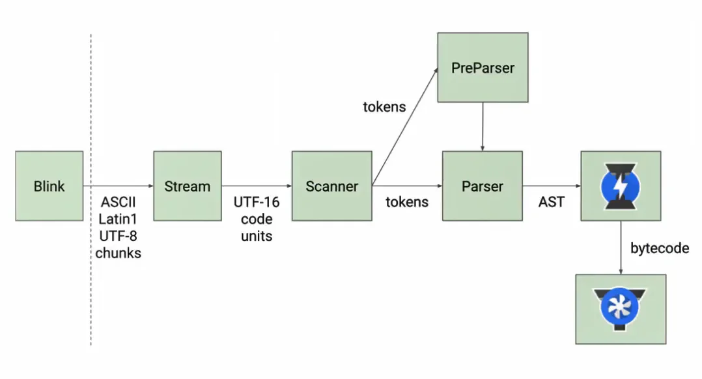

# JavaScript 高级教程

## 函数中this指向

函数在调用时, Javascript会默认为this绑定一个值

```js
// 定义一个函数
function foo() {
  console.log(this)
}

// 1. 直接调用
foo() // Window

// 2. 绑定对象调用
const obj = { name: 'ziu', aaa: foo }
obj.aaa() // obj

// 3. 通过call/apply调用
foo.call('Ziu') // String {'Ziu'}
```

this的绑定: 

- 和定义的位置没有关系
- 和调用方式/调用位置有关系
- 是在运行时被绑定的

**this始终指向最后调用它的对象**

```js
function foo() {
  console.log(this)
}
foo() // Window

const obj = {
  name: 'ziu',
  bar: function () {
    console.log(this)
  }
}
obj.bar() // obj

const baz = obj.bar
baz() // Window
```

### 如何改变this的指向

### new 实例化一个函数

> new一个对象时发生了什么:
>
> 1. 创建一个空对象
> 2. 这个空对象会被执行prototype连接
> 3. 将this指向这个空对象
> 4. 执行函数体中的代码
> 5. 没有显式返回这个对象时 会默认返回这个对象

函数可以作为一个构造函数, 作为一个类, 可以通过new关键字将其实例化

```js
function foo() {
  console.log(this)
  this.name = 'Ziu'
}
foo() // 直接调用的话 this为Window

new foo() // 通过new关键字调用 则this指向空对象
```

### 使用 call apply bind

在 JavaScript 中, 函数是对象。

JavaScript 函数有它的属性和方法。call() 和 apply() 是预定义的函数方法。 

两个方法可用于调用函数，两个方法的第一个参数必须是对象本身

****

要将`foo`函数中的`this`指向`obj`，可以通过赋值的方式：

```js
obj.foo = foo // 绑定
obj.foo() // 调用
```

但是也可以通过对函数调用call / apply实现

```js
var obj = {
  name: 'Ziu'
}

function foo() {
  console.log(this)
}

foo.call(obj) // 将foo执行时的this显式绑定到了obj上 并调用foo
foo.call(123) // foo的this被绑定到了 Number { 123 } 上
foo.call("ziu") // 绑定到了 String { "ziu" } 上
```

#### 包装类对象

当我们直接使用类似：

```js
"ZiuChen".length // String.length
```

的语句时，`JS`会为字符串 `ZiuChen` 包装一个对象，随后在这个对象上调用 `.length` 属性

#### call和apply的区别

- 相同点：第一个参数都是相同的，要求传入一个对象
  - 在函数调用时，会将this绑定到这个传入的对象上
- 不同点：后面的参数
  - apply 传入的是一个数组
  - call 传入的是参数列表

```js
function foo(name, age, height) {
  console.log(this)
}

foo('Ziu', 18, 1.88)

foo.apply('targetThis', ['Ziu', 18, 1.88])

foo.call('targetThis', 'Ziu', 18, 1.88)
```

当我们需要给一个带参数的函数通过call/apply的方式绑定this时，就需要使用到call/apply的第二个入参了。

#### 参数列表

当传入函数的参数有多个时，可以通过`...args`将参数合并到一个数组中去

```js
function foo(...args) {
  console.log(args)
}

foo("Ziu", 18, 1.88) // ["Ziu", 18, 1.88]
```

#### bind绑定

如果我们希望：在每次调用`foo`时，都能将`obj`绑定到`foo`的`this`上，那么就需要用到`bind`

```js
// 将obj绑定到foo上
const fun = foo.bind(obj)
// 在后续每次调用foo时, foo内的this都将指向obj
fun() // obj
fun() // obj
```

`bind()`方法将创建一个新的函数，当被调用时，将其`this`关键字

### 箭头函数

箭头函数是`ES6`新增的编写函数的方式，更简洁。

- 箭头函数不会绑定`this`、`arguments`属性
  - `arguments`

- 箭头函数不能作为构造函数来使用（不能与`new`同用，会报错）

#### 箭头函数中的this

在箭头函数中是没有`this`的：

```js
const foo = () => {
  console.log(this)
}
foo() // window
console.log(this) // window
```

之所以找到了`Window`对象，是因为在调用`foo()`时，函数内部作用域并没有找到`this`，转而向上层作用域找`this`

因此找到了顶层的全局`this`，也即`Window`对象

#### 箭头函数中this的查找规则

检查以下代码：

```js
const obj = {
  name: "obj",
  foo: function () {
    const bar = () => {
      console.log(this)
    }
    return bar
  }
}
const fn = obj.foo()
fn() // obj
```

代码执行完毕，控制台输出`this`值为`obj`对象，这是为什么？

箭头函数中没有`this`，故会向上层作用域寻找`this`，`bar`的上层作用域为函数`foo`，而函数`foo`的`this`由其调用决定

调用`foo`函数的为`obj`对象，故内部箭头函数中的`this`指向的是`obj`

检查以下代码：

```js
const obj = {
  name: "obj",
  foo: () => {
    const bar = () => {
      console.log(this)
    }
    return bar
  }
}
const fn = obj.foo()
fn() // Window
```

和上面的代码不同之处在于：`foo`也是由箭头函数定义的，`bar`向上找不到`foo`的`this`，故而继续向上，找到了全局`this`，也即`Window`对象

### 严格模式

- 在严格模式下，全局的`this`不是`Window`对象，而是`undefined`。
- 在 JavaScript 严格模式(strict mode)下, 在调用函数时第一个参数会成为 this 的值， 即使该参数不是一个对象。
- 在 JavaScript 非严格模式(non-strict mode)下, 如果第一个参数的值是 null 或 undefined, 它将使用全局对象替代。

### this面试题

```js
var name = 'window'

var person = {
  name: 'person',
  sayName: function () {
    console.log(this.name)
  }
}

function sayName() {
  var sss = person.sayName

  sss() // 默认绑定: window
  person.sayName();  // 隐式绑定: person
  (person.sayName)() // 隐式绑定: person, 本质与上一行代码相同
  ;(person.sayName = person.sayName)() // 间接调用: window
}

sayName()
```

```js
var name = 'window'

var person1 = {
  name: 'person1',
  foo1: function () {
    console.log(this.name)
  },
  foo2: () => console.log(this.name),
  foo3: function () {
    return function () {
      console.log(this.name)
    }
  },
  foo4: function () {
    return () => console.log(this.name)
  }
}

var person2 = {
  name: 'person2'
}

person1.foo1() // 隐式绑定: person1
person1.foo1.call(person2) // 显式绑定: person2

person1.foo2() // 上层作用域: window
person1.foo2.call(person2) // 上层作用域: window

person1.foo3()() // 默认绑定: window
person1.foo3.call(person2)() // 默认绑定: window
person1.foo3().call(person2) // 显式绑定: person2

person1.foo4()() // 隐式绑定: person1
person1.foo4.call(person2)() // 显式绑定: person2
person1.foo4().call(person2) // 隐式绑定: person1
```

## 原型与继承

JavaScript中，任何一个对象都有一个特殊的内置属性`[[prototype]]`，称之为原型

- 可以通过`.__proto__`或`Object.getPrototypeOf(obj)`获取到这个原型对象

```js
const obj = {
  name: 'Ziu',
  age: 18
}

console.log(obj) // obj
console.log(obj.__proto__) // 由浏览器添加 非标准
console.log(Object.getPrototypeOf(obj)) // 标准的获取原型的方法
```

### 原型有什么作用？

当我们通过`[[getter]]`执行 `obj.name` 时：

- 首先在自身上找`name`属性，如果找到了则直接返回
- 如果没找到，则沿着原型链向上查找，检查其原型是否存在该属性

手动为`obj`的原型添加`message`属性后，在`obj`上获取`name`属性，会沿着原型链找到原型上的`message`属性

```js
const proto = Object.getPrototypeOf(obj)
proto.message = 'Hello, Prototype.'
console.log(obj.message) // Hello, Prototype.
```

### 函数的显式原型

之前我们说**对象的原型都是隐式的**，不能直接通过属性直接获取（`.__proto__`的方式是非标准）

而**函数是存在一个名为`prototype`的显式原型的**，可以通过这个属性获取到函数的原型，向原型添加额外的属性

每次在通过`new`操作符创建对象时，将对象的隐式原型指向这个显式原型

```js
function Student(name, age) {
  this.name = name
  this.age = age
}

// 向构造函数的显式原型添加公共方法
Student.prototype.running = function () {
  console.log(`${this.name} is running`)
}

const s1 = new Student('ziu', 18)
const s2 = new Student('kobe', 19)
const s3 = new Student('brant', 20)

// 任何一个由该构造函数创建的对象实例的原型都指向函数的显式原型
// 可以调用原型上的公共方法
s1.running() // ziu is running
s2.running() // kobe is running

// 对象实例的原型上包含构造函数与我们手动添加上去的公共方法
console.log(Object.getPrototypeOf(s1)) // {running: ƒ, constructor: ƒ}
```

添加在对象原型上的方法，在被多个实例调用时只会开辟一块内存空间

如果将公共方法放到构造函数中，那么每创建一个实例，都会为这个方法开辟一块新的内存空间

构造函数的显式原型中的属性`constructor`，这个属性即指向构造函数，因此存在关系`Student --proto-> {constructor: Student}`

### Object的原型

当我们定义了一个对象，它的原型即为`Object`，而`Object`的原型则为`Null`

```js
const obj = {
  name: 'Ziu'
}

const p1 = Object.getPrototypeOf(obj) // Object
const p2 = Object.getPrototypeOf(p1) // null

console.log(p1)
console.log(p2)
```

以上一节的例子举例：

```js
// s1是构造函数Student的实例
const p1 = Object.getPrototypeOf(s1)
const p2 = Object.getPrototypeOf(p1)
const p3 = Object.getPrototypeOf(p2)

console.log(Student.prototype) // {running: ƒ, constructor: ƒ}
console.log(p1) // {running: ƒ, constructor: ƒ}
console.log(p2) // Object
console.log(p3) // null
```

### 原型链实现继承

创建两个构造函数`Person`与`Student`，各自有自身的方法，我们希望实现`Student`继承`Person`的方法

```js
function Person(name, age) {
  this.name = name
  this.age = age
}

Person.prototype.running = function () {
  console.log(`${this.name} is running.`)
}

function Student(name, age, id, score) {
  this.name = name
  this.age = age
  this.id = id
  this.score = score
}

Student.prototype.studying = function () {
  console.log(`${this.name} is studying.`)
}

const s1 = new Student('Ziu', 18, 2, 60)
s1.running() // ERROR: s1.running is not a function
```

显然现在`Student`和`Person`是没有任何关联的，要让二者联系起来有以下几种方法：

#### 方法一（错误）

```js
Student.prototype = Person.prototype
```

可以让`Student`构造函数的显式原型指向`Person`的显式原型，这时可以顺利在`s1`实例上调用`.running()`方法，但是存在问题：

- 在子类`Student`添加的`studying`方法会被添加到父类`Person`的显式原型上，这并不合理
  - 父类和子类共享一个原型对象，子类的方法都被添加到了父类的原型对象上
  - 此后如果有从`Person`继承的子类，那这个子类也将可以调用`studying`方法，这是因为所有子类的方法都被放到了父类`Person`的显式原型上

#### 方法二（有效但不合理）

创建一个父类的实例对象（`new Person()`）用这个实例对象作为子类的原型对象

```js
const p = new Person()
Student.prototype = p
```

创建一个`p`对象，其隐式原型`__proto__`指向`Person`的显式原型对象上

通过这个方法，`Student`添加的`studying`方法将被放到`p`对象上，此后由`Student`派生的类，其隐式原型也将被指定到`p`对象上，而不会污染原始的原型

但是当我们会发现，两个构造函数的内容是有重复的：

```js
function Person(name, age) {
  this.name = name
  this.age = age
}
function Student(name, age, id, score) {
  this.name = name
  this.age = age
  this.id = id
  this.score = score
}
```

针对`name`与`age`的定义完全可以被复用

#### 方法三（最终）

借用构造函数方法

```js
function Student(name, age, id, score) {
  Person.call(this, name, age) // 通过Person.call 绑定this到当前的s实例上
  this.id = id
  this.score = score
}

Student.prototype = Person.prototype

const s = new Student('ziu', 18, 2, 60)
s.running()
```

- 借用继承的方法很简单：在子类构造函数内部调用父类型构造函数
  - 因为函数可以在任意时刻被调用
  - 通过`apply()` `call()`方法也可以在创建新的对象上执行构造函数

### 创建原型对象的方法

```js
function Person(name, age, height) {}
function Student() {}
```

要实现Student对Person的继承：

之前我们通过`new`关键字，为`Student`创建一个新的原型对象，也介绍了这种方法存在的弊端

```js
const p = new Person()
Student.prototype = p.prototype
```

可以使用另一种更优秀的方案：

```js
var obj = {}
// obj.__proto__ = Person.prototype // 非规范用法 兼容性不保证
Object.setPrototypeOf(obj, Person.prototype) // 挂载原型对象
Student.prototype = obj
```

社区中也有一种方案：

不需要再`new Person()`，而是用另外一个构造函数，此后需要挂载原型时都通过`new F()`来实现

- 更具备通用性，此处做`Person`的继承，后续也可以做`Animal`的继承
- 如果浏览器不支持`Object.setPrototypeOf()`则此方法更优

```js
function F() {}
F.prototype = Person.prototype
Student.prototype = new F()
```

最终方案：

从之前的代码可知，要达到的目的有两个：`1. 创建一个新对象 让原型对象不要被污染 2. 将新对象的原型挂载到目标原型上`

```js
var obj = Object.create(Person.prototype)
Student.prototype = obj
```

`Object.create()`传入的参数是原型对象，可以在创建新对象的同时将此对象的原型指向目标原型对象上

#### 开发封装

根据上述最终方案的原理，在开发中可以对继承方案做如下封装：

```js
function inherit(subType, superType) {
  // 创建一个新对象并将新对象的原型指向父类构造函数的原型
  subType.prototype = Object.create(superType.prototype)

  // 为子类的原型添加constructor属性
  Object.defineProperty(subType.prototype, 'constructor', {
    enumerable: false, // 不可被枚举
    configurable: true, // 值可被修改
    writable: true, // 值可被覆写
    value: subType // 初始值: 父类构造函数
  })
}

inherit(Student, Person)
```

另外，如果担心`Object.create()`的兼容性，也可以将创建对象的代码替换为：

```js
function createObject(o) {
  function F() {}
  F.prototype = o
  return new F()
}
...
  subType.prototype = createObject(superType.prototype)
...
```

也可以实现：创建对象并修改新对象的原型指向

### 对象方法补充

- hasOwnProperty
  - 对象上是否有某一个属于自己的属性（不是在原型上的属性）

```js
const info = {
  name: 'Ziu',
  age: 18
}
const obj = createObject(info) // 创建一个新对象并将新对象的原型指向info
console.log(obj.name) // Ziu: 对象自身上并没有该属性 会沿着原型链找到info对象
console.log(obj.hasOwnProperty('name')) // false: 因为对象身上并没有该属性
```

- in 或 for-in
  - 判断某个属性是否存在于某个对象或对象的原型上

以上文中例子举例，用`in`操作符可以沿着原型链获取属性：

`for-in`遍历的不只是自己身上的属性，也包括原型上的属性，因为对象都是继承自`Object`，而`Object`中的属性其属性描述符`enumerable`默认为false，故自己创建的对象在遍历时不会遍历到`Object`对象上的属性

```js
console.log('name' in obj) // true: 对象上没有 则沿着原型链找到原型上的属性
for (const key in obj) {
  console.log(key) // name age
}
```

- instanceof
  - 用于判断构造函数（Person Student类）的prototype，是否出现在某个实例对象的原型链上
  - **用于判断对象与构造函数之间的关系**
  - 该运算符右侧必须为一个对象：`s instanceof null`将报错

```js
function Person() {}
function Student() {}

inherit(Student, Person) // 将Student的隐式原型指向Person的隐式原型（继承）

const s = new Student()
console.log(s instanceof Student) // true
console.log(s instanceof Person) // true
console.log(s instanceof Object) // true
console.log(s instanceof Array) // false
```

`instanceof`会沿着原型链查找：s -> Student -> Person -> Object

- isPrototypeOf
  - **用于检测某个对象是否出现在某个实例对象的原型链上**
  - 可以用于判断对象之间的继承关系

```js
const s = new Student()
console.log(Student.prototype.isPrototypeOf(s)) // true
```

### 解读原型继承关系图

- f1是Foo的实例对象
- obj是Object的实例对象
- Function/Object/Foo都是Function的实例对象
- 原型对象默认创建时，其隐式原型都是指向Object的显示原型（Object指向null）


在解读之前首先明确以下几点：

- 对象都有隐式原型，可以通过`Object.getPrototypeof()`或`__proto__`（非标准）获取到
- 函数也是对象，有隐式原型，也有显式原型，显式原型可以通过`.prototype`获取到
- `Object.getPrototypeOf()`本应传入的是一个对象，当我们为其传入一个构造函数时，是将此构造函数视为对象，此时通过`Object.getPrototypeOf(Foo)`获取到的是**函数对象**的原型，即`Function.prototype`

由上至下解读，首先解读`function Foo()`这一层：

通过构造函数`new Foo()`创建了两个实例对象`f1 f2`，`f1 f2`是由`function Foo`创建出来的，故其隐式原型指向`Foo.prototype`

Foo既是一个函数，也是一个对象（由`new Function()`创建出来的）。

- 作为函数，它拥有显式原型`prototype`，指向`Foo.prototype`这个原型对象
- 作为对象，它拥有隐式原型`__proto__`，指向`Function.prototype`这个原型对象

而`Foo.prototype`作为一个原型对象，拥有他的构造函数`constructor`指向`Foo`，也拥有它的隐式原型`__proto__`指向`Object.prototype`（本质上`Foo.prototype`也是由`new Object()`创建出来的）

随后，开始解读`function Object()`这第二层：

通过构造函数`new Object()`创建出来两个实例对象`o1 o2`，它们是由`function Object`创建出来的，故其隐式原型指向`Object.prototype`

同样的，`function Object`作为构造函数对象，它既拥有作为函数的显式原型对象，也拥有作为对象的隐式原型对象

- 作为函数，它拥有显式原型，指向`Object.prototype`
- 作为对象，它是由`new Function()`创建的，其隐式原型指向`Function.prototype`

需要注意的是，原型对象`Object.prototype`的隐式原型指向`null`，它的构造函数`constructor`指向`function Object`

继续解读`function Function()`第三层：

`JavaScript`中的函数对象都是通过`function Function()`这个构造函数创建出来的，所以所有函数的隐式原型`__proto__`都指向`Function.prototype`

- `function Function()`作为函数，其显式原型指向`Function.prototype`
- 而当其作为对象，是由`new Function()`创建出来的，故其隐式原型也指向`Function.prototype`

### 构造函数的类方法

需要区分一下类方法与实例方法：

- 实例方法：在实例上调用，会沿着原型链向上查找
- 类方法：在类上（构造函数上）直接调用

在下面的例子中，我们向`Person.prototype`上添加了方法`running`，当我们在实例对象`p`上调用`running`时，会沿着`p` `p.__proto__`(`Person.prototype`)查找，在`Person.prototype`上找到`running`方法后进行调用

然而我们在`Person`类上直接调用`running()`则不行，这是因为`Person`只是`Person.prototype`的`constructor`属性，是它的构造函数，与原型链没有关系，`Person`上并没有`running()`方法，`Person.prototype`上才有

```js
function Person(name) {
  this.name = name
}
Person.prototype.running = function () {
  console.log(`${this.name} is running.`)
}
const p = new Person('Ziu')
p.running() // Ziu is running
Person.running() // undefined
```

要实现类方法，只需要直接在构造函数上添加新属性即可，因为构造函数本身也是一个对象：构造函数对象

```js
const names = ['abc', 'cba', 'nba', 'mba']
Person.randomPerson = function () {
  const randName = names[Math.floor(Math.random() * names.length)]
  return new Person(randName)
}

const p2 = Person.randomPerson()
console.log(p2)
```

上例中，我们手动向`Person`构造函数对象中添加了类方法`randomPerson`，可以直接在`Person`上进行调用

## ES6继承

- class方式定义类
- extends实现继承
- Babel的ES6转ES5
- 面向对象多态理解
- ES6对象的增强

ES6提供了`class`定义类的语法糖，其本质的特性是与ES6之前实现继承的方式是一样的

```js
class Person {
  constructor(name) {
    this.name = name
  }
  // 实例方法
  running() {
    console.log(`${this.name} is running.`)
  }
  // 静态方法(类方法)
  static randomPerson() {
    console.log('static func: random person')
  }
}

const p = new Person('Ziu') // 根据类创建实例

console.log(Person.prototype === p.__proto__) // true
console.log(Person.prototype.constructor) // class Person ...
console.log(typeof Person) // function
```

当我们通过`new`关键字操作类时，会调用这个`constructor`函数，并执行以下操作：

1. 在内存中创建一个新的对象（空对象）
2. 这个对象内部的`[[prototype]]`属性（隐式原型`__proto__`）会被赋值为该类的`prototype`属性
3. 构造函数内部的this，会指向创建出来的新对象
4. 执行构造函数内的代码
5. 如果构造函数没有返回非空对象，则返回创建出来的新对象

### 与function的异同

区别在于：定义构造函数与定义实例方法的部分聚合到了一起（高内聚、低耦合）相同的功能如果要用`function`来实现：

```js
function Person(name) {
  this.name = name
}
Person.prototype.running = function () {
  console.log(`${this.name} is running.`)
}
const p = new Person('Ziu')
console.log(Person.prototype === p.__proto__) // true
console.log(Person.prototype.constructor) // function Person ...
console.log(typeof Person) // function
```

运行代码可知，几个`console.log`输出都是相同的，这证明二者的本质是相同的，`Class`语法只是一种语法糖

二者之间是存在区别的：

- 构造函数`function Person`可以通过`()`作为普通函数调用
- `class Person`则不可以直接调用：`Class constructor Person cannot be invoked without 'new'`

### 定义访问器方法

为对象属性定义访问器（`Object.defineProperty()`）：

```js
const obj = {}
let value

Object.defineProperty(obj, 'name', {
  get: function () {
    console.log('name getted')
    return value
  },
  set: function (val) {
    console.log('name setted ' + val)
    value = val
    return value
  }
})

obj.name = 'Ziu' // name setted Ziu
const tmp = obj.name // name getted
```

直接在对象中定义访问器：

```js
const obj = {
  _name: 'Ziu',
  get name() {
    return this._name
  },
  set name(val) {
    this._name = val
    return true
  }
}
```

在ES6的`class`关键字中定义访问器：

```js
class Person {
  constructor(name) {
    this._name = name
  }
  get name() {
    return this._name
  }
  set name(val) {
    this._name = val
    return true
  }
}
```

#### 访问器的应用场景

当我们需要频繁的对某些属性组合进行调用时，可以将这些属性组合，在外部可以通过访问器获得计算好的值

例如下述代码中实现了一个简单的`Rectangle`类，可以通过访问器直接获取其`position`与`size`属性

```js
class Rectangle {
  constructor(x, y, width, height) {
    this.x = x
    this.y = y
    this.width = width
    this.height = height
  }

  get position() {
    return { x: this.x, y: this.y }
  }

  get size() {
    return this.width * this.height
  }
}

const rect = new Rectangle(10, 15, 20, 50)
console.log(rect.position, rect.size)
```

### 类的静态方法

**在ES6之前我们将这种方法称为`类方法`，在其之后我们将其称为静态方法**

静态方法通常用于定义直接使用类来执行的方法，不需要有类的实例，使用`static`关键字来定义：

```js
class Person {
  constructor(name) {
    this.name = name
  }
  // 实例方法
  running() {
    console.log(`${this.name} is running.`)
  }
  // 静态方法(类方法)
  static randomPerson() {
    console.log('static func: random person')
  }
}
```

本质上：

```js
Person.randomPerson = function() {
  console.log('static func: random person')
}
```

### extends实现继承

在`Person`类的基础上实现`Student`类继承自`Person`

在子类的构造函数内需要通过`super()`并传入父类（超类）构造函数需要的参数，这样就可以调用父类的构造函数

```js
class Person {
  constructor(name) {
    this.name = name
  }
  running() {
    console.log(`${this.name} is running.`)
  }
  sitting() {
    console.log(`${this.name} is sitting.`)
  }
}

class Student extends Person {
  constructor(name, score) {
    super(name) // 在子类的constructor中通过super()调用父类的构造函数
    this.score = score
  }
  studying() {
    super.sitting() // 在子类中通过super.method()调用父类的方法
    console.log(`${this.name} is studying.`)
  }
}

const s = new Student('Ziu', 60)
s.running() // 可以调用父类方法
s.studying() // 也可以调用自己的方法
```

- 在子类中，执行`super.method(...)`可以调用一个父类方法
- 在子类的`constructor`中，执行`super(...)`来调用父类`constructor`

**在子（派生）类的构造函数中使用this或者返回默认对象之前，必须先通过super调用父类的构造函数**

```js
...
constructor(name, score) {
  this.score = score
  super(name) // 这是不对的，应该在使用this之前先调用super
}
...
```

### 继承自默认类

可以通过继承，为内置类做修改或扩展，方便我们使用：

在下例中，我们对内置类`Array`做了扩展，添加了访问器属性`lastItem`可以获取数组内最后一个元素

```js
class SelfArray extends Array {
  get lastItem() {
    return this[this.length - 1]
  }
}

const arr = new SelfArray(5).fill(false)
console.log(arr)
console.log(arr.lastItem)
```

传统方式也可以实现，通过操作原型：

为`Array.prototype`定义属性`lastItem`，并为其添加`getter`函数，可以通过`lastItem`获取最后一个元素

需要注意的是，这种方法会对所有`Array`对象产生影响，所有的数组都可以调用这个方法

```js
Object.defineProperty(Array.prototype, 'lastItem', {
  get: function () {
    return this[this.length - 1]
  }
})

const arr = new Array(5).fill(false)
console.log(arr.lastItem)
```

### 类的混入mixin

JavaScript只支持单继承，不支持多继承。要让一个类继承自多个父类，调用来自不同父类的方法，可以使用`mixin`

下例中我们希望`Bird`能够同时继承自`Animal`和`Flyer`类，直接使用`extends`会报错

```js
function mixinAnimal(BaseClass) {
  // 1. 创建一个新的类 继承自baseClass
  // 2. 对这个新的类进行扩展 添加running方法
  return class extends BaseClass {
    running() {
      console.log('running')
    }
  }
}
function mixinFlyer(BaseClass) {
  return class extends BaseClass {
    flying() {
      console.log('flying')
    }
  }
}

class Bird {
  eating() {
    console.log('eating')
  }
}
class newBird extends mixinAnimal(mixinFlyer(Bird)) {}

const b = new newBird()
b.eating() // eating
b.running() // running
b.flying() // flying
```

通过调用`mixin`方法，创建一个新的类 继承自baseClass，对这个新的类进行扩展 添加我们希望新类能够继承的方法

除了这种方式，也可以通过复制对象的方法实现继承`Object.assign(Bird.prototype, {})`

#### React中的高阶组件

在React的高阶组件实现中有`connect`方法，即是使用到了类似`mixin`的方法实现多继承

### Babel是如何转化ES6的

Babel可以对更高级的代码进行转义，转义后的代码支持在更低级的浏览器上运行。开发者可以使用高级语法进行开发而不需要担心在低级浏览器上的兼容问题。

例如Babel会将ES6的类（Class）写法转义为ES5的`prototype`继承式写法

#### class是如何转化的

假设有以下ES6代码，我们解读通过Babel转义后的ES5代码：

```js
class Person {
  constructor(name) {
    this.name = name
  }
  running() {
    console.log(`${this.name} is running.`)
  }
  static randomPerson() {
    return new this('xxx')
  }
}

const p = new Person('Ziu')
```

```js
'use strict'

function _typeof(obj) {
  '@babel/helpers - typeof'
  return (
    (_typeof =
      'function' == typeof Symbol && 'symbol' == typeof Symbol.iterator
        ? function (obj) {
            return typeof obj
          }
        : function (obj) {
            return obj &&
              'function' == typeof Symbol &&
              obj.constructor === Symbol &&
              obj !== Symbol.prototype
              ? 'symbol'
              : typeof obj
          }),
    _typeof(obj)
  )
}
function _classCallCheck(instance, Constructor) {
  if (!(instance instanceof Constructor)) {
    throw new TypeError('Cannot call a class as a function')
  }
}
function _defineProperties(target, props) {
  for (var i = 0; i < props.length; i++) {
    var descriptor = props[i]
    descriptor.enumerable = descriptor.enumerable || false
    descriptor.configurable = true
    if ('value' in descriptor) descriptor.writable = true
    Object.defineProperty(target, _toPropertyKey(descriptor.key), descriptor)
  }
}
function _createClass(Constructor, protoProps, staticProps) {
  if (protoProps) _defineProperties(Constructor.prototype, protoProps)
  if (staticProps) _defineProperties(Constructor, staticProps)
  Object.defineProperty(Constructor, 'prototype', { writable: false })
  return Constructor
}
function _toPropertyKey(arg) {
  var key = _toPrimitive(arg, 'string')
  return _typeof(key) === 'symbol' ? key : String(key)
}
function _toPrimitive(input, hint) {
  if (_typeof(input) !== 'object' || input === null) return input
  var prim = input[Symbol.toPrimitive]
  if (prim !== undefined) {
    var res = prim.call(input, hint || 'default')
    if (_typeof(res) !== 'object') return res
    throw new TypeError('@@toPrimitive must return a primitive value.')
  }
  return (hint === 'string' ? String : Number)(input)
}
var Person = /*#__PURE__*/ (function () {
  function Person(name) {
    _classCallCheck(this, Person)
    this.name = name
  }
  _createClass(
    Person,
    [
      {
        key: 'running',
        value: function running() {
          console.log(''.concat(this.name, ' is running.'))
        }
      }
    ],
    [
      {
        key: 'randomPerson',
        value: function randomPerson() {
          return new this('xxx')
        }
      }
    ]
  )
  return Person
})()
var p = new Person('Ziu')
```

`_createClass`传入一个构造函数，在`_createClass`内部：

- 检查是否传入了原型方法（实例方法）
  - 如果传入了原型方法，通过调用`_defineProperties`将这些方法挂载到`Constructor.prototype`上
  - 在此例中，传入`_defineProperties`的第一个参数为原型对象，第二个参数为原型方法，通过for循环挂载方法，并分别配置每个方法的属性描述符：`enumerable: false`，配置其`configurable: true`，如果配置了`'value'`属性，则`writable: true`
- 检查是否传入了静态方法（类方法）
  - 如果传入了静态方法，通过调用`_defineProperties`将这些方法挂载到`Constructor`上
  - 在此例中，具体执行过程是相同的，只不过第一个入参变成了构造函数（类），将方法直接挂载到类上
- 为`Constructor`类添加显式原型`prototype`属性，其值不可被覆写
- 返回该构造函数`Person`
- 直接通过`var p = new Person()`创建实例对象
  - 在使用`new`关键字调用函数时，在函数内部调用了`_classCallCheck`
    - 检查调用方式，不允许通过调用函数的方法调用类，而只能通过`new`关键字
    - 使用`new`关键字时会默认创建一个`Person`实例，此时函数内部的`this`自然指向这个实例
    - 入参为`this`与该构造函数，如果`this`不是该构造函数的实例，则抛出错误

- 代码中`_toPropertyKey _toPrimitive _typeof`都是方法类
- 其中涉及到纯函数（pure function）的概念：纯函数是没有任何副作用的函数，可以直接被删除而不用考虑其影响，在Tree-Shaking时有较大作用（将代码从依赖树上删除）

#### extends是如何转化的

```js
class Person {
  constructor(name) {
    this.name = name
  }
  running() {
    console.log(`${this.name} is running.`)
  }
  static randomPerson() {
    return new this('xxx')
  }
}

class Student extends Person {
  constructor(name, score) {
    super(name)
    this.score = score
  }
  studying() {
    console.log(`${this.name} is studying.`)
  }
  static randomStudent() {
    return new this('xxx', 66)
  }
}

const s = new Student('Kobe', 66)
```

```js
'use strict'

function _inherits(subClass, superClass) {
  if (typeof superClass !== 'function' && superClass !== null) {
    throw new TypeError('Super expression must either be null or a function')
  }
  subClass.prototype = Object.create(superClass && superClass.prototype, {
    constructor: { value: subClass, writable: true, configurable: true }
  })
  Object.defineProperty(subClass, 'prototype', { writable: false })
  if (superClass) _setPrototypeOf(subClass, superClass)
}
function _setPrototypeOf(o, p) {
  _setPrototypeOf = Object.setPrototypeOf
    ? Object.setPrototypeOf.bind()
    : function _setPrototypeOf(o, p) {
        o.__proto__ = p
        return o
      }
  return _setPrototypeOf(o, p)
}
function _createSuper(Derived) {
  var hasNativeReflectConstruct = _isNativeReflectConstruct()
  return function _createSuperInternal() {
    var Super = _getPrototypeOf(Derived),
      result
    if (hasNativeReflectConstruct) {
      var NewTarget = _getPrototypeOf(this).constructor
      result = Reflect.construct(Super, arguments, NewTarget)
    } else {
      result = Super.apply(this, arguments)
    }
    return _possibleConstructorReturn(this, result)
  }
}
function _possibleConstructorReturn(self, call) {
  if (call && (_typeof(call) === 'object' || typeof call === 'function')) {
    return call
  } else if (call !== void 0) {
    throw new TypeError('Derived constructors may only return object or undefined')
  }
  return _assertThisInitialized(self)
}
function _assertThisInitialized(self) {
  if (self === void 0) {
    throw new ReferenceError("this hasn't been initialised - super() hasn't been called")
  }
  return self
}
function _isNativeReflectConstruct() {
  if (typeof Reflect === 'undefined' || !Reflect.construct) return false
  if (Reflect.construct.sham) return false
  if (typeof Proxy === 'function') return true
  try {
    Boolean.prototype.valueOf.call(Reflect.construct(Boolean, [], function () {}))
    return true
  } catch (e) {
    return false
  }
}
function _getPrototypeOf(o) {
  _getPrototypeOf = Object.setPrototypeOf
    ? Object.getPrototypeOf.bind()
    : function _getPrototypeOf(o) {
        return o.__proto__ || Object.getPrototypeOf(o)
      }
  return _getPrototypeOf(o)
}
function _typeof(obj) {
  '@babel/helpers - typeof'
  return (
    (_typeof =
      'function' == typeof Symbol && 'symbol' == typeof Symbol.iterator
        ? function (obj) {
            return typeof obj
          }
        : function (obj) {
            return obj &&
              'function' == typeof Symbol &&
              obj.constructor === Symbol &&
              obj !== Symbol.prototype
              ? 'symbol'
              : typeof obj
          }),
    _typeof(obj)
  )
}
function _classCallCheck(instance, Constructor) {
  if (!(instance instanceof Constructor)) {
    throw new TypeError('Cannot call a class as a function')
  }
}
function _defineProperties(target, props) {
  for (var i = 0; i < props.length; i++) {
    var descriptor = props[i]
    descriptor.enumerable = descriptor.enumerable || false
    descriptor.configurable = true
    if ('value' in descriptor) descriptor.writable = true
    Object.defineProperty(target, _toPropertyKey(descriptor.key), descriptor)
  }
}
function _createClass(Constructor, protoProps, staticProps) {
  if (protoProps) _defineProperties(Constructor.prototype, protoProps)
  if (staticProps) _defineProperties(Constructor, staticProps)
  Object.defineProperty(Constructor, 'prototype', { writable: false })
  return Constructor
}
function _toPropertyKey(arg) {
  var key = _toPrimitive(arg, 'string')
  return _typeof(key) === 'symbol' ? key : String(key)
}
function _toPrimitive(input, hint) {
  if (_typeof(input) !== 'object' || input === null) return input
  var prim = input[Symbol.toPrimitive]
  if (prim !== undefined) {
    var res = prim.call(input, hint || 'default')
    if (_typeof(res) !== 'object') return res
    throw new TypeError('@@toPrimitive must return a primitive value.')
  }
  return (hint === 'string' ? String : Number)(input)
}
var Person = /*#__PURE__*/ (function () {
  function Person(name) {
    _classCallCheck(this, Person)
    this.name = name
  }
  _createClass(
    Person,
    [
      {
        key: 'running',
        value: function running() {
          console.log(''.concat(this.name, ' is running.'))
        }
      }
    ],
    [
      {
        key: 'randomPerson',
        value: function randomPerson() {
          return new this('xxx')
        }
      }
    ]
  )
  return Person
})()
var Student = /*#__PURE__*/ (function (_Person) {
  _inherits(Student, _Person)
  var _super = _createSuper(Student)
  function Student(name, score) {
    var _this
    _classCallCheck(this, Student)
    _this = _super.call(this, name)
    _this.score = score
    return _this
  }
  _createClass(
    Student,
    [
      {
        key: 'studying',
        value: function studying() {
          console.log(''.concat(this.name, ' is studying.'))
        }
      }
    ],
    [
      {
        key: 'randomStudent',
        value: function randomStudent() {
          return new this('xxx', 66)
        }
      }
    ]
  )
  return Student
})(Person)
var s = new Student('Kobe', 66)
```

创建`Student`类的代码仍然是一个纯函数：

- 立即执行函数传入了一个实参`Person`，随后实参作为内部函数的形参读取到函数内部以供使用
- 可以消除副作用，避免直接调用外部变量形成闭包，让立即执行函数在得到参数的同时成为纯函数

在`Student`内部通过调用`_inherits`，传入`Student`与`Person`，将二者之间做了关联：

- 创建一个`Person`实例对象，并将`Student`的原型对象指向此对象
- 向此对象上添加`constructor`属性，指向构造函数`Student`
- 经过`_setPrototypeOf`，`Student`的`__proto__`指向了`Person`，这样带来的好处：让`Student`函数对象可以继承`Person`的类方法

实现继承后，通过`_createClass`创建类，相关内容不再重复叙述（挂载实例方法、类方法、`prototype`属性）

至此完成了`Student`类的创建，随后我们通过`var s = new Student(...)`创建一个`Student`实例

- 通过`new`关键字调用`Student`时，将执行其内部的`function Student`
- 首先执行`_classCallCheck`检查调用方式是否合法
- 在内部通过借用构造函数继承`_this = _super.call(this, name)`
  - 此处的`_super`本质上就是父类（可以理解为`_this = Person.call(this, name)`）下面来解释一下`_super`的创建过程
  - 通过`_createSuper`方法创建`_super`
    - 检查是否支持`Reflect`，返回的新的函数`_createSuperInternal`实际上就是`_super`
    - 当外部通过`_this = _super.call(this, name)`调用时，实际上调用的就是这个函数
    - 首先获取子类的原型，通过`_getPrototypeof`，该函数内部进行了一些兼容性判断，检查是否支持各种获取原型的方法
    - 最终获取到`Student`的隐式原型`Person`并赋值给`_Super`
      - 如果支持`Reflect`，通过`Reflect.construct`实现借用构造函数继承，调用父类的构造方法
      - 如果不支持`Reflect`，通过`Super.apply()`实现···
  - 绕了一圈，本质上就是调用了`_Person.call(this, name)`，并且将创建的对象返回出来赋值给`result`

#### 自己实现的ES5对比

在之前的内容中我们自己实现了相关的类定义/继承功能

```js
function Person(name) {
  this.name = name // 定义内部属性
}
// 定义实例方法
Person.prototype.running = function() {
  console.log(`${this.name} is running.`)
}
// 定义类方法（静态方法）
Person.randomPerson = function() {
  return new this('xxx')
}
```

自己实现的继承：

```js
function inherit(SubClass, SuperClass) {
  // 创建一个新对象并将新对象的原型指向父类构造函数的原型
  subType.prototype = Object.create(superType.prototype)

  // 为子类的原型添加constructor属性
  Object.defineProperty(subType.prototype, 'constructor', {
    enumerable: false, // 不可被枚举
    configurable: true, // 值可被修改
    writable: true, // 值可被覆写
    value: subType // 初始值: 父类构造函数
  })
}

inherit(Student, Person)
```

相比之下不难发现，Babel转义用ES5实现相关功能的核心思想是一致的，只不过Babel转义后的代码添加了更多的边界条件的判定。


## 浏览器运行原理

### 网页解析过程

输入域名 => DNS解析为IP => 目标服务器返回`index.html`

> DNS：Domain Name System

#### HTML解析过程

- 浏览器开始解析`index.html`文件，当遇到`<link>`则向服务器请求下载`.css`文件

- 遇到`<script>`标签则向服务器请求下载`.js`文件


[How browsers work](https://web.dev/howbrowserswork/)

#### 生成CSS规则

在解析的过程中，如果遇到`<link>`元素，那么会由浏览器负责下载对应的CSS文件

- 注意：下载CSS文件不会影响到DOM解析
- 有单独一个线程对CSS文件进行下载与解析

浏览器下载完CSS文件后，就会对CSS文件进行解析，解析出对应的规则树：

- 我们可以称之为CSSOM（CSS Object Model，CSS对象模型）

#### 构建Render Tree

有了DOM Tree和CSSOM Tree之后，就可以将二者结合，构建Render Tree了

此时，如果有某些元素的CSS属性`display: none;`那么这个元素就不会出现在Render Tree中

- 下载和解析CSS文件时，不会阻塞DOM Tree的构建过程
- 但会阻塞Render Tree的构建过程：因为需要对应的CSSOM Tree

#### 布局和绘制(Layout & Paint)

第四步是在渲染树（Render Tree）上运行布局（Layout），以计算每个节点的几何体

- 渲染树会表示显示哪些节点以及其他的样式，但是不表示每个节点的尺寸、位置等信息
- 布局是确定呈现树中所有节点的宽度、高度和位置信息

第五步是将每个节点绘制（Paint）到屏幕上

- 在绘制阶段，浏览器布局阶段计算的每个frame转为屏幕上实际的像素点
- 包括将元素的可见部分进行绘制，比如文本、颜色、边框、阴影、替换元素

#### 回流和重绘(Reflow & )

回流也可称为重排

理解回流（Reflow）：

- 第一次确定节点的大小和位置，称之为布局（layout）
- 之后对节点的大小、位置修改重新计算，称之为回流

什么情况下会引起回流？

- DOM 结构发生改变（添加新的节点或者移除节点）
- 改变了布局（修改了width height padding font-size等值）
- 窗口resize（修改了窗口的尺寸等）
- 调用getComputedStyle方法获取尺寸、位置信息

理解重绘（Repaint）：

- 第一次渲染内容称之为绘制（paint）
- 之后的重新渲染称之为重绘

什么情况下会引起重绘？

- 修改背景色、文字颜色、边框颜色、样式等

**回流一定会引起重绘，所以回流是一件很消耗性能的事情**

- 开发中要尽量避免发生回流
- 修改样式尽量一次性修改完毕
  - 例如通过cssText一次性设置样式，或通过修改class的方式修改样式
- 尽量避免频繁的操作DOM
  - 可以在一个DocumentFragment或者父元素中，将要操作的DOM操作完成，再一次性插入到DOM树中
- 尽量避免通过getComputedStyle获取元素尺寸、位置等信息
- 对某些元素使用position的absolute或fixed属性
  - 并不是不会引起回流，而是开销相对较小，不会对其他元素产生影响

#### 特殊解析: composite合成

在绘制的过程中，可以将布局后的元素绘制到多个合成图层中

- 这是浏览器的一种优化手段
- 将不同流生成的不同Layer进行合并

```
标准流 => LayouTree => RenderLayer
`position:fixed;` => RenderLayer
```

默认情况，标准流中的内容都是被绘制在同一个图层（Layer）中的

而一些特殊的属性，浏览器会创建一个新的合成层（CompositingLayer），并且新的图层可以利用GPU来加速绘制

- 每个合成层都是单独渲染的
- 单独渲染可以避免所有的动画都在同一层中渲染导致性能问题
- 在各自的层中渲染完成后，只需要将渲染结果更新回合成层即可

当元素具有哪些属性时，浏览器会为其创建新的合成层呢？

- 3D Transforms
- video canvas iframe
- opacity 动画转换时
- position: fixed
- will-change: 一个实验性的属性，提前告诉浏览器此元素可能发生哪些变化
- animation 或 transition设置了opacity、transform

##### 案例1：同一层渲染

```css
.box1 {
  width: 100px;
  height: 100px;
  background-color: red;
}
.box2 {
  width: 100px;
  height: 100px;
  background-color: blue;
}
```

```html
<body>
  <div class="box1"></div>
  <div class="box2"></div>
</body>
```

在开发者工具的图层工具中可以看到，两个元素`.box1` 和 `.box2`都是在一个层（Document）下渲染的：


##### 案例2：分层渲染

当我们为`.box2`添加上`position: fixed;`属性，这时`.box2`将在由浏览器创建出来的合成层，分层单独渲染

```css
.box2 {
  width: 100px;
  height: 100px;
  background-color: blue;
  position: fixed;
}
```


##### 案例3：transform 3D

为元素添加上`transform`属性时，浏览器也会为对应元素创建一个合成层，需要注意的是：只有3D的变化浏览器才会创建

如果是`translateX`或`translateY`则不会

```css
.box2 {
  width: 100px;
  height: 100px;
  background-color: blue;
  /* position: fixed; */
  transform: translateZ(10px);
}
```


##### 案例4：transition+transform

当我们为元素添加上动画时，动画的中间执行过程的渲染会在新的图层上进行，但是中间动画渲染完成后，结果会回到原始图层上

```css
.box2 {
  width: 100px;
  height: 100px;
  background-color: blue;
  transition: transform 0.5s ease;
}
.box2:hover {
  transform: translateY(10px);
}
```

- 这也是使用`transform`执行动画性能更高的原因，因为浏览器会为动画的执行过程单独创建一个合成层
- 如果是通过修改`top` `left`等定位属性实现的动画，是在原始的图层上渲染完成的。“牵一发则动全身”，动画过程中将导致整个渲染树回流与重绘，极大的影响性能

##### 案例5：transition+opacity

与`transform`类似，使用`transition`过渡的`opacity`动画，浏览器也会为其创建一个合成层

```css
.box2 {
  width: 100px;
  height: 100px;
  background-color: blue;
  opacity: 1;
  transition: opacity 0.5s ease;
}
.box2:hover {
  opacity: 0.2;
}
```

##### 总结

分层确实可以提高性能，但是它是以内存管理为代价的，因此不应当作为Web性能优化策略的一部分过度使用

### 浏览器对script元素的处理

之前我们说到，在解析到`link`标签时，浏览器会异步下载其中的css文件，并在DOM树构建完成后，将其与CSS Tree合成为RenderTree

但是当浏览器解析到`script`标签时，整个解析过程将被阻塞，当前`script`标签后面的DOM树将停止解析，直到当前`script`代码被下载、解析、执行完毕，才会继续解析HTML，构建DOM树

为什么要这样做呢？

- 这是因为Javascript的作用之一就是操作DOM，并且可以修改DOM
- 如果我们等到DOM树构建完成并且渲染出来了，再去执行Javascript，会造成回流和重绘，严重影响页面性能
- 所以当浏览器构建DOM树遇到`script`标签时，会优先下载和执行Javascript代码，而后再继续构建DOM树

这也会带来新的问题，比如在现代的页面开发中：

- 脚本往往比HTML更“重”，浏览器也需要花更多的时间去处理脚本
- 会造成页面的解析阻塞，在脚本下载、解析、执行完成之前，用户在界面上什么也看不到

为了解决这个问题，浏览器的`script`标签为我们提供了两个属性（attribute）：`defer` 和 `async`

#### defer属性

`defer` 即推迟，为`script`标签添加这个属性，相当于告诉浏览器：不要等待此脚本下载，而是继续解析HTML，构建DOM Tree

- 脚本将由浏览器进行下载，但是不会阻塞DOM Tree的构建过程
- 如果脚本提前下载好了，那么它会等待DOM Tree构建完成，在`DOMContentLoaded`**事件触发之前**先执行`defer`中的代码

```html
<script>
  console.log('script enter')
  window.addEventListener('DOMContentLoaded', () => {
    console.log('DOMContentLoaded enter')
  })
</script>
<script src="./defer.js" defer></script>
```

```js
// defer.js
console.log('defer script enter')
```

上述代码在控制台的输出为：

```
script enter
defer script enter
DOMContentLoaded enter
```

- 多个带`defer`的脚本也是按照自上至下的顺序执行的
- 从某种角度来说，`defer`可以提高页面的性能，并且推荐放到`head`元素中
- 注意：`defer`仅适用于外部脚本，对于`script`标签内编写的默认`JS`代码会被忽略掉

#### async属性

`async`属性也可以做到：让脚本异步加载而不阻塞DOM树的构建，它与`defer`的区别：

- 用`async`标记的脚本是**完全独立**的
- `async`脚本不能保证执行顺序，因为它是独立下载、独立运行，不会等待其他脚本
- 使用`async`标记的脚本不会保证它将在`DOMContentLoaded`之前或之后被执行

要使用`async`属性标记的`script`操作DOM，必须在其中使用`DOMContentLoaded`监听器的回调函数，在该事件触发（DOM树构建完毕）后，执行相应的回调函数

## JavaScript 运行原理

### JS代码的执行

JavaScript代码下载好后，是如何一步步被执行的？

浏览器内核是由两部分组成的，以Webkit为例：

- WebCore：负责HTML解析、布局、渲染等相关的工作
- JavaScriptCore：解析、执行JavaScript代码

### JavaScript V8引擎


JS源代码经过解析，生成抽象语法树（词法分析器、语法分析器），经过ignition转为字节码（二进制、跨平台），即可由CPU执行

在ignition的过程中，会由TurboFan收集类型信息（检查哪些函数是被重复执行的），对优化生成的机器码，得到性能更高的机器指令

如果生成的优化的机器码不符合函数实际执行，则会进行Deoptimization（反优化），降级回普通的字节码

- Parse模块会将JavaScript代码转化为AST（抽象语法树），因为解释器并不直接认识JavaScript代码
  - 如果函数没有被调用，那么是不会被转换成AST的
  - 官方文档：https://v8.dev/blog/scanner
- Ignition是一个解释器，会将AST转换成ByteCode（字节码）
  - 同时会收集TurboFan优化所需要的信息（比如函数参数的类型信息，有了类型才能进行真实的计算）
  - 如果函数只调用一次，Ignition会直接解释执行ByteCode
  - 官方文档：https://v8.dev/blog/ignition-interpreter
- TurboFan是一个编译器，可以将字节码编译为CPU可以直接执行的机器码
  - 如果一个函数被多次调用，那么就会被标记为热点函数，经过TurboFan转化成优化的机器码，提高代码的执行性能
  - 但是，机器码实际上也会被还原为ByteCode，这是因为如果后续执行函数的过程中，类型发生了变化（比如sum函数原来执行的是number类型，后来执行变成了string类型），之前优化的机器码并不能正确的处理运算，就会逆向的转换成字节码
  - 官方文档：https://v8.dev/blog/turbofan-jit



Blink 获取到源码 => 转为Stream => Scanner扫描器

- 词法分析（lexical analysis，简称lexer）
  - 将字符序列转换成token序列的过程，例如`var name = 'Ziu'`，词法分析器会将每个词转为token
  - token是记号化（tokenization）的缩写
  - 词法分析器，也叫扫描器（scanner）
- 语法分析（syntactic analysis，也叫parsing）
  - 语法分析器也可以称之为parser 解析器

### JavaScript代码执行过程

- 初始化全局对象
  - js引擎会在执行代码之前，在堆内存中创建一个全局对象：Global Object (GO)
  - 该对象可以在所有的作用域（scope）中被访问
  - 里面会包含Date、Array、String、Number、setTimeout、setInterval等内置对象
  - 其中还包含一个window属性指向自己
- 执行上下文
  - JS引擎内部有一个执行上下文栈（Execution Context Stack 简称ECS），它是用于执行代码的调用栈
  - 那么现在它要执行谁呢？执行的是全局的代码块：
    - 全局的代码块为了执行会构建一个Global Execution Context（GEC）
    - GEC会被放入到ECS中执行
  - GEC被放入到ECS中里面包含两部分内容：
    - 第一部分：在代码执行之前，在parser转化为AST的过程中，会将全局定义的变量、函数等加入到GlobalObject中，但是并不会赋值
      - 这个过程也被称为变量的作用域提升（hoisting）
    - 第二部分：在代码的执行过程中，对变量进行赋值，或者执行其他的函数
      - 当代码被翻译为可执行代码，将进入到一个可执行的上下文中，活跃的函数执行上下文在逻辑上是一个栈，

```js
console.log('script start')

function fun1() {
  console.log('fun1')
}

function fun2() {
  console.log('fun2 start')
  fun1()
  console.log('fun2 end')
}

fun2()

console.log('script end')
```

创建全局执行上下文 => 函数执行到`fun2()` => 创建`fun2`执行上下文 => 函数执行到`fun1()` => 创建`fun1`执行上下文 => `fun1`执行完毕出栈 => 继续执行`fun2`后续代码 => `fun2`执行完毕出栈 => 继续执行全局上下文后续代码 => 结束

```sh
'script start'
'fun2 start'
'fun1'
'fun2 end'
'script end'
```

## Proxy与Reflect

- 监听对象的操作
- Proxy类基本使用
- Proxy常见捕获器
- Reflect介绍和作用
- Reflect基本使用
- Reflect的receiver

### 监听对象方法

#### Proxy监听对象

可以使用Proxy对象将原对象包裹，此后的操作都对`proxy`进行，每次`get`与`set`被触发时都会自动执行相应代码

- 可以为`handler`传入不同的捕获器
- 需要注意的是 `get` 与 `set` 都需要有返回值
  - `get` 默认行为是返回属性值
  - `set` 返回`true`表示设置成功 也可以做其他`if-else`抛出错误表示执行失败

```js
const obj = {
  name: 'ziu',
  age: 18,
}
const proxy = new Proxy(obj, {
  // 需要注意的是 get 与 set 都需要有返回值
  get(target, key) {
    console.log('get', key)
    return target[key] // 默认行为是返回属性值
  },
  set(target, key, value) {
    console.log('set', key, value)
    target[key] = value
    return true // 代表执行成功
  }
})
```

```js
const tmp = proxy.age // getter被触发
proxy.name = 'Ziu' // setter被触发
```

#### defineProperty监听对象

除此之外，可以通过`Object.defineProperty`为对象中某个属性设置`getter`与`setter`函数，可以达到类似的效果

需要注意的是，此处要用`for-in`遍历对象的所有属性，并逐个为其设置`getter`与`setter`

```js
for (const key of Object.keys(obj)) {
  let value = obj[key]
  Object.defineProperty(obj, key, {
    get() {
      console.log('get', value)
      return value
    },
    set(newVal) {
      console.log('set', key, newVal)
      value = newVal
      return true
    }
  })
}
```

#### Proxy与defineProperty的区别

[defineProperty 和 Proxy区别](https://segmentfault.com/a/1190000041084082)

1. **监听数据的角度**

   1. `defineproperty`只能监听某个属性而不能监听整个对象。
   2. `proxy`不用设置具体属性，直接监听整个对象。
   3. `defineproperty`监听需要知道是哪个对象的哪个属性，而`proxy`只需要知道哪个对象就可以了。也就是会省去`for in`循环提高了效率。

2. **监听对原对象的影响**

   1. 因为`defineproperty`是通过在原对象身上新增或修改属性增加描述符的方式实现的监听效果，一定会修改原数据。
   2. 而`proxy`只是原对象的代理，`proxy`会返回一个代理对象不会在原对象上进行改动，对原数据无污染。

3. **实现对数组的监听**

   1. 因为数组 `length` 的特殊性 `(length 的描述符configurable 和 enumerable 为 false，并且妄图修改 configurable 为 True 的话 js 会直接报错：VM305:1 Uncaught TypeError: Cannot redefine property: length)`
   2. `defineproperty`无法监听数组长度变化, `Vue`只能通过重写数组方法的方式变现达成监听的效果，光重写数组方法还是不能解决修改数组下标时监听的问题，只能再使用自定义的`$set`的方式
   3. 而`proxy`因为自身特性，是创建新的代理对象而不是在原数据身上监听属性，对代理对象进行操作时，所有的操作都会被捕捉，包括数组的方法和`length`操作，再不需要重写数组方法和自定义`set`函数了。(代码示例在下方)

   **4. 监听的范围**

   1. `defineproperty`只能监听到`value`的 `get set` 变化。
   2. `proxy`可以监听除 `[[getOwnPropertyNames]]` 以外所有`JS`的对象操作。监听的范围更大更全面。

### Proxy

```JS
const proxy = new Proxy(target, handler)
```

即使不传入handler，默认也会进行基本的代理操作，将对代理对象的操作透传给原始对象

```js
const obj = {
  name: 'ziu',
  age: 18
}
const proxy = new Proxy(obj, {})
proxy.height = 1.88 // 添加新属性
proxy.name = 'Ziu' // 修改原属性

console.log(obj) // { name: 'Ziu', age: 18, height: 1.88 }
```

#### 捕获器 (trap)

[handler 对象的方法](https://developer.mozilla.org/zh-CN/docs/Web/JavaScript/Reference/Global_Objects/Proxy#handler_%E5%AF%B9%E8%B1%A1%E7%9A%84%E6%96%B9%E6%B3%95)

常用的捕获器有`set`与`get`函数

```js
const proxy = new Proxy(obj, {
  set: function (target, key, newVal) {
    console.log(`监听: ${key} 设置 ${newVal}`)
    target[key] = newVal
  },
  get: function (target, key) {
    console.log(`监听: ${key} 获取`)
    return target[key]
  }
})
```

- set函数有四个参数
  - target 目标对象（侦听的对象）
  - property 即将被设置的属性key
  - value 新属性值
  - receiver 调用的代理对象
- get函数有三个参数
  - target 目标对象（侦听的对象）
  - property 被获取的属性key
  - receiver 调用的代理对象

另外介绍两个捕获器：`has`与`deleteProperty`

```js
const proxy = new Proxy(obj, {
  ...
  has: function (target, key) {
    console.log(`监听: ${key} 判断`)
    return key in target
  },
  deleteProperty: function (target, key) {
    console.log(`监听: ${key} 删除 `)
    return true
  }
})

delete proxy.name // 监听: name 删除
console.log('age' in proxy) // 监听: age 判断
```

#### this指向问题

`Proxy`对象可以对我们的目标对象进行访问，但没有做任何拦截时，也不能保证与目标对象的行为一致，因为目标对象内部的`this`会自动改变为`Proxy`代理对象。

```js
const obj = {
  name: 'ziu',
  foo() {
    return this === proxy
  }
}

const proxy = new Proxy(obj, {})

console.log(obj.foo()) // false
console.log(proxy.foo()) // true
```

#### 使用Proxy监听嵌套对象

TODO

### Reflect

Reflect是ES6新增的一个API，它本身是一个对象

- 提供了很多操作JavaScript对象的方法，有点像Object中操作对象的方法
- 比如`Reflect.getPrototypeOf(target)`类似于`Object.getPrototypeOf()`
- 比如`Reflect.defineProperty(targetm propertyKey, attributes)`类似于`Object.defineProperty()`

如果我们又Object对象可以完成这些操作，为什么还需要Reflect呢？

- Object作为一个构造函数，这些操作放到它身上并不合适
- 包含一些类似于 in delete的操作符
- 在ES6新增了Reflect，让这些操作都集中到了Reflect对象上
- 在使用Proxy时，可以做到不操作原对象

#### 与Object操作的区别

删除对象上的某个属性

```js
const obj = {
  name: 'ziu',
  age: 18
}
// 当且仅当该属性的 configurable 键值为 true 时，该属性的描述符才能够被改变
// 同时该属性也能从对应的对象上被删除。 默认为 false。
Object.defineProperty(obj, 'name', {
  configurable: false
})

// 1. 旧方法 检查`delete obj.name`是否执行成功
// 结果: 需要额外编写检查代码且存在问题(严格模式下删除configurable为false的属性将报错)
delete obj.name
if (obj.name) {
  console.log(false)
} else {
  console.log(true)
}

// 2. Reflect
// 结果: 根据是否删除成功返回结果
if (Reflect.deleteProperty(obj, 'name')) {
  console.log(true)
} else {
  console.log(false)
}
```

#### Reflect常见方法

其中的方法与Proxy的方法是一一对应的，一共13个。其中的一些方法是Object对象中没有的：

- `has` 判断一个对象是否存在某个属性，和 `in` 运算符功能完全相同
- `get` 获取对象身上某个属性的值，类似于`target[key]`
- `set` 将值分配给属性的函数，返回一个Boolean，如果更新成功则返回true
- `deleteProperty` 作为函数的 `delete` 操作符，相当于执行 `delete target[key]`
- ··· 

代理对象的目的：不再直接操作原始对象，一切读写操作由代理完成。我们先前在编写Proxy的代理代码时，仍然有操作原对象的行为：

```js
const proxy = new Proxy(obj, {
  set: function (target, key, newVal) {
    console.log(`监听: ${key} 设置 ${newVal}`)
    target[key] = newVal // 直接操作原对象
  },
})
```

这时我们可以让Reflect登场，代替我们对原对象进行操作，之前的代码可以修改：

```js
const proxy = new Proxy(obj, {
  set: function (target, key, newVal) {
    console.log(`监听: ${key} 设置 ${newVal}`)
    Reflect.set(target, key, newVal)
  },
  get: function (target, key) {
    console.log(`监听: ${key} 获取`)
    return Reflect.get(target, key)
  },
  has: function (target, key) {
    console.log(`监听: ${key} 判断`)
    return Reflect.has(target, key)
  }
})
```

使用Reflect替代之前的对象操作有以下好处：

- 代理对象的目的：不再直接操作原对象
- Reflect.set方法有返回Boolean值，可以判断本次操作是否成功
- receiver就是外层的Proxy对象

针对好处三，做出如下解释。以下述代码为例，`set name(){}`函数中的`this`指向的是`obj`

```js
const obj = {
  _name: 'ziu',
  set name(newVal) {
    console.log(`set name ${newVal}`)
    console.log(this)
    this._name = newVal
  },
  get name() {
    console.log(`get name`)
    console.log(this)
    return this._name
  }
}

console.log(obj.name)
obj.name = 'Ziu'
```

```js
const proxy = new Proxy(obj, {
  set: function (target, key, newVal, receiver) {
    console.log(`监听: ${key} 设置 ${newVal}`)
    Reflect.set(target, key, newVal, receiver)
  },
  get: function (target, key, receiver) {
    console.log(`监听: ${key} 获取`)
    return Reflect.get(target, key, receiver)
  }
})
```

我们使用Proxy代理，并且使用Reflect操作对象时，输出的`this`仍然为`obj`，需要注意的是，此处的`this`指向是默认指向原始对象`obj`，而如果业务需要改变`this`指向，此时可以为`Reflect.set()`的最后一个参数传入`receiver`

#### Reflect.construct方法

以下两段代码的实现结果是一样的：

```js
function Person(name, age) {
  this.name = name
  this.age = age
}

function Student(name, age) {
  Person.call(this, name, age) // 借用
}

const stu = new Student('ziu', 18)
console.log(stu)
```

```js
function Person(name, age) {
  this.name = name
  this.age = age
}

function Student(name, age) {
  // Person.call(this, name, age) // 借用
}

const stu = new Reflect.construct(Person, ['ziu', 18], Student)
console.log(stu)
```

### 理解Proxy与Reflect中的receiver参数

[Proxy和Reflect中的receiver到底是个什么东西](https://juejin.cn/post/7085742282476879902)

[ES6的Proxy中，为什么推荐使用Reflect.get而不是target[key]？](https://juejin.cn/post/7050489628062646286)

## Promise详解

- 异步代码的困境
- 认识Promise
- Promise状态变化
- Promise实例方法
- Promise的类方法

### 异步代码

ES5之前，都是通过回调函数完成异步逻辑代码的，如果存在多次异步操作，会导致回调函数不断嵌套，回调地狱

```js
function fetchData(callback) {
  setTimeout(() => {
    const res = ['data1', 'data2', 'data3']
    callback(res)
  }, 2000)
}
fetchData((res) => {
  const div = document.createElement('div')
  div.innerHTML = res
  document.body.appendChild(div)
})
```

### 认识Promise

用Promise改造上述代码：

```js
function fetchData() {
  return new Promise((resolve, reject) => {
    setTimeout(() => {
      const res = ['data1', 'data2', 'data3']
      resolve(res)
    }, 2000)
  })
}
const data = fetchData()
data.then((res) => {
  const div = document.createElement('div')
  div.innerHTML = res
  document.body.appendChild(div)
})
```

- 通过new创建Promise对象时，需要传入一个回调函数，称之为executor
  - 这个回调函数**会被立即执行**，并且传入另外两个回调函数 `resolve reject`
  - 当我们调用`resolve`时，会执行Promise对象的then方法传入的回调函数
  - 当我们调用`reject`时，会执行Promise对象的catch方法传入的回调函数

> `.catch()` 其实只是没有给处理已兑现状态的回调函数预留参数位置的 `.then()` 而已。

#### Promise状态变化

- Promise有三种状态 只修改一次 后续状态将被锁定
  - `pending` 初始状态 既没有被兑现，也没有被拒绝
    - 执行executor中代码时，处于该状态
  - `fulfilled` 操作已完成
    - 执行resolve时，Promise已经被兑现
  - `rejected` 操作失败
    - 执行reject时，Promise已经被拒绝

#### resolve值

为`resolve`函数传入普通值，Promise的状态会被设置为兑现，而为`resolve`传入一个Promise对象时，当前Promise对象的状态将由传入的Promise对象决定。如下述代码中，`'Outer Promise Result'`会被作为最终结果被兑现

```js
const p = new Promise((res, rej) => {
  res('Outer Promise Result')
})
function fetchData() {
  return new Promise((resolve, reject) => {
    setTimeout(() => {
      const res = ['data1', 'data2', 'data3']
      resolve(p)
    }, 2000)
  })
}
```

`resolve`还可以传入`thenable`对象：该对象中的`then`方法会被回调

```js
function fetchData() {
  return new Promise((resolve, reject) => {
    setTimeout(() => {
      const res = ['data1', 'data2', 'data3']
      resolve({
        name: 'Ziu',
        then: (resolve, reject) => {
          resolve('thenable Object resolve')
        }
      })
    }, 2000)
  })
}
```

综上：

- 如果resolve传入一个普通的值或对象，那么这个值会作为then回调的参数
- 如果resolve中传入的是另一个Promise，那么这个新Promise会决定原Promise的状态
- 如果resolve中传入的是一个对象，并且这个对象中实现了then方法，那么会执行该then方法，并且根据then方法的结果来决定Promise 的状态

#### .then方法

实际上，then方法可以传入两个回调函数，可以同时传入成功处理的回调函数和失败处理的回调函数。

```js
const data = fetchData()
data
  .then(
  (res) => {
    const div = document.createElement('div')
    div.innerHTML = res
    document.body.appendChild(div)
  },
  (err) => {
    console.log(err)
  }
)
```

在前文中我们描述`.catch`为：

> `.catch()` 其实只是没有给处理已兑现状态的回调函数预留参数位置的 `.then()` 而已。

那么`.catch`的实现本质上就是为成功回调传入null的`.then`

```js
const data = fetchData()
data
  .catch((err) => {
  console.log(err)
})
  .then(null, (err) => {
  console.log(err)
})
```

Promise的`.then`方法可以被多次调用，下例中，控制台只会输出一次`'execute'`而会输出三次`'success'`，证明三次`.then`都被调用了。同理，`.catch`方法也可以被多次调用

```js
const p = new Promise((res, rej) => {
  console.log('execute')
  res(['data1', 'data2', 'data3'])
})

p.then(() => {
  console.log('success')
})
p.then(() => {
  console.log('success')
})
p.then(() => {
  console.log('success')
})
```

#### .then的返回值

Promise本身支持链式调用，`.then`方法实际上是返回了一个新的Promise，链式调用中的`.then`是在等待这个新的Promise兑现之后执行

```js
const p = new Promise((res, rej) => {
  res('aaa')
})

p.then((res) => {
  console.log(res)
  return 'bbb' // return new Promise((res) => res('bbb'))
}).then((res) => {
  console.log(res)
})
```

#### .catch的返回值

可以通过`throw`抛出一个错误实现在链式调用中抛出异常，让`.catch`对异常进行处理

```js
const p = new Promise((res, rej) => {
  res('aaa')
})

p.then((res) => {
  console.log(res)
  return 'bbb' // return new Promise((res) => res('bbb'))
})
  .then((res) => {
  console.log(res)
  throw new Error('Error Info') // return new Promise((_, rej) => rej('Error Info'))
})
  .catch((err) => {
  console.log(err)
})
```

### Promise类方法

#### `Promise.resolve()`

类方法与实例方法，下例中两个方式是等效的，其中`Promise.resolve()`即为类方法。如果你现在已经有了一个数据内容，希望通过Promise包装来使用，这时就可以通过`Promise.resolve()`方法

```js
Promise.resolve(['data1', 'data2', 'data3'])
// 等价于
new Promise((res) => res(['data1', 'data2', 'data3']))
```

#### `Promise.reject()`

与`resolve`方法类似，下述两种写法的效果是相同的

```js
Promise.reject(['data1', 'data2', 'data3'])
// 等价于
new Promise((_, rej) => rej(['data1', 'data2', 'data3']))
```

#### `Promise.all()`

> `**Promise.all(iterable)**` 方法返回一个 [`Promise`](006949885979dbd292ab622df526fdf7.html) 实例，此实例在 `iterable` 参数内所有的 `promise` 都“完成（resolved）”或参数中不包含 `promise` 时回调完成（resolve）；如果参数中 `promise` 有一个失败（rejected），此实例回调失败（reject），失败原因的是第一个失败 `promise` 的结果。

- 将多个Promise包裹在一起形成一个新的Promise
- 新的Promise状态由包裹的所有Promise共同决定
  - **当所有的Promise状态都变成fulfilled状态时**，新的Promise状态为`fulfilled`，并且会将所有的Promise返回值组成一个数组
  - **当有一个Promise状态为reject时**，新的Promise状态为`reject`，并且会将第一个`reject`的返回值作为参数

```js
const p1 = new Promise((res) => res(['data1', 'data2', 'data3']))
const p2 = new Promise((res) => res('Hello, Promise.'))
const p3 = new Promise((_, rej) => rej('Failed'))

const promises = [p1, p2, p3]

Promise.all(promises)
  .then((res) => {
  console.log(res)
})
  .catch((err) => {
  console.log(err)
})
```

#### `Promise.allSettled()` (ES11)

`.all()`方法有一个缺陷：当某一个Promise被reject时，新的Promise会立刻变成reject状态，此时对于其他处于resolved和pending状态的Promise就获取不到结果了

- 会在所有的Promise都有结果（settled） 无论是fulfilled 还是 rejected时，才会有最终的状态
- **这个Promise的结果一定是fulfilled的**
- 返回的结果是一个数组，每个元素包含Promise的状态与结果

```js
Promise.allSettled(promises)
  .then((res) => {
  console.log(res)
})
  .catch((err) => {
  console.log(err)
})
```

#### `Promise.race()`

> **`Promise.race(iterable)`** 方法返回一个 promise，一旦迭代器中的某个promise解决或拒绝，返回的 promise就会解决或拒绝。

```js
Promise.race(promises)
  .then((res) => {
  console.log(res)
})
  .catch((err) => {
  console.log(err)
})
```

#### `Promise.any()` (ES12)

- any方法是ES12新增的方法，与race类似
  - any方法会等到一个fulfilled状态，才会决定新的Promise状态
  - 如果所有Promise都是reject的，那么也会等到所有Promise都变成rejected状态
  - （race方法一旦fulfilled或rejected会直接修改新的Promise状态）

## 迭代器与生成器

- 迭代器 可迭代对象
- 原生的迭代器对象
- 自定义类的迭代器
- 生成器的理解和作用
- 自定义生成器方案
- 异步处理方案解析

### 什么是迭代器

迭代器是帮助我们对某个数据结构进行遍历的对象，不同语言对迭代器都有不同的实现

在JavaScript中，迭代器是一个具体的对象，这个对象需要符合迭代器协议（literator protocol）

- 迭代器协议产生了一系列值（无论是有限个还是无限个）的标准方式
- 在JavaScript中这个标准就是一个特定的`next`方法

这个`next()`方法有如下要求：

- 一个没有参数或者一个参数的函数，返回一个对象，此对象拥有两个属性：
  - `done` 布尔值 代表当前迭代是否完成
    - 如果迭代器可以产生序列中下一个值，则`done = false`（等价于没有指定`done`这个属性）
    - 如果迭代器已将序列迭代完毕，则`done = true`，这种情况下`value`是可选的，如果它依然存在，即为迭代结束之后的默认返回值
  - `value`
    - 迭代器返回的任何JavaScript值，其`done`值为`true`时可以省略

案例：

```js
```


### 异步处理

假设有如下场景：请求3的数据依赖请求2，请求2的数据依赖请求1，这样会存在嵌套的问题

```js
// 第一次请求
reqData('ziu').then((res) => {
  // 第二次请求
  reqData('Ziu').then((res) => {
    // 第三次请求
    reqData('Ziuc').then((res) => {
      console.log(res)
    })
  })
})
```

可以通过Promise链式调用，避免深层嵌套回调，但是代码并不足够优秀

```js
reqData('ziu')
  .then((res) => {
  return reqData(res + 'Ziu')
})
  .then((res) => {
  return reqData(res + 'Ziuc')
})
  .then((res) => {
  console.log(res)
})
```

生成器写法

```js
function* getData() {
  const res1 = yield reqData('ziu')
  const res2 = yield reqData(res1 + 'Ziu')
  const res3 = yield reqData(res2 + 'Ziuc')
  console.log(res3)
}

const generator = getData()
generator.next().value.then((res) => {
  generator.next(res).value.then((res) => {
    generator.next(res).value.then((res) => {
      generator.next(res)
    })
  })
})
```

通过递归优化生成器代码

```js
function execGenFn(genFn) {
  const generator = genFn()
  function exec(res) {
    const result = generator.next(res)
    if (result.done) return
    else result.value.then((res) => exec(res))
  }
  exec()
}

execGenFn(getData)
```

此时引入`async`和`await`可以提高代码的阅读性，**本质上就是生成器函数和`yeild`的语法糖**

```js
async function getData() {
  const res1 = await reqData('ziu')
  const res2 = await reqData(res1 + 'Ziu')
  const res3 = await reqData(res2 + 'Ziuc')
  console.log(res3)
}
getData()
```


## let与const

- `let`与`var`都用于声明变量
- `const`声明的变量不允许被修改，如果是引用类型变量，则可以修改引用内的属性，不可修改变量本身
- 与`var`的区别：
  - 不允许重复声明、不存在变量提升
  - 不会被添加到`window`上，不能通过`window.xxx`访问

### 作用域提升

`var`定义的变量会自动进行变量提升

```js
console.log(typeof name) // undefined
var name = 'Ziu'
```

在声明`name`前就可以访问到这个变量，且其值为`undefined`

但是用`let` `const`定义的变量在初始化前访问会抛出错误

```js
console.log(address) // 报错
let address = 'China'
```

- 变量会被创建在包含他们的词法环境被实例化时，但是是不可以访问它们的，直到词法绑定被求值
- 在执行上下文的词法环境创建出来的时候，变量事实上已经被创建了，只是这个变量是不能被访问的

### 暂时性死区

在作用域内，从作用域开始到变量被定义之前的区域被称为暂时性死区，这部分里是不能访问变量的。

```js
function foo() {
  console.log(name, age) // 报错
  console.log('Hello, World!')
  let name = 'Ziu'
  let age = 18
}

foo()
```

- 从作用域的顶部一直到变量声明完成之前，这个变量处在暂时性死区（TDZ, Temporal dead zone）
- 暂时性死区和定义的位置没有关系，和代码的执行顺序有关系
- 暂时性死区形成之后，在该区域内该标识符都不能被访问

```js
// 代码报错：
console.log(name)
let name = 'Hello, World!'
```

```js
// 代码正确执行
function foo() {
  console.log(name)
}
let name = 'Hello, World!'
foo() // Hello, World!
```

在上例中，先执行`let name = 'Hello, World!'`，随后再执行`foo()`输出`name`变量，这样就不会报错。

所以得出结论：暂时性死区与代码的执行顺序有关

----

下述代码能正常执行：调用`foo()`时，现在内部作用域查找`message`，没找到则到外部作用域找到`message`并输出

```js
let message = 'Hello, World!'
function foo() {
  console.log(message)
}
foo()
```

但是稍作修改，下面的代码执行将报错：这是因为函数`foo()`内部形成了暂时性死区，函数内定义了`message`，所以优先访问内部的`message`变量，在输出语句访问它时正处于暂时性死区中，所以会抛出错误

```js
let message = 'Hello, World!'
function foo() {
  console.log(message)
  let message = 'Ziu'
}
foo()
```

### 变量保存位置

既然通过`let const`声明的变量不会被保存在`window`上，那他们保存在哪里呢？我们从ECMA文档入手

> A Global Environment Record is logically a single record but it is specified as a composite encapsulating an [Object Environment Record](https://tc39.es/ecma262/multipage/executable-code-and-execution-contexts.html#sec-object-environment-records) and a [Declarative Environment Record](https://tc39.es/ecma262/multipage/executable-code-and-execution-contexts.html#sec-declarative-environment-records).

全局环境记录包括：1 对象环境记录 2 声明环境记录

Table 20: Additional Fields of [Global Environment Records](https://tc39.es/ecma262/multipage/executable-code-and-execution-contexts.html#sec-global-environment-records)

| Field Name            | Value                                                        | Meaning                                                      |
| --------------------- | ------------------------------------------------------------ | ------------------------------------------------------------ |
| [[ObjectRecord]]      | an [Object Environment Record](https://tc39.es/ecma262/multipage/executable-code-and-execution-contexts.html#sec-object-environment-records) | Binding object is the [global object](https://tc39.es/ecma262/multipage/global-object.html#sec-global-object). It contains global built-in bindings as well as [FunctionDeclaration](https://tc39.es/ecma262/multipage/ecmascript-language-functions-and-classes.html#prod-FunctionDeclaration), [GeneratorDeclaration](https://tc39.es/ecma262/multipage/ecmascript-language-functions-and-classes.html#prod-GeneratorDeclaration), [AsyncFunctionDeclaration](https://tc39.es/ecma262/multipage/ecmascript-language-functions-and-classes.html#prod-AsyncFunctionDeclaration), [AsyncGeneratorDeclaration](https://tc39.es/ecma262/multipage/ecmascript-language-functions-and-classes.html#prod-AsyncGeneratorDeclaration), and [VariableDeclaration](https://tc39.es/ecma262/multipage/ecmascript-language-statements-and-declarations.html#prod-VariableDeclaration) bindings in global code for the associated [realm](https://tc39.es/ecma262/multipage/executable-code-and-execution-contexts.html#realm). |
| [[GlobalThisValue]]   | an Object                                                    | The value returned by `this` in global scope. [Hosts](https://tc39.es/ecma262/multipage/overview.html#host) may provide any ECMAScript Object value. |
| [[DeclarativeRecord]] | a [Declarative Environment Record](https://tc39.es/ecma262/multipage/executable-code-and-execution-contexts.html#sec-declarative-environment-records) | Contains bindings for all declarations in global code for the associated [realm](https://tc39.es/ecma262/multipage/executable-code-and-execution-contexts.html#realm) code except for [FunctionDeclaration](https://tc39.es/ecma262/multipage/ecmascript-language-functions-and-classes.html#prod-FunctionDeclaration), [GeneratorDeclaration](https://tc39.es/ecma262/multipage/ecmascript-language-functions-and-classes.html#prod-GeneratorDeclaration), [AsyncFunctionDeclaration](https://tc39.es/ecma262/multipage/ecmascript-language-functions-and-classes.html#prod-AsyncFunctionDeclaration), [AsyncGeneratorDeclaration](https://tc39.es/ecma262/multipage/ecmascript-language-functions-and-classes.html#prod-AsyncGeneratorDeclaration), and [VariableDeclaration](https://tc39.es/ecma262/multipage/ecmascript-language-statements-and-declarations.html#prod-VariableDeclaration) bindings. |
| [[VarNames]]          | a [List](https://tc39.es/ecma262/multipage/ecmascript-data-types-and-values.html#sec-list-and-record-specification-type) of Strings | The string names bound by [FunctionDeclaration](https://tc39.es/ecma262/multipage/ecmascript-language-functions-and-classes.html#prod-FunctionDeclaration), [GeneratorDeclaration](https://tc39.es/ecma262/multipage/ecmascript-language-functions-and-classes.html#prod-GeneratorDeclaration), [AsyncFunctionDeclaration](https://tc39.es/ecma262/multipage/ecmascript-language-functions-and-classes.html#prod-AsyncFunctionDeclaration), [AsyncGeneratorDeclaration](https://tc39.es/ecma262/multipage/ecmascript-language-functions-and-classes.html#prod-AsyncGeneratorDeclaration), and [VariableDeclaration](https://tc39.es/ecma262/multipage/ecmascript-language-statements-and-declarations.html#prod-VariableDeclaration) declarations in global code for the associated [realm](https://tc39.es/ecma262/multipage/executable-code-and-execution-contexts.html#realm). |

由上表可知，对象环境记录也就是`global object`，在浏览器中也就是`window`对象，它包含了全局内置绑定：函数声明、生成器声明、异步函数声明、异步生成器声明、变量声明（特指通过`var`声明的变量）

而在声明环境记录中，它包含了除了上述内容的声明，比如`const let`声明的变量

### 块级作用域

用花括号括起来的代码块是一个块级作用域，在ES5之前，只有全局作用域与函数作用域

```js
{
  var bar = 'Ziu'
}
console.log(bar) // Ziu
```

在代码块内声明的变量，在外部仍然可以访问到。

但是通过`let const function class`声明的变量具有块级作用域限制：

```js
{
  let foo = 'foo'
  function bar() {
    console.log('bar')
  }
  class Person {}
}

console.log(foo) // 报错
bar() // bar 函数能够被调用
var p = new Person() // 报错
```

但是，函数虽然有块级作用域限制，但是仍然是可以在外界被访问的

- 这是因为引擎会对函数的声明进行特殊处理，允许其像var那样提升

- 但是与var不同的是，var声明的变量可以在其之前被访问，其值为`undefined`，但是函数不能在代码块之前访问

```js
bar() // 报错
{
  function bar() {
    console.log('bar')
  }
}
```

### 开发中的应用

使用`var`定义的变量会被自动提升，在某些情况下会导致非预期行为：

#### 使用var的非预期行为

我们希望为每个按钮添加监听事件，点击后在控制台输出按钮编号，然而通过`var`定义循环变量`i`时，其所在作用域是全局的。代码执行完毕后，当多个回调函数访问位于全局的`i`时，它的值已经变成了`3`，所以每次点击控制台都会输出`btn 4 is clicked`

```html
<button>按钮1</button>
<button>按钮2</button>
<button>按钮3</button>
<button>按钮4</button>
<script>
  const btns = document.querySelectorAll('button')
  for (var i = 1; i < btns.length; i++) {
    const btn = btns[i]
    btn.onclick = function () {
      console.log(`btn ${i + 1} is clicked`) // btn 4 is clicked
    }
  }
</script>
```

#### 早期解决方案

当然，在没有`let const`的早期也有解决方法：为每个DOM引用添加额外属性`index`，保存当前次遍历时的`i`值

```js
const btns = document.querySelectorAll('button')
for (var i = 0; i < btns.length; i++) {
  const btn = btns[i]
  btn.index = i
  btn.onclick = function () {
    console.log(`btn ${this.index + 1} is clicked`) // btn 0,1,2,3 is clicked
  }
}
```

也可以使用立即执行函数，每次添加监听回调函数时都创建一个新的作用域，并且将当前的`i`值作为参数传入，这样每次回调函数在被调用时访问到的都是各自的词法环境（作用域），传入函数的`m`值是固定的

这里用到了闭包，立即执行函数会拥有自己的AO，而每次遍历时立即执行函数的AO都通过闭包保存了下来，这样挂载到AO上的变量就是各自独立的了

```js
const btns = document.querySelectorAll('button')
for (var i = 0; i < btns.length; i++) {
  const btn = btns[i]
  ;(function (m) {
    btn.onclick = function () {
      console.log(`btn ${m + 1} is clicked`) // btn 0,1,2,3 is clicked
    }
  })(i)
}
```

#### 使用let解决

如果使用`let`来定义循环用的临时变量`i`，那么每次遍历时都是一个新的作用域，变量`i`不会泄露到全局，这样每个回调函数在被调用时访问到的`i`都来自各自的词法环境，都来自作用域

```js
const btns = document.querySelectorAll('button')
for (let i = 0; i < btns.length; i++) {
  const btn = btns[i]
  btn.onclick = function () {
    console.log(`btn ${i + 1} is clicked`) // btn 0,1,2,3 is clicked
  }
}
```

## await async 事件循环

- async await
- 浏览器进程 线程
- 宏任务、微任务队列
- Promise面试题解析
- throw try catch
- 浏览器存储Storage

### 异步函数 async

```js
// 普通函数
function fun() {}
const fun = function () {}
// 箭头函数
const fun = () => {}
// 生成器函数
function* fun() {}
```

```js
// 异步函数写法
async function fun() {}
const fun = async function () {}
const fun = async () => {}

// 默认包裹Promise
async function getData() {
  return '123'
}
const res = getData()
console.log(res) // Promise {<fulfilled>: '123'}

res.then((r) => {
  console.log(r) // '123'
})
```

异步函数的返回值默认会被包裹一层Promise。

如果代码中抛出了错误，不会像普通函数一样报错，而是会在内部调用`reject(err)`将错误抛给`.catch`方法（如果有的话），否则会直接抛出

```js
async function getData() {
  throw new Error('Error Info')
  return '123'
}

const res = getData()
.then((r) => {
  console.log(r)
})
.catch((err) => {
  console.log(err)
})
```

### await关键字

- await关键字只能在异步函数中使用
- 通常await后面跟上一个表达式，该表达式会返回一个Promise
- await会**等到Promise的状态变为fulfilled状态**，之后继续执行异步函数

会阻塞代码执行，与yeild类似

```js
async function reqData(param) {
  return param
}

async function getData() {
  const data1 = await reqData('ziu')
  const data2 = await reqData('Ziu')
  const data3 = await reqData('Ziuc')

  console.log(data1, data2, data3)
}

getData()
```

如果代码在await过程中出现异常，也可以通过`.catch`捕获到异常

```js
async function reqData(param) {
  throw new Error('Error Info')
  return param
}

async function getData() {
  const data = await reqData('ziu')
  console.log(data)
}

getData().catch((err) => {
  console.log(err) // 捕获到异步函数内抛出的异常
})
```

### 进程与线程

- 进程：计算机已经运行的程序，是操作系统管理程序的一种方式
  - 启动一个应用程序时就会默认启动**一个或多个进程**
- 线程：操作系统能够运行运算调度的最小单元，通常情况下它被包含在进程中
  - **每一个进程**中，都会启动**至少一个线程**用来执行程序中的代码，这个线程被称之为**主线程**
  - 可以认为进程是线程的容器

操作系统可以同时让多个进程同时工作

- CPU的运算速度很快，可以快速地在多个进程之间迅速地切换
- 当进程中的线程获取到时间片时，就可以快速执行我们编写的代码
- 用户是感受不到这种快速的切换的

### JavaScript线程

JavaScript是单线程（可以开启Worker）的，但是JavaScript线程应该有自己的容器进程：浏览器或Node

- 浏览器是一个应用程序，是多进程的，每打开一个Tab页面就会开启一个新的进程：防止一个页面卡死导致浏览器崩溃
- 每个进程都有很多的线程，其中就**包括执行JavaScript代码的线程**
- JavaScript的代码执行是在一个单独的线程执行的
  - 这意味着JavaScript的代码在同一个时刻只能做一件事
  - 如果某些任务非常消耗时间，当前线程就会被阻塞
  - timer函数、onClick、ajax callback

#### setTimeout

当函数执行到`setTimeout`时，会由浏览器单独的另一个线程负责计时，将这个定时器任务放到Event Table，计时完成后Event Table会将定时器的回调函数放入Event Queue，当主线程的代码执行完毕后，会去Event Queue中取出队头的任务放入主线程中执行

这样的过程会不断重复，这也就是常说的Event Loop 事件循环

```js
setTimeout(() => {
  console.log('timeout')
}, 500)
```

#### setInterval

`setInterval`与`setTimeout`类似，只不过`setInterval`会每隔将注册的回调函数放入Event Queue，如果前面的事件处理得太久也会出现延迟执行的问题，如果队列前面的事件阻塞的时间太长，那么后续队列中就连续被放入了多个`setInterval`的回调函数任务，这样就失去了定期执行的初衷。

```js
setInterval(() => {
  console.log('interval')
}, 500)
```

#### onClick

DOM监听时注册的回调函数也会作为异步任务进入事件循环中，每次点击都会将回调函数任务加入到Event Queue中。

```js
const btn = document.querySelector('button')
btn.addEventListener('click', () => {
  console.log('btn Clicked')
})
```

### 微任务与宏任务

- 宏任务队列`macrotask queue`
  - `ajax、setTimeout、setInterval、DOM监听、UI Rendering等`
- 微任务`microtask queue`
  - `Promise的.then回调、Mutation Observer API、queueMicrotask()等`

- 微任务和宏任务皆为异步任务，它们都属于一个队列，主要区别在于他们的执行顺序，Event Loop的走向和取值。
- 主线程的代码先执行
- 在执行任何一个宏任务之前，都会先查看微任务队列中是否有任务需要执行
  - 宏任务执行之前，保证微任务队列是空的
  - 如果不为空，那么优先执行微任务队列中的任务（回调）

```js
console.log('script start')

setTimeout(() => {
  console.log('timeout1')
})

new Promise((res) => {
  console.log('promise')
  res()
}).then((res) => {
  console.log('then')
})

setTimeout(() => {
  console.log('timeout2')
})

console.log('script end')
```

```sh
'script start'
'promise'
'script end'
'then'
'timeout1'
'timeout2'
```

Promise内的代码会直接在主线程中执行，而`.then`内的回调则会作为微任务进入微任务队列

### 事件循环 面试题

#### 面试题1

```js
console.log('script start')

setTimeout(() => {
  console.log('setTimeout1')
  new Promise((res) => {
    res()
  }).then(() => {
    new Promise((res) => {
      res()
    }).then(() => {
      console.log('then4')
    })
    console.log('then2')
  })
})

new Promise((res) => {
  console.log('promise1')
  res()
}).then(() => {
  console.log('then1')
})

setTimeout(() => {
  console.log('setTimeout2')
})

console.log('2')

queueMicrotask(() => {
  console.log('queueMicrotask1')
})

new Promise((res) => {
  res()
}).then(() => {
  console.log('then3')
})

console.log('script end')
```

```sh
'script start'
'promise1'
'2'
'script end'
'then1'
'queueMicrotask1'
'then3'
'setTimeout1'
'then2'
'then4'
'setTimeout2'
```

- 主线程 `script start` `promise1` `2` `script end`
- 宏任务 `setTimeout1` `setTimeout2`
- 微任务 `then1` `queueMicrotask1` `then3`

先开始执行微任务队列，微任务队列执行完毕清空后，开始`setTimeout1`宏任务

- `setTimeout1` 宏任务开始，`then4`进入微任务队列，`then2`直接执行
- `setTimeout1` 宏任务结束，微任务队列非空，执行`then4`，清空微任务队列
- `setTimeout2` 宏任务开始，执行完毕

#### await的使用

```js
console.log('script start')

function reqData(param) {
  return new Promise((res) => {
    setTimeout(() => {
      console.log('setTimeout')
      res(param)
    }, 2000)
  })
}

function getData() {
  console.log('getData start')

  reqData('Ziu').then((res) => {
    console.log('res', res)
  })

  console.log('getData end')
}

getData()

console.log('script end')
```

```sh
'script start'
'getData start'
'getData end'
'script end'
'setTimeout'
'res Ziu'
```

- 主线程 `script start` `getData start` `getData end` `script end`

主线程运行过程中，执行到`getData start`后的`Promise`时，其中代码在主线程中进行

遇到`setTimeout`，放入Event Table由浏览器开始计时，计时2s结束后，将回调函数放入宏任务队列中执行`setTimeout`

`setTimeout`执行完毕，`res(param)`执行后，返回的Promise成功`resolved`，将`.then`回调函数放入微任务队列并开始执行

微任务`.then`执行完毕输出`res` 代码执行结束

#### 改用await实现微任务

```js
console.log('script start')

function reqData(param) {
  return new Promise((res) => {
    setTimeout(() => {
      console.log('setTimeout')
      res(param)
    }, 2000)
  })
}

async function getData() {
  console.log('getData start')

  const res = await reqData('Ziu')

  console.log('res', res)
  console.log('getData end')
}

getData()

console.log('script end')
```

改写上述面试题2，将res部分代码改为使用`await`，这里的代码输出为：

```sh
'script start'
'getData start'
'script end'
'setTimeout'
'res Ziu'
'getData end'
```

**`await`后续的代码，实质上就是一个微任务，这些代码不在主线程中被执行，而是被放入微任务队列：**

```js
/* 使用await */
const res = await reqData('Ziu')
console.log('res', res)
console.log('getData end')
/* 不使用await */
reqData('Ziu').then((res) => {
  console.log('res', res)
})
console.log('getData end')
```

这样就会出现：先`script end`，后`setTimeout, res Ziu, getData end`的情况

#### 面试题2

```js
console.log('script start')

async function async1() {
  console.log('async1 start')
  await async2()
  console.log('async1 end')
}

async function async2() {
  console.log('async2')
}

setTimeout(() => {
  console.log('setTimeout')
})

async1()

new Promise((res) => {
  console.log('promise1')
  res()
}).then(() => {
  console.log('promise2')
})

console.log('script end')
```

```sh
'script start'
'async1 start'
'async2'
'promise1'
'script end'
'async1 end'
'promise2'
'setTimeout'
```

`await`前的代码是跟随之前代码的执行顺序执行的，而其后的代码会被放入微任务队列中延迟执行

### Node事件循环

TODO

## 防抖与节流

- 认识防抖与节流
- underscore使用
- 防抖函数实现优化
- 节流函数实现优化
- 深拷贝函数的实现
- 事件总线工具实现

### 防抖函数

降低高频操作的发生频次，如输入框防抖

- 当事件触发时，相应的函数不会立即触发，而是会等待一定的时间
- 当事件密集触发时，函数的触发会被频繁的推迟
- 只有等待了一段时间也没有事件触发，才会真正的执行响应函数

防抖的应用场景

- 输入框中频繁输入内容
- 频繁的点击按钮
- 监听浏览器的滚动事件
- 用户缩放浏览器的resize事件

#### 基本实现

- 入参：函数、防抖时间
- 返回值：一个新的函数

```js
function debounce(callback, timeout) {
  let timer = null
  const _debounce = function () {
    if (timer) clearTimeout(timer) // 高频调用 清理上次调用的timer
    // 创建本次调用的timer
    timer = setTimeout(() => {
      callback()
      timer = null // 执行回调 清理此次调用的timer
    }, timeout)
  }
  return _debounce
}

const input = document.querySelector('input')
input.oninput = debounce(function() {
  console.log(this.value)
}, 500)
```

#### 优化 绑定this 传入参数

此时并没有绑定`this`，无法通过`this.value`获取到当前输入框内的值，现在要将返回的函数`_debounce`绑定给`input`

以DOM事件绑定的函数为例，事件触发回调的入参会有参数`event`可供使用

```js
function debounce(callback, timeout) {
  let timer = null
  const _debounce = function (...args) {
    if (timer) clearTimeout(timer) // 高频调用 清理上次调用的timer
    // 创建本次调用的timer
    timer = setTimeout(() => {
      callback.apply(this, args)
      timer = null // 执行回调 清理此次调用的timer
    }, timeout)
  }
  return _debounce
}

const input = document.querySelector('input')
input.oninput = debounce(function (event) {
  console.log(this.value, event)
}, 500)
```

需要注意的是：在箭头函数中没有`this`，会直接去上层作用域找`this`，直到找到`function`定义的函数。

#### 优化 取消功能

如果用户输入过程中执行了页面跳转，旧的防抖函数需要被取消

给`_debounce`绑定一个取消的函数`cancel()`，执行后如果有timer，则清理此timer

```js
function debounce(callback, timeout) {
  let timer = null
  const _debounce = function (...args) {
    if (timer) clearTimeout(timer) // 高频调用 清理上次调用的timer
    // 创建本次调用的timer
    timer = setTimeout(() => {
      callback.apply(this, args)
      timer = null // 执行回调 清理此次调用的timer
    }, timeout)
  }
  _debounce.cancel = function () {
    if (timer) clearTimeout(timer)
    timer = null
  }
  return _debounce
}

const input = document.querySelector('input')
const callback = debounce(function (event) {
  console.log(this.value, event)
}, 2000, true)
input.oninput = callback

const cancel = () => {
  console.log('debounce canceled')
  callback.cancel()
}
```

#### 优化 立即执行功能

第一次触发时立即执行，后续时才防抖（默认为`false`）

```js
function debounce(callback, timeout, immediate = false) {
  let timer = null
  let isInvoke = false
  const _debounce = function (...args) {
    if (timer) clearTimeout(timer) // 高频调用 清理上次调用的timer

    // 需要立即执行 并且是第一次执行 立即执行回调
    if (immediate && !isInvoke) {
      callback.apply(this, args)
      isInvoke = true // 标记已经执行过
      return
    }
    // 创建本次调用的timer
    timer = setTimeout(() => {
      callback.apply(this, args)
      timer = null // 执行回调 清理此次调用的timer
      isInvoke = false // 恢复初始状态
    }, timeout)
  }
  _debounce.cancel = function () {
    if (timer) clearTimeout(timer)
    timer = null
    isInvoke = false
  }
  return _debounce
}
```

#### 优化 获取返回值

在某些场景下，我们希望获取防抖函数中回调的返回值

```js
const myDebounce = debounce(function (name, age, height) {
  const res = `${name} ${age} ${height}`
  console.log(res)
  return res
}, 1000)

// 三次调用只会执行最后一次
const res1 = myDebounce('Ziu', 18, 1.88)
const res2 = myDebounce('Ziu', 18, 1.88)
const res3 = myDebounce('Ziu', 18, 1.88)

console.log(res1, res2, res3) // undefined undefined undefined
```

可以将`callback`的返回值用Promise返回，后续有结果直接通过`.then`即可获取到返回值，同时通过`try-catch`包裹，抛出代码执行错误

```js
function debounce(callback, timeout, immediate = false) {
  let timer = null
  let isInvoke = false
  const _debounce = function (...args) {
    return new Promise((resolve, reject) => {
      try {
        if (timer) clearTimeout(timer) // 高频调用 清理上次调用的timer
        // 需要立即执行 并且是第一次执行 立即执行回调
        if (immediate && !isInvoke) {
          const res = callback.apply(this, args)
          resolve(res)
          isInvoke = true // 标记已经执行过
          return
        }
        // 创建本次调用的timer
        timer = setTimeout(() => {
          const res = callback.apply(this, args)
          resolve(res)
          timer = null // 执行回调 清理此次调用的timer
          isInvoke = false // 恢复初始状态
        }, timeout)
      } catch (error) {
        reject(error)
      }
    })
  }
  return _debounce
}

const myDebounce = debounce(function (name, age, height) {
  const res = `${name} ${age} ${height}`
  return res
}, 1000)

myDebounce('Ziu', 18, 1.88).then((res) => {
  console.log(res) // Ziu 18 1.88
})
```

### 节流函数

#### 基本实现

```js
function throttle(callback, interval) {
  let startTime = 0 // 开始时间
  const _throttle = function (...args) {
    const nowTime = new Date().getTime() // 当前时间
    const waitTime = interval - (nowTime - startTime) // 需要等待的时间
    // 结束等待 调用函数
    if (waitTime <= 0) {
      callback.apply(this, args)
      startTime = nowTime // 重置开始时间 准备下一次调用
    }
  }
  return _throttle
}

const input = document.querySelector('input')
const callback = throttle(function (event) {
  console.log(this.value, event)
}, 2000)
input.oninput = callback
```

#### 立即执行

一般情况下需要立即执行，也是默认状态。当需要取消第一次输入时的立即执行时，可以令`startTime`与`nowTime`相等，这样`_throttle`第一次触发时，计算出来的`waitTime`值就为`interval`的值，也就是等待一个间隔的时间再执行。

需要注意的是触发条件为`!immediate && startTime ===0`同时满足，默认立即执行，只有同时满足`startTime === 0`即第一次触发函数时才会设置`startTime = nowTime`

```js
function throttle(callback, interval, immediate = true) {
  let startTime = 0 // 开始时间
  const _throttle = function (...args) {
    const nowTime = new Date().getTime() // 当前时间

    if (!immediate && startTime === 0) {
      startTime = nowTime
    }

    const waitTime = interval - (nowTime - startTime) // 需要等待的时间
    // 结束等待 调用函数
    if (waitTime <= 0) {
      callback.apply(this, args)
      startTime = nowTime // 重置开始时间 准备下一次调用
    }
  }
  return _throttle
}

const input = document.querySelector('input')
const callback = throttle(
  function (event) {
    console.log(this.value, event)
  },
  2000,
  false
)
input.oninput = callback
```

## 深拷贝与浅拷贝

对象属于引用类型，如果单纯复制

### 浅拷贝

- 直接引用赋值
  - 两个对象仍然共用一块内存
- 浅拷贝
  - 解构创建一个新对象
  - `Object.assign(target, source)`

```js
const obj1 = {
  name: 'ziu',
  age: 18,
  friend: {
    name: 'kobe'
  }
}

// 1. 引用赋值
// 修改obj2会影响原数据
const obj2 = obj1
obj2.name = 'Ziu'
console.log(obj1, obj2)

// 2. 浅拷贝
// 修改基本数据类型不会影响原对象
// 但是引用类型数据仍然是原对象的引用
const obj3 = { ...obj1 } // Object.assign({}, obj1)
obj3.name = 'Ziuc'
obj3.friend.name = 'james'
console.log(obj1, obj3)
```

### 深拷贝

- `JSON.stringify()` `JSON.parse()`
  - 性能较差 对`function` `Symbol`无能为力（只能解析标准JSON格式 其他内容默认会被忽略）
  - 局限性较大
- 实现深拷贝函数（第三方库）

#### 基本实现

封装函数`isObject`判断传入变量是否为对象类型

```js
function isObject(variable) {
  // null | object | array -> object
  // function -> function
  const type = typeof variable
  return variable !== null && (type === 'object' || type === 'function')
}

console.log(isObject(() => {})) // true
console.log(isObject(null)) // false
console.log(isObject({})) // true
console.log(isObject(undefined)) // false
```

通过递归实现基本的`deepCopy`函数，可以深拷贝嵌套对象

传入的对象如果包含数组，通过 `Array.isArray()` `.toString()` 等方法对数据类型进行具体的判断

```js
function deepCopy(originValue) {
  // 递归的值非对象 直接返回其本身
  if (!isObject(originValue)) {
    return originValue
  }
  const target = Array.isArray(originValue) ? [] : {} // 判断原始值是数组还是对象
  for (const key in originValue) {
    // 递归调用deepCopy 实时创建新对象
    target[key] = deepCopy(originValue[key])
  }
  return target
}
```

#### 支持Set

此时的代码，如果原始对象包含`Set()`，他也会被当做`Object`处理，但是需要注意的是：

- `Set()`不支持 `for-in` 遍历
- `Set()`只支持 `for-of` 遍历

```js
// 处理Set
if (originValue instanceof Set) {
  const set = new Set()
  for (const item of originValue) {
    console.log(item)
    set.add(deepCopy(item))
  }
  return set
}
```

#### 支持函数

一般情况下是不需要深拷贝函数的，对性能有较大的影响，当然，如果一定要支持深拷贝函数，只需要对函数做一次判断即可

直接返回其本身，这样两个函数都是同一片内存空间的引用，不必重新开辟新的内存空间

```js
// 处理Function
if (typeof originValue === 'function') {
  return originValue
}
```

#### 支持Symbol作为值

`typeof Symbol()` 返回的是 `'symbol'`，同时需要考虑到如果`Symbol()`传入了`description`的情况

```js
// 处理Symbol
if (typeof originValue === 'symbol') {
  return Symbol(originValue.description)
}
```

#### 支持Symbol作为键

当`Symbol`作为键在执行`for-in`时不会被遍历得到，以下是MDN对`for-in`的说明：

> **`for...in`** **语句**以任意顺序迭代一个对象的除[Symbol](https://developer.mozilla.org/zh-CN/docs/Web/JavaScript/Reference/Global_Objects/Symbol)以外的[可枚举](https://developer.mozilla.org/zh-CN/docs/Web/JavaScript/Enumerability_and_ownership_of_properties)属性，包括继承的可枚举属性。

```js
// 遍历对象中的Symbol键
const symbolKeys = Object.getOwnPropertySymbols(originValue)
for (const symbol of symbolKeys) {
  target[Symbol(symbol.description)] = deepCopy(originValue[symbol])
}
```

使用`Object.getOwnPropertySymbols()`方法获取所有键名类型为`Symbol`的`Symbo`对象并遍历，逐个向新的深拷贝对象中添加对应`description`的新的`Symbol`键值对

#### 支持循环引用

循环引用：在使用`JSON.stringify`对包含循环引用的对象进行转化时会报错

```js
const obj = {
  name: 'Object'
}
obj.self = obj
console.log(obj === obj.self) // true
console.log(obj.self.self.self.self.self.self) // obj
```

如果使用我们之前编写的`deepCopy`拷贝一个包含循环引用的对象，会出现函数执行栈溢出的问题，这是因为`target[key] = deepCopy(originValue[key])`不会跳出而是会一直递归，最终导致栈溢出

可以为增加一个默认入参，每次调用`deepCopy`时为其传入一个`Map`，其中保存着拷贝出来的新对象的引用，在调用`deepCopy`时对此`Map`进行判断，如果其中已经包含了拷贝出来的新对象则直接取值并赋给当前的key，不再重新拷贝

每次执行完深拷贝需要对这个`Map`中保存的对象进行删除操作，如果通过`map = null`销毁此`map`，由于`Map`是强引用，里面保存的对象在内存中并不会被真正销毁。可以使用`WeakMap`替换，`WeakMap`中的引用是弱引用，如果引用的原始对象被销毁，能保证其引用的对象也被销毁

### 完整代码

```js
function isObject(variable) {
  // null | object | array -> object
  // function -> function
  const type = typeof variable
  return variable !== null && (type === 'object' || type === 'function')
}

function deepCopy(originValue, map = new WeakMap()) {
  // 处理Symbol
  if (typeof originValue === 'symbol') {
    return Symbol(originValue.description)
  }

  // 递归的值非对象 直接返回其本身
  if (!isObject(originValue)) {
    return originValue
  }

  // 处理Set
  if (originValue instanceof Set) {
    const set = new Set()
    for (const item of originValue) {
      console.log(item)
      set.add(deepCopy(item))
    }
    return set
  }

  // 处理Function
  if (typeof originValue === 'function') {
    return originValue
  }

  // 如果存在引用循环 且上次已经设置过引用 则跳出递归
  if (map.get(originValue)) {
    return map.get(originValue)
  }

  // 如果是对象/数组类型 需要创建新的对象/数组
  const target = Array.isArray(originValue) ? [] : {} // 判断原始值是数组还是对象
  map.set(originValue, target) // 将新对象自身保存到WeakMap中

  // 遍历当前对象中所有普通的key
  for (const key in originValue) {
    // 递归调用deepCopy 实时创建新对象
    target[key] = deepCopy(originValue[key], map)
  }

  // 遍历对象中的Symbol键
  const symbolKeys = Object.getOwnPropertySymbols(originValue)
  for (const symbol of symbolKeys) {
    target[Symbol(symbol.description)] = deepCopy(originValue[symbol], map)
  }

  return target
}

const obj = {
  name: 'Ziu',
  age: 18,
  friend: {
    name: 'kobe',
    address: {
      name: '洛杉矶',
      detail: '斯坦普斯中心'
    }
  },
  array: [
    { name: 'JavaScript权威指南', price: 99 },
    { name: 'JavaScript高级程序设计', price: 66 }
  ],
  set: new Set(['abc', 'cba', 'nba']),
  func: function () {
    console.log('hello, deepCopy')
  },
  [Symbol('abc')]: 'Hello, Symbol Key.',
  [Symbol('cba')]: 'Hello, Symbol Key.'
}
obj.self = obj

const newObj = deepCopy(obj)
console.log(newObj)
```

## 事件总线

```js
class ZiuEventBus {
  constructor() {
    this.eventMap = {}
  }

  on(eventName, eventFn) {
    // 获取保存事件回调的数组
    let eventFns = this.eventMap[eventName]
    if (!eventFns) {
      eventFns = []
      this.eventMap[eventName] = eventFns // 一个事件名可以同时注册多个回调函数
    }
    // 将当前回调存入数组
    eventFns.push(eventFn)
  }

  off(eventName, eventFn) {
    let eventFns = this.eventMap[eventName]
    if (!eventFns) return // 如果没有注册过事件回调 直接返回

    for (let i = 0; i < eventFns.length; i++) {
      const fn = eventFns[i]

      // 是同一个函数引用
      if (fn === eventFn) {
        eventFns.splice(i, 1)
        break
      }
    }
  }

  emit(eventName, ...args) {
    let eventFns = this.eventMap[eventName]
    if (!eventFns) return
    eventFns.forEach((fn) => {
      fn(...args)
    })
  }
}

const eventBus = new ZiuEventBus()

const callBack = (payload) => {
  console.log('navClick', payload)
}

// 支持为同一事件注册多个回调
eventBus.on('navClick', callBack)
eventBus.on('navClick', callBack)

const btn = document.querySelector('button')
btn.onclick = () => {
  // 手动触发事件回调
  eventBus.emit('navClick', {
    name: 'Ziu',
    age: 18
  })
}

// 支持移除回调
setTimeout(() => {
  eventBus.off('navClick', callBack) // 移除某个事件的某次回调
}, 5000)
```

