# Mermaid 图表语法学习指南

Mermaid 是一个基于 JavaScript 的图表和流程图生成工具，它使用简单的文本语法来创建复杂的图表。本指南总结了各种 Mermaid 图表类型的语法和实用技巧。

## 1. 序列图 (Sequence Diagram)

序列图用于显示对象之间的交互过程，特别适合描述系统的动态行为。

### 5 个实用技巧

1. **使用 `autonumber` 自动编号**：给每个步骤添加序号，便于跟踪流程
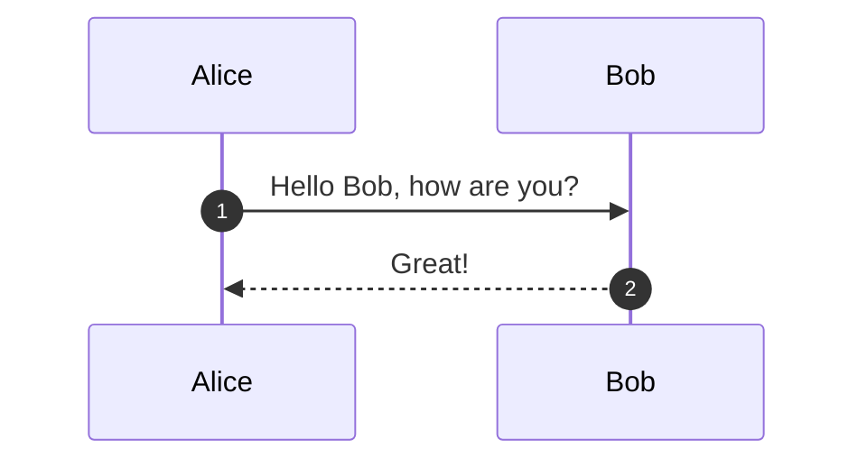

2. **自定义参与者颜色**：使用 `participant` 声明并在 CSS 中自定义样式
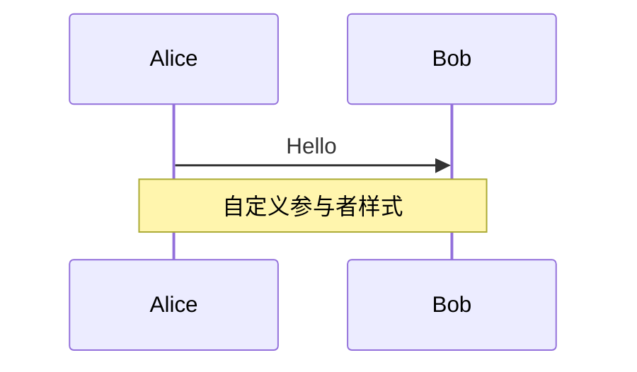

3. **使用不同类型的箭头**：表达不同的消息类型
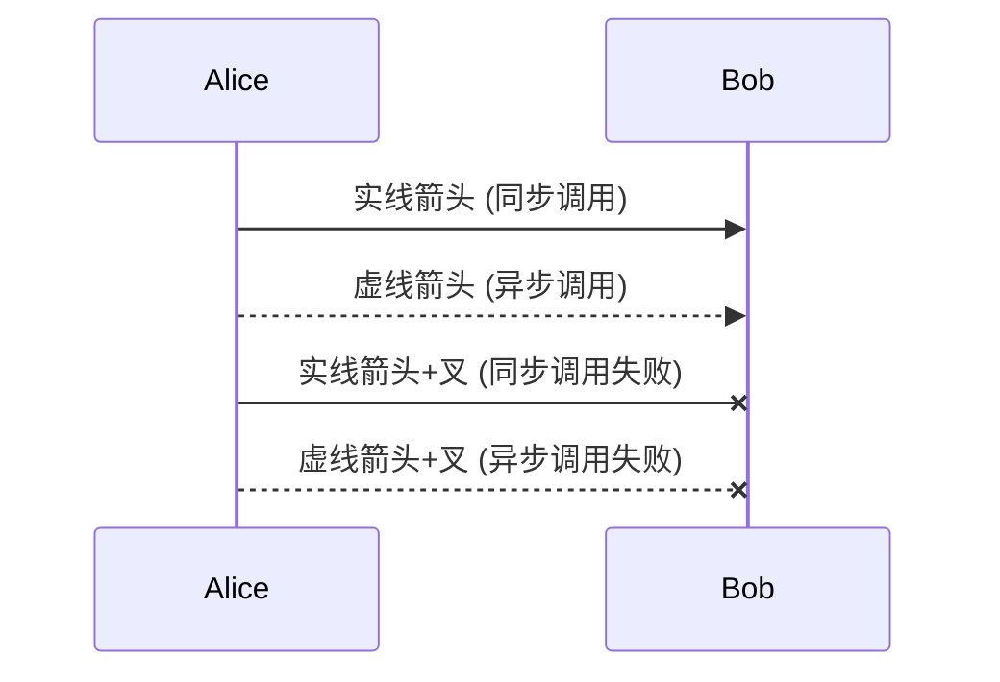

4. **添加激活框**：显示对象的生命周期
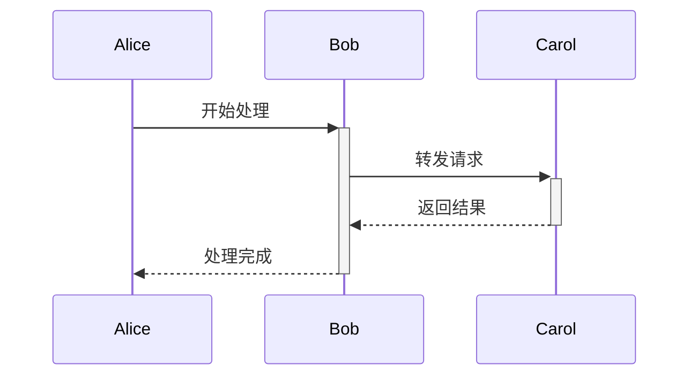

5. **使用循环和条件**：表达复杂的业务逻辑
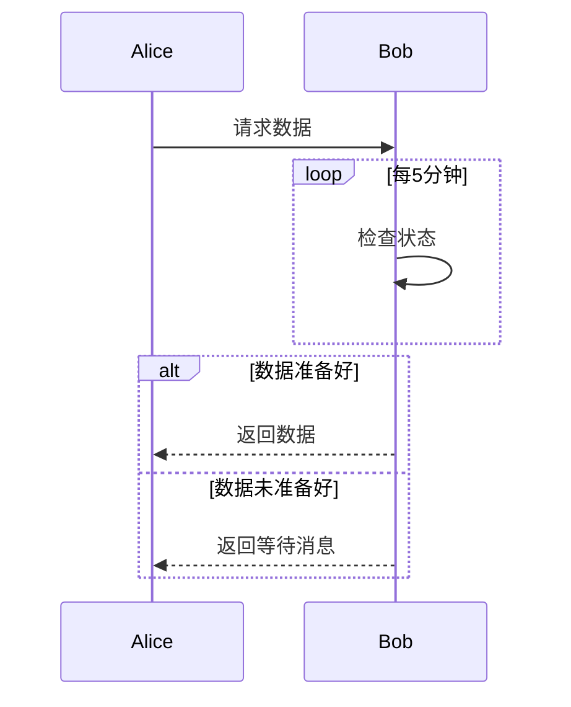

## 2. 流程图 (Flowchart)

流程图用于表示算法、工作流程或决策过程。

### 5 个实用技巧

1. **使用不同形状的节点**：区分不同类型的步骤
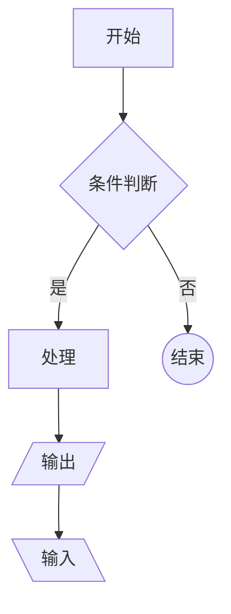

2. **设置流程方向**：选择最适合的布局
```mermaid
flowchart LR
    A --> B --> C
    
flowchart TD
    D --> E --> F
    
flowchart BT
    G --> H --> I
```

3. **使用子图组织复杂流程**：提高可读性
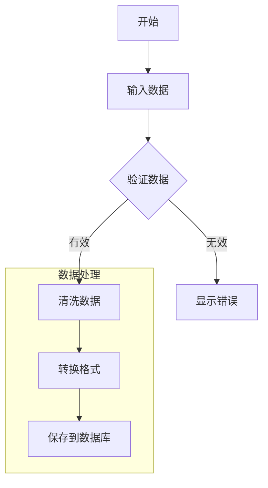

4. **使用不同样式的连接线**：表达不同的关系
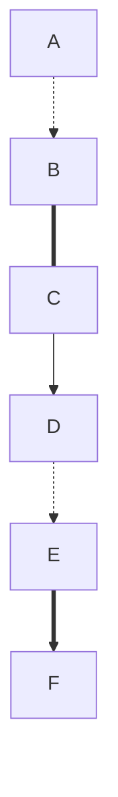

5. **添加点击事件和链接**：增加交互性
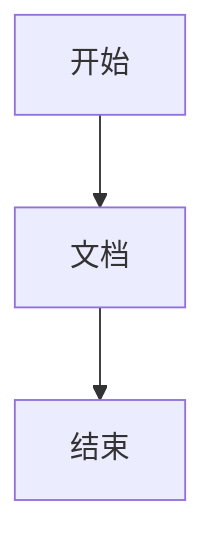

## 3. 类图 (Class Diagram)

类图用于显示系统中类的静态结构和它们之间的关系。

### 5 个实用技巧

1. **定义完整的类结构**：包括属性、方法和可见性
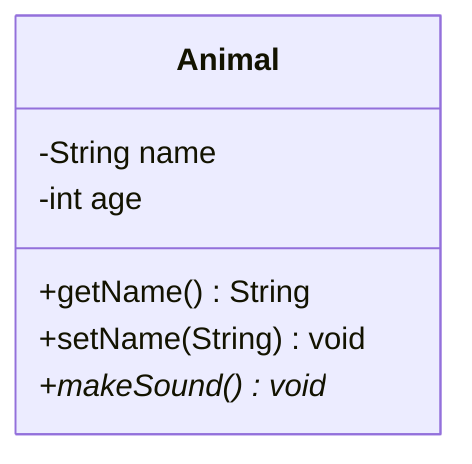

2. **使用不同的关系类型**：表达准确的类关系
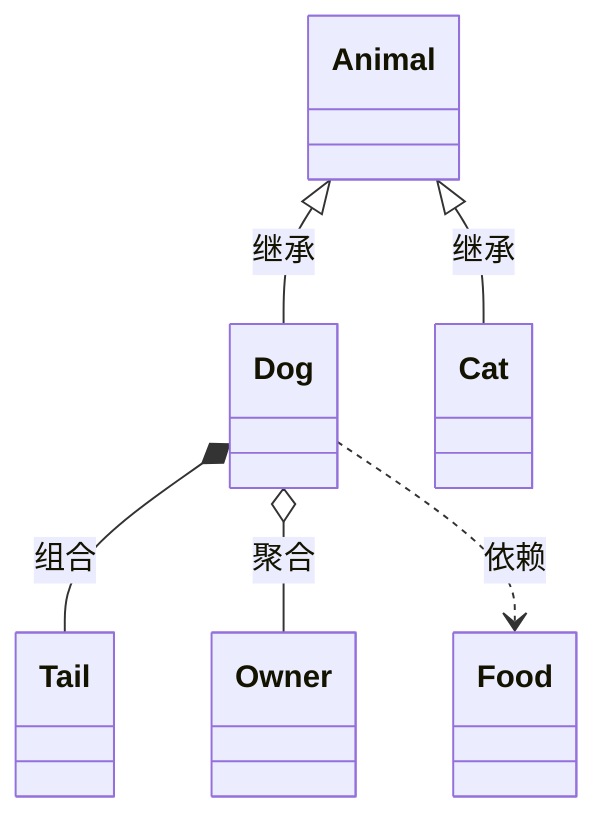

3. **使用泛型和接口**：表达更复杂的设计
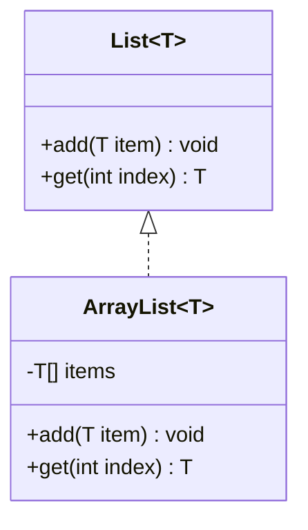

4. **添加注释和标签**：增加说明信息
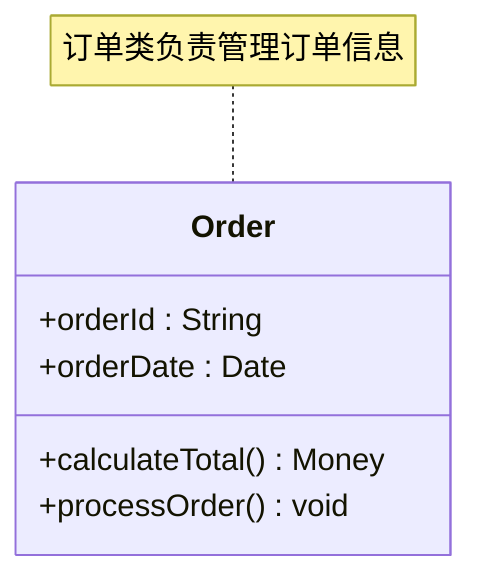

5. **使用命名空间组织类**：管理大型系统
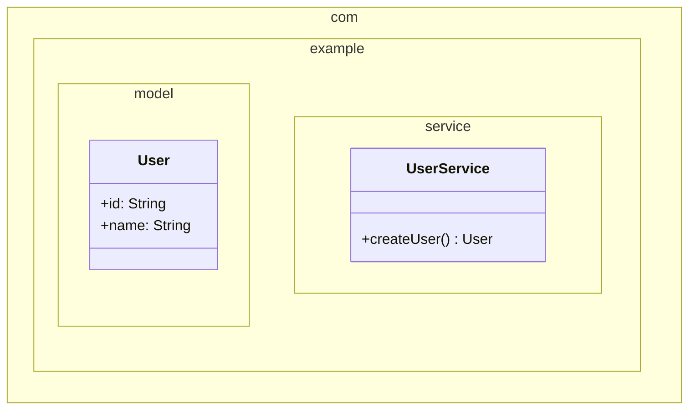

## 4. 状态图 (State Diagram)

状态图用于描述对象在其生命周期中的状态变化。

### 5 个实用技巧

1. **定义状态转换条件**：清晰表达状态变化的触发条件
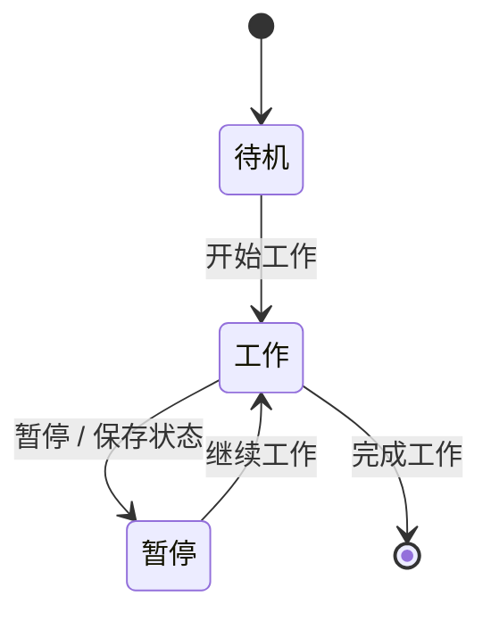

2. **使用复合状态**：处理复杂的状态层次
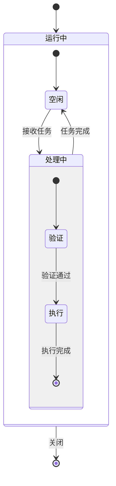

3. **添加并发状态**：表示同时进行的状态
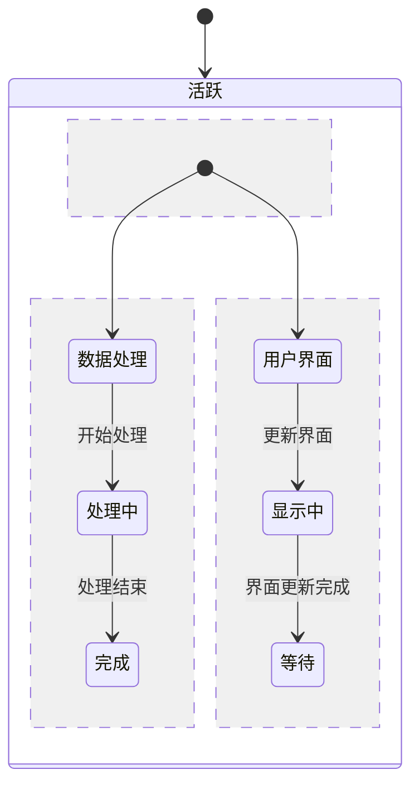

4. **使用状态注释**：添加详细说明
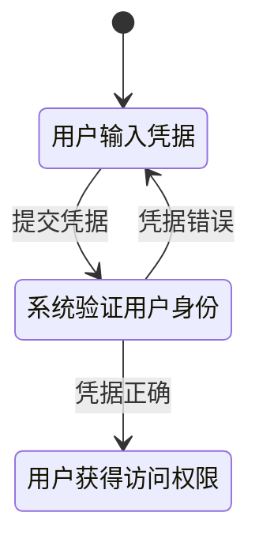

5. **处理错误状态和恢复**：设计健壮的状态机
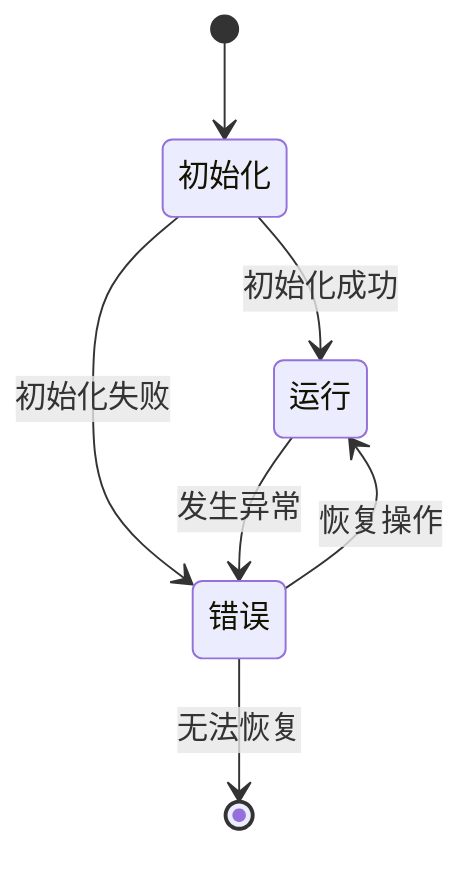

## 5. 实体关系图 (Entity Relationship Diagram)

ER图用于设计和可视化数据库结构。

### 5 个实用技巧

1. **定义实体属性和主键**：清晰表达数据结构
```mermaid
erDiagram
    USER {
        int user_id PK
        string username
        string email UK
        datetime created_at
    }
    
    POST {
        int post_id PK
        int user_id FK
        string title
        text content
        datetime published_at
    }
```

2. **使用不同的关系类型**：准确表达数据关系
```mermaid
erDiagram
    USER ||--o{ POST : "发布"
    POST }o--|| CATEGORY : "属于"
    USER }o--o{ ROLE : "拥有"
    POST ||--o{ COMMENT : "包含"
```

3. **添加关系属性**：描述关系的附加信息
```mermaid
erDiagram
    STUDENT {
        int student_id PK
        string name
        string email
    }
    
    COURSE {
        int course_id PK
        string course_name
        int credits
    }
    
    ENROLLMENT {
        int student_id PK, FK
        int course_id PK, FK
        datetime enrollment_date
        string grade
    }
    
    STUDENT ||--o{ ENROLLMENT : "注册"
    COURSE ||--o{ ENROLLMENT : "开设"
```

4. **使用约束和索引标记**：表达数据库设计细节
```mermaid
erDiagram
    USER {
        int id PK
        string email UK "唯一约束"
        string phone UK "唯一约束"
        string password "非空约束"
        datetime created_at "默认当前时间"
        boolean is_active "默认true"
    }
```

5. **组织复杂的数据模型**：使用分组和模块化
```mermaid
erDiagram
    %% 用户模块
    USER ||--o{ USER_PROFILE : "拥有"
    USER ||--o{ USER_ROLE : "分配"
    
    %% 内容模块  
    USER ||--o{ ARTICLE : "创建"
    ARTICLE ||--o{ COMMENT : "包含"
    ARTICLE }o--|| CATEGORY : "分类"
    
    %% 权限模块
    ROLE ||--o{ USER_ROLE : "分配给"
    ROLE ||--o{ PERMISSION : "包含"
```

## 6. 用户旅程图 (User Journey)

用户旅程图用于描述用户与产品或服务交互的完整过程。

### 5 个实用技巧

1. **定义完整的用户路径**：从开始到结束的完整体验
```mermaid
journey
    title 网上购物用户旅程
    
    section 发现阶段
      搜索产品           : 3: 用户
      浏览商品页面       : 4: 用户
      比较不同商品       : 2: 用户
      
    section 购买阶段
      添加到购物车       : 5: 用户
      填写收货信息       : 3: 用户
      选择支付方式       : 4: 用户
      完成支付          : 5: 用户
```

2. **使用情感评分**：量化用户体验的好坏
```mermaid
journey
    title 客户服务体验
    
    section 问题报告
      发现问题    : 1: 用户 : 沮丧
      寻找联系方式 : 2: 用户 : 困惑
      
    section 客服交流
      联系客服    : 4: 用户, 客服 : 希望
      问题诊断    : 5: 用户, 客服 : 满意
      解决方案    : 5: 用户, 客服 : 高兴
```

3. **包含多个角色**：展示不同参与者的视角
```mermaid
journey
    title 在线教育课程体验
    
    section 课程准备
      制作课程内容  : 4: 讲师
      上传课程视频  : 3: 讲师
      设置课程价格  : 5: 讲师
      
    section 学生学习
      搜索课程     : 4: 学生
      购买课程     : 3: 学生
      观看视频     : 5: 学生
      完成作业     : 4: 学生
```

4. **标识关键触点**：突出重要的交互节点
```mermaid
journey
    title 移动应用注册流程
    
    section 首次接触
      下载应用     : 4: 用户
      启动应用     : 5: 用户
      
    section 注册过程
      点击注册     : 4: 用户
      输入手机号   : 3: 用户 : 关键触点
      接收验证码   : 2: 用户 : 痛点
      完成注册     : 5: 用户 : 成功点
```

5. **描述不同场景路径**：考虑多种用户行为
```mermaid
journey
    title 电商退货流程
    
    section 申请退货
      发现产品问题   : 1: 用户
      查找退货政策   : 3: 用户
      提交退货申请   : 4: 用户
      
    section 处理流程
      审核申请      : 4: 客服
      生成退货标签   : 5: 系统
      
    section 完成退货
      寄回商品      : 3: 用户
      收到退款      : 5: 用户
```

## 7. 甘特图 (Gantt Chart)

甘特图用于项目管理，显示任务的时间安排和依赖关系。

### 5 个实用技巧

1. **设置任务依赖关系**：明确任务之间的先后顺序
```mermaid
gantt
    title 网站开发项目进度
    dateFormat  YYYY-MM-DD
    
    section 设计阶段
    需求分析    :done, des1, 2024-01-01,2024-01-05
    UI设计     :done, des2, after des1, 10d
    原型制作    :active, des3, after des2, 5d
    
    section 开发阶段
    前端开发    :dev1, after des3, 20d
    后端开发    :dev2, after des3, 25d
    集成测试    :dev3, after dev1 dev2, 10d
```

2. **使用里程碑标记重要节点**：突出关键时间点
```mermaid
gantt
    title 产品发布计划
    dateFormat  YYYY-MM-DD
    
    section 开发
    功能开发    :dev, 2024-01-01, 30d
    
    section 测试
    内部测试    :test1, after dev, 10d
    用户测试    :test2, after test1, 15d
    
    section 发布
    Beta版发布  :milestone, m1, after test2, 0d
    正式发布    :milestone, m2, after test2, 30d
```

3. **标识任务状态**：跟踪项目进展
```mermaid
gantt
    title 软件开发生命周期
    dateFormat  YYYY-MM-DD
    
    section 已完成
    需求收集    :done, req, 2024-01-01, 5d
    系统设计    :done, design, after req, 8d
    
    section 进行中
    编码实现    :active, code, after design, 20d
    
    section 计划中
    系统测试    :test, after code, 10d
    部署上线    :deploy, after test, 3d
```

4. **使用关键路径标识**：突出影响项目完成时间的任务
```mermaid
gantt
    title 移动应用开发关键路径
    dateFormat  YYYY-MM-DD
    
    section 关键路径
    核心功能开发  :crit, core, 2024-01-01, 25d
    性能优化     :crit, perf, after core, 10d
    应用商店审核  :crit, review, after perf, 7d
    
    section 并行任务
    UI美化       :ui, 2024-01-15, 20d
    文档编写     :doc, 2024-01-20, 15d
```

5. **分组显示复杂项目**：组织大型项目的任务结构
```mermaid
gantt
    title 企业级系统开发
    dateFormat  YYYY-MM-DD
    
    section 后端系统
    数据库设计   :db, 2024-01-01, 10d
    API开发     :api, after db, 20d
    
    section 前端应用
    界面设计    :ui, 2024-01-01, 15d
    前端开发    :fe, after ui, 25d
    
    section 运维部署
    环境搭建    :env, 2024-01-01, 5d
    CI/CD配置   :cicd, after env, 10d
    生产部署    :deploy, after api fe cicd, 5d
```

## 8. 饼图 (Pie Chart)

饼图用于显示数据的比例分布。

### 5 个实用技巧

1. **显示百分比数据**：清晰表达各部分占比
```mermaid
pie title 网站流量来源分布
    "搜索引擎" : 42.5
    "直接访问" : 28.3
    "社交媒体" : 15.2
    "推荐链接" : 10.1
    "其他" : 3.9
```

2. **使用有意义的标签**：提高图表可读性
```mermaid
pie title 2024年销售额分布（单位：万元）
    "华北区域 (320万)" : 320
    "华南区域 (280万)" : 280
    "华东区域 (450万)" : 450
    "西部区域 (150万)" : 150
```

3. **突出显示重要数据**：使关键信息更突出
```mermaid
pie title 用户设备类型统计
    "移动设备" : 65.2
    "桌面设备" : 28.7
    "平板设备" : 6.1
```

4. **保持数据精度一致**：确保数据的专业性
```mermaid
pie title 客户满意度调查结果
    "非常满意 (45.2%)" : 45.2
    "满意 (38.7%)" : 38.7
    "一般 (12.1%)" : 12.1
    "不满意 (3.5%)" : 3.5
    "非常不满意 (0.5%)" : 0.5
```

5. **限制分类数量**：避免图表过于复杂
```mermaid
pie title 项目预算分配
    "人力成本" : 50
    "技术成本" : 25
    "运营成本" : 15
    "其他支出" : 10
```

## 9. Git 图 (Git Graph)

Git图用于可视化代码仓库的分支和合并历史。

### 5 个实用技巧

1. **显示标准的Git工作流**：可视化常见的开发流程
```mermaid
gitgraph
    commit id: "Initial commit"
    branch develop
    checkout develop
    commit id: "Add feature A"
    commit id: "Fix bug #001"
    checkout main
    merge develop
    commit id: "Release v1.0"
```

2. **使用功能分支模式**：展示并行开发过程
```mermaid
gitgraph
    commit id: "Start project"
    branch feature-login
    checkout feature-login
    commit id: "Add login form"
    commit id: "Add validation"
    checkout main
    branch feature-dashboard
    checkout feature-dashboard
    commit id: "Create dashboard"
    checkout main
    merge feature-login
    merge feature-dashboard
    commit id: "Release v1.1"
```

3. **表示热修复流程**：显示紧急修复的分支策略
```mermaid
gitgraph
    commit id: "v1.0 Release"
    branch hotfix
    checkout hotfix
    commit id: "Fix critical bug"
    checkout main
    merge hotfix
    commit id: "v1.0.1 Hotfix"
    branch develop
    checkout develop
    merge main
    commit id: "Continue development"
```

4. **使用标签标记版本**：清晰标识发布节点
```mermaid
gitgraph
    commit id: "Initial"
    commit id: "Feature 1" tag: "v0.1"
    branch develop
    checkout develop
    commit id: "Feature 2"
    commit id: "Feature 3"
    checkout main
    merge develop
    commit id: "Release" tag: "v1.0"
```

5. **展示复杂的合并场景**：处理多分支开发
```mermaid
gitgraph
    commit id: "Start"
    branch feature-A
    branch feature-B
    checkout feature-A
    commit id: "A1"
    commit id: "A2"
    checkout feature-B
    commit id: "B1"
    checkout main
    merge feature-A
    checkout feature-B
    commit id: "B2"
    checkout main
    merge feature-B
    commit id: "Final merge"
```

## 10. 思维导图 (Mindmap)

思维导图用于组织和可视化信息结构。

### 5 个实用技巧

1. **构建层次化的知识结构**：从中心主题向外扩展
```mermaid
mindmap
  root((Web开发))
    前端技术
      HTML
        语义化标签
        表单元素
      CSS
        布局技术
        响应式设计
      JavaScript
        ES6+特性
        异步编程
    后端技术
      Node.js
      Python
      数据库
        MySQL
        MongoDB
```

2. **使用符号区分不同类型的节点**：增强视觉识别
```mermaid
mindmap
  root((项目管理))
    [计划阶段]
      需求分析
      资源规划
    (执行阶段)
      任务分配
      进度跟踪
    )监控阶段(
      质量控制
      风险管理
    ))收尾阶段((
      项目交付
      经验总结
```

3. **表达复杂的概念关系**：展示知识点之间的联系
```mermaid
mindmap
  root((数据科学))
    统计学基础
      描述性统计
      推断性统计
      概率论
    编程技能
      Python
        Pandas
        NumPy
        Scikit-learn
      R语言
    机器学习
      监督学习
        分类算法
        回归算法
      无监督学习
        聚类分析
        降维技术
```

4. **组织学习路径**：规划知识学习顺序
```mermaid
mindmap
  root((全栈开发学习路径))
    基础阶段
      HTML/CSS
      JavaScript基础
      版本控制Git
    前端进阶
      React/Vue框架
      状态管理
      构建工具
    后端开发
      服务器语言
      数据库操作
      API设计
    运维部署
      云服务
      容器技术
      CI/CD
```

5. **展示系统架构思考**：可视化技术决策过程
```mermaid
mindmap
  root((微服务架构))
    服务拆分
      按业务领域
      按数据模型
      按团队结构
    通信机制
      同步调用
        HTTP/REST
        gRPC
      异步消息
        消息队列
        事件驱动
    数据管理
      数据库分离
      数据一致性
      分布式事务
    运维监控
      服务发现
      负载均衡
      日志聚合
      指标监控
```

## 总结

Mermaid 提供了丰富的图表类型来可视化不同类型的信息：

- **序列图**：适合描述系统交互和API调用流程
- **流程图**：适合表达算法逻辑和业务流程
- **类图**：适合设计和文档化面向对象系统
- **状态图**：适合描述系统状态变化和生命周期
- **ER图**：适合数据库设计和数据建模
- **用户旅程图**：适合用户体验设计和服务设计
- **甘特图**：适合项目管理和时间规划
- **饼图**：适合数据分析和比例展示
- **Git图**：适合版本控制和分支管理可视化
- **思维导图**：适合知识组织和头脑风暴

每种图表都有其特定的应用场景和语法特点。掌握这些技巧可以帮助你更有效地使用 Mermaid 来创建清晰、专业的图表，提升文档质量和沟通效率。

## 参考资源

- [Mermaid 官方文档](https://mermaid.js.org/)
- [Mermaid 在线编辑器](https://mermaid.live/)
- [GitHub Mermaid 支持](https://github.blog/2022-02-14-include-diagrams-markdown-files-mermaid/)