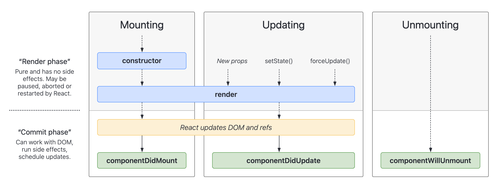

# React

## 邂逅React

### React开发依赖

- `react` 包含React的核心代码
- `react-dom` 将React渲染到不同平台需要的核心代码
- `babel` 将JSX转换成React代码的工具

为什么要拆分成这么多的包？

- 不同的库各司其职，让库变得纯粹
- `react`包中包含了 React Web 和 React Native 共同拥有的**核心代码**
- `react-dom` 针对Web和Native完成的事情不同
  - Web端：`react-dom`会将JSX渲染成真实DOM，展示在浏览器中
  - Native端：`react-dom`会将JSX渲染成原生的控件（如Android中的Button，iOS中的UIButton）

### Babel与React的关系

Babel是什么？

- Babel又名Babel.js
- 是目前前端使用非常广泛的编译器、转换器（Compiler/Transformer）
- 提供对ES6语法的Polyfill，将ES6语法转为大多数浏览器都支持的ES5语法

二者之间的联系

- 默认情况下React开发可以不使用Babel
- 但是我们不可能使用React.createElement来编写代码
- 通过Babel，我们可以直接编写JSX（JavaScript XML），让Babel帮我们转化为React.createElement

### React初体验

我们通过CDN方式引入react、react-dom、babel这三个依赖

并且创建`#root`根节点，作为渲染React组件的容器，再新建一个script标签，键入以下内容

```html
<div id="root"></div>
<script src="https://unpkg.com/react@18/umd/react.development.js" crossorigin></script>
<script src="https://unpkg.com/react-dom@18/umd/react-dom.development.js" crossorigin></script>
<script src="https://unpkg.com/babel-standalone@6/babel.min.js" crossorigin></script>
<script type="text/babel">
  ReactDOM.render(<div>Hello, React!</div>, document.querySelector('#root'))
</script>
```

这时，一个内容为`Hello, React!`的div标签就被渲染到页面上了

需要注意的是：`ReactDOM.render`这种写法适用于React18之前，在React18之后建议用下面的代码渲染根节点：

```tsx
const root = ReactDOM.createRoot(document.querySelector('#root'))
root.render(<h1>Hello, React!</h1>)
```

### 第一个React程序

设想我们现在有这样一个需求：点击按钮使文本`Hello, World!`变为`Hello, React!`

我们很容易就能写出如下代码：

```tsx
const root = ReactDOM.createRoot(document.querySelector('#root'))
let msg = 'Hello, World!'

render() // initial render

function handleChangeClick() {
  msg = 'Hello, React!'
}

root.render(
  <div>
    <h1>{msg}</h1>
    <button onClick={handleChangeClick}>Change Text</button>
  </div>
)
```

在Vue中，如果我们对数据进行了修改，Vue的数据响应式会自动帮我们完成视图的更新

然而在React中，当我们修改了数据需要通知React，让React重新渲染视图。在这里，我们可以把渲染的过程封装为一个函数，方便我们重复调用，触发重新渲染

```tsx
const root = ReactDOM.createRoot(document.querySelector('#root'))
let msg = 'Hello, World!'

render() // initial render

function handleChangeClick() {
  msg = 'Hello, React!'
  render() // re-render
}

function render() {
  root.render(
    <div>
      <h1>{msg}</h1>
      <button onClick={handleChangeClick}>Change Text</button>
    </div>
  )
}
```

这个案例中，我们使用`{}`语法，将动态的JS语法嵌入到JSX代码中

### 组件化开发

React有两种组件：类组件与函数组件，React18+推荐使用函数组件+Hooks

#### 类组件

我们使用类组件来逐步重构上面的案例：

```tsx
class App extends React.Component {
  constructor() {
    super()
    this.state = {
      msg: 'Hello, World!'
    }
  }
  render() {
    return <h2>{this.state.msg}</h2>
  }
}

const root = ReactDOM.createRoot(document.querySelector('#root'))
root.render(<App />)
```

- 类组件必须实现render方法，render方法返回值为后续React渲染到页面的内容
- 组件内数据分为两类
  - 参与页面更新的数据
    - 当数据变化时，需要触发组件重新渲染
  - 不参与页面更新的数据
    - 数据不会变化，或变化后也不需要重新渲染视图

- 需要触发视图重新渲染的数据，我们将其成为：**参与数据流**
  - 定义在对象的`state`属性中
  - 可以通过在构造函数中通过 `this.state = { name: 'Ziu' }` 来定义状态
  - 当数据发生变化，可以调用 `this.setState` 来更新数据，通知React执行视图更新
  - update操作时，会重新调用render函数，使用最新的数据来渲染界面

::: tip
需要注意的是，在constructor中我们调用了`super`，因为App类是继承自React.Component类，调用`super`即调用了其父类的构造函数，让我们的App组件可以继承一些内置属性/方法如`state setState render`
:::

至此我们完成了数据的迁移，下面我们来完成事件函数的迁移。

有了之前的介绍，我们很容易的可以写出下面的代码：

```tsx
class App extends React.Component {
  constructor() {
    super()
    this.state = {
      msg: 'Hello, World!'
    }
  }
  changeText() {
    this.setState({
      msg: 'Hello, React!'
    })
  }
  render() {
    return (
      <div>
        <h2>{this.state.msg}</h2>
        <button onClick={this.changeText}>Change Text</button>
      </div>
    )
  }
}

const root = ReactDOM.createRoot(document.querySelector('#root'))
root.render(<App />)
```

我们可以写一个实例方法changeText来修改msg，然而，此时我们点击按钮后发现，案例不能正常工作。

如果在changeText中打log，会发现函数被正常触发了，但是状态没有更新

为什么this.setState失效了？这和this的绑定有关：绑定的`changeText`在被调用时，向上找`this`找到的是全局的`this`即`undefined`

这种情况有点类似于下面的例子：

```ts
const app = new App()
app.changeText() // this => app

const func = app.changeText
func() // this => undefined
```

在非严格模式下，直接调用func时的this指向的是window，严格模式下则为undefined

为了解决this绑定的问题，我们需要显式把函数调用绑定给当前组件，这时组件就可以正常工作了。

```tsx {17}
class App extends React.Component {
  constructor() {
    super()
    this.state = {
      msg: 'Hello, World!'
    }
  }
  changeText() {
    this.setState({
      msg: 'Hello, React!'
    })
  }
  render() {
    return (
      <div>
        <h2>{this.state.msg}</h2>
        <button onClick={this.changeText.bind(this)}>Change Text</button>
      </div>
    )
  }
}

const root = ReactDOM.createRoot(document.querySelector('#root'))
root.render(<App />)
```

### 提前绑定this

在render函数中频繁通过`.bind`毕竟不太优雅，好在也有另一种方式：可以在constructor中提前对实例方法进行this绑定：

```tsx {7,11}
...
constructor() {
  super()
  this.state = {
    msg: 'Hello, World!'
  }
  this.changeText = this.changeText.bind(this)
}
render() {
  ...
    <button onClick={this.changeText}>Change Text</button>
  ...
}
...
```

### 列表渲染

可以通过循环，将数组渲染到视图中

```tsx
class App extends React.Component {
  constructor() {
    super()
    this.state = {
      movieList: [
        'The Shawshank Redemption',
        'The Godfather',
        'The Godfather: Part II',
        'The Dark Knight'
      ]
    }
  }

  render() {
    return (
      <ul>
        {this.state.movieList.map((item) => (
          <li key={item}>{item}</li>
        ))}
      </ul>
    )
  }
}

const root = ReactDOM.createRoot(document.querySelector('#root'))
root.render(<App />)
```

需要注意的是，这里绑定的key的功能类似于Vue中的特殊属性key，它用来帮助React对列表渲染进行更高效的更新。

### 计数器案例

结合之前的知识，可以实现一个简单的计数器

```tsx
class App extends React.Component {
  constructor() {
    super()
    this.state = {
      count: 0
    }
    this.addCount = this.addCount.bind(this)
    this.subCount = this.subCount.bind(this)
  }

  addCount() {
    this.setState({
      count: this.state.count + 1
    })
  }

  subCount() {
    this.setState({
      count: this.state.count - 1
    })
  }

  render() {
    const { count } = this.state

    return (
      <div>
        <h1>Count: {count}</h1>
        <button onClick={this.addCount}>Add</button>
        <button onClick={this.subCount}>Sub</button>
      </div>
    )
  }
}

const root = ReactDOM.createRoot(document.querySelector('#root'))
root.render(<App />)
```

## 认识JSX语法

- 认识JSX语法
- JSX基本使用
- JSX事件绑定
- JSX条件渲染
- JSX列表渲染
- JSX的原理与本质

是因为我们给script标签添加了`type="text/babel"`属性，浏览器不会对这个script进行解析，当babel被加载完成后，babel会在页面中寻找`type="text/babel"`的script标签进行转义，转义后的代码才会被浏览器执行

- JSX: JavaScript Extension / JavaScript XML
- All in JS
- 不同于Vue的模板语法 不需要专门学习模板语法中的指令(v-for/v-if/v-bind)

### JSX的使用

#### 书写JSX的规范与注意事项

- JSX的顶层只能有一个根元素 元素必须包裹在单独的闭合标签中
  - 后续会接触到Fragment标签 Vue3也是将元素包裹在了Fragments标签中
- 为了方便阅读 通常在JSX外层包裹一个小括号`()`方便阅读

#### JSX的注释

在JSX中编写注释，需要以`{/* ... */}`的形式，在`.jsx/.tsx`文件中，通过快捷键就可以快捷的生成注释内容

本质上是通过花括号语法`{}`嵌入了一段JavaScript表达式，在表达式中书写注释

```tsx{4}
...
return (
  <div>
    {/* Some Comment... */}
    <h1>Count: {count}</h1>
    <button onClick={this.addCount}>Add</button>
    <button onClick={this.subCount}>Sub</button>
  </div>
)
...
```

#### JSX嵌入变量作为子元素

可以通过花括号语法将变量内容嵌入到JSX语法中：

```tsx
const message = 'Hello, React!'
const arr = ['abc', 'cba', 'nba']

return (
  <div>
    <h1>{ message }</h1>
    <div>{ arr }</div>
  </div>
)
```

- 变量类型为number string array类型时，可以直接展示
- 变量类型为null undefined boolean类型时，内容为空
  - 如果希望可以展示null/undefined/boolean类型，需要通过`.toString()`方法将其转为字符串
  - 空字符串拼接、String构造函数等方式
- Object对象类型不能作为子元素 (Objects are not valid as a React child)

下例中，只有number类型会被正常展示，而其余变量则不会展示在视图中

```tsx
render() {
  const number = 123
  const n = null
  const u = undefined
  const b = true

  return (
    <div>
      <div>
        Number: {number}
      </div>
      <div>
        Null: {n}
      </div>
      <div>
        Undefined: {u}
      </div>
      <div>
        Boolean: {b}
      </div>
    </div>
  )
}
```

将对象类型变量嵌入到JSX语法中，React会抛出错误：

```tsx {6}
...
render() {
  const obj = { name: 'Ziu' }
  return (
    <div>
      { obj }
    </div>
  )
}
...
```

#### JSX的属性绑定

- 在Vue中我们通过`v-bind`绑定属性
- 在React中如何绑定元素属性？
- `title` `src` `href` `class` 内联`style`等

下例中，我们通过花括号语法对元素的属性进行了动态绑定，点击按钮可以切换className状态

同时，动态绑定的内联样式也会发生改变，通过花括号语法动态绑定style属性

```tsx
class App extends React.Component {
  constructor() {
    super()
    this.state = {
      isActive: false,
      title: 'Description'
    }
    this.changeActive = this.changeActive.bind(this)
  }

  changeActive() {
    this.setState({
      isActive: !this.state.isActive
    })
  }

  render() {
    const { isActive, title } = this.state
    const classList = ['title', isActive ? 'active' : '']

    return (
      <div>
        <div
          className={classList.join(' ')}
          title={title}
          style={{ color: isActive ? 'red' : 'blue' }}
        >
          Hello, React!
        </div>
        <button onClick={this.changeActive}>Change Active</button>
      </div>
    )
  }
}
```

当我们通过脚手架创建项目时，可以使用第三方库来帮我们完成className的绑定

- `classnames`库 `pnpm add classnames`
- 提供了多种创建className的语法

### JSX事件绑定

先前的例子中，我们已经通过`onClick`给按钮绑定过事件处理函数了，其中涉及了this绑定

回顾一下this的四种绑定规则：

1. 默认绑定 独立执行 foo() this => undefined
2. 隐式绑定 被一个对象执行 obj.foo() this => obj
3. 显式绑定 call/bind/apply foo.call('aaa') this => String('aaa')
4. new绑定 new Foo() 创建一个新对象，并且赋值给this

除了之前通过`function + bind`绑定事件处理函数的方式，还可以通过箭头函数来帮我们完成处理

箭头函数的内部使用this时会自动向上层作用域查找this 实际开发中这种方式并不常用 

```tsx {2}
...
changeActive = () => {
  this.setState({
    isActive: !this.state.isActive
  })
}
...
```

相比之下更推荐使用的，是下面这种方式：

```tsx {2}
...
<button onClick={() => this.changeActive()}>Change Active</button>
...
```

这样书写有几种好处：

- 给事件处理函数传递参数更方便
- 书写更方便 不必主动考虑this绑定问题

它的原理是，我们对外暴露的本质上是一个箭头函数，当调用箭头函数时，本质上是执行`this.changeActive`，这是 一种隐式绑定，找到的this为当前组件实例

### 事件绑定参数传递

- Event参数传递
- 额外参数传递

事件回调函数的第一个默认参数就是Event对象，这个Event对象是经过React包装后的，但是原生的属性都包含在内，React对其进行了一些扩展
 
```tsx {13}
...
changeActive(ev) {
  console.log('Event', ev)
}

render() {
  return (
    <div>
      {/* event将作为默认入参传递给changeActive */}
      <button onClick={this.changeActive}>Change Active</button>

      {/* 通过箭头函数绑定事件监听回调函数时 需要手动透传一下event */}
      <button onClick={(ev) => this.changeActive(ev)}>Change Active</button>
    </div>
  )
}
...
```

当我们需要传递额外的参数时，通过箭头函数传递也更容易：

```tsx {13}
changeActive(ev, name, age) {
  console.log('Event', ev)
  console.log('Name', name)
  console.log('Age', age)
}

render() {
  return (
    <div>
      {/* NOT Recommand */}
      <button onClick={this.changeActive.bind(this, 'Ziu', 18)}>Change Active</button>
      {/* Recommand */}
      <button onClick={(ev) => this.changeActive(ev, 'Ziu', 18)}>Change Active</button>
    </div>
  )
}
```

需要注意，当通过`.bind`传递额外参数时，最后一个参数才是默认传递的Event对象，这会导致非预期行为

```sh
> Event 'Ziu'
> Name 18
> Age {Event}
```

### JSX事件绑定案例

创建一个Tab栏，选中哪个选项，哪个选项被激活切换为红色，同一时间仅有一个激活项目

结合之前学习的内容，很容易就可以写出下述 代码：

```tsx
class App extends React.Component {
  constructor() {
    super()
    this.state = {
      activeIndex: 0,
      tabList: ['Home', 'Recommend', 'Hot', 'User']
    }
  }

  changeActive(index) {
    this.setState({
      activeIndex: index
    })
  }

  render() {
    const { activeIndex, tabList } = this.state

    return (
      <div>
        <div className="tabs">
          {tabList.map((item, index) => (
            <button
              className={'tab ' + index === activeIndex ? 'active' : ''}
              style={{
                color: index === activeIndex ? 'red' : 'black'
              }}
              key={index}
              onClick={() => this.changeActive(index)}
            >
              {item}
            </button>
          ))}
        </div>
      </div>
    )
  }
}

const root = ReactDOM.createRoot(document.querySelector('#root'))
root.render(<App />)
```

### 条件渲染

控制元素按照某种条件渲染，以加载状态为例

列表未加载出来时，展示`加载中`，加载完毕则渲染完整内容：

```tsx
class App extends React.Component {
  constructor() {
    super()
    this.state = {
      isLoading: true
    }
  }

  changeLoading() {
    this.setState({
      isLoading: !this.state.isLoading
    })
  }

  render() {
    const { isLoading } = this.state

    return (
      <div>
        {isLoading ? (
          <div className="loading"> Loading ... </div>
        ) : (
          <div className="list">Some Content</div>
        )}
        <button onClick={() => this.changeLoading()}>Toggle Loading</button>
      </div>
    )
  }
}

const root = ReactDOM.createRoot(document.querySelector('#root'))
root.render(<App />)
```

常用的条件渲染方式

- `if/else/else-if`
  - 适合判断逻辑较复杂的情况 将条件渲染抽离出来
- 三元运算符 `?:`
  - 适合判断逻辑简单的情况
- 逻辑与运算符 `&&`
  - 如果条件成立则渲染某个组件，否则什么内容都不渲染
- 可选链 `user?.info?.name`

下例中通过逻辑与运算符`&&`决定`VIP`标签是否展示在视图中 

```tsx
class App extends React.Component {
  constructor() {
    super()
    this.state = {
      isVip: false
    }
  }

  changeVip() {
    this.setState({
      isVip: !this.state.isVip
    })
  }

  render() {
    const { isVip } = this.state

    return (
      <div>
        <div class="user">
          <span>username: Ziu</span>
          {isVip && <span className="vip-banner"> VIP </span>}
        </div>

        <button onClick={() => this.changeVip()}>Toggle Vip</button>
      </div>
    )
  }
}

const root = ReactDOM.createRoot(document.querySelector('#root'))
root.render(<App />)
```

#### 在React中简单写一个"v-show"

`v-show`是Vue提供的语法糖，不同于`v-if`，它只切换元素的`display`属性。

下面我们在React中简单复现一个`v-show`的效果：

```tsx
class App extends React.Component {
  constructor() {
    super()
    this.state = {
      isShow: true
    }
  }

  changeShow() {
    this.setState({
      isShow: !this.state.isShow
    })
  }

  render() {
    const { isShow } = this.state

    return (
      <div>
        <div style={{ display: isShow ? '' : 'none' }}>Target Element</div>
        <button onClick={() => this.changeShow()}>Toggle Show</button>
      </div>
    )
  }
}
```

实际使用中，将其封装为hooks来调用更具通用性，也更方便管理

### 列表渲染中的高阶函数

- `filter`函数 过滤器
- `slice`函数 分页
- `sorc`函数 排序
- ...

```tsx
class App extends React.Component {
  constructor() {
    super()
    this.state = {
      stuList: [
        { name: 'Ziu', age: 18, score: 88 },
        { name: 'Kobe', age: 19, score: 59 },
        { name: 'Why', age: 20, score: 61 },
        { name: 'James', age: 21, score: 99 }
      ]
    }
  }

  render() {
    const { stuList } = this.state

    // 及格的学生
    const passStuList = stuList.filter((item) => item.score >= 60)

    // 分数最高的两个学生
    const top2StuList = stuList.sort((a, b) => b.score - a.score).slice(0, 2)

    return (
      <div>
        <div className="list">
          {stuList.map(({ name, age, score }) => (
            <div className="item" key={name}>
              <span className="name">{name}</span>
              <span className="age">{age}</span>
              <span className="score">{score}</span>
            </div>
          ))}
        </div>
      </div>
    )
  }
}

const root = ReactDOM.createRoot(document.querySelector('#root'))
root.render(<App />)
```

### JSX的本质

#### JSX的转换过程

假设我们有下面的JSX代码：

```tsx
class App extends React.Component {
  constructor() {
    super()
  }

  render() {
    const page = (
      <div className="page">
        <div className="header">Header</div>
        <div className="content">
          Content
          <div className="banner">Banner</div>
          <ul>
            <li>Item 1</li>
            <li>Item 2</li>
            <li>Item 3</li>
            <li>Item 4</li>
            <li>Item 5</li>
          </ul>
        </div>
        <div className="footer">Footer</div>
      </div>
    )
    console.log(page)
    return <div>{page}</div>
  }
}
```

通过JSX语法描述出来的template会经过Babel转化，转化为JavaScript树的数据结构

在控制台中我们可以看到，子节点都存放进了父节点的`props.children`中

#### 虚拟DOM树

JSX仅仅是`React.createElement(component, props, ...children)`的语法糖

所有的JSX语法都会被Babel转化为这样的命令式语法

.createElement函数的参数

- type
  - 当前ReactElement的类型
  - 如果是标签元素，值为字符串如：`"div"`
  - 如果是组件元素，那么值为组件的名称
- config
  - 所有JSX中绑定的属性都在config中以键值对的形式存储
  - 例如`className` => `class`

我们借助Babel官网的Playground来检查一下JSX语法的转化

```js
import { jsx as _jsx } from "react/jsx-runtime";
import { jsxs as _jsxs } from "react/jsx-runtime";
const page = /*#__PURE__*/_jsxs("div", {
  className: "page",
  children: [/*#__PURE__*/_jsx("div", {
    className: "header",
    children: "Header"
  }), /*#__PURE__*/_jsxs("div", {
    className: "content",
    children: ["Content", /*#__PURE__*/_jsx("div", {
      className: "banner",
      children: "Banner"
    }), /*#__PURE__*/_jsxs("ul", {
      children: [/*#__PURE__*/_jsx("li", {
        children: "Item 1"
      }), /*#__PURE__*/_jsx("li", {
        children: "Item 2"
      }), /*#__PURE__*/_jsx("li", {
        children: "Item 3"
      }), /*#__PURE__*/_jsx("li", {
        children: "Item 4"
      }), /*#__PURE__*/_jsx("li", {
        children: "Item 5"
      })]
    })]
  }), /*#__PURE__*/_jsx("div", {
    className: "footer",
    children: "Footer"
  })]
});
console.log(page);
```

这时经过Babel转义后的纯JS函数，这段函数可以在浏览器中直接运行

如果移除了相关JSX代码，并将他们都替换为`React.createElement`函数调用，那么得到的代码也可以直接在浏览器中运行。Babel帮助我们完成了转化，提高了开发效率，相比于通过调用`React.createElement`来描述视图，通过JSX编写的代码更加容易维护

这些代码最终形成的就是虚拟DOM树，React可以将虚拟DOM渲染到页面上，形成真实DOM

虚拟DOM允许React可以通过diff算法，高效地对真实DOM树进行更新

### 声明式编程

- 虚拟DOM帮我们从命令式编程转到了声明式编程的模式
- 对虚拟DOM作何处理，如何渲染是由React决定的，由于做了一层抽象，那么同样可以将虚拟DOM渲染成原生组件（React Native）

### 购物车案例

下面写一个经典的购物车案例

```tsx
function formatPrice(price) {
  return `$ ${price.toFixed(2)}`
}

class App extends React.Component {
  constructor() {
    super()
    this.state = {
      books: [
        { name: 'book1', author: 'author1', price: 100, count: 0 },
        { name: 'book2', author: 'author2', price: 200, count: 0 },
        { name: 'book3', author: 'author3', price: 300, count: 0 },
        { name: 'book4', author: 'author4', price: 400, count: 0 }
      ]
    }
  }

  changeCount(index, count) {
    this.setState((state) => {
      const books = [...state.books]
      books[index].count += count
      return { books }
    })
  }

  removeItem(index) {
    this.setState((state) => {
      const books = [...state.books]
      books.splice(index, 1)
      return { books }
    })
  }

  getTotal() {
    const { books } = this.state
    return books.reduce((acc, { price, count }) => acc + price * count, 0)
  }

  renderBookCart() {
    const { books } = this.state
    const total = this.getTotal()
    return (
      <div className="shopping-cart">
        <h1>Shopping Cart</h1>
        <div className="books">
          {books.map(({ name, author, price, count }, index) => (
            <div className="book" key={name}>
              <span className="idx">{index + 1}</span>
              <span className="name">{name}</span>
              <span className="author">{author}</span>
              <span className="price">{formatPrice(price)}</span>
              <span className="counter">
                <button onClick={() => this.changeCount(index, -1)} disabled={count <= 0}>
                  -
                </button>
                <span className="counter-number">{count}</span>
                <button onClick={() => this.changeCount(index, 1)}>+</button>
              </span>
              <button onClick={() => this.removeItem(index)}>Delete</button>
            </div>
          ))}
        </div>
        <div className="total">
          <span>Total: {formatPrice(total)}</span>
        </div>
      </div>
    )
  }

  renderEmptyTip() {
    return <div className="empty">Shopping Cart is Empty</div>
  }

  render() {
    const isEmpty = this.state.books.length === 0

    return !isEmpty ? this.renderBookCart() : this.renderEmptyTip()
  }
}

const root = ReactDOM.createRoot(document.querySelector('#root'))
root.render(<App />)
```

## React项目开发

- 认识脚手架工具
- create-react-app
- 创建React项目
- Webpack的配置

### React脚手架

类似于Vue提供的 `pnpm create vite` 创建一个模板，React也可以通过 `create-react-app` 来初始化一个空的React模板

```sh
pnpm add create-react-app -g # 全局安装create-react-app
create-react-app react-app # 创建一个名为react-app的React项目
# 删除node_modules package-lock.json
cd react-app
pnpm i # 使用pnpm重新安装依赖
```

```tsx
// index.js
import ReactDOM from 'react-dom/client'
import App from './App'

const root = ReactDOM.createRoot(document.querySelector('#root'))
root.render(<App />)

// App.jsx
import { Component } from 'react'

export default class App extends Component {
  render() {
    return <div>Hello, React!</div>
  }
}
```

## React组件化开发

- React组件生命周期
- React组件间通信
- React组件插槽
- React非父子的通信
- setState使用详解

组件化是React的核心思想之一，组件化是一个抽象的过程，将大的应用程序抽象为多个小的组件，最终形成组件树

分而治之，让代码更容易组织和管理

React组件相对于Vue更加灵活多样，按照不同的方式可以分为多种组件

- 根据组件定义方式，可以分为：函数组件(Functional Component)与类组件(Class Component)
- 根据组件内部是否有状态需要维护，可以分为：无状态组件(Stateless Component)和有状态组件(Stateful Component)
- 根据组件的不同职责，可以分为：展示型组件(Presentational Component)和容器型组件(Container Component)

除此之外，还有异步组件、高阶组件等...

### 类组件

- 类组件的定义有以下要求：
  - 组件的名称必须为大写（无论是类组件还是函数组件）
  - 类组件需要继承自React.Component
  - 类组件内必须实现render函数
- 通过class关键字定义一个组件
  - constructor是可选的，通常需要在constructor中初始化一些数据
  - this.state中维护的数据就是组件内部的数据
  - **render方法是class组件中唯一必须实现的方法**

#### render函数

- render函数在组件第一次渲染时被调用
- 当`this.props`或`this.state`发生变化时被调用
 
被调用时组件内会检查`this.props`和`this.state`是否发生变化，并且返回下面的返回值之一：

- React元素
  - 通常通过JSX创建
  - 例如`<div />`会被React渲染为DOM节点，而`<SomeComponent />`会被React渲染为自定义组件
  - 无论是`<div />`还是`<SomeComponent />`，他们都为React元素
- 数组或Fragments组件
  - 允许通过render方法同时返回多个元素
- 字符串或数字
  - 元素会被渲染
- boolean/null/undefined类型
  - 元素不会被渲染

### 函数组件

函数组件不需要继承自任何父类，函数的返回值相当于render函数的返回值，表示组件要渲染的内容

修改前文中编写的`App.jsx`即可：

```tsx
// App.jsx
export default function App() {
  return <div>Hello, React!</div>
}
```

- 函数组件是使用function定义的函数，函数的返回值会返回与render函数相同的内容，表示组件要渲染的内容
- 函数组件有自己的特点（在无hooks的情况下，引入hooks后函数组件与类组件一样强大）
  - 没有生命周期，也会被更新并挂在，但是没有生命周期函数
  - this关键字不能指向组件实例，因为没有组件实例
  - 没有内部状态（state）

## 组件的生命周期

我们需要在组件的不同生命周期中执行不同的操作，比如添加解除监听器、发起网络请求等



结合上图，解读一下组件的完整生命周期：

- 组件挂载后 调用构造方法 constructor
- 执行 render 方法
- 组件挂载完毕 `componentDidMount`
- 后续，当props发生修改 或调用了setState触发state改变 或调用forceUpdate触发组件更新
  - 重新执行render函数 根据修改后的最新状态更新视图
  - React帮我们更新DOM和refs
  - 更新回调 `componentDidUpdate` 被调用
- 组件卸载 一般是条件渲染切换路由时发生卸载
- 组件被卸载前 `componentWillUnmount` 被调用
  - 可以用来执行一些清理副作用的操作
  - 如解除监听器等

总结一下常用的生命周期钩子：

- `componentDidMount` 组件挂载后
- `componentDidUpdate` 组件更新后
- `componentWillUnmount` 组件卸载前

```tsx
// LifeCycle.jsx
import { Component } from 'react'

export default class LifeCycle extends Component {
  constructor() {
    super()
    this.state = {
      count: 0
    }
  }

  addCount = () => {
    this.setState({
      count: this.state.count + 1
    })
  }

  componentDidMount() {
    console.log('LifeCycle componentDidMount')
  }

  componentDidUpdate() {
    console.log('LifeCycle componentDidUpdate')
  }

  componentWillUnmount() {
    console.log('LifeCycle componentWillUnmount')
  }

  render() {
    console.log('LifeCycle render')
    return (
      <div>
        <h1>LifeCycle</h1>
        <p>{this.state.count}</p>
        <button onClick={this.addCount}>+</button>
      </div>
    )
  }
}
```

### constructor

一般来讲 constructor 中只完成两件事情

- 给this.state赋初值 初始化组件内部状态
- 为事件处理函数绑定实例(.bind(this))

如果不初始化state或不进行方法绑定，则不需要为React组件实现构造函数

### componentDidMount

该生命周期钩子会在组件挂载后被立即调用，相当于Vue中的onMounted

在该生命周期钩子中可以获取到组件的DOM结构，通常在其中完成以下操作：

- 依赖于DOM的操作 需要操作DOM
- 在此处发送网络请求 (Official Recommend)
- 在此处添加一些订阅监听回调 (在 componentWillUnmount 中取消订阅)

### componentDidUpdate

会在组件更新后被立即调用，首次渲染不会执行此方法

- 每次组件发生更新后，可以在此回调中对DOM进行操作
- 如果对更新前后的props进行了比较，也可以选择在此处进行网络请求
  - 比如当props未发生改变，则不执行网络请求

### componentWillUnmount

组件卸载及销毁之前调用

- 在此回调中执行必要的清理操作
- 例如 清除timer 取消网络请求 或取消在 componentDidMount 中创建的订阅等

### 不常用的生命周期

- static getDeivedStateFromProps
  - state的值在任何时候都依赖props时使用，该方法返回一个对象来更新state
- shouldComponentUpdate
  - 对外部条件进行显式比较 决定是否需要对组件进行更新
  - 在此生命周期回调中返回false时 不会触发re-render 可以完成一些性能优化
- getSnapshotBeforeUpdate
  - 在更新前获取快照 用于更新DOM前对部分数据进行保存
  - 比如在DOM更新前获取并保存当前滚动位置

## 组件间通信

组件间通过props通信

- 父组件通过直接在子组件上添加属性 `title={someValue}` 传递数据
- 子组件中通过 props 参数获取父组件传递来的数据

需要注意的是，子组件中需要通过 `super(props)` 将props注册给父类，这样才能通过`this.props`获取到props

但是默认情况下React帮我们完成了这个操作，我们也就不必手动在constructor写了

```tsx
// Header.jsx
import React, { Component } from 'react'

export default class Header extends Component {
  // constructor(props) {
  //   super(props)
  // }

  render() {
    const { title, count, tabs } = this.props

    return (
      <div>
        <h2>Title: {title}</h2>
        <h2>Count: {count}</h2>
        <ul>
          {tabs.map((tab, index) => (
            <li key={index}>{tab}</li>
          ))}
        </ul>
      </div>
    )
  }
}

// App.jsx
import React, { Component } from 'react'
import Header from './components/Header'

export default class App extends Component {
  render() {
    return (
      <div>
        <Header title="Custom Title" count={1} tabs={['Home', 'Category', 'User']} />
      </div>
    )
  }
}
```

上文中的例子我们从父组件向子组件传递数据，但是数据都为静态的

我们再完成一个动态数据的绑定，用到了axios请求网络数据，并将数据动态传递给子组件

在父组件的 componentDidMount 中发起网络请求，获取到 postList 后通过props动态传递给子组件 Content 展示出来

```tsx
// Content.jsx
import React, { Component } from 'react'

export default class Content extends Component {
  render() {
    const { postList } = this.props

    return (
      <div>
        <ul>
          {postList.map((post) => {
            return <li key={post.id}>{post.title}</li>
          })}
        </ul>
      </div>
    )
  }
}

// App.jsx
import React, { Component } from 'react'
import axios from 'axios'
import Content from './components/Content'

export default class App extends Component {
  constructor() {
    super()
    this.state = {
      postList: []
    }
  }

  componentDidMount() {
    axios.get('https://jsonplaceholder.typicode.com/posts').then((res) => {
      this.setState({
        postList: res.data
      })
    })
  }

  render() {
    const { postList } = this.state
    return (
      <div>
        <Content postList={postList} />
      </div>
    )
  }
}
```

### 子组件向父组件通信

除了父组件向下传递数据，子组件也需要向上传递数据给父组件。

在React中是通过父组件提供给子组件一个回调函数，在子组件中调用回调函数，从而达到子组件向父组件通信的目的

父组件在提供数据状态 `count` 的同时，也提供了增减 `count` 的回调函数 `addCount` 和 `subCount`，子组件通过调用回调即可修改状态值

```tsx
// Counter.jsx
import React, { Component } from 'react'

export default class Counter extends Component {
  render() {
    const { count, addCount, subCount } = this.props
    return (
      <div>
        <button onClick={subCount}>-</button>
        <span>{count}</span>
        <button onClick={addCount}>+</button>
      </div>
    )
  }
}

// App.jsx
import React, { Component } from 'react'
import Counter from './components/Counter'

export default class App extends Component {
  constructor() {
    super()
    this.state = {
      count: 0
    }
  }

  addCount = () => {
    this.setState({
      count: this.state.count + 1
    })
  }

  subCount = () => {
    this.setState({
      count: this.state.count - 1
    })
  }

  render() {
    const { count } = this.state
    return (
      <div>
        <Counter count={count} addCount={this.addCount} subCount={this.subCount}></Counter>
      </div>
    )
  }
}
```

### 参数propTypes

我们可以对props传递值的类型做限制 （目前官方已不再推荐使用prop-types 建议直接上TypeScript）

- 如果项目中默认集成了Flow或TypeScript，可以直接进行类型验证
- 如果没有集成，则可以通过 prop-types 库来进行参数类型验证
- 从React v15.5起，React.PropTypes独立成为了一个npm包 prop-types 库

```sh
pnpm add prop-types
```

以之前的类组件 Header 为例，为其添加类型限制：

```tsx {3,27-31}
// Header.jsx
import React, { Component } from 'react'
import PropTypes from 'prop-types'

export default class Header extends Component {
  // constructor(props) {
  //   super(props)
  // }

  render() {
    const { title, count, tabs } = this.props

    return (
      <div>
        <h2>Title: {title}</h2>
        <h2>Count: {count}</h2>
        <ul>
          {tabs.map((tab, index) => (
            <li key={index}>{tab}</li>
          ))}
        </ul>
      </div>
    )
  }
}

Header.propTypes = {
  title: PropTypes.string.isRequired,
  count: PropTypes.number.isRequired,
  tabs: PropTypes.array.isRequired
}

Header.defaultProps = {
  title: 'Default Title',
  count: 0
}
```

- 可以直接在组件类上添加`.propsType`为其添加类型检查
- 也可以添加`.defaultProps`为其传入默认值

需要注意的是，这里的类型限制和Vue做的defineProps类型限制是类似的，如果没有IDE Extension做额外检查，其类型检查都是在运行时进行的

如果props类型发生不匹配，在运行时会在控制台抛出错误，而编译是可以正常完成的

> Warning: Failed prop type: Invalid prop `title` of type `number` supplied to `Header`, expected `string`.

相比之下，TypeScript可以完成静态的类型检查，帮助我们更早的发现错误

### 组件通信案例 Tab栏切换

展示一个Tabs，点击切换页面，并切换不同的Tab激活状态。

切换activeIndex后，触发Tabs组件和下方Pages组件的重新渲染

这里对className的拼接可以用第三方库 classnames 替换

```tsx
// Tabs.jsx
import React, { Component } from 'react'

export default class Tabs extends Component {
  render() {
    const { tabs, activeIndex, changeTab } = this.props

    return (
      <div className="tabs" style={{ display: 'flex' }}>
        {tabs.map((tabName, index) => (
          <div
            className={['tab', activeIndex === index ? 'tab-active' : ''].join('')}
            onClick={changeTab(index)}
            style={{
              margin: 5,
              cursor: 'pointer',
              transition: 'all 0.2s',
              color: activeIndex === index ? 'red' : 'black',
              borderBottom: activeIndex === index ? '2px solid red' : ''
            }}
          >
            {tabName}
          </div>
        ))}
      </div>
    )
  }
}

// App.jsx
import React, { Component } from 'react'
import Tabs from './components/Tabs'

export default class App extends Component {
  constructor() {
    super()
    this.state = {
      tabs: ['Home', 'Hot', 'Category', 'Profile'],
      activeIndex: 0
    }
  }

  changeTab = (index) => () => {
    this.setState({
      activeIndex: index
    })
  }

  render() {
    const { tabs, activeIndex } = this.state
    return (
      <div>
        <Tabs tabs={tabs} activeIndex={activeIndex} changeTab={this.changeTab}></Tabs>
        {tabs[activeIndex] === 'Home' && <h2>Home</h2>}
        {tabs[activeIndex] === 'Hot' && <h2>Hot</h2>}
        {tabs[activeIndex] === 'Category' && <h2>Category</h2>}
        {tabs[activeIndex] === 'Profile' && <h2>Profile</h2>}
      </div>
    )
  }
}
```

## React中的插槽

React并不存在插槽的概念，但是可以通过`props.children`来实现类似的效果

- 可以通过向子组件传递`props.children`子元素来决定子组件内渲染何种内容的标签
- 我们在子组件标签内书写的内容都会默认作为`props.children`传递给子组件

### 通过children实现插槽

实现一个导航栏NavBar组件，左中右布局，渲染内容由父组件决定

需要注意的是 如果只传入了一个子标签，那么`props.children`不再是一个数组，需要对此做额外判断

```tsx
// NavBar.jsx
import React, { Component } from 'react'

export default class NavBar extends Component {
  render() {
    const { children } = this.props

    Array.isArray(children) || (children = [children])

    return (
      <div
        className="nav-bar"
        style={{ display: 'flex', justifyContent: 'space-between', alignContent: 'center' }}
      >
        <div className="left">{children[0]}</div>
        <div className="center">{children[1]}</div>
        <div className="right">{children[2]}</div>
      </div>
    )
  }
}

// App.jsx
import React, { Component } from 'react'
import NavBar from './components/NavBar'

export default class App extends Component {
  render() {
    return (
      <div>
        <NavBar>
          <span>Back</span>
          <div>Search</div>
          <div>Menu</div>
        </NavBar>
      </div>
    )
  }
}
```

### 通过props实现插槽

相比于通过`props.children`传递插槽，通过props实现的插槽更具确定性

```tsx
// NavBar.jsx
import React, { Component } from 'react'

export default class NavBar extends Component {
  render() {
    const { left, center, right } = this.props

    return (
      <div
        className="nav-bar"
        style={{ display: 'flex', justifyContent: 'space-between', alignContent: 'center' }}
      >
        <div className="left">{left}</div>
        <div className="center">{center}</div>
        <div className="right">{right}</div>
      </div>
    )
  }
}

// App.jsx
import React, { Component } from 'react'
import NavBar from './components/NavBar'

export default class App extends Component {
  render() {
    const left = <span>Back</span>
    const center = <div>Search</div>
    const right = <div>Menu</div>

    return (
      <div>
        <NavBar left={left} center={center} right={right}></NavBar>
      </div>
    )
  }
}
```

### 作用域插槽

在Vue中，可以通过作用域插槽，在父组件插槽内容中注入插槽的数据

- 标签与结构由父组件决定
- 数据内容由子组件对外暴露

重写之前的Tabs例子，可以将插槽传递的内容由静态的React元素变为一个函数，这样在子组件内部就可以通过函数传参，动态地对外暴露数据

之前每个Tab使用`span`标签书写的，通过作用域插槽，我们将它通过`button`标签渲染出来

```tsx{6,22,57}
// Tabs.jsx
import React, { Component } from 'react'

export default class Tabs extends Component {
  render() {
    const { tabs, activeIndex, changeTab, tabSlot } = this.props

    return (
      <div className="tabs" style={{ display: 'flex' }}>
        {tabs.map((tabName, index) => (
          <div
            className={['tab', activeIndex === index ? 'tab-active' : ''].join('')}
            onClick={changeTab(index)}
            style={{
              margin: 5,
              cursor: 'pointer',
              transition: 'all 0.2s',
              color: activeIndex === index ? 'red' : 'black',
              borderBottom: activeIndex === index ? '2px solid red' : ''
            }}
          >
            {tabSlot ? tabSlot(tabName) : tabName}
          </div>
        ))}
      </div>
    )
  }
}

// App.jsx
import React, { Component } from 'react'
import Tabs from './components/Tabs'

export default class App extends Component {
  constructor() {
    super()
    this.state = {
      tabs: ['Home', 'Hot', 'Category', 'Profile'],
      activeIndex: 0
    }
  }

  changeTab = (index) => () => {
    this.setState({
      activeIndex: index
    })
  }

  render() {
    const { tabs, activeIndex } = this.state
    return (
      <div>
        <Tabs
          tabs={tabs}
          activeIndex={activeIndex}
          changeTab={this.changeTab}
          tabSlot={(content) => <button>{content}</button>}
        ></Tabs>
        {tabs[activeIndex] === 'Home' && <h2>Home</h2>}
        {tabs[activeIndex] === 'Hot' && <h2>Hot</h2>}
        {tabs[activeIndex] === 'Category' && <h2>Category</h2>}
        {tabs[activeIndex] === 'Profile' && <h2>Profile</h2>}
      </div>
    )
  }
}
```

## Context跨组件传参

非父子组件之间的数据共享

- props层层传递 跨组件会很不方便 对于中间那些本不需要这些props数据的组件是冗余的
- 第三方状态库 外置于React 如Redux （实际开发中较为常用）
- 事件总线 ...

针对跨组件传参的场景，React提供了一个API名为Context

- Context 提供了一个在组件之间共享此类值的方式，而不是显式地通过组件树逐层传递props
- 使用 Context 共享那些全局的数据，如主题色、用户登录状态、locales等

### 用Context实现跨组件传参

假设有App Profile UserCard三个嵌套组件，我们希望App中的 `isDarkMode` 状态能够透传到UserCard组件中

- 全局通过 `createContext` 创建一个上下文
- 根组件通过 `DarkModeContext.Provider` 标签与 `value` 传递值到上下文中
- 需要使用到该值的子组件通过 `UserCard.contextType = DarkModeContext` 绑定到上下文
- 随后即可在子组件中通过 `this.context` 获取到此上下文当前绑定的状态值

::: code-group
```tsx [context.js]
// context.js
import { createContext } from 'react'

export const DarkModeContext = createContext()
```

```tsx [App.jsx]
// App.jsx
import React, { Component } from 'react'
import Profile from './components/Profile'
import { DarkModeContext } from './context'

export default class App extends Component {
  constructor() {
    super()
    this.state = {
      darkMode: false
    }
  }

  changeDarkMode = () => {
    this.setState({ darkMode: !this.state.darkMode })
  }

  render() {
    const { darkMode } = this.state

    return (
      <DarkModeContext.Provider value={darkMode}>
        <Profile />
        <button onClick={this.changeDarkMode}>Change DarkMode</button>
      </DarkModeContext.Provider>
    )
  }
}

// Profile.jsx
import React, { Component } from 'react'
import UserCard from './UserCard'

export default class Profile extends Component {
  render() {
    return (
      <div>
        <UserCard />
      </div>
    )
  }
}
```

```tsx [UserCard.jsx]
// UserCard.jsx
import React, { Component } from 'react'
import { DarkModeContext } from '../context'

export default class UserCard extends Component {
  render() {
    return (
      <div>
        <h1>UserCard</h1>
        {this.context ? <h2>Dark Mode</h2> : <h2>Light Mode</h2>}
      </div>
    )
  }
}

UserCard.contextType = DarkModeContext
```
:::

在类组件中可以通过Context共享数据，而函数组件中的this并没有指向组件实例，那么在函数式组件中应当如何使用？

用函数式组件重写一下 UserCard

```tsx
// UserCard.jsx
import { DarkModeContext } from '../context'

export default function UserCard() {
  return (
    <DarkModeContext.Consumer>
      {(context) => (
        <div>
          <h1>UserCard</h1>
          {context ? <h2>Dark Mode</h2> : <h2>Light Mode</h2>}
        </div>
      )}
    </DarkModeContext.Consumer>
  )
}
```

如果同时需要共享多个状态，Provider可以嵌套，那么在子组件中可以通过不同的Context.Consumer获取到不同的全局上下文，执行不同的操作，展示不同的内容

### React.createContext

- 创建一个需要共享的Context对象
- 如果一个组件订阅了Context，那么这个组件会从自身最近的那个匹配的Provider中读取到当前的context值
- defaultValue是组件在顶层查找过程中没有找到对应的Provider，那么就使用默认值
- `const SomeContext = React.createContext(defaultValue)`

### Context.Provider

- 每个Context对象都会返回一个Provider组件，它允许消费组件订阅Context的变化
- Provider接收一个value属性，用于将变化的值传递给消费组件Consumer
- 一个Provider可以与多个Consumer创建关系
- 多个Provider可以嵌套使用，内层数据会覆盖外层数据
- 当Provider的value发生变化时，其内部的所有Consumer组件都会重新渲染

### Class.contextType

- 挂载在类组件上的 `contextType` 属性会被重新赋值为一个由 `React.createContext` 创建的Context对象
- 这允许你在类组件中通过 `this.context` 获取到**最近的Context**的值
- 任何生命周期都能访问到这个值

### Context.Consumer

- 帮你在**函数式组件**中完成订阅context （函数式组件中没有this）
- 当Consumer订阅到context变更，会触发其内部传递的函数
- 传入Consumer的函数接收当前的context值，返回一个React元素节点

### 关于defaultValue

什么时候会用到创建Context时传入的defaultValue？

如果子组件通过 `this.context` 向上查找时没有找到相应的Provider，则使用Context的默认值

```tsx{10}
...
  render() {
    const { darkMode } = this.state

    return (
      <>
        <DarkModeContext.Provider value={darkMode}>
          <button onClick={this.changeDarkMode}>Change DarkMode</button>
        </DarkModeContext.Provider>
        <Profile />
      </>
    )
  }
...
```

### props属性展开

如果我们希望将一个对象中的所有属性都作为props传递给子组件，可以在子组件标签上直接展开该对象

类似于Vue中的`v-bind="childProps"`，一次绑定所有属性到子组件

```tsx{6}
...
  render() {
    const { childProps } = this.state
    return (
      <div>
        <Child {...childProps} />
      </div>
    )
  }
...
```

如果你确实希望层层传递props来实现跨组件通信，那么可以在render函数中直接将`this.props`进行属性展开，虽然不推荐这样的做法：

```tsx
// App.jsx
<App {...this.props} />
// Profile.jsx
<Profile {...this.props} />
// UserCard.jsx
<UserCard {...this.props} />
// Details.jsx
<Details {...this.props} />
...
```

## EventBus跨组件通信

很多第三方库实现了时间发布订阅，如 `tiny-emitter`

可以借助EventBus完成全局状态共享：

- 在 App.jsx 中点击按钮 触发全局事件并携带payload
- 当 Player 组件挂载时 `componentDidMount` 添加play事件的监听
- 当 Player 组件卸载时 `componentWillUnmount` 移除play事件的监听
- 在 Player 组件中展示当前播放的音乐

```tsx
// App.jsx
import React, { Component } from 'react'
import Player from './components/Player'
import { emit } from './eventbus'

export default class App extends Component {
  play = () => {
    emit('play', { musicName: 'Hello, Music' })
  }

  render() {
    return (
      <>
        <Player></Player>
        <button onClick={this.play}>Play</button>
      </>
    )
  }
}

// Player.jsx
import React, { Component } from 'react'
import { on, off } from '../eventbus'

export default class Player extends Component {
  constructor() {
    super()
    this.state = {
      musicName: ''
    }
  }

  playMusic = ({ musicName }) => {
    console.log('Music Play: ' + musicName)
    this.setState({ musicName })
  }

  componentDidMount() {
    on('play', this.playMusic)
  }

  componentWillUnmount() {
    off('play', this.playMusic)
  }

  render() {
    return (
      <div>
        <h1>Player</h1>
        <p>Now Playing: {this.state.musicName}</p>
      </div>
    )
  }
}
```

## setState的使用详解

不同于Vue的自动追踪依赖，React是通过用户调用`setState`来获知状态的更新，所以开发者要更新状态不能直接`this.state.xxx = 'xxx'`，而必须通过`setState`方法。这样React在内部才能获知状态的更新，继而触发对视图的更新。

从React的源码可以看到，setState方法是从Component集继承而来的


### setState的异步更新

当调用 `setState` 时，方法会使用 `Object.assign()` 方法将新旧state合并

也可以通过传入回调函数来更新state

```tsx
// 传入一个state对象 更新state
this.setState({
  count: this.state.count + 1
})

// 传入回调函数 返回值作为将与旧state合并
this.setState((state, props) => {
  return {
    count: state.count + 1
  }
})
```

传入回调函数来对state进行更新带来了一些好处：

- 可以在回调中写心得state的逻辑（代码内聚性更强）
- 回调函数会将之前的state和当前的props传递进来
- setState在React的事件处理中是被异步调用的

**如何获取异步更新的结果？**

setState的异步更新也带来了一些问题，如果我们希望能在state变化后立即做出一些处理，可以使用到setState的第二个入参:

第二个参数是一个回调函数，在回调函数中获取到的state为更新后的state最新值

`setState((oldState, props) => newState, () => ... )`

#### 为什么setState被设计为异步执行？

[Github: RFClarification: why is setState asynchronous?](https://github.com/facebook/react/issues/11527#issuecomment-360199710)

- 可以显著提升性能，出于性能优化考虑
    - 假设`setState`是同步执行的，假设在调用函数后开发者连续调用了三次`setState`
    - render函数会执行三次，创建三份不同的VDOM，执行三次Diff算法，三次更新到DOM上，带来重绘与重排...
  - 如果在同一时间段内多次修改了state，那么React会在一段时间内的多次修改合并到一起，统一修改
  - 这样，即使在同一时间多次触发`setState`，那么render函数也只会被调用一次
- 如果同步更新state，那么render函数中通过props传参的子组件不会被更新，会出现数据不同步的问题
  - 在setState后，可以立即获取到最新的state值，但是此时render函数并没有被执行

#### setState一定是异步的吗？（React18之前）

在React18之后，setState方法调用都为异步的（在生命周期中 或在方法中）

但是在React18之前，某些情况下是同步的：

```tsx
// 异步执行 执行setState后当前state并未改变
changeTitle = () => {
  this.setState({ title: 'Hello, React!' })
  console.log(this.state.title) // Hello, World!
}

// 同步执行
changeTitle = () => {
  setTimeout(() => {
    this.setState({ title: 'Hello, React!' })
    console.log(this.state.title) // Hello, React!
  }, 0)
}
```

- 这是因为setTimeout创建了一个宏任务，脱离了React内部的事件处理队列，不再受React的控制，从而达到了同步执行的效果
- 同样的，如果是通过DOM监听器触发的回调中执行setState，也会作为宏任务执行，脱离React的事件处理队列

在React18之后，即使是setTimeout中的回调也是异步执行的，所有的回调都将被放入React内部维护的队列中，批量更新

> New Feature: Automatic Batching 
> 
> Batching is when React groups multiple state updates into a single re-render for better performance. Without automatic batching, we only batched updates inside React event handlers. Updates inside of promises, setTimeout, native event handlers, or any other event were not batched in React by default. With automatic batching, these updates will be batched automatically:
> 
> [What’s New in React 18](https://react.dev/blog/2022/03/29/react-v18#new-feature-automatic-batching)

- 将多个状态更新会放到一次re-render中，为了更好的性能
- 只在React事件处理函数才会有批处理
- 之前：在promise/setTimeout/原生事件处理器以及其他的事件默认没有被批处理
- 现在：都会被做批量处理，收集state改变，统一更新

在React18之后，可以通过 `flushSync(() => { ... })` 让 `setState` 实现同步更新：

```tsx {2}
...
flushSync(() => {
  this.setState({
    message: 'Hello, React!'
  })

  this.setState({
    message: 'Hello, React18!'
  })
})

console.log(this.state.message) // Hello, React18
...
```

## React性能优化SCU

### React的更新机制

之前我们已经了解了React的渲染流程：JSX => 虚拟DOM => 真实DOM

React的更新流程：

- props/state改变
- render函数重新执行
- 产生新的虚拟DOM树
- diff新旧虚拟DOM树
- 计算出差异执行局部更新 更新真实DOM
- 获取到真实DOM

### 关于diff算法

- React需要基于两棵新旧虚拟DOM树来判断如何更高效地更新UI
- 如果一棵树参考另一棵树完全比较更新，那么即使是最先进的算法，时间复杂度为$O(n^2)$，其中$n$是树中节点的数量
- 如果React中使用了这样的算法，当节点数量提高，那计算量是巨大的，会造成巨量的性能开销，更新性能较差

针对普通diff算法的缺陷，React对其进行了优化，将其时间复杂度优化到了$O(n)$

- 同级节点之间互相比较，节点不会跨级比较
- 不同类型的节点产生不同的树结构
- 开发中可以通过绑定 `key` 来保证哪些节点在不同的渲染下保持稳定（跳过diff 尽可能复用节点 避免更新）

这意味着，如果根节点的类型发生变化，即使所有子节点都未发生变化，那整棵树也都将重新渲染，这也是一种取舍

### 关于key的优化

- 如果我们在渲染列表时没有绑定 `key` 属性，控制台会抛出警告提示
- key的优化也是分为不同场景的
  - 向列表末位插入数据
    - key的优化意义不大 插入新数据时前面数据不会发生改变
  - 向列表前插入数据
    - 该场景下应当传key 否则列表发生变化时所有列表都会发生re-render
- key必须为唯一的 唯一代表当前节点
- 不要使用随机数 这脱离了绑定key的初衷
- 使用index作为key时没有意义 对性能优化没有助益

### 引入shouldComponentUpdate

这里我们首先引入一个例子：在App组件中包含两个纯展示组件Home和Profile。

观察控制台输出，当页面第一次渲染时，所有组件的 `render` 函数都会被执行

但是当我们点击按钮，修改App中的`state.count`时，实际上只有`h1`标签的内容发生了变化

此时观察控制台，Home和Profile的render函数又都被执行了一次，这显然是不合理的，因为这两个组件的内容没有发生变化

```tsx
import React, { Component } from 'react'

export class Home extends Component {
  render() {
    console.log('Home render')
    return <h1>Home</h1>
  }
}

export class Profile extends Component {
  render() {
    console.log('Profile render')
    return <h1>Profile</h1>
  }
}

export default class App extends Component {
  constructor() {
    super()
    this.state = {
      count: 0
    }
  }

  render() {
    console.log('App render')
    return (
      <div>
        <h1>Count: {this.state.count}</h1>
        <button onClick={() => this.setState({ count: this.state.count + 1 })}>+1</button>
        <Home />
        <Profile />
      </div>
    )
  }
}
```

这样的场景下，可以通过 `shouldComponentUpdate` 生命周期返回 `false` 来决定当前组件是否发生更新

判断两次state是否发生改变，只有改变时才触发re-render

```tsx
...
// nextProps: 修改后最新的Props
// nextState: 修改后最新的State
shouldComponentUpdate(nextProps, nextState) {
  // 只有两次不等时 才发生更新
  return this.state.count !== nextState.count
}
...
```

在组件内部也可以使用类似的优化手段，自行决定是否更新

需要注意的是，`shouldComponentUpdate` 只会进行浅层比较，如果比较的props或state是引用类型的数据，则不适合用这样的方式

### PureComponent

显然，如果每次都通过编写 `shouldComponentUpdate` (SCU) 来决定更新是很繁琐的，React为我们提供了更方便的用法：React.PureComponent

如果你正在编写类组件，那么你可以使用 PureComponent (纯组件) 包裹你的组件内容，它会来帮你完成跳过更新，它的本质和 `shouldComponentUpdate` 是一样的：相同输入导致相同输出，输入相同时不必重新渲染

使用PureComponent对之前Counter的例子进行修改：

当执行 `changeTitle` 修改父组件状态时，不会触发 Counter 的重新渲染，而只有在修改和 Counter 相关联的状态 count 时，其才会re-render

```tsx {4}
// Counter.jsx
import React, { PureComponent } from 'react'

export default class Counter extends PureComponent {
  render() {
    const { count, addCount, subCount } = this.props
    return (
      <div>
        <button onClick={subCount}>-</button>
        <span>{count}</span>
        <button onClick={addCount}>+</button>
      </div>
    )
  }
}

// App.jsx
import React, { Component } from 'react'
import Counter from './components/Counter'

export default class App extends Component {
  constructor() {
    super()
    this.state = {
      count: 0,
      title: 'Hello, World!'
    }
  }

  changeTitle = () => {
    this.setState({
      title: new Date().getTime()
    })
  }

  ...

  render() {
    const { title, count } = this.state
    return (
      <div>
        <h2>{title}</h2>
        <button onClick={this.changeTitle}>Change Title</button>
        <Counter count={count} addCount={this.addCount} subCount={this.subCount}></Counter>
      </div>
    )
  }
}
```

### 函数式组件 memo

我们知道，函数式组件是没有生命周期的，要在函数式组件中使用类似的性能优化手段，可以使用 `memo` 这个API

```tsx {4}
// Recommand.jsx
import { memo } from 'react'

export default memo(function Recommand(props) {
  console.log('Recommand render')
  const { count } = props
  return (
    <div>
      <h2>Recommand</h2>
      <h3>count: {count}</h3>
    </div>
  )
})
```

### 不可变数据的力量

来自React官方文档，不可变数据指的是稳定的state和props

我们在这里举一个简单的书籍列表的例子：

我们首先向state中推入一条新数据，随后使用 `setState` 将当前的状态作为更新源，点击按钮后页面是可以正常更新的

```tsx {4,21-22}
// BookList.jsx
import React, { Component } from 'react'

export default class BookList extends Component {
  constructor() {
    super()
    this.state = {
      books: [
        { id: 1, name: 'book1', price: 10 },
        { id: 2, name: 'book2', price: 20 },
        { id: 3, name: 'book3', price: 30 },
        { id: 4, name: 'book4', price: 40 }
      ]
    }
  }

  addBook = () => {
    const newBook = { id: new Date().getDate(), name: 'book5', price: 50 }
    this.state.books.push(newBook)
    this.setState({ books: this.state.books })
  }

  render() {
    const { books } = this.state

    return (
      <div>
        <ul className="books">
          {books.map((book) => {
            return (
              <li className="book" key={book.id}>
                <span>{book.name}</span>
                <span>{book.price}</span>
              </li>
            )
          })}
        </ul>
        <button onClick={this.addBook}>add Book</button>
      </div>
    )
  }
}
```

然而，一旦如果我们将 `Component` 替换为 `PureComponent`

由于 `shouldComponentUpdate` 是**浅层比较**的

传入 `setState` 的更新源 `books` 的引用地址和 `this.state.books` 是相同的，**即使内部数据发生了添加，更新也会被跳过**

最好的方式就是，**保证每次传入 `setState` 的值都是新的**，保证组件能够被正常渲染更新

```tsx
...
this.setState({
  books: [
    ...this.state.books,
    { id: new Date().getDate(), name: 'book5', price: 50 }
  ]
})
...
```

这里的“不可变数据的力量”，指的就是保持state中数据稳定，如果我们希望修改state中的数据，则应当将state.xxx完整替换为一个新的对象

从源码层面，在源码内部React实现了一个方法 `checkShouldComponentUpdate`，如果组件内部定义了 `shouldComponentUpdate` 则会通过此方法进行检查

如果是 PureComponent，则会从组件原型上检查 `isPureReactComponent`，继而通过 shallowEqual 浅层比较判断 oldState & newState 是否相等

## 获取DOM的方式 refs

### 使用Ref获取到真实DOM

某些情况下我们需要直接操作DOM，在Vue中可以通过在template中绑定ref获取到DOM元素

- 方式1：在ReactElement上绑定ref属性 值为字符串 （已被废弃）
- 方式2：通过 `createRef` 创建一个ref并动态绑定到ReactElement上
- 方式3：给ref属性传入一个函数，当DOM被创建时将作为参数传递到函数中

```tsx
// method 1: bind string to ref attribute
import React, { PureComponent } from 'react'

export default class Input extends PureComponent {
  getNativeDOM = () => {
    console.log(this.refs.input) // <input type="text" />
  }

  render() {
    return (
      <div>
        <input ref="input" type="text" />
        <button onClick={this.getNativeDOM}>getNativeDOM</button>
      </div>
    )
  }
}
```

```tsx {7,10,16}
// method 2: dynamic bind Ref object to target Element's ref attribute
import React, { PureComponent, createRef } from 'react'

export default class Input extends PureComponent {
  constructor() {
    super()
    this.inputRef = createRef()
  }
  getNativeDOM = () => {
    console.log(this.inputRef.current) // <input type="text" />
  }

  render() {
    return (
      <div>
        <input ref={this.inputRef} type="text" />
        <button onClick={this.getNativeDOM}>getNativeDOM</button>
      </div>
    )
  }
}
```

```tsx {8}
// method 3: bind a function to ref attribute of target element
import React, { PureComponent } from 'react'

export default class Input extends PureComponent {
  render() {
    return (
      <div>
        <input ref={(e) => console.log(e)} type="text" />
      </div>
    )
  }
}
```

### 获取组件实例

通过类似的方法，可以直接获取到组件实例，也可以直接调用组件实例上的方法

```tsx
import React, { PureComponent, createRef } from 'react'

class CustomInput extends PureComponent {
  foo = () => {
    console.log('CustomInput foo called')
  }

  render() {
    return <input type="text" />
  }
}

export default class Input extends PureComponent {
  constructor() {
    super()
    this.customInputRef = createRef()
  }

  getComponent = () => {
    this.customInputRef.current.foo()
  }

  render() {
    return (
      <div>
        <CustomInput ref={this.customInputRef} />
        <button onClick={this.getComponent}>getComponent</button>
      </div>
    )
  }
}
```

但是，函数式组件没有实例，更别提直接调用实例方法了。类似于Vue3中通过setup创建的组件，我们需要对函数式组件做额外处理，类似于`defineExpose`

这时就需要用到新的API：`forwardRef` 和 `useImperativeHandle`

- `forwardRef` 用于将ref属性传递给函数式组件
  - 父组件传递给子组件的ref属性，会被React自动传递给子组件的第二个参数，即 `forwardRef` 的第二个参数
- `useImperativeHandle` 用于将函数式组件内部的方法暴露给父组件

```tsx
import React, { PureComponent, createRef, forwardRef, useImperativeHandle } from 'react'

const CustomInput = forwardRef((props, ref) => {
  const foo = () => {
    console.log('CustomInput foo called')
  }

  useImperativeHandle(ref, () => ({
    foo
  }))

  return <input type="text" ref={ref} {...props} />
})
...
```

## 受控和非受控组件

在React中，HTML表单的处理方式和普通DOM元素不太一样：表单通常会保存在一些内部的state中，并且根据用户的输入进行更新

下例中创建了一个非受控组件，React只能被动从组件接受值并更新到state中，而无法主动更新组件的值

```tsx
// Input.jsx
import React, { PureComponent } from 'react'

export default class Input extends PureComponent {
  constructor(props) {
    super(props)
    this.state = {
      value: ''
    }
  }

  handleInputChange = (ev) => {
    console.log(ev.target.value) // 这里的Event对象是合成事件 SyntheticEvent 由React封装的
    this.setState({
      value: ev.target.value
    })
  }

  render() {
    return (
      <div>
        <input type="text" onChange={this.handleInputChange} />
        <button onClick={this.getComponent}>getComponent</button>
      </div>
    )
  }
}
```

我们对例子稍加改动，将组件的`value`属性设置为state中的值，从而实现受控组件。

需要注意的是，绑定`value`属性的同时，我们也要绑定`onChange`事件，供用户输入时对state进行更新

```tsx {8,22}
// Input.jsx
import React, { PureComponent } from 'react'

export default class Input extends PureComponent {
  constructor(props) {
    super(props)
    this.state = {
      value: 'default Value'
    }
  }

  handleInputChange = (ev) => {
    this.setState({
      value: ev.target.value
    })
  }

  render() {
    return (
      <div>
        <h2>currentValue: {this.state.value}</h2>
        <input type="text" value={this.state.value} onChange={this.handleInputChange} />
      </div>
    )
  }
}
```

this.state.value默认值 => 渲染到Input标签内 => 用户输入 => 触发onChange事件 => 更新state => 渲染到Input标签内 => ...

React要求我们要么指定`onChange`要么指定`readOnly`，只绑定`value`属性时，控制台会抛出错误

### 使用受控组件的几个例子

下例中分别使用`input`创建了几个受控组件，文本框、单选、多选

```tsx
import React, { PureComponent } from 'react'

export default class Form extends PureComponent {
  constructor(props) {
    super(props)
    this.state = {
      username: 'ziu',
      password: '123456',
      isAgree: false,
      hobbies: [
        { value: 'sing', label: 'Sing', isChecked: false },
        { value: 'dance', label: 'Dance', isChecked: false },
        { value: 'rap', label: 'Rap', isChecked: false },
        { value: 'music', label: 'Music', isChecked: false }
      ],
      fruits: ['orange']
    }
  }

  handleInputChange = (ev, idx) => {
    this.setState({
      [ev.target.name]: ev.target.value
    })
  }

  handleAgreeChange = (ev) => {
    this.setState({
      isAgree: ev.target.checked
    })
  }

  handleHobbyChange = (ev, idx) => {
    const hobbies = [...this.state.hobbies] // IMPORTANT
    hobbies[idx].isChecked = ev.target.checked
    this.setState({
      hobbies
    })
  }

  handleSelectChange = (ev) => {
    this.setState({
      fruits: [...ev.target.selectedOptions].map((opt) => opt.value)
    })
  }

  handleSubmitClick = () => {
    const { username, password, isAgree, hobbies, fruits } = this.state
    console.log(
      username,
      password,
      isAgree,
      hobbies.filter((h) => h.isChecked).map((h) => h.value),
      fruits
    )
  }

  render() {
    const { username, password, isAgree, hobbies, fruits } = this.state
    return (
      <div>
        <input type="text" value={username} onChange={this.handleInputChange} />
        <input type="password" value={password} onChange={this.handleInputChange} />
        <div>
          <label htmlFor="agree">
            Agree
            <input id="agree" type="checkbox" checked={isAgree} onChange={this.handleAgreeChange} />
          </label>
        </div>
        <div>
          Hobby:
          {hobbies.map((hobby, idx) => (
            <label key={idx} htmlFor={hobby.value}>
              <input
                id={hobby.value}
                type="checkbox"
                checked={hobby.isChecked}
                onChange={(ev) => this.handleHobbyChange(ev, idx)}
              />
              {hobby.label}
            </label>
          ))}
        </div>
        <div>
          <select value={fruits} onChange={this.handleSelectChange} multiple>
            <option value="apple">Apple</option>
            <option value="orange">Orange</option>
            <option value="banana">Banana</option>
          </select>
        </div>
        <div>
          <button onClick={this.handleSubmitClick}>Submit</button>
        </div>
      </div>
    )
  }
}
```

这里有一点小知识，关于可迭代对象，可以通过`Array.from`将可迭代对象转为数组

方便我们使用数组的方法来操作选取的DOM列表

简单做一下总结，如何在React中绑定受控组件：

| Element | Value Property | Change Callback | New Value in Callback |
| ------- | -------------- | --------------- | --------------------- |
| `<input type="text">` | value | onChange | event.target.value |
| `<input type="checkbox">` | checked | onChange | event.target.checked |
| `<input type="radio">` | checked | onChange | event.target.checked |
| `<textarea>` | value | onChange | event.target.value |
| `<select>` | value | onChange | event.target.value |

在大多数情况下我们都应该使用受控组件，来实时获取最新的组件状态，组件的状态也维护在React中

如果要使用非受控组件来处理表单

- 数据由DOM元素来处理
- 给DOM节点传入`defaultValue`/`defaultChecked`来为其设置初始值
- 监听`onChange`事件来获取最新的DOM状态

本质上就是在操作DOM，而不是在操作React状态

## React的高阶组件

什么是高阶函数？

- 接受一个或多个函数作为输入
- 输出一个函数

在之前的JS开发中我们经常遇到的几种高阶函数：`arr.map` `arr.filter` `arr.reduce` ...

那么什么是高阶组件？

- 高阶组件 Higher Order Components(HOC)
- 高阶组件是参数为组件，返回值为新组件的函数

在React中，高阶组件就是一个函数，**接受一个组件作为输入，输出一个新的组件**（随着React Hooks的出现，高阶组件的使用已经不是那么常见了）

下面写一个高阶组件的例子：

HelloWorld组件传入一个`name`属性，高阶组件`hoc`会在`HelloWorld`组件的基础上添加一个`name`属性，值为`additional-name-value`

这里的`hoc`就是一个高阶组件，它接受一个组件`HelloWorld`作为输入，返回一个新的组件`NewHelloWorld`

我们可以利用高阶组件来实现一些功能：

- 代码复用
- 渲染劫持
- 状态抽象和变更监听

```tsx
import React, { Component } from 'react'

function hoc(WrapperComponent) {
  function NewCpn() {
    return <WrapperComponent name="additional-name-value"></WrapperComponent>
  }
  return NewCpn
}

class HelloWorld extends Component {
  render() {
    return <div>hello {this.props.name}</div>
  }
}

const NewHelloWorld = hoc(HelloWorld)

export default class App extends Component {
  render() {
    return (
      <div>
        <NewHelloWorld></NewHelloWorld>
      </div>
    )
  }
}
```

- 高阶组件并不是React API的一部分，它是基于React的组合特性而形成的设计模式
- 高阶组件在一些React第三方库中非常常见
  - 比如Redux中的connect
  - 比如React-Router中的withRouter

### 使用高阶组件简化Context使用

下面我们介绍一个高阶组件的适用场景：

假设我们有userInfo中的若干数据：`{ isDarkMode: false, hasLogin: false }`，我们希望这些状态能够在若干组件中共享

下例中我们实现了一个高阶函数`enhancedWithUserInfo`，所有传入它的组件都会被注入`userInfo`这个状态

```tsx
function enhancedWithUserInfo(oldComponent) {
  class EnhancedComponent extends PureComponent {
    constructor() {
      super()
      this.state = {
        userInfo: {
          isDarkMode: false,
          hasLogin: false
        }
      }
    }
    render() {
      return <oldComponent {...this.state.userInfo} />
    }
  }
  return EnhancedComponent
}
```

后续如果有其他组件希望能够共享`userInfo`这个状态时，只需要将其传入`enhancedWithUserInfo`：

这样我们可以在组件中使用这个状态

```tsx
const NavTabWithUserInfo = enhancedWithUserInfo(
  function NavTab(props) {
    return (
      <div>
        isDarkMode: {props.isDarkMode.toString()}
        hasLogin: {props.hasLogin.toString()}
      </div>
    )
  }
)
```

高阶组件结合Context，我们可以将原来`Context.Consumer`较为繁琐的用法变得十分简单：

在没有高阶组件之前，要使用`Context`则不得不在每个要使用`Context`的组件中，通过`Context.Comsumer`将组件包裹

我们可以封装一个高阶组件`enhanceWithContext`，在组件中统一使用`Context.Consumer`包裹组件，并将context中的状态注入到其中

```tsx
// enhanceWithContext.jsx
function enhanceWithContext(OriginComponent) {
  return (props) => {
    return (
      <DarkModeContext.Consumer>
        {(context) => <OriginComponent {...context} {...props} />}
      </DarkModeContext.Consumer>
    )
  }
}
```

这样就可以更方便地使用`Context.Consumer`，此时context中的状态作为props传递给了低阶组件

在低阶组件中可以很方便的从props中取出context中的状态：

```tsx
// App.jsx
import { NavTabWithContext } from './component/NavTab'

export default class App extends Component {
  render() {
    return (
      <div>
        <DarkModeContext.Provider>
          <NavTabWithContext />
        </DarkModeContext.Provider>
      </div>
    )
  }
}

// NavTab.jsx
export class NavTab extends PureComponent {
  render() {
    return (
      <div>
        <h1>NavTab</h1>
        <p>DarkMode: {this.props.darkMode ? 'true' : 'false'}</p>
      </div>
    )
  }
}
export const NavTabWithContext = enhanceWithContext(NavTab)
```

### 使用高阶组件计算渲染时间

假设我们需要计算组件的渲染时间，可以通过计算`UNSAFE_componentWillMount`和`componentDidMount`的执行时间差值，得到组件的渲染时间

:::warn
目前React已经不推荐在实际开发中使用`UNSAFE_componentWillMount`了
:::

下面展示了通过这种方式计算一个大列表的渲染时间的例子：

```tsx
class GiantList extends PureComponent {
  constructor() {
    super()
    this.state = {
      list: new Array(100).fill('item')
    }
  }

  UNSAFE_componentWillMount() {
    this.beginRender = new Date().getTime()
  }

  componentDidMount() {
    const renderInterval = new Date().getTime() - this.beginRender
    console.log('renderInterval', renderInterval)
  }

  render() {
    return (
      <div>
        <ul>
          {this.state.list.map((item, idx) => (
            <li key={idx}>{item}</li>
          ))}
        </ul>
      </div>
    )
  }
}
```

我们可以借助高阶组件，将计算渲染时间的能力抽离出来，让我们更方便的在项目中使用：

如果要为组件增强计算渲染时间的能力，只需要将其传入`enhanceRenderInterval`函数即可

```tsx
// enhanceRenderInterval.jsx
export function enhanceRenderInterval(WrappedComponent) {
  return class extends WrappedComponent {
    UNSAFE_componentWillMount() {
      this.beginRender = new Date().getTime()
    }

    componentDidMount() {
      const renderInterval = new Date().getTime() - this.beginRender
      // class/function component both has `name` property
      console.log(WrappedComponent.name, 'renderInterval', renderInterval)
    }
  }
}

// List.jsx
const ListWithEnhanceRenderInterval = enhanceRenderInterval(
  class List extends PureComponent {
    render() {
      return (
        <ul>
          {Array.from({ length: 100 }).map((_, index) => (
            <li key={index}>{index}</li>
          ))}
        </ul>
      )
    }
  }
)
```

- 这里使用到了组件的`.name`属性，这并不是React提供的API，而是原生JS的特性，类和函数都有这样一个`name`属性
- 这里封装的高阶组件由于用到了生命周期，所以只适用于类组件，对于函数式组件，有Hooks的实现方案

在历史上React也使用过Mixin作为代码复用的解决方案，但是Mixin会导致一系列的问题：

- Mixin之间可能会相互依赖、相互耦合，不利于代码维护
- 不同的Mixin中的变量/方法会发生冲突
- 多个Mixin混入在一起时，组件内部状态会变得更复杂，往往导致牵一发而动全身，使组件难以维护

利用高阶组件，可以针对某些需要高频使用的React代码进行高效的复用，但是HOC也有一些缺陷：

- HOC需要在原组件上进行包裹或嵌套，如果大量使用HOC，会产生很多嵌套关系，让调试变得复杂
- HOC可以劫持props，但在不遵守约定的情况下也可能造成冲突

在React18推出的Hooks是开创性的，它解决了之前代码复用存在的很多问题，后续会介绍

Mixin已经基本不再适用，现代开发基本采用Hooks，部分老代码还在使用高阶组件（`connect()()`）

### 使用高阶组件转发ref

- 在前面的章节中我们说过：函数式组件不能使用ref来获取DOM
- 因为函数式组件没有实例，所以不能获取到对应组件的对象

但是在开发中我们遇到需要获取函数式组件中某个元素的DOM的需求时，可以利用高阶组件来解决：

通过`forwardRef`高阶函数对ref进行转发：

```tsx
const Home = forwardRef(function(props, ref) {
  return (
    <div>
      <h2 ref={ref}> Home </h2>
      <p> Some other elements. </p>
    </div>
  )
})
```

`forwardRef`这个API本质上就是一个高阶组件，接收一个函数式组件，返回一个新的组件

- 用于转发ref，获取函数式组件的DOM节点
- 它只能接受函数式组件，不能接收类组件

## Portals和Fragment

### Portals

我们希望子组件渲染到其他位置，而保持Element与当前组件的上下文，可以使用`createPortal`这个API

- 接收参数1：渲染到容器中的React Element子元素（元素节点/字符串/Fragment）
- 接收参数2：目标容器的DOM节点
- 返回`ReactPortal`类型的React Element节点
  - 增加了`key`与`children`属性

```tsx
// App.jsx
import React, { Component, PureComponent } from 'react'
import { createPortal } from 'react-dom'

class Modal extends PureComponent {
  render() {
    return createPortal(this.props.children, document.body)
  }
}

export default class App extends Component {
  render() {
    return (
      <div>
        <Modal>
          <h1>Modal Title</h1>
          <p>Modal Content</p>
        </Modal>
      </div>
    )
  }
}
```

### Fragment

React要求每个组件必须有唯一根节点，在之前的开发中，如果需要渲染多个元素，我们不得不在根节点包裹一个`div`

然而某些情况下会导致DOM节点的冗余，可以使用Fragment包裹组件，来优化DOM节点数量

- Fragment意味片段，是一系列React Element的组合
- Fragment创建的是虚拟的VDOM节点，不会被渲染为真实DOM
- Fragment只能传入`key`或`children`作为props，其他的props会被忽略（如className）
- 类似于Vue3中的Fragments

```tsx
import React, { Component, PureComponent, Fragment } from 'react'

class MultiElementCpn extends PureComponent {
  render() {
    return (
      // Fragment is a component that can be used to wrap multiple elements
      // It can be used to wrap multiple elements without adding extra nodes to the DOM
      // Here, className will NOT be added to the DOM
      // Only `key` or `children` props can owned by Fragment
      <Fragment className="test">
        <h1>Some Title</h1>
        <p>Some Content</p>
        <div>
          <p>Lorem ipsum dolor sit amet consectetur adipisicing elit. Quisquam</p>
        </div>
      </Fragment>
    )
  }
}

export default class App extends Component {
  render() {
    return (
      <div>
        <MultiElementCpn></MultiElementCpn>
      </div>
    )
  }
}
```

Fragment有一种语法糖写法：`<> ... </>`

- 没有标签名的空标签，可以被直接编译为Fragment
- 但是，在列表渲染时如果需要绑定key，必须完整书写Fragment，不能省略

```tsx {16,19}
export default class App extends Component {
  constructor() {
    super()
    this.state = {
      list: [
        { id: 1, name: 'Jack', age: 18 },
        { id: 2, name: 'Rose', age: 20 },
        { id: 3, name: 'Tom', age: 22 }
      ]
    }
  }
  render() {
    return (
      this.state.list.map((item) => {
        return (
          <>
            <span>{item.name}</span>
            <span>{item.age}</span>
          </>
        )
      })
    )
  }
}
```

```tsx{5,8}
...
  render() {
    return this.state.list.map((item) => {
      return (
        <Fragment key={item.id}>
          <span>{item.name}</span>
          <span>{item.age}</span>
        </Fragment>
      )
    })
  }
...
```

## StrictMode 严格模式

StrictMode是一个用来突出显示应用程序中潜在问题的工具

- 与Fragment一样，StrictMode不会渲染任何可见的UI
- 它为其后代元素触发额外的检查与警告
- 严格模式检查仅在开发模式下运行，不会影响生产构建

可以为应用程序的任何部分启用严格模式，例如：

- 不会对Header和Footer组件运行严格检查模式
- 可以对Card组件、UserInfo组件及它们的所有后代元素都进行检查

当然，一般情况下`<StrictMode>`都会将整个App包裹，以便更早的发现程序中的问题：

- 识别不安全的生命周期 如`UNSAFE_componentWillMount`等
  - > Warning: Using UNSAFE_componentWillMount in strict mode is not recommended and may indicate bugs in your code. See https://reactjs.org/link/unsafe-component-lifecycles for details.
- 使用过时的ref API
  - > Warning: A string ref, "title", has been found within a strict mode tree. String refs are a source of potential bugs and should be avoided. We recommend using useRef() or createRef() instead. Learn more about using refs safely here: https://reactjs.org/link/strict-mode-string-ref
- 检查意外的副作用
  - 组件的constructor会被调用两次
  - 这是严格模式下故意进行的操作，让你来查看这里写的一些逻辑代码被调用多次时是否会产生一些副作用
  - 在生产环境中，是不会被调用两次的
  - React18之后 如果安装了React Devtool浏览器插件，第二次执行的日志输出会是灰色的
- 使用了废弃的API 如`findDOMNode`
  - 可以直接找到组件的根DOM节点 `const root = findDOMNode(component)`
- 检测过时的context api
  - 早期的Context是通过static属性声明Context对象属性
  - 通过getChildContext返回Context对象等方式使用Context的
  - 目前这种方式已经不推荐使用

```tsx
import React, { Component, PureComponent, StrictMode } from 'react'

class UserInfo extends PureComponent {
  UNSAFE_componentWillMount() {
    console.log('UserInfo', 'componentWillMount')
  }

  componentDidMount() {
    console.log('UserInfo', 'componentDidMount')
  }

  render() {
    console.log('UserInfo', 'render')
    return (
      <div>
        <h1>UserInfo</h1>
        <h2 ref="title">Test Title</h2>
      </div>
    )
  }
}

export default class App extends Component {
  render() {
    return (
      <div>
        <StrictMode>
          <UserInfo></UserInfo>
        </StrictMode>
      </div>
    )
  }
}
```

## React过渡动画实现

- React的过渡动画
- CSSTransition的使用
- 常见的属性设置
- SwitchTransition
- TransitionGroup

### CSSTransition

由社区实现的transition动画库`react-transition-group`

```bash
npm install react-transition-group
```

- 本质上就是帮你维护了一系列的transition动画类
- CSSTransition的执行过程中有三种状态：`appear` `enter` `exit`
- 需要在CSS代码中为不同状态的类绑定样式
  - 开始状态 `xxx-appear` `xxx-enter` `xxx-exit`
  - 动画进行 `xxx-appear-active` `xxx-enter-active` `xxx-ext-active`
  - 动画结束 `xxx-appear-done` `xxx-enter-done` `xxx-exit-done`

下例中，点击按钮将切换h1的展示状态

```tsx {22-26}
// App.jsx
import React, { PureComponent } from 'react'
import { CSSTransition } from 'react-transition-group'
import './styles/index.css'

export default class App extends PureComponent {
  constructor() {
    super()
    this.state = {
      show: true
    }
  }
  toggle = () => {
    this.setState({
      show: !this.state.show
    })
  }
  render() {
    return (
      <div>
        <CSSTransition
          in={this.state.show}
          timeout={200}
          classNames="emerge"
          unmountOnExit
          appear={true}
        >
          <h1>hello</h1>
        </CSSTransition>
        <button onClick={this.toggle}>Toggle</button>
      </div>
    )
  }
}
```

```css
.emerge-enter {
  opacity: 0;
}

.emerge-enter-active {
  opacity: 1;
  transition: opacity 0.2s;
}

.emerge-exit {
  opacity: 1;
}

.emerge-exit-active {
  opacity: 0;
  transition: opacity 0.2s;
}
```

CSSTransition常用的属性：

- `in` 布尔值
  - 展示/隐藏的触发器
  - 如果添加了`unmountOnExit`属性，则组件会在退出动画结束后从DOM树上摘除
  - `in === true` 触发进入状态 依次添加下面的类名：
    - `xxx-enter`
    - `xxx-enter-active`
    - `xxx-enter-done`
  - `in === false` 触发退出状态 依次添加下面的类名：
    - `xxx-exit`
    - `xxx-exit-active`
    - `xxx-exit-done`
- `classNames` 动画名称
- `timeout` 过渡动画时间
  - 应当与`transition`中动画执行时间保持一致
  - `timeout`属性决定了由CSSTransition维护的类名移除的时机
  - 而`transition`中的时间则决定了动画执行的持续时间
- `appear`组件第一次渲染时是否添加动画
  - 需要在CSS中指定`xxx-active`的类名动画
- JavaScript钩子
  - `onEnter` `onEntering` `onEntered` ...

### SwitchTransition

SwitchTransition可以完成两个组件之间切换的动画

- 例如一个按钮需要在ON与OFF之间切换
  - ON从左侧退出，OFF从右侧进入
- 这样的动画在VueTransitionAPI中我们使用`mode`指定
- 在React中使用`SwitchTransition`来实现

，下面是一个按钮切换效果，模式是先出后进：

```tsx
// App.jsx
import React, { PureComponent } from 'react'
import { CSSTransition, SwitchTransition } from 'react-transition-group'
import './styles/index.css'

export default class App extends PureComponent {
  constructor() {
    super()
    this.state = {
      status: true
    }
  }
  toggle = () => {
    this.setState({
      status: !this.state.status
    })
  }
  render() {
    return (
      <div>
        {/* <button onClick={this.toggle}>{this.state.status ? 'ON' : 'OFF'}</button> */}
        <SwitchTransition mode="out-in">
          <CSSTransition key={this.state.status ? 'on' : 'off'} classNames="emerge" timeout={200}>
            <button key={this.state.status ? 'on' : 'off'} onClick={this.toggle}>
              {this.state.status ? 'ON' : 'OFF'}
            </button>
          </CSSTransition>
        </SwitchTransition>
      </div>
    )
  }
}
```

SwitchTransition中的属性 `mode`支持两种模式：

- `out-in` 旧组件先退出，新组件后进入，常用
- `in-out` 新组件先进入，旧组件后退出

- 不能直接包裹待添加动画的元素
- 需要结合CSSTransition来实现，且不能给CSSTransition设置`in`属性，而是要绑定`key`属性

### TransitionGroup

```tsx
// App.jsx
import React, { PureComponent } from 'react'
import { CSSTransition, TransitionGroup } from 'react-transition-group'
import './styles/index.css'

export default class App extends PureComponent {
  constructor() {
    super()
    this.state = {
      danmakus: []
    }
  }
  addDanmaku = () => {
    const danmaku = {
      id: Date.now(),
      content: '弹幕' + Date.now()
    }
    this.setState({
      danmakus: [...this.state.danmakus, danmaku]
    })
  }
  render() {
    return (
      <div>
        <button onClick={this.addDanmaku}>ADD</button>
        <TransitionGroup>
          {this.state.danmakus.map((item, index) => {
            return (
              <CSSTransition key={item.id} classNames="emerge" timeout={200}>
                <div key={item.id}>
                  <span>{item.content}</span>
                </div>
              </CSSTransition>
            )
          })}
        </TransitionGroup>
      </div>
    )
  }
}
```

## React CSS方案

- React中的CSS概述
- 内联样式CSS
- 普通CSS文件
- CSS Modules
- CSS in JS
- classnames

### Inline Style

内联样式

- style属性接受一个采用小驼峰格式作为属性的JS对象
- 可以引用外部变量作为值

内联样式的优点

- 样式内联 不会有冲突
- 可以动态获取state中的状态设置样式

内联样式的缺点

- 写法全部需要小驼峰
  - `font-size` => `fontSize`
- 样式代码提示缺失
- 样式与结构耦合 逻辑混乱
- 无法添加伪类、伪元素的样式
- 优先级问题 外部覆写只能用`!important`

```tsx
// App.jsx
export default class App extends PureComponent {
  constructor() {
    super()
    this.state = {
      color: 'red'
    }
  }
  render() {
    const { color } = this.state
    return (
      <div>
        <h1>React App</h1>
        <div
          style={{
            width: '100px',
            color: color
          }}
        >
          Hello, World!
        </div>
      </div>
    )
  }
}
```

### Normal CSS

直接通过`import`引入CSS文件，CSS文件中的样式将被注入到head标签，**全局生效**

在JSX中编写与CSS文件相对应的选择器，以便样式能够正确被应用

```tsx
import './styles/index.css'

// some JSX expression ...
```

### CSS Modules

CSS Modules不是React特有的解决方案，而是所有使用了类似于Webpack配置的环境都可以使用的

`webpack.config.js modules: true`

React的脚手架内置了CSS Modules的配置

- `css/less/scss`等样式文件都需要添加`.module`的后缀：
- `xxx.module.css` `xxx.module.less` `xxx.module.scss`
- 随后就可以在其他文件导入并使用

```tsx
// App.jsx
import React, { PureComponent } from 'react'
import navbarStyle from './styles/navbar.module.css'

export default class App extends PureComponent {
  render() {
    return (
      <div className={navbarStyle.navbar}>
        <h1>React App</h1>
        <div>
          <span className={navbarStyle.navbarItem}>Hello, World!</span>
        </div>
      </div>
    )
  }
}
```

```css
/* navbar.module.css */
.navbar {
  color: red;
}

.navbarItem {
  color: blue;
}
```

本质上是将CSS文件编译为了一个JS对象，从其他模块导入CSS Modules时，导入的是一个JS对象

通过从模块中取key值，即可获得经过处理的类名，这个类名与最终插入到head标签中的真实CSS选择器相对应

类名一般由：`[filename]_[classname]__[hash]`组成，保证局部性、唯一性

CSS Modules的缺点

- 引用的类名不能使用连接符`-`，如果使用了会被编译器自动忽略
- 所有的className必须使用`styleModule.className`来获取
- 动态样式不方便修改，仍然需要搭配内联样式

### CSS in JS

Strongly Recommand.

- All in JS
- CSS-in-JS是一种模式：CSS由JavaScript生成，而不是从外部文件定义
- 功能不是React的一部分，而是第三方库实现的

- 可以通过JavaScript为CSS赋予一些能力
- 像CSS预处理器一样的样式嵌套、函数定义、逻辑复用、动态样式等
- 样式状态与组件状态保持一致，动态获取JS状态

目前较为流行的CSS in JS的第三方库

- `styled-components`
- `emotion`
- `glamorous`

```bash
npm i styled-components
```

#### ES6 标签模板字符串

模板字符串将被动态参数截取，并作为参数传递给函数，此时函数调用的括号可以省略

```ts
function foo(...args) {
  console.log(args)
}

const name = 'Ziu'
const age = 18

// foo('Ziu', 18)
foo`my name is ${name}, age is ${age}`
```

- 正常情况下我们都是通过`func()`的方式调用的
- 除此之外，我们还可以通过另一种方式调用

我们在调用时插入了其他变量

- 模板字符串被拆分了
- 第一个元素是数组，是被模板字符串拆分的字符串组合
- 后面的元素是一个个模板字符串传入的内容

#### Styled Components初体验

- styled-component的本质是通过函数的调用，最终**创建出一个组件**
- 这个组件会被添加上一个唯一的className
- 这个唯一的className与最终插入到head标签中的真实CSS选择器相对应

除此之外，它支持类似于CSS预处理器一样的样式嵌套：

- 直接子代选择器或后代选择器
- 通过`&`符号获取当前元素
- 直接伪类选择器、伪元素等

搭配VSCode拓展`vscode styled components`，可以在模板字符串中编写CSS时获得高亮与代码提示

```tsx {3,8,13}
// App.jsx
import React, { PureComponent } from 'react'
import { AppWrapper } from './styles/style'

export default class App extends PureComponent {
  render() {
    return (
      <AppWrapper>
        <h1 className="title">React App</h1>
        <div className="nav-bar">
          <span className="nav-bar-item">Hello, World!</span>
        </div>
      </AppWrapper>
    )
  }
}
```

```ts
// style.js
import styled from 'styled-components'

export const AppWrapper = styled.div`
  .title {
    font-size: 1.5em;
    text-align: center;
  }

  .nav-bar {
    width: 100px;
    text-align: center;

    .nav-bar-item {
      color: blue;

      &:hover {
        color: red;
      }
    }
  }
`
```

### 进阶用法

由于本质上是方法调用，返回的内容本质上是一个组件，我们可以通过给组件传值，很方便的实现动态样式绑定：

点击按钮动态修改样式的值：

```tsx
// App.jsx
import React, { PureComponent } from 'react'··
import { AppWrapper } from './styles/style'

export default class App extends PureComponent {
  constructor() {
    super()
    this.state = {
      color: 'blue',
      hoverColor: 'red',
      size: 1.5
    }
  }
  setColor = () => {
    this.setState({
      ...this.state,
      color: this.state.color === 'blue' ? 'green' : 'blue'
    })
  }
  render() {
    const { color, hoverColor, size } = this.state

    return (
      <AppWrapper color={color} hoverColor={hoverColor} size={size}>
        <h1 className="title">React App</h1>
        <div className="nav-bar">
          <span className="nav-bar-item">Hello, World!</span>
        </div>
        <button onClick={this.setColor}>Set Color</button>
      </AppWrapper>
    )
  }
}
```

```ts
// style.js
import styled from 'styled-components'

export const AppWrapper = styled.div`
  .title {
    font-size: ${(props) => props.size}em;
    text-align: center;
  }

  .nav-bar {
    width: 100px;
    text-align: center;

    .nav-bar-item {
      color: ${(props) => props.color};

      &:hover {
        color: ${(props) => props.hoverColor};
      }
    }
  }
`
```

我们之前演示过，标签模板字符串中通过`${ ... }`动态插入的变量会作为参数，当函数调用时传递给函数

创建组件时动态传入的这些函数，当props发生变化时，就会在`div`函数中被再次调用，生成新的样式并应用到页面中

### styled高级特性

- 支持样式的继承
- 支持设置主题

```tsx
// 样式继承
const BasicButton = styled.button`
  padding: 8px 30px;
  border-radius: 5px
`

const WarnButton = styled(BasicButton)`
  background-color: orange;
  color: white;
`
```

```tsx
import { ThemeProvider } from 'styled-components'
...
  <ThemeProvider
    theme={{
      color,
      hoverColor,
      size
    }}
  >
    ...
  </ThemeProvider>
...
```

### classnames

动态绑定className，如果没有`classnames`库，我们常常写这样的代码来动态绑定className：

```tsx
const classList = ['item', this.state.isActive ? 'item-active' : '']
const className = classList.join(' ')

// or
const className = `item ${this.state.isActive ? 'item-active' : ''}`

// or
const classNameMap = {
  'item': true,
  'item-active': this.state.isActive
}
const className = Object.entries(classNameMap).map(item => !!item[1] ? item[0] : '').join(' ')
```

手动编写动态绑定的className较为繁琐，可以依靠第三方库`classnames`帮我们完成（Vue已将类似的功能内置）

```bash
npm i classnames
```

Usage Sample:

```tsx
classNames('foo', 'bar')
classNames('foo', { bar: true })
classNames(...['foo', 'bar'])
```

## Redux

- Redux的核心思想
- Redux的基本使用
- React结合Redux
- Redux的异步操作
- redux-devtool
- reducer的模块拆分

### 理解JavaScript的纯函数

- 函数式编程中有一个非常重要的概念 **纯函数**，JavaScript符合函数式编程的范式，所以也有纯函数的概念
  - 在React开发中，纯函数被多次提及：
  - React组件被要求像一个纯函数（为什么是像，因为还有类组件）
  - Redux中有一个reducer的概念，同样是要求必须是一个纯函数
- 掌握纯函数对于理解很多框架的设计都是有帮助的

一个纯函数必然具备以下特征：

- 确定的输入一定产生确定的输出
- 函数的执行过程中，不能产生副作用


### 为什么需要Redux

- JS需要管理的状态越来越多，越来越复杂
- 状态不断发生变化之间又相互依赖，这要求视图层也能同步更新
- React提供了自动更新视图的方法，但状态仍需要手动管理
- Redux可以帮我们管理状态，提供了**可预测的状态管理**
- 框架无关，体积只有2KB大小

### Redux的核心理念

Redux的核心理念 Store

- 定义一个统一的规范来操作数据，这样就可以做到对数据的跟踪
- `list.push()` `list[0].age = 18`

Redux的核心理念 Action

- Redux要求：要修改数据，必须通过Action来修改
- 所有数据的变化，必须通过派发（Patch）Action来更新
- Action是一个普通的JS对象，用来描述此次更新的type与content
- `const action = { type: 'ADD_ITEM', item: { name: 'Ziu', age: 18 } }`

Redux的核心理念 Reducer

- 如何将Store和Action联系在一起？
- reducer是一个纯函数
- 完成的工作就是：将传入的state和action结合起来，生成一个新的state
- `patch` => `reducer` => `newState` => `Store`

### Redux Demo

下例中，通过`createStore`创建了一个Store（已经不推荐了）

- initialState用于在调用`createStore`时作为默认值传入`reducer`
- 后续每次`store.dispatch`都会调用`reducer`
- 通过`reducer`更新state中的数据

在React中，可以通过`store.subscribe`注册State变化的监听回调

- 当state发生变化时，通过调用`this.forceUpdate`触发组件的更新
- 一般情况下，我们在`componentDidMount`注册监听回调，在`componentWillUnmount`解除监听

::: code-group
```tsx [App.jsx]
// App.jsx
import React, { PureComponent } from 'react'
import store from './store'

export default class App extends PureComponent {
  componentDidMount() {
    // Subscribe to the store
    store.subscribe(() => {
      console.log('subscribe', store.getState())
      this.forceUpdate()
    })
  }

  componentWillUnmount() {
    store.unsubscribe()
  }

  render() {
    return (
      <div>
        <h1>App</h1>
        <p>Count: {store.getState().count}</p>
        <p>Name: {store.getState().name}</p>
        <button onClick={() => store.dispatch({ type: 'INCREMENT' })}> +1 </button>
        <button onClick={() => store.dispatch({ type: 'DECREMENT' })}> -1 </button>
        <button onClick={() => store.dispatch({ type: 'CHANGE_NAME', name: 'ZIU' })}>
          {' '}
          CHANGE_NAME{' '}
        </button>
      </div>
    )
  }
}
```
```tsx [index.js]
// store/index.js
import { createStore } from 'redux'

// The initial application state
// This is the same as the state argument we passed to the createStore function
const initialState = {
  count: 0,
  name: 'Ziu'
}

// Reducer: a pure function that takes the previous state and an action, and returns the next state.
// (previousState, action) => newState
function reducer(state = initialState, action) {
  console.log('reducer', state, action)

  switch (action.type) {
    case 'INCREMENT':
      // NOTE: Keep functions pure - do not mutate the original state.
      // Desctructure the state object and return a **new object** with the updated count
      // Instead of `return state.count++`
      return {
        ...state,
        count: state.count + 1
      }
    case 'DECREMENT':
      return {
        ...state,
        count: state.count - 1
      }
    case 'CHANGE_NAME':
      return {
        ...state,
        name: action.name
      }
    default:
      return state
  }
}

const store = createStore(reducer)

export default store
```
:::


### 进一步封装

可以将耦合在一起的代码拆分到不同文件中

- 将`reducer`抽取出来`reducer.js`，简化`store/index.js`内容
- 将`action.type`抽取为常量`constants.js`，使用时做导入，以保证一致性
- 将`action`抽取出来`actionFactory.js`，用于外部dispatch时规范类型

::: code-group
```tsx [index.js]
// store/index.js
import { createStore } from 'redux'
import reducer from './reducer'

const store = createStore(reducer)

export default store
```
```tsx [constants.js]
// constants.js
export const INCREMENT = 'INCREMENT'
export const DECREMENT = 'DECREMENT'
export const CHANGE_NAME = 'CHANGE_NAME'
```
```tsx [reducer.js]
// reducer.js
import * as actionType from './constants'

const initialState = {
  count: 0,
  name: 'Ziu'
}

export default function reducer(state = initialState, action) {
  switch (action.type) {
    case actionType.INCREMENT:
      return {
        ...state,
        count: state.count + 1
      }
    case actionType.DECREMENT:
      return {
        ...state,
        count: state.count - 1
      }
    case actionType.CHANGE_NAME:
      return {
        ...state,
        name: action.name
      }
    default:
      return state
  }
}
```
```tsx [actionFactory.js]
// actionFactory.js
import * as actionType from './constants'

export const increment = () => ({
  type: actionType.INCREMENT
})

export const decrement = () => ({
  type: actionType.DECREMENT
})

export const changeName = (name) => ({
  type: actionType.CHANGE_NAME,
  name
})
```
:::

```tsx
// App.jsx
import React, { PureComponent } from 'react'
import store from './store'
import { increment, decrement, changeName } from './store/actionFactory'

export default class App extends PureComponent {
  componentDidMount() {
    store.subscribe(() => this.forceUpdate())
  }
  componentWillUnmount() {
    store.unsubscribe()
  }
  render() {
    return (
      <div>
        <h1>App</h1>
        <p>Count: {store.getState().count}</p>
        <p>Name: {store.getState().name}</p>
        <button onClick={() => store.dispatch(increment())}> +1 </button>
        <button onClick={() => store.dispatch(decrement())}> -1 </button>
        <button onClick={() => store.dispatch(changeName('ZIU'))}>CHANGE_NAME</button>
      </div>
    )
  }
}
```

### Redux的三大原则

单一数据源

- 整个应用程序的状态都被存储在一棵Object Tree上
- 且这个Object Tree只存储在一个Store中
- 但Redux并不强制限制创建多Store，不利于数据维护
- 单一数据源有利于整个应用程序的维护、追踪、修改

State属性是只读的

- 允许修改State的方法只有patch action，不要直接修改State
- 确保了View或网络请求都不能修改State
- 保证所有的修改都能被追踪、按照严格的顺序执行，不用担心竞态（race condition）的问题

使用纯函数来执行修改

- 通过reducer将旧State与新State联系在一起，并且返回一个**新的State**
- 随着应用程序复杂程度增加，可以将reducer拆分为多个小的reducer，分别用于操作不同State Tree的某一部分
- 所有的reducer都应该是纯函数，不能产生任何的副作用

### 优化重复代码

当编写了一些案例的时候会发现，React结合Redux时会编写很多重复的代码

在每个需要用到Redux中状态的组件中，都需要在不同生命周期做添加订阅/解除订阅的处理，组件初始化时还要从store中取最新的状态

针对重复代码的问题，可以使用之前学到的高阶组件来做优化

Redux官方提供的库`react-redux`，可以让我们更方便的在React中使用Redux

```bash
npm i react-redux
```

在Profile组件中，通过高阶函数`connect`实现的

将store中需要的状态通过`mapStoreToProps`转为props，并将需要使用store中状态的组件传入调用connect返回的函数中

在`Profile`组件中就可以从props中获取到store中的状态

::: code-group
```tsx [App.jsx]
// App.jsx
import React, { PureComponent } from 'react'
import { Provider } from 'react-redux'
import store from './store'
import Profile from './Profile'

export default class App extends PureComponent {
  render() {
    return (
      <Provider store={store}>
        <div>
          <h2>App</h2>
          <Profile></Profile>
        </div>
      </Provider>
    )
  }
}
```
```tsx [Profile.jsx]
// Profile.jsx
import React, { Component } from 'react'
import { connect } from 'react-redux'

// mapStateToProps is a function that
//  takes the state of the store as an argument
//  and returns an object with the data that the component needs from the store.
// component will receive the data as props.
const mapStateToProps = (state) => ({
  count: state.count
})

export default connect(mapStateToProps)(
  class Profile extends Component {
    render() {
      return (
        <div>
          <h2>Profile</h2>
          <p>Count: {this.props.count}</p>
        </div>
      )
    }
  }
)
```
:::

我们刚刚只是完成了对State的映射，将Store中保存的全局状态state映射到了Profile组件的props中

connect还可以传入第二个参数，用于将action也映射到props中：

```tsx {4,10-13,17,25,26}
// Profile.jsx
import React, { Component } from 'react'
import { connect } from 'react-redux'
import { INCREMENT, DECREMENT } from './store/constants'

const mapStateToProps = (state) => ({
  count: state.count
})

const mapDispatchToProps = (dispatch) => ({
  increment: () => dispatch({ type: INCREMENT }),
  decrement: () => dispatch({ type: DECREMENT })
})

export default connect(
  mapStateToProps,
  mapDispatchToProps
)(
  class Profile extends Component {
    render() {
      return (
        <div>
          <h2>Profile</h2>
          <p>Count: {this.props.count}</p>
          <button onClick={this.props.increment}> +1 </button>
          <button onClick={this.props.decrement}> -1 </button>
        </div>
      )
    }
  }
)
```

本质上是`connect`内部对操作进行了封装，把逻辑隐藏起来了：

- 调用`connect`这个**高阶函数**，返回一个**高阶组件**
- 为高阶组件传入映射目标组件，最后高阶组件返回一个新组件
- 新组件的props包含了来自Store中状态/dispatch的映射

### 异步Action

有些场景下，我们希望组件能够直接调用Store中的action来触发网络请求，并且获取到数据

但是dispatch只允许派发对象类型的Action，不能通过dispatch派发函数

可以通过中间件`redux-thunk`来对Redux做增强，让dispatch能够对函数进行派发

```bash
npm i redux-thunk
```

通过`applyMiddleware`引入`redux-thunk`这个中间件：

::: code-group
```tsx [index.js] {2,3,6}
// store/index.js
import { createStore, applyMiddleware } from 'redux'
import thunk from 'redux-thunk'
import reducer from './reducer'

const store = createStore(reducer, applyMiddleware(thunk))

export default store
```
```tsx [actionFactory.js]
// actionFactory.js
export const fetchPostList = () => {
  return (dispatch, getState) => {
    fetch('https://jsonplaceholder.typicode.com/posts')
      .then((res) => res.json())
      .then((res) => {
        dispatch({
          type: actionType.FETCH_POST_LIST,
          list: res
        })
      })
  }
}
```
```tsx [list.jsx]
// list.jsx
import React, { Component } from 'react'
import { connect } from 'react-redux'
import { fetchPostList } from './store/actionFactory'

const mapStateToProps = (state) => ({
  list: state.list
})

const mapDispatchToProps = (dispatch) => ({
  fetchList: () => dispatch(fetchPostList())
})

export default connect(
  mapStateToProps,
  mapDispatchToProps
)(
  class Profile extends Component {
    render() {
      return (
        <div>
          <h2>List</h2>
          <button onClick={() => this.props.fetchList()}>Fetch List</button>
          {this.props.list.length && (
            <ul>
              {this.props.list.map((item) => (
                <li key={item.id}>{item.title}</li>
              ))}
            </ul>
          )}
        </div>
      )
    }
  }
)
```
:::

- 这样就可以将网络请求的具体逻辑代码隐藏到Redux中
- 将网络请求归于状态管理的一部分
- 而不是书写在组件内，不利于维护，耦合度太高

`redux-thunk`是如何做到可以让我们发送异步请求的？

- 默认情况下`dispatch(action)`的action必须为一个JS对象
- `redux-thunk`允许我们传入一个函数作为`action`
- 函数会被调用，并且将`dispatch`函数和`getState`函数作为入参传递给这个函数action
  - `dispatch` 允许我们在这之后再次派发`action`
  - `getState` 允许我们之后的一些操作依赖原来的状态，可以获取到之前的状态

下图展示了从组件调用方法，触发patch到Redux接收patch、发送网络请求、更新state的全过程：


### 拆分Store

拆分Store带来的益处很多，便于多人协作、不同业务逻辑解耦等

在Redux中，拆分Store的本质是拆分不同的`reducer`函数，之前在使用`createStore`时，传入的就是`reducer`函数

之前的Store写法与用法：

```tsx {8-9}
// store/index.js
import { createStore } from 'redux'
import reducer from './reducer'

const store = createStore(reducer)

// App.jsx
store.getState().count
store.getState().list
```

拆分Store后的写法与用法：

```tsx {7-8,14-15}
// store/index.js
import { createStore, combineReducers } from 'redux'
import counterReducer from './counter'
import postListReducer from './postList'

const reducer = combineReducers({
  counter: counterReducer,
  postList: postListReducer
})

const store = createStore(reducer)

// App.jsx
store.getState().counter.count
store.getState().postList.count
```

拆分为多个Reducer之后，需要首先`getState()`获取到整个状态树，随后指定获取到不同的模块中的状态

拆分后，不同模块下的文件是保持一致的：

```sh
- store/ # Store根目录
  - index.js # 导出 store 位置
  - counter/ # Counter模块
    - actionFactory.js
    - constants.js
    - index.js # 统一导出
    - reducer.js
  - postList/ # PostList模块
    - actionFactory.js
    - constants.js
    - index.js
    - reducer.js
  - ...
```

#### combineReducer函数

前面拆分Store时用到了`combineReducer`函数，将多个模块reducer组合到一起，函数内部是如何处理的？

- 将传入的reducers合并到一个对象中，最终返回一个`combination`函数（相当于未拆分时传给`createStore`的`reducer`函数）
- 在执行`combination`函数的过程中，它会通过判断前后返回的数据是否相同来决定返回之前的state还是新的state
- 新state会触发订阅者发生对应更新，而旧state可以有效地组织订阅者发生刷新

下面简单写了一下`combineReducer`的实现原理

```ts
// 使用
combineReducer({
  counter: combineReducer,
  postList: postListReducer
})

// 创建一个新的reducer
function reducer(state = {}, action) {
  // 返回一个对象 是Store的state
  return {
    counter: counterReducer(state.counter, action),
    postList: postListReducer(state.postList, action)
  }
}
```

## ReduxToolkit

- ReduxToolkit重构
- ReduxToolkit异步
- connect高阶组件
- 中间件的实现原理
- React状态管理选择

### 认识ReduxToolkit

之前在使用`createStore`创建Store时会出现deprecated标识，推荐我们使用`@reduxjs/toolkit`包中的`configureStore`函数

Redux Toolkit是官方推荐编写Redux逻辑的方法

- 在前面学习Redux时已经发现，Redux的逻辑编写过于繁琐、麻烦
- 代码分拆在不同模块中，存在大量重复代码
- Redux Toolkit旨在成为编写Redux逻辑的标准方式，从而解决上面提到的问题
- 这个包常被称为：RTK

### 使用ReduxToolkit重写Store

Redux Toolkit依赖于react-redux包，所以需要同时安装这二者

```bash
npm i @reduxjs/toolkit react-redux
```

Redux Toolkit的核心API主要是下述几个：

- `configureStore` 包装createStore以提供简化的配置选项和良好的默认值
  - 可以自动组合你的slice reducer 添加你提供的任何Redux中间件
  - 默认包含redux-thunk，并启用Redux DevTools Extension
- `createSlice` 创建切片 片段
  - 接受reducer函数的对象、切片名称和初始状态值，并自动生成切片reducer，并带有actions
- `createAsyncThunk`
  - 接受一个动作类型字符串和一个返回Promise的函数
  - 并生成一个`pending / fullfilled / rejected`基于该承诺分派动作类型的thunk

写一个Demo：

::: code-group
```tsx [index.js]
// store/index.js
import { configureStore } from '@reduxjs/toolkit'
import counterSlice from './features/counter'

const store = configureStore({
  reducer: {
    counter: counterSlice
  }
})

export default store
```
```tsx [counter.js]
// store/features/counter.js
import { createSlice } from '@reduxjs/toolkit'

const counterSlice = createSlice({
  name: 'counter',
  initialState: {
    count: 0
  },
  reducers: {
    addCount(state, action) {
      const { payload } = action
      state.count += payload
    },
    subCount(state, action) {
      const { payload } = action
      state.count -= payload
    }
  }
})

const { actions, reducer } = counterSlice

export const { addCount, subCount } = actions

export default reducer
```
```tsx [Counter.jsx]
// Counter.jsx
import React, { Component } from 'react'
import { connect } from 'react-redux'
import { addCount, subCount } from '../store/features/counter'

const mapStateToProps = (state) => ({
  count: state.counter.count
})

const mapDispatchToProps = (dispatch) => ({
  increment: (count) => {
    const action = addCount(count)
    return dispatch(action)
  },
  decrement: (count) => {
    const action = subCount(count)
    return dispatch(action)
  }
})

export default connect(
  mapStateToProps,
  mapDispatchToProps
)(
  class Counter extends Component {
    render() {
      const { count } = this.props

      return (
        <div>
          <h2>Counter</h2>
          <div>count: {count}</div>
          <button onClick={() => this.props.increment(1)}>+1</button>
          <button onClick={() => this.props.decrement(1)}>-1</button>
        </div>
      )
    }
  }
)
```
:::

`createSlice` 函数参数解读

- `name` 标记Slice 展示在dev-tool中
- `initialState` 初始化状态
- `reducers` 对象 对应之前的reducer函数
- 返回值: 一个对象 包含所有actions

`configureStore` 解读

- `reducer` 将slice中的reducer组成一个对象，传入此参数
- `middleware` 额外的中间件
  - RTK已经为我们集成了`redux-thunk`和`redux-devtool`两个中间件
- `devTools` 布尔值 是否启用开发者工具

### 使用RTK执行异步dispatch

实际场景中都是在组件中发起网络请求，并且将状态更新到Store中

之前的开发中，我们通过`redux-thunk`这个中间件，让dispatch中可以进行异步操作

ReduxToolkit默认已经给我们集成了Thunk相关的功能：`createAsyncThunk`

下面我们使用RTK实现一下这个场景：在Profile中请求postList数据并保存在Store中，并展示出来

::: code-group
```tsx [postList.js] {4-8,20}
// store/features/postList.js
import { createSlice, createAsyncThunk } from '@reduxjs/toolkit'

export const fetchPostList = createAsyncThunk('fetch/postList', async () => {
  const url = 'https://jsonplaceholder.typicode.com/posts'
  const data = await fetch(url).then((res) => res.json())
  return data
})

const postListSlice = createSlice({
  name: 'postList',
  initialState: {
    postList: []
  },
  reducers: {
    setPostList(state, { payload }) {
      state.postList = payload
    }
  },
  extraReducers: {
    [fetchPostList.fulfilled]: (state, { payload }) => {
      console.log('payload', payload)
      state.postList = payload
    },
    [fetchPostList.pending]: (state, { payload }) => {
      console.log('fetchPostList.pending', payload)
    },
    [fetchPostList.rejected]: (state, { payload }) => {
      console.log('fetchPostList.rejected', payload)
    }
  }
})

export const { setPostList } = postListSlice.actions

export default postListSlice.reducer
```
```tsx [index.js]
// store/index.js
import { configureStore } from '@reduxjs/toolkit'
import counterReducer from './features/counter'
import postListReducer from './features/postList'

export default configureStore({
  reducer: {
    counter: counterReducer,
    postList: postListReducer
  }
})
```
```tsx [Profile.jsx]
// Profile.jsx
import React, { Component } from 'react'
import { connect } from 'react-redux'
import { fetchPostList } from '../store/features/postList'

const mapStateToProps = (state) => ({
  postList: state.postList.postList
})

const mapDispatchToProps = (dispatch) => ({
  fetchPostList: () => dispatch(fetchPostList())
})

export default connect(
  mapStateToProps,
  mapDispatchToProps
)(
  class Profile extends Component {
    render() {
      return (
        <div>
          Profile
          <button onClick={() => this.props.fetchPostList()}>Fetch Data</button>
          <ul>
            {this.props.postList.map((item, index) => (
              <li key={index}>{item.title}</li>
            ))}
          </ul>
        </div>
      )
    }
  }
)
```
:::

当`createAsyncThunk`创建出来的action被dispatch时，会存在三种状态：

- pending: action被发出，但是还没有最终的结果
- fulfilled: 获取到最终的结果（有返回值的结果）
- rejected: 执行过程中又错误或者抛出了异常

我们可以在`createSlice`的`entraReducer`中监听这些结果，根据派发action后的状态添加不同的逻辑进行处理

除了上述的写法，还可以为`extraReducer`传入一个函数，函数接收一个`builder`作为参数，在函数体内添加不同的case来监听异步操作的结果：

```ts
// postList.js
...
extraReducers: (builder) => {
  builder.addCase(fetchPostList.fulfilled, (state, { payload }) => {
    state.postList = payload
  })
  builder.addCase(fetchPostList.pending, (state, { payload }) => {
    console.log('fetchPostList.pending', payload)
  })
  builder.addCase(fetchPostList.rejected, (state, { payload }) => {
    console.log('fetchPostList.rejected', payload)
  })
}
...
```

在之前的代码中，我们都是通过触发action后置的回调来更新state，那么有没有可能在请求完毕时确定性地更新store中的state？

可以当请求有结果了，在请求成功的回调中直接dispatch设置state的action

当我们通过dispatch触发异步action时可以传递额外的参数，这些参数可以在传入createAsyncThunk的回调函数的参数中获取到，同时也可以从函数的参数中获取到`dispatch`与`getState`函数，这样就可以在请求到数据后直接通过派发action的方式更新store中的state，下面是修改后的例子：

```ts {6}
// postList.js
import { createSlice, createAsyncThunk } from '@reduxjs/toolkit'

export const fetchPostList = createAsyncThunk(
  'fetch/postList',
  async (extraInfo, { dispatch, getState }) => {
    const url = 'https://jsonplaceholder.typicode.com/posts'
    const data = await fetch(url).then((res) => res.json())
    dispatch(setPostList(data))
  }
)

const postListSlice = createSlice({
  name: 'postList',
  initialState: {
    postList: []
  },
  reducers: {
    setPostList(state, { payload }) {
      state.postList = payload
    }
  }
})

export const { setPostList } = postListSlice.actions

export default postListSlice.reducer
```

当然，此时异步action的状态已经不那么重要了，也就不必再`return data`了，除非你需要对异常状态做额外处理，仍然可以在`extraReducers`中添加异常处理回调

### Redux Toolkit的数据不可变性

Redux Toolkit本质是对之前繁琐的操作进行的一次封装

我们注意到：在之前reducer对state进行更新时，必须返回一个新的state才能触发修改`state = { ...state, count: count + 1 }`，但是经过Redux Toolkit的封装，我们只需要`state.count += 1`，直接对状态进行赋值就可以完成状态的更新

这是因为在RTK内部使用了`immutable.js`，数据不可变性

- 在React开发中，我们总是强调数据的不可变性
  - 无论是类组件中的state还是redux中管理的state
  - JS的编码过程里，数据的不可变性都是非常重要的
- 所以在之前我们更新state时都是通过浅拷贝来完成的
  - 但是浅拷贝也存在它的缺陷：
  - 当对象过大时，进行浅拷贝会造成性能的浪费
  - 浅拷贝后的新对象，其深层属性仍然是旧对象的引用

Redux Toolkit底层使用了`immerjs`库来保证数据的不可变性

immutablejs库的底层原理和使用方法：[React系列十八 - Redux(四)state如何管理](https://mp.weixin.qq.com/s/hfeCDCcodBCGS5GpedxCGg)

为了节约内存，出现了新的算法`Persistent Data Structure`持久化数据结构/一致性数据结构

- 用一种数据结构来保存数据
- 当数据被修改时，会返回一个新的对象，但是新的对象会尽可能复用之前的数据结构而不会对内存进行浪费
- 比如有一棵引用层级较深的树，当我们对其深层某个节点进行修改时，不会完全拷贝整棵树，而是在尽可能复用旧树结构的同时创建一棵新的树

一图胜千言：


### connect的实现原理

connect函数是`react-redux`提供的一个高阶函数，它返回一个高阶组件，用于将store中的state/dispatch映射为组件的props

下面一步一步手写一个connect函数，实现和库提供的connect一样的映射功能：

首先完成基本的代码搭建，connect函数接收两个参数`mapStateToProps` `mapDispatchToProps`返回一个高阶组件

所谓高阶组件，就是传入一个类组件，返回一个增强后的新的类组件：

```tsx
// connect.js
import { PureComponent } from 'react'

export default function connect(mapStateToProps, mapDispatchToProps) {
  return (WrapperComponent) =>
    class InnerComponent extends PureComponent {
      render() {
        return <WrapperComponent {...this.props} />
      }
    }
}
```

其中，`mapStateToProps`和`mapDispatchToProps`都是函数，函数入参是`state`与`dispatch`，返回一个对象，键值对对应`prop <=> state/dispatch调用`

我们导入store，并且从store中获取到state和dispatch传入`mapStateToProps`和`mapDispatchToProps`，随后将得到的键值对以props形式传递给WrapperComponent

这样新组件就可以拿到这些状态与dispatch方法，我们可以在`componentDidMount`中监听整个store，当store中的状态发生改变时，强制执行re-render

```tsx {9}
// connect.js
import { PureComponent } from 'react'
import store from '../store'

export default function connect(mapStateToProps, mapDispatchToProps) {
  return (WrapperComponent) =>
    class InnerComponent extends PureComponent {
      componentDidMount() {
        store.subscribe(() => this.forceUpdate())
      }

      render() {
        const state = mapStateToProps(store.getState())
        const dispatch = mapDispatchToProps(store.dispatch)
        return <WrapperComponent {...this.props} {...state} {...dispatch} />
      }
    }
}
```

上述代码能够正常工作，但是显然每次store内state发生改变都re-render是不明智的，因为组件可能只用到了store中的某些状态

那些组件没有用到的其他状态发生改变时，组件不应该也跟着re-render，这里可以做一些优化

```ts {10,14-16}
// connect.js
import { PureComponent } from 'react'
import store from '../store'

export default function connect(mapStateToProps, mapDispatchToProps) {
  return (WrapperComponent) =>
    class InnerComponent extends PureComponent {
      constructor(props) {
        super(props)
        this.state = mapStateToProps(store.getState())
      }

      componentDidMount() {
        store.subscribe(() => {
          this.setState(mapStateToProps(store.getState()))
        })
      }

      render() {
        const state = mapStateToProps(store.getState())
        const dispatch = mapDispatchToProps(store.dispatch)

        return <WrapperComponent {...this.props} {...state} {...dispatch} />
      }
    }
}
```

经过优化后，每次store.state发生变化会触发setState，由React内部的机制来决定组件是否应当重新渲染

如果组件依赖的state发生变化了，那么React会替我们执行re-render，而不是每次都强制执行re-render

进一步地，我们可以补充更多细节：

- 当组件卸载时解除监听
  - `store.subscribe`会返回一个`unsubscribe`函数 用于解除监听
- 解除与业务代码store的耦合
  - 目前的store来自业务代码 更优的做法是从context中动态获取到store
  - 应当提供一个context Provider供用户使用
  - 就像`react-redux`一样，使用connect前需要将App用Provider包裹并传入store

至此就基本完成了一个connect函数

::: code-group
```tsx [connect.js]
// connect.js
import { PureComponent } from 'react'
import { StoreContext } from './storeContext'

export function connect(mapStateToProps, mapDispatchToProps) {
  return (WrapperComponent) => {
    class InnerComponent extends PureComponent {
      constructor(props, context) {
        super(props)
        this.state = mapStateToProps(context.getState())
      }

      componentDidMount() {
        this.unsubscribe = this.context.subscribe(() => {
          this.setState(mapStateToProps(this.context.getState()))
        })
      }

      componentWillUnmount() {
        this.unsubscribe()
      }

      render() {
        const state = mapStateToProps(this.context.getState())
        const dispatch = mapDispatchToProps(this.context.dispatch)

        return <WrapperComponent {...this.props} {...state} {...dispatch} />
      }
    }

    InnerComponent.contextType = StoreContext

    return InnerComponent
  }
}
```
```tsx [storeContext.js]
// storeContext.js
import { createContext } from 'react'

export const StoreContext = createContext(null)

export const Provider = StoreContext.Provider
```
```tsx [App.jsx]
// App.jsx
import React, { Component } from 'react'
import store from './store'
import Counter from './cpns/Counter'
import { Provider } from './hoc'

export default class App extends Component {
  render() {
    return (
      <Provider value={store}>
        <div>
          <h1>React Redux</h1>
          <Counter />
        </div>
      </Provider>
    )
  }
}
```
:::

### 实现日志中间件logger

设想现在有需求：设计一个Redux中间件，当我们每次通过dispatch派发action时都能够在控制台输出：派发了哪个action，传递的数据是怎样的

最终实现：拦截dispatch，并且在控制台打印派发的action

```ts
// logger.js
function logger(store) {
  const next = store.dispatch // 保留原始的dispatch函数
  function dispatchWithLog(action) {
    console.group(action.type)
    console.log('dispatching', action)
    const res = next.dispatch(action)
    console.log('next state', store.getState())
    console.groupEnd()
    return res
  }
  store.dispatch = dispatchWithLog
}

logger(store) // 应用中间件
```

通过`monkey patch`对原始dispatch函数进行了修改，为函数添加额外的副作用

### 实现redux-thunk

`redux-thunk`这个库帮我们提供了派发异步函数的功能

回顾一下`redux-thunk`的功能：

- 默认情况下dispatch(action)的action必须为一个JS对象
- redux-thunk允许我们传入一个函数作为action
- 函数会被调用，并且将dispatch函数和getState函数作为入参传递给这个函数action
  - dispatch 允许我们在这之后再次派发action
  - getState 允许我们之后的一些操作依赖原来的状态，可以获取到之前的状态

```ts {7}
// thunk.js
function thunk(store) {
  const next = store.dispatch
  function dispatchWithThunk(action) {
    if (typeof action === 'function') {
      // pass dispatch and getState to the thunk
      return action(store.dispatch, store.getState)
    }
    return next(action)
  }
  return dispatchWithThunk
}

thunk(store) // 应用中间件
```

需要注意的是，传递给函数action的第一个参数是经过更新后的新的`dispatch`函数，这是从细节考虑：如果在函数中又派发了函数

### 实现applyMiddleware

当我们需要同时应用多个中间件时，可以用`applyMiddleware`来对多个中间件进行组合，统一进行注册

```ts
// applyMiddleware.js
function applyMiddleware(store, ...fns) {
  fns.forEach(fn => fn(store))
}

applyMiddleware(store, logger, thunk) // 使用applyMiddleware
```


