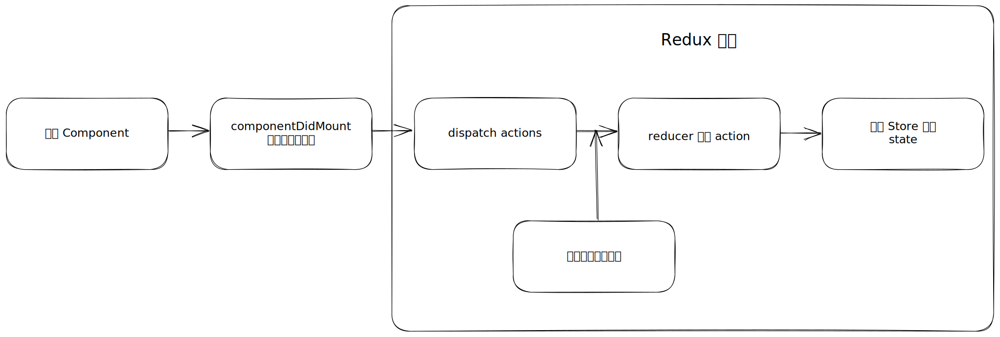

# Redux

## 理解JavaScript的纯函数

- 函数式编程中有一个非常重要的概念 **纯函数**，JavaScript符合函数式编程的范式，所以也有纯函数的概念
  - 在React开发中，纯函数被多次提及：
  - React组件被要求像一个纯函数（为什么是像，因为还有类组件）
  - Redux中有一个reducer的概念，同样是要求必须是一个纯函数
- 掌握纯函数对于理解很多框架的设计都是有帮助的

一个纯函数必然具备以下特征：

- 确定的输入一定产生确定的输出
- 函数的执行过程中，不能产生副作用


## 为什么需要Redux

- JS需要管理的状态越来越多，越来越复杂
- 状态不断发生变化之间又相互依赖，这要求视图层也能同步更新
- React提供了自动更新视图的方法，但状态仍需要手动管理
- Redux可以帮我们管理状态，提供了**可预测的状态管理**
- 框架无关，体积只有2KB大小

## Redux的核心理念

Redux的核心理念 Store

- 定义一个统一的规范来操作数据，这样就可以做到对数据的跟踪
- `list.push()` `list[0].age = 18`

Redux的核心理念 Action

- Redux要求：要修改数据，必须通过Action来修改
- 所有数据的变化，必须通过派发（Patch）Action来更新
- Action是一个普通的JS对象，用来描述此次更新的type与content
- `const action = { type: 'ADD_ITEM', item: { name: 'Ziu', age: 18 } }`

Redux的核心理念 Reducer

- 如何将Store和Action联系在一起？
- reducer是一个纯函数
- 完成的工作就是：将传入的state和action结合起来，生成一个新的state
- `patch` => `reducer` => `newState` => `Store`

## Redux Demo

下例中，通过`createStore`创建了一个Store（已经不推荐了）

- initialState用于在调用`createStore`时作为默认值传入`reducer`
- 后续每次`store.dispatch`都会调用`reducer`
- 通过`reducer`更新state中的数据

在React中，可以通过`store.subscribe`注册State变化的监听回调

- 当state发生变化时，通过调用`this.forceUpdate`触发组件的更新
- 一般情况下，我们在`componentDidMount`注册监听回调，在`componentWillUnmount`解除监听

::: code-group
```tsx [App.jsx]
// App.jsx
import React, { PureComponent } from 'react'
import store from './store'

export default class App extends PureComponent {
  componentDidMount() {
    // Subscribe to the store
    store.subscribe(() => {
      console.log('subscribe', store.getState())
      this.forceUpdate()
    })
  }

  componentWillUnmount() {
    store.unsubscribe()
  }

  render() {
    return (
      <div>
        <h1>App</h1>
        <p>Count: {store.getState().count}</p>
        <p>Name: {store.getState().name}</p>
        <button onClick={() => store.dispatch({ type: 'INCREMENT' })}> +1 </button>
        <button onClick={() => store.dispatch({ type: 'DECREMENT' })}> -1 </button>
        <button onClick={() => store.dispatch({ type: 'CHANGE_NAME', name: 'ZIU' })}>
          {' '}
          CHANGE_NAME{' '}
        </button>
      </div>
    )
  }
}
```
```tsx [index.js]
// store/index.js
import { createStore } from 'redux'

// The initial application state
// This is the same as the state argument we passed to the createStore function
const initialState = {
  count: 0,
  name: 'Ziu'
}

// Reducer: a pure function that takes the previous state and an action, and returns the next state.
// (previousState, action) => newState
function reducer(state = initialState, action) {
  console.log('reducer', state, action)

  switch (action.type) {
    case 'INCREMENT':
      // NOTE: Keep functions pure - do not mutate the original state.
      // Desctructure the state object and return a **new object** with the updated count
      // Instead of `return state.count++`
      return {
        ...state,
        count: state.count + 1
      }
    case 'DECREMENT':
      return {
        ...state,
        count: state.count - 1
      }
    case 'CHANGE_NAME':
      return {
        ...state,
        name: action.name
      }
    default:
      return state
  }
}

const store = createStore(reducer)

export default store
```
:::


## 进一步封装

可以将耦合在一起的代码拆分到不同文件中

- 将`reducer`抽取出来`reducer.js`，简化`store/index.js`内容
- 将`action.type`抽取为常量`constants.js`，使用时做导入，以保证一致性
- 将`action`抽取出来`actionFactory.js`，用于外部dispatch时规范类型

::: code-group
```tsx [index.js]
// store/index.js
import { createStore } from 'redux'
import reducer from './reducer'

const store = createStore(reducer)

export default store
```
```tsx [constants.js]
// constants.js
export const INCREMENT = 'INCREMENT'
export const DECREMENT = 'DECREMENT'
export const CHANGE_NAME = 'CHANGE_NAME'
```
```tsx [reducer.js]
// reducer.js
import * as actionType from './constants'

const initialState = {
  count: 0,
  name: 'Ziu'
}

export default function reducer(state = initialState, action) {
  switch (action.type) {
    case actionType.INCREMENT:
      return {
        ...state,
        count: state.count + 1
      }
    case actionType.DECREMENT:
      return {
        ...state,
        count: state.count - 1
      }
    case actionType.CHANGE_NAME:
      return {
        ...state,
        name: action.name
      }
    default:
      return state
  }
}
```
```tsx [actionFactory.js]
// actionFactory.js
import * as actionType from './constants'

export const increment = () => ({
  type: actionType.INCREMENT
})

export const decrement = () => ({
  type: actionType.DECREMENT
})

export const changeName = (name) => ({
  type: actionType.CHANGE_NAME,
  name
})
```
:::

```tsx
// App.jsx
import React, { PureComponent } from 'react'
import store from './store'
import { increment, decrement, changeName } from './store/actionFactory'

export default class App extends PureComponent {
  componentDidMount() {
    store.subscribe(() => this.forceUpdate())
  }
  componentWillUnmount() {
    store.unsubscribe()
  }
  render() {
    return (
      <div>
        <h1>App</h1>
        <p>Count: {store.getState().count}</p>
        <p>Name: {store.getState().name}</p>
        <button onClick={() => store.dispatch(increment())}> +1 </button>
        <button onClick={() => store.dispatch(decrement())}> -1 </button>
        <button onClick={() => store.dispatch(changeName('ZIU'))}>CHANGE_NAME</button>
      </div>
    )
  }
}
```

## Redux的三大原则

单一数据源

- 整个应用程序的状态都被存储在一棵Object Tree上
- 且这个Object Tree只存储在一个Store中
- 但Redux并不强制限制创建多Store，不利于数据维护
- 单一数据源有利于整个应用程序的维护、追踪、修改

State属性是只读的

- 允许修改State的方法只有patch action，不要直接修改State
- 确保了View或网络请求都不能修改State
- 保证所有的修改都能被追踪、按照严格的顺序执行，不用担心竞态（race condition）的问题

使用纯函数来执行修改

- 通过reducer将旧State与新State联系在一起，并且返回一个**新的State**
- 随着应用程序复杂程度增加，可以将reducer拆分为多个小的reducer，分别用于操作不同State Tree的某一部分
- 所有的reducer都应该是纯函数，不能产生任何的副作用

## 优化重复代码

当编写了一些案例的时候会发现，React结合Redux时会编写很多重复的代码

在每个需要用到Redux中状态的组件中，都需要在不同生命周期做添加订阅/解除订阅的处理，组件初始化时还要从store中取最新的状态

针对重复代码的问题，可以使用之前学到的高阶组件来做优化

Redux官方提供的库`react-redux`，可以让我们更方便的在React中使用Redux

```bash
npm i react-redux
```

在Profile组件中，通过高阶函数`connect`实现的

将store中需要的状态通过`mapStoreToProps`转为props，并将需要使用store中状态的组件传入调用connect返回的函数中

在`Profile`组件中就可以从props中获取到store中的状态

::: code-group
```tsx [App.jsx]
// App.jsx
import React, { PureComponent } from 'react'
import { Provider } from 'react-redux'
import store from './store'
import Profile from './Profile'

export default class App extends PureComponent {
  render() {
    return (
      <Provider store={store}>
        <div>
          <h2>App</h2>
          <Profile></Profile>
        </div>
      </Provider>
    )
  }
}
```
```tsx [Profile.jsx]
// Profile.jsx
import React, { Component } from 'react'
import { connect } from 'react-redux'

// mapStateToProps is a function that
//  takes the state of the store as an argument
//  and returns an object with the data that the component needs from the store.
// component will receive the data as props.
const mapStateToProps = (state) => ({
  count: state.count
})

export default connect(mapStateToProps)(
  class Profile extends Component {
    render() {
      return (
        <div>
          <h2>Profile</h2>
          <p>Count: {this.props.count}</p>
        </div>
      )
    }
  }
)
```
:::

我们刚刚只是完成了对State的映射，将Store中保存的全局状态state映射到了Profile组件的props中

connect还可以传入第二个参数，用于将action也映射到props中：

```tsx {4,10-13,17,25,26}
// Profile.jsx
import React, { Component } from 'react'
import { connect } from 'react-redux'
import { INCREMENT, DECREMENT } from './store/constants'

const mapStateToProps = (state) => ({
  count: state.count
})

const mapDispatchToProps = (dispatch) => ({
  increment: () => dispatch({ type: INCREMENT }),
  decrement: () => dispatch({ type: DECREMENT })
})

export default connect(
  mapStateToProps,
  mapDispatchToProps
)(
  class Profile extends Component {
    render() {
      return (
        <div>
          <h2>Profile</h2>
          <p>Count: {this.props.count}</p>
          <button onClick={this.props.increment}> +1 </button>
          <button onClick={this.props.decrement}> -1 </button>
        </div>
      )
    }
  }
)
```

本质上是`connect`内部对操作进行了封装，把逻辑隐藏起来了：

- 调用`connect`这个**高阶函数**，返回一个**高阶组件**
- 为高阶组件传入映射目标组件，最后高阶组件返回一个新组件
- 新组件的props包含了来自Store中状态/dispatch的映射

## 异步Action

有些场景下，我们希望组件能够直接调用Store中的action来触发网络请求，并且获取到数据

但是dispatch只允许派发对象类型的Action，不能通过dispatch派发函数

可以通过中间件`redux-thunk`来对Redux做增强，让dispatch能够对函数进行派发

```bash
npm i redux-thunk
```

通过`applyMiddleware`引入`redux-thunk`这个中间件：

::: code-group
```tsx [index.js] {2,3,6}
// store/index.js
import { createStore, applyMiddleware } from 'redux'
import thunk from 'redux-thunk'
import reducer from './reducer'

const store = createStore(reducer, applyMiddleware(thunk))

export default store
```
```tsx [actionFactory.js]
// actionFactory.js
export const fetchPostList = () => {
  return (dispatch, getState) => {
    fetch('https://jsonplaceholder.typicode.com/posts')
      .then((res) => res.json())
      .then((res) => {
        dispatch({
          type: actionType.FETCH_POST_LIST,
          list: res
        })
      })
  }
}
```
```tsx [list.jsx]
// list.jsx
import React, { Component } from 'react'
import { connect } from 'react-redux'
import { fetchPostList } from './store/actionFactory'

const mapStateToProps = (state) => ({
  list: state.list
})

const mapDispatchToProps = (dispatch) => ({
  fetchList: () => dispatch(fetchPostList())
})

export default connect(
  mapStateToProps,
  mapDispatchToProps
)(
  class Profile extends Component {
    render() {
      return (
        <div>
          <h2>List</h2>
          <button onClick={() => this.props.fetchList()}>Fetch List</button>
          {this.props.list.length && (
            <ul>
              {this.props.list.map((item) => (
                <li key={item.id}>{item.title}</li>
              ))}
            </ul>
          )}
        </div>
      )
    }
  }
)
```
:::

- 这样就可以将网络请求的具体逻辑代码隐藏到Redux中
- 将网络请求归于状态管理的一部分
- 而不是书写在组件内，不利于维护，耦合度太高

`redux-thunk`是如何做到可以让我们发送异步请求的？

- 默认情况下`dispatch(action)`的action必须为一个JS对象
- `redux-thunk`允许我们传入一个函数作为`action`
- 函数会被调用，并且将`dispatch`函数和`getState`函数作为入参传递给这个函数action
  - `dispatch` 允许我们在这之后再次派发`action`
  - `getState` 允许我们之后的一些操作依赖原来的状态，可以获取到之前的状态

下图展示了从组件调用方法，触发patch到Redux接收patch、发送网络请求、更新state的全过程：



## 拆分Store

拆分Store带来的益处很多，便于多人协作、不同业务逻辑解耦等

在Redux中，拆分Store的本质是拆分不同的`reducer`函数，之前在使用`createStore`时，传入的就是`reducer`函数

之前的Store写法与用法：

```tsx {8-9}
// store/index.js
import { createStore } from 'redux'
import reducer from './reducer'

const store = createStore(reducer)

// App.jsx
store.getState().count
store.getState().list
```

拆分Store后的写法与用法：

```tsx {7-8,14-15}
// store/index.js
import { createStore, combineReducers } from 'redux'
import counterReducer from './counter'
import postListReducer from './postList'

const reducer = combineReducers({
  counter: counterReducer,
  postList: postListReducer
})

const store = createStore(reducer)

// App.jsx
store.getState().counter.count
store.getState().postList.count
```

拆分为多个Reducer之后，需要首先`getState()`获取到整个状态树，随后指定获取到不同的模块中的状态

拆分后，不同模块下的文件是保持一致的：

```sh
- store/ # Store根目录
  - index.js # 导出 store 位置
  - counter/ # Counter模块
    - actionFactory.js
    - constants.js
    - index.js # 统一导出
    - reducer.js
  - postList/ # PostList模块
    - actionFactory.js
    - constants.js
    - index.js
    - reducer.js
  - ...
```

### combineReducer函数

前面拆分Store时用到了`combineReducer`函数，将多个模块reducer组合到一起，函数内部是如何处理的？

- 将传入的reducers合并到一个对象中，最终返回一个`combination`函数（相当于未拆分时传给`createStore`的`reducer`函数）
- 在执行`combination`函数的过程中，它会通过判断前后返回的数据是否相同来决定返回之前的state还是新的state
- 新state会触发订阅者发生对应更新，而旧state可以有效地组织订阅者发生刷新

下面简单写了一下`combineReducer`的实现原理

```ts
// 使用
combineReducer({
  counter: combineReducer,
  postList: postListReducer
})

// 创建一个新的reducer
function reducer(state = {}, action) {
  // 返回一个对象 是Store的state
  return {
    counter: counterReducer(state.counter, action),
    postList: postListReducer(state.postList, action)
  }
}
```

## ReduxToolkit

- ReduxToolkit重构
- ReduxToolkit异步
- connect高阶组件
- 中间件的实现原理
- React状态管理选择

## 认识ReduxToolkit

之前在使用`createStore`创建Store时会出现deprecated标识，推荐我们使用`@reduxjs/toolkit`包中的`configureStore`函数

Redux Toolkit是官方推荐编写Redux逻辑的方法

- 在前面学习Redux时已经发现，Redux的逻辑编写过于繁琐、麻烦
- 代码分拆在不同模块中，存在大量重复代码
- Redux Toolkit旨在成为编写Redux逻辑的标准方式，从而解决上面提到的问题
- 这个包常被称为：RTK

## 使用ReduxToolkit重写Store

Redux Toolkit依赖于react-redux包，所以需要同时安装这二者

```bash
npm i @reduxjs/toolkit react-redux
```

Redux Toolkit的核心API主要是下述几个：

- `configureStore` 包装createStore以提供简化的配置选项和良好的默认值
  - 可以自动组合你的slice reducer 添加你提供的任何Redux中间件
  - 默认包含redux-thunk，并启用Redux DevTools Extension
- `createSlice` 创建切片 片段
  - 接受reducer函数的对象、切片名称和初始状态值，并自动生成切片reducer，并带有actions
- `createAsyncThunk`
  - 接受一个动作类型字符串和一个返回Promise的函数
  - 并生成一个`pending / fullfilled / rejected`基于该承诺分派动作类型的thunk

写一个Demo：

::: code-group
```tsx [index.js]
// store/index.js
import { configureStore } from '@reduxjs/toolkit'
import counterSlice from './features/counter'

const store = configureStore({
  reducer: {
    counter: counterSlice
  }
})

export default store
```
```tsx [counter.js]
// store/features/counter.js
import { createSlice } from '@reduxjs/toolkit'

const counterSlice = createSlice({
  name: 'counter',
  initialState: {
    count: 0
  },
  reducers: {
    addCount(state, action) {
      const { payload } = action
      state.count += payload
    },
    subCount(state, action) {
      const { payload } = action
      state.count -= payload
    }
  }
})

const { actions, reducer } = counterSlice

export const { addCount, subCount } = actions

export default reducer
```
```tsx [Counter.jsx]
// Counter.jsx
import React, { Component } from 'react'
import { connect } from 'react-redux'
import { addCount, subCount } from '../store/features/counter'

const mapStateToProps = (state) => ({
  count: state.counter.count
})

const mapDispatchToProps = (dispatch) => ({
  increment: (count) => {
    const action = addCount(count)
    return dispatch(action)
  },
  decrement: (count) => {
    const action = subCount(count)
    return dispatch(action)
  }
})

export default connect(
  mapStateToProps,
  mapDispatchToProps
)(
  class Counter extends Component {
    render() {
      const { count } = this.props

      return (
        <div>
          <h2>Counter</h2>
          <div>count: {count}</div>
          <button onClick={() => this.props.increment(1)}>+1</button>
          <button onClick={() => this.props.decrement(1)}>-1</button>
        </div>
      )
    }
  }
)
```
:::

`createSlice` 函数参数解读

- `name` 标记Slice 展示在dev-tool中
- `initialState` 初始化状态
- `reducers` 对象 对应之前的reducer函数
- 返回值: 一个对象 包含所有actions

`configureStore` 解读

- `reducer` 将slice中的reducer组成一个对象，传入此参数
- `middleware` 额外的中间件
  - RTK已经为我们集成了`redux-thunk`和`redux-devtool`两个中间件
- `devTools` 布尔值 是否启用开发者工具

## 使用RTK执行异步dispatch

实际场景中都是在组件中发起网络请求，并且将状态更新到Store中

之前的开发中，我们通过`redux-thunk`这个中间件，让dispatch中可以进行异步操作

ReduxToolkit默认已经给我们集成了Thunk相关的功能：`createAsyncThunk`

下面我们使用RTK实现一下这个场景：在Profile中请求postList数据并保存在Store中，并展示出来

::: code-group
```tsx [postList.js] {4-8,20}
// store/features/postList.js
import { createSlice, createAsyncThunk } from '@reduxjs/toolkit'

export const fetchPostList = createAsyncThunk('fetch/postList', async () => {
  const url = 'https://jsonplaceholder.typicode.com/posts'
  const data = await fetch(url).then((res) => res.json())
  return data
})

const postListSlice = createSlice({
  name: 'postList',
  initialState: {
    postList: []
  },
  reducers: {
    setPostList(state, { payload }) {
      state.postList = payload
    }
  },
  extraReducers: {
    [fetchPostList.fulfilled]: (state, { payload }) => {
      console.log('payload', payload)
      state.postList = payload
    },
    [fetchPostList.pending]: (state, { payload }) => {
      console.log('fetchPostList.pending', payload)
    },
    [fetchPostList.rejected]: (state, { payload }) => {
      console.log('fetchPostList.rejected', payload)
    }
  }
})

export const { setPostList } = postListSlice.actions

export default postListSlice.reducer
```
```tsx [index.js]
// store/index.js
import { configureStore } from '@reduxjs/toolkit'
import counterReducer from './features/counter'
import postListReducer from './features/postList'

export default configureStore({
  reducer: {
    counter: counterReducer,
    postList: postListReducer
  }
})
```
```tsx [Profile.jsx]
// Profile.jsx
import React, { Component } from 'react'
import { connect } from 'react-redux'
import { fetchPostList } from '../store/features/postList'

const mapStateToProps = (state) => ({
  postList: state.postList.postList
})

const mapDispatchToProps = (dispatch) => ({
  fetchPostList: () => dispatch(fetchPostList())
})

export default connect(
  mapStateToProps,
  mapDispatchToProps
)(
  class Profile extends Component {
    render() {
      return (
        <div>
          Profile
          <button onClick={() => this.props.fetchPostList()}>Fetch Data</button>
          <ul>
            {this.props.postList.map((item, index) => (
              <li key={index}>{item.title}</li>
            ))}
          </ul>
        </div>
      )
    }
  }
)
```
:::

当`createAsyncThunk`创建出来的action被dispatch时，会存在三种状态：

- pending: action被发出，但是还没有最终的结果
- fulfilled: 获取到最终的结果（有返回值的结果）
- rejected: 执行过程中又错误或者抛出了异常

我们可以在`createSlice`的`entraReducer`中监听这些结果，根据派发action后的状态添加不同的逻辑进行处理

除了上述的写法，还可以为`extraReducer`传入一个函数，函数接收一个`builder`作为参数，在函数体内添加不同的case来监听异步操作的结果：

```ts
// postList.js
...
extraReducers: (builder) => {
  builder.addCase(fetchPostList.fulfilled, (state, { payload }) => {
    state.postList = payload
  })
  builder.addCase(fetchPostList.pending, (state, { payload }) => {
    console.log('fetchPostList.pending', payload)
  })
  builder.addCase(fetchPostList.rejected, (state, { payload }) => {
    console.log('fetchPostList.rejected', payload)
  })
}
...
```

在之前的代码中，我们都是通过触发action后置的回调来更新state，那么有没有可能在请求完毕时确定性地更新store中的state？

可以当请求有结果了，在请求成功的回调中直接dispatch设置state的action

当我们通过dispatch触发异步action时可以传递额外的参数，这些参数可以在传入createAsyncThunk的回调函数的参数中获取到，同时也可以从函数的参数中获取到`dispatch`与`getState`函数，这样就可以在请求到数据后直接通过派发action的方式更新store中的state，下面是修改后的例子：

```ts {6}
// postList.js
import { createSlice, createAsyncThunk } from '@reduxjs/toolkit'

export const fetchPostList = createAsyncThunk(
  'fetch/postList',
  async (extraInfo, { dispatch, getState }) => {
    const url = 'https://jsonplaceholder.typicode.com/posts'
    const data = await fetch(url).then((res) => res.json())
    dispatch(setPostList(data))
  }
)

const postListSlice = createSlice({
  name: 'postList',
  initialState: {
    postList: []
  },
  reducers: {
    setPostList(state, { payload }) {
      state.postList = payload
    }
  }
})

export const { setPostList } = postListSlice.actions

export default postListSlice.reducer
```

当然，此时异步action的状态已经不那么重要了，也就不必再`return data`了，除非你需要对异常状态做额外处理，仍然可以在`extraReducers`中添加异常处理回调

## Redux Toolkit的数据不可变性

Redux Toolkit本质是对之前繁琐的操作进行的一次封装

我们注意到：在之前reducer对state进行更新时，必须返回一个新的state才能触发修改`state = { ...state, count: count + 1 }`，但是经过Redux Toolkit的封装，我们只需要`state.count += 1`，直接对状态进行赋值就可以完成状态的更新

这是因为在RTK内部使用了`immutable.js`，数据不可变性

- 在React开发中，我们总是强调数据的不可变性
  - 无论是类组件中的state还是redux中管理的state
  - JS的编码过程里，数据的不可变性都是非常重要的
- 所以在之前我们更新state时都是通过浅拷贝来完成的
  - 但是浅拷贝也存在它的缺陷：
  - 当对象过大时，进行浅拷贝会造成性能的浪费
  - 浅拷贝后的新对象，其深层属性仍然是旧对象的引用

Redux Toolkit底层使用了`immerjs`库来保证数据的不可变性

immutablejs库的底层原理和使用方法：[React系列十八 - Redux(四)state如何管理](https://mp.weixin.qq.com/s/hfeCDCcodBCGS5GpedxCGg)

为了节约内存，出现了新的算法`Persistent Data Structure`持久化数据结构/一致性数据结构

- 用一种数据结构来保存数据
- 当数据被修改时，会返回一个新的对象，但是新的对象会尽可能复用之前的数据结构而不会对内存进行浪费
- 比如有一棵引用层级较深的树，当我们对其深层某个节点进行修改时，不会完全拷贝整棵树，而是在尽可能复用旧树结构的同时创建一棵新的树

一图胜千言：


## connect的实现原理

connect函数是`react-redux`提供的一个高阶函数，它返回一个高阶组件，用于将store中的state/dispatch映射为组件的props

下面一步一步手写一个connect函数，实现和库提供的connect一样的映射功能：

首先完成基本的代码搭建，connect函数接收两个参数`mapStateToProps` `mapDispatchToProps`返回一个高阶组件

所谓高阶组件，就是传入一个类组件，返回一个增强后的新的类组件：

```tsx
// connect.js
import { PureComponent } from 'react'

export default function connect(mapStateToProps, mapDispatchToProps) {
  return (WrapperComponent) =>
    class InnerComponent extends PureComponent {
      render() {
        return <WrapperComponent {...this.props} />
      }
    }
}
```

其中，`mapStateToProps`和`mapDispatchToProps`都是函数，函数入参是`state`与`dispatch`，返回一个对象，键值对对应`prop <=> state/dispatch调用`

我们导入store，并且从store中获取到state和dispatch传入`mapStateToProps`和`mapDispatchToProps`，随后将得到的键值对以props形式传递给WrapperComponent

这样新组件就可以拿到这些状态与dispatch方法，我们可以在`componentDidMount`中监听整个store，当store中的状态发生改变时，强制执行re-render

```tsx {9}
// connect.js
import { PureComponent } from 'react'
import store from '../store'

export default function connect(mapStateToProps, mapDispatchToProps) {
  return (WrapperComponent) =>
    class InnerComponent extends PureComponent {
      componentDidMount() {
        store.subscribe(() => this.forceUpdate())
      }

      render() {
        const state = mapStateToProps(store.getState())
        const dispatch = mapDispatchToProps(store.dispatch)
        return <WrapperComponent {...this.props} {...state} {...dispatch} />
      }
    }
}
```

上述代码能够正常工作，但是显然每次store内state发生改变都re-render是不明智的，因为组件可能只用到了store中的某些状态

那些组件没有用到的其他状态发生改变时，组件不应该也跟着re-render，这里可以做一些优化

```ts {10,14-16}
// connect.js
import { PureComponent } from 'react'
import store from '../store'

export default function connect(mapStateToProps, mapDispatchToProps) {
  return (WrapperComponent) =>
    class InnerComponent extends PureComponent {
      constructor(props) {
        super(props)
        this.state = mapStateToProps(store.getState())
      }

      componentDidMount() {
        store.subscribe(() => {
          this.setState(mapStateToProps(store.getState()))
        })
      }

      render() {
        const state = mapStateToProps(store.getState())
        const dispatch = mapDispatchToProps(store.dispatch)

        return <WrapperComponent {...this.props} {...state} {...dispatch} />
      }
    }
}
```

经过优化后，每次store.state发生变化会触发setState，由React内部的机制来决定组件是否应当重新渲染

如果组件依赖的state发生变化了，那么React会替我们执行re-render，而不是每次都强制执行re-render

进一步地，我们可以补充更多细节：

- 当组件卸载时解除监听
  - `store.subscribe`会返回一个`unsubscribe`函数 用于解除监听
- 解除与业务代码store的耦合
  - 目前的store来自业务代码 更优的做法是从context中动态获取到store
  - 应当提供一个context Provider供用户使用
  - 就像`react-redux`一样，使用connect前需要将App用Provider包裹并传入store

至此就基本完成了一个connect函数

::: code-group
```tsx [connect.js]
// connect.js
import { PureComponent } from 'react'
import { StoreContext } from './storeContext'

export function connect(mapStateToProps, mapDispatchToProps) {
  return (WrapperComponent) => {
    class InnerComponent extends PureComponent {
      constructor(props, context) {
        super(props)
        this.state = mapStateToProps(context.getState())
      }

      componentDidMount() {
        this.unsubscribe = this.context.subscribe(() => {
          this.setState(mapStateToProps(this.context.getState()))
        })
      }

      componentWillUnmount() {
        this.unsubscribe()
      }

      render() {
        const state = mapStateToProps(this.context.getState())
        const dispatch = mapDispatchToProps(this.context.dispatch)

        return <WrapperComponent {...this.props} {...state} {...dispatch} />
      }
    }

    InnerComponent.contextType = StoreContext

    return InnerComponent
  }
}
```
```tsx [storeContext.js]
// storeContext.js
import { createContext } from 'react'

export const StoreContext = createContext(null)

export const Provider = StoreContext.Provider
```
```tsx [App.jsx]
// App.jsx
import React, { Component } from 'react'
import store from './store'
import Counter from './cpns/Counter'
import { Provider } from './hoc'

export default class App extends Component {
  render() {
    return (
      <Provider value={store}>
        <div>
          <h1>React Redux</h1>
          <Counter />
        </div>
      </Provider>
    )
  }
}
```
:::

## 实现日志中间件logger

设想现在有需求：设计一个Redux中间件，当我们每次通过dispatch派发action时都能够在控制台输出：派发了哪个action，传递的数据是怎样的

最终实现：拦截dispatch，并且在控制台打印派发的action

```ts
// logger.js
function logger(store) {
  const next = store.dispatch // 保留原始的dispatch函数
  function dispatchWithLog(action) {
    console.group(action.type)
    console.log('dispatching', action)
    const res = next.dispatch(action)
    console.log('next state', store.getState())
    console.groupEnd()
    return res
  }
  store.dispatch = dispatchWithLog
}

logger(store) // 应用中间件
```

通过`monkey patch`对原始dispatch函数进行了修改，为函数添加额外的副作用

## 实现redux-thunk

`redux-thunk`这个库帮我们提供了派发异步函数的功能

回顾一下`redux-thunk`的功能：

- 默认情况下dispatch(action)的action必须为一个JS对象
- redux-thunk允许我们传入一个函数作为action
- 函数会被调用，并且将dispatch函数和getState函数作为入参传递给这个函数action
  - dispatch 允许我们在这之后再次派发action
  - getState 允许我们之后的一些操作依赖原来的状态，可以获取到之前的状态

```ts {7}
// thunk.js
function thunk(store) {
  const next = store.dispatch
  function dispatchWithThunk(action) {
    if (typeof action === 'function') {
      // pass dispatch and getState to the thunk
      return action(store.dispatch, store.getState)
    }
    return next(action)
  }
  return dispatchWithThunk
}

thunk(store) // 应用中间件
```

需要注意的是，传递给函数action的第一个参数是经过更新后的新的`dispatch`函数，这是从细节考虑：如果在函数中又派发了函数

## 实现applyMiddleware

当我们需要同时应用多个中间件时，可以用`applyMiddleware`来对多个中间件进行组合，统一进行注册

```ts
// applyMiddleware.js
function applyMiddleware(store, ...fns) {
  fns.forEach(fn => fn(store))
}

applyMiddleware(store, logger, thunk) // 使用applyMiddleware
```
