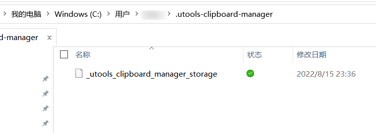

# 使用指南

## 如何迁移数据

`v2.0.0` 及之前的版本，剪贴板数据存放在

- `Windows` `Linux`用户：`{home}\_utools_clipboard_manager_storage`
- `Mac`用户：`{userData}\_utools_clipboard_manager_storage`

`v2.0.0` 版本之后，剪贴板数据存放在

- `{userData}\.utools-clipboard-manager\_utools_clipboard_manager_storage`

要手动迁移数据，只需要在新设备上运行一次插件，而后将原设备上的数据文件拷贝并替换新设备中的数据文件即可

## 如何实现多端同步

::: warning
`v2.0.0` 及之后的版本适用
:::

### 坚果云

到[坚果云官网](https://www.jianguoyun.com/#/)安装好软件后，找到`.utools-clipboard-manager`目录

右键目录，`坚果云`/`同步该文件夹`，将此文件夹加入到坚果云的同步服务中

这样，每次剪贴板内容更新都将自动触发坚果云的同步服务，将剪贴板数据同步到云端

其他安装了坚果云的设备也将自动同步更新

### OneDrive

> 有待测试
