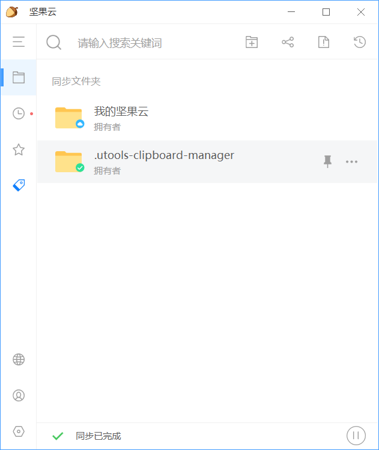

# 使用指南

[插件发布页](https://yuanliao.info/d/5722/29)

## 如何实现多端同步

### 坚果云

到[坚果云官网](https://www.jianguoyun.com/#/)安装好软件后，找到`.utools-clipboard-manager`目录

- `Windows`用户：`C:\Users\{Username}\.utools-clipboard-manager`
- `Mac`用户：``

右键目录，`坚果云`/`同步该文件夹`，将此文件夹加入到坚果云的同步服务中

这样，每次剪贴板内容更新都将自动触发坚果云的同步服务，将剪贴板数据同步到云端

其他安装了坚果云的设备也将自动同步更新

