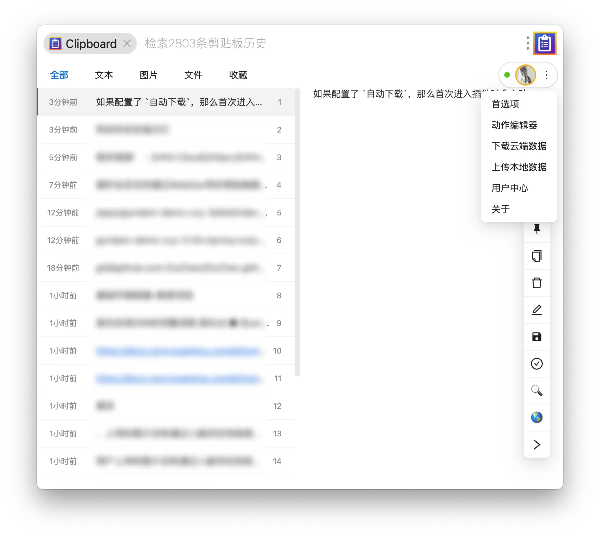
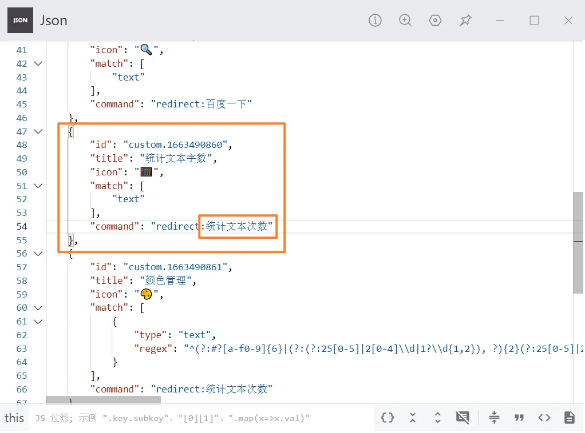

# 使用指南

[[TOC]]

## WebDAV 使用指南 <Badge type="warning" text="Pro" />

插件会员支持通过 WebDAV 将本地的剪贴板数据同步到云端，并在不同设备之间同步：

1. 获取 `服务器地址`、`账号`、`密钥`（如有）
2. 在插件的 `首选项/网络` 中，开启 WebDAV 同步功能
3. 在配置弹窗中填入上述信息，并点击测试连接
4. 在测试连接成功后，点击保存配置，即可完成配置。

在开启 WebDAV 同步功能后，插件的主面板下述变化：

- 主面板下拉菜单中支持主动上传/主动下载数据；
- 主面板用户信息左侧的同步的状态指示灯用以显示当前的同步状态；



此外，每次本地剪贴板内容发生变化，都会将最新数据同步到服务器。

:::warning
注意，如果你同时在多台设备上使用超级剪贴板，并希望通过 WebDAV 同步不同设备上的数据

你需要在 `首选项/网络` 中按需配置 `自动下载`：

- **插件启动时**：仅在插件首次启动时主动从 WebDAV 服务器下载数据。
- **每次进入插件时**：每次进入插件时都会主动从 WebDAV 服务器下载数据。
:::


相关链接：

- [Infini Cloud](https://infini-cloud.net/en/) （国内可用 无限制）
- [坚果云 WebDav](https://help.jianguoyun.com/?tag=webdav)（国内可用 限制调用次数）
- [2022年还有哪些支持WebDAV的网盘？](https://www.zhihu.com/question/347182171)

## 高级搜索 <Badge type="warning" text="Pro" />

超级剪贴板自 `v2.9.1` 起，支持强大的高级搜索功能，让您能够精确地过滤和查找剪贴板历史记录。

### 基本语法

高级搜索使用特殊的语法格式：`关键词:值`，可以与普通文本搜索组合使用。

#### 1. 类型搜索 (type)

按剪贴板内容类型过滤：

```
type:text        # 只显示文本类型
type:image       # 只显示图片类型  
type:file        # 只显示文件类型
type:text,image  # 显示文本和图片类型
```

#### 2. 日期搜索 (date)

按特定日期过滤：

```
date:2024-01-01                    # 搜索2024年1月1日的条目
date:2024-01-01,2024-01-02         # 搜索多个特定日期的条目
```

#### 3. 日期范围搜索 (daterange)

按日期范围过滤：

```
daterange:2024-01-01~2024-01-31    # 搜索2024年1月份的条目
daterange:2024-01-01~2024-12-31    # 搜索2024年全年的条目
```

#### 4. 收藏状态搜索 (collect)

按收藏状态过滤：

```
collect:true     # 只显示收藏的条目
collect:false    # 只显示未收藏的条目
```

#### 5. 置顶状态搜索 (top)

按置顶状态过滤：

```
top:true         # 只显示置顶的条目
top:false        # 只显示未置顶的条目
```

### 组合搜索

您可以组合多个条件，并与普通文本搜索结合：

#### 基本组合示例

```
type:text hello                    # 搜索包含"hello"的文本条目
collect:true 重要                  # 搜索包含"重要"的收藏条目
date:2024-01-01 type:image         # 搜索2024年1月1日的图片
```

#### 复杂组合示例

```
type:text collect:true daterange:2024-01-01~2024-01-31 工作
# 搜索2024年1月份包含"工作"的收藏文本条目

type:file,image top:false date:2024-01-15
# 搜索2024年1月15日的非置顶文件和图片

collect:true daterange:2024-01-01~2024-12-31 项目 计划
# 搜索2024年全年包含"项目"或"计划"的收藏条目
```

### 实际使用场景

#### 场景1：查找特定日期的工作文档

```
daterange:2024-01-01~2024-01-31 type:file 报告
```

#### 场景2：整理收藏的重要信息

```
collect:true type:text 密码
```

#### 场景3：查找最近的截图

```
type:image daterange:2024-08-01~2024-08-01
```

#### 场景4：查找未整理的内容

```
collect:false top:false type:text
```

### 搜索提示

1. **大小写不敏感**：搜索不区分大小写
2. **日期格式**：必须使用 YYYY-MM-DD 格式
3. **组合顺序**：条件的顺序不影响搜索结果
4. **文本搜索**：
   - 对于普通条目，搜索内容文本
   - 对于收藏条目，搜索备注内容
   - 对于文件条目，搜索文件名

## 如何创造自己的动作按钮

在超级剪贴板的右侧悬浮着工具栏，用户可以通过选择这些动作，跳转到其他插件处理剪贴板数据。

插件已经为您内置了一系列动作按钮：

- 讯飞OCR识别
- 百度搜索
- 百度识图
- 统计文本字数
- 颜色管理
- 识别图片中二维码
- 上传到图床
- 翻译

当内置动作无法满足你的需求时，用户可以通过插件内的「动作编辑器」自定义功能按钮，也可以从动作市场中获取更多内置的动作。

### 基础用法

你可以在「动作编辑器」新增一个动作，按要求填写好动作名、插件应用名称、指令以及匹配类型：

- 动作名
  - 用于动作命名，例如「百度OCR识别」
- 插件应用名称
  - 要跳转的插件名称
- 指令
  - 需要插件实现对应的指令
- 匹配类型
  - 选中哪些种类的数据时，才会展示此动作
  - 例如「百度搜搜」只会匹配文本类型的剪贴板历史

以 `百度搜索` 为例，跳转的目标插件应用名称为 `网页快开`，指令为 `百度一下`，匹配的指令类型为 `文本`

此时当你在「超级剪贴板」中选中一个文本时，就可以直接用百度搜索当前选中的这段文本。

### 高级用例

除了使用简单的字符串匹配不同的内容，`超级剪贴板`还支持使用正则表达式，这需要你切换到「高级匹配」并填写 JSON。

以`上传到图床`功能为例：

```json
{
  "id": "custom.1663490864",
  "title": "上传到图床",
  "icon": "🚀",
  "match": ["image", { "type": "file", "regex": ".(?:jpg|jpeg|png)$" }],
  "command": "redirect:上传到图床"
}
```

这个动作除了可以匹配图片，还可以将符合正则的图片文件匹配上，在匹配上的历史记录上展示`上传到图床`按钮，携带数据跳转到图床插件，一键上传。

需要注意的是，因为自定义功能按钮实现的是**携带数据跳转不同插件**，所以`redirect`后的内容并不应该是普通关键字（普通关键字仅能作为插件入口，而不能携带数据），而应该是`文本`/`图片`/`文件或文件夹`：




- `id`: `String` 全局唯一 必须以`custom`开头 建议以时间戳为后缀
- `title`: `String` 鼠标悬停时展示的文本
- `icon`: `String` 展示在插件内的图标
- `match`: `<String | Object>[]` 匹配模式
- `command`: `String` 执行跳转的关键字 前缀`redirect:`是必须的
