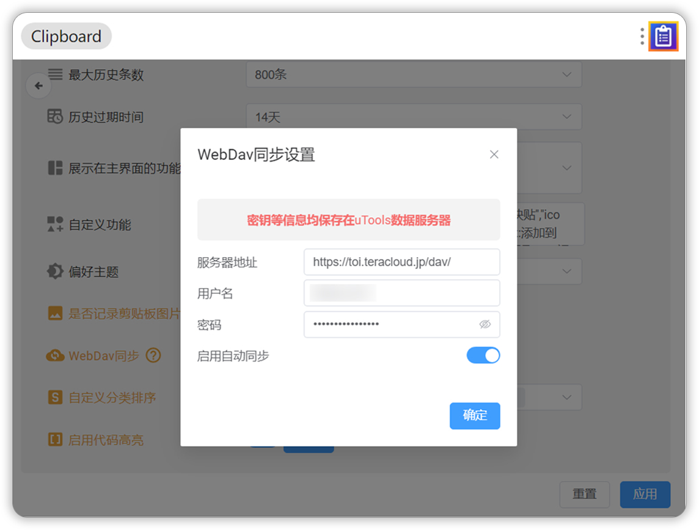
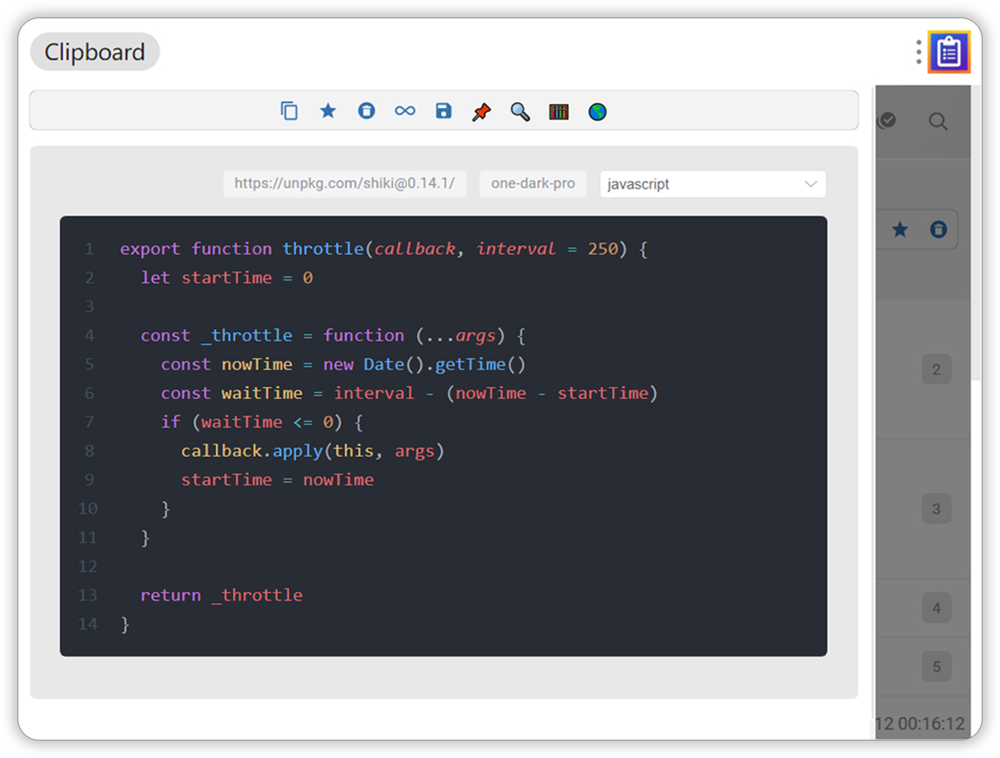

# 插件会员

:::tip
超级剪贴板是一款 “随心所欲” 的软件。您可以永久免费使用它。

但是，如果您真的喜欢它，您可以付费支持它的发展。作为答谢，您将获得更多更方便的功能。这取决于您，如果您不想，也没关系。谢谢你，祝你有美好的一天！☀️
:::

## 会员权益

- **插件会员**
  - `WebDav数据多端同步` <Badge type="tip" text="已上线" />
  - `支持保存2000条历史记录` <Badge type="tip" text="已上线" />
  - `不限制历史记录过期时间` <Badge type="tip" text="已上线" />
  - `文本/图片/文件预览增强, 按住Ctrl/Command点击 解锁更多操作` <Badge type="tip" text="已上线" />
  - `键盘操作模式 Vim快捷键` <Badge type="tip" text="已上线" />
  - `简洁模式 隐藏页面中不必要的组件与元素` <Badge type="tip" text="已上线" />
  - `自定义分类排序` <Badge type="tip" text="已上线" />
  - `预览页代码高亮 预览快捷键` <Badge type="tip" text="已上线" />
  - `关闭剪贴板图片记录` <Badge type="tip" text="已上线" />
  - `插件使用统计` <Badge type="tip" text="已上线" />
  - **...**
- **uTools会员**
  - `插件使用统计` <Badge type="tip" text="已上线" />

## 会员定价

::: warning
- **插件会员为大版本买断制，购买后即可享用当前版本(2.x)后续所有更新的会员内容**
- 插件会员为虚拟商品，购买后不支持退款
- 插件会员的价格是浮动的，随着功能和权益的增加，不排除涨价的可能
- 购买插件会员后若未能及时到账，请[加入QQ群](https://jq.qq.com/?_wv=1027&k=fURjGVJr)反馈
:::

插件会员定价`10元`，登录uTools账号后，点击插件导航栏中个人中心图标进入购买页面

购买后可使用会员功能，不购买不影响基本功能的使用，希望大家多多理解，按需购买

## WebDav同步功能

:::warning
如果剪贴板数据体积过大，可能出现同步时间过长、同步失败等问题

建议及时删除保存在超级剪贴板内的图片，或**关闭记录图片到剪贴板**
:::

插件会员支持通过WebDav同步剪贴板数据

获取`服务器地址 账号 密钥`后，仅需在**插件内的设置页面**添加WebDav配置后，

每次本地数据库发生变化，都会将最新数据同步到同步到服务器（须开启插件内的自动同步 否则需要手动同步）

- 如果配置了WebDav 则每天第一次进入插件时会自动从服务器拉取最新数据
- 如果设置了自动同步 每次本地数据变化将自动同步本地数据到服务器
  - 插件会缓存云端数据文件的ETag 如果云端数据有更新 则采用云端数据覆盖本地数据
  - 数据文件的上传和下载都开启了gzip以节省流量与带宽
  - **清空本地数据库的同时也会触发云端文件清空**
  - 可以选择**关闭图片记录** 以降低同步的数据文件体积 提高同步效率
- 插件仅在每次启动时主动从云端拉取数据 云端数据的更新不会自动同步到本地
- 可以通过点击工具栏按钮主动拉取云端数据到本地或上传数据到云端

相关链接：

- [Infini Cloud](https://infini-cloud.net/en/) （国内可用 无限制）
- [坚果云 WebDav](https://help.jianguoyun.com/?tag=webdav)（国内可用 限制调用次数）
- [2022年还有哪些支持WebDAV的网盘？](https://www.zhihu.com/question/347182171)

## 代码高亮功能

插件使用Shiki作为代码高亮库，为了压缩插件体积、提高代码执行效率，其相关依赖都将从CDN动态加载

支持在设置页修改代码高亮的主题、可选语言、CDN地址，**设置的首个语言为展开预览后的默认语言**

- 默认CDN地址: `https://unpkg.com/shiki@0.14.1/`
- 默认主题: `one-dark-pro`
- 默认语言: `javascript` `css` `html` `json` `markdown` `php` `python` `ruby` `shellscript` `sql` `java` `c` `cpp` `csharp` `go`

更多可用主题/语言，见Github仓库：[Shiki](https://github.com/shikijs/shiki)

## 更多内容

[疑难解答](../statement/index.md)