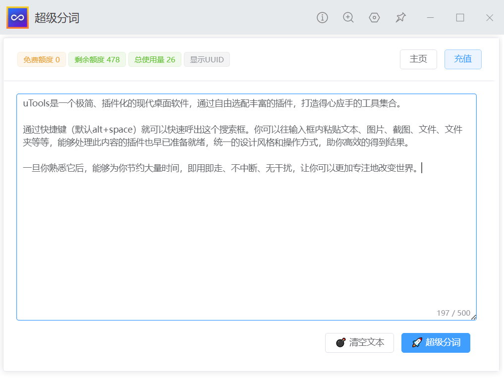

<Title v-bind="titleInfo" />

## 🔰 开始使用

**服务器不会保留处理的数据, 但请避免使用此功能处理敏感数据**

- ✅ 支持选中文本后通过超级面板直接进入分词
- ✅ 支持直接读取剪贴板文本分词
- ✅ 支持单选/拖拽/跨段落快速拖选
- ✅ 支持一键合并复制/粘贴/翻译/搜索
- ✅ 普通用户有每日免费额度 每日0:00重置
- ✅ 优雅、迅速的动效与交互 适配深色模式
- ✅ 可以通过插件内入口获取更多额度
- ✅ 与`超级剪贴板`插件集成，一次购买 多处使用

--------

## 📚 安装方式

- 官方插件市场安装
- 离线插件安装：[百度网盘](https://pan.baidu.com/s/1Shq6mtU9tjhICvcawrp9Ug?pwd=Ziuc)
