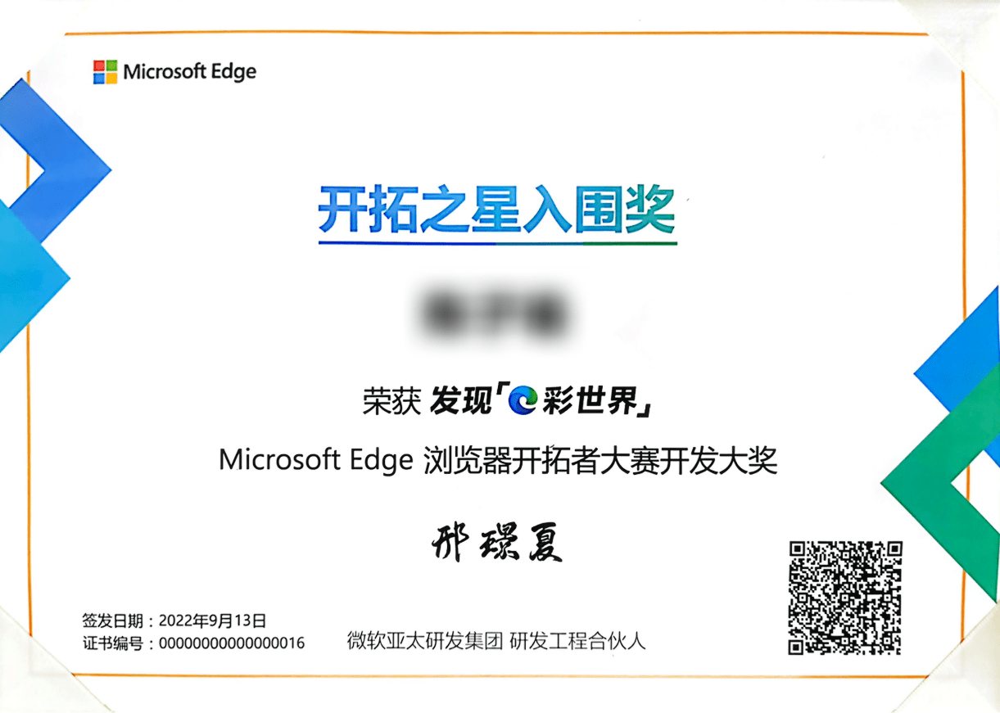

# 个人介绍

北京交通大学（BeijingJiaoTong University）电子信息工程学院本科在读

* 熟悉`ES6`特性, 有前端领域开发经验, 能独立完成基础的前端开发工作;
* 熟练使用`Vue`框架及相关工具开发应用, 阅读过部分`Vue`源码, 了解`Vue`响应式实现原理;
* 掌握`NodeJS`基本使用, 能够基于`NodeJS`编写开发工具或搭建Web服务;
* 了解`Webpack`基本配置和使用, 有`Webpack` `Vite`等前端工程化工具使用经验;
* 了解`Typescript`, 有`Typescript`的项目使用经历;
* 良好的`Git`操作, 清晰的`Commit`提交, 保证代码质量;
* 对前端学习抱有热情, 有良好的学习能力, 能够快速学习掌握新知识;

## 技术栈

### 前端技术

`Vue Router` `Vuex` `Pinia` `Element Plus` `Echart` `WangEditor`

`Sass/Less` `Axios` `Ajax` `...`

### 后端技术

### 相关技能

文档处理：

`Microsoft Word` `Microsoft PowerPoint` `Microsoft Excel` 

平面设计：

`Adobe PhotoShop` `Adobe Lightroom`

影音制作：

`DaVinci Resolve Studio` `Adobe Premiere` `Adobe After Effects`

专业软件：

`MATLAB` `ICEDA` `Multisim` `Keil uVision5`

## 获得奖项

### Microsoft Edge 浏览器开拓者大赛 开拓之星

### 稀土掘金2022编程挑战赛 三等奖

### 入选“扬帆计划·中央和国家机关大学生实习”

### 100周年现场志愿者

### 优秀学生干部、优秀共青团员

### 社会工作优秀奖学金

## 相关链接

[Github](https://github.com/ZiuChen)
[哔哩哔哩](https://space.bilibili.com/7597956)
[稀土掘金](https://juejin.cn/user/4420463502826087)
[CSDN](https://blog.csdn.net/Huuc6)
[Gitee](https://gitee.com/ziuc)