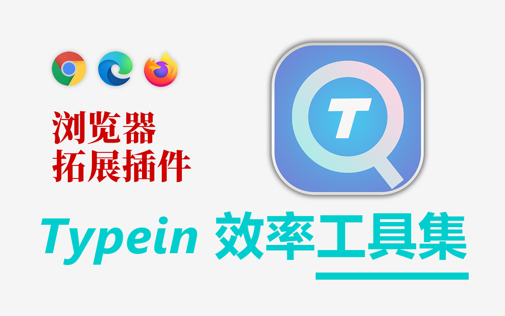

# 开源作品

## 个人作品

### Vue3+TypeScript后台管理系统

Vue3+TypeScript后台管理系统

[源代码](https://github.com/ZiuChen/vue3-ts-cms)

### Typein 效率工具集

Typein 是一个运行在现代浏览器上的拓展插件，它可以帮助你在保持专注的情况下，高效完成各种操作。

[源代码](https://github.com/ZiuChen/Typein) [宣传视频](https://www.bilibili.com/video/BV17F411A7FA)  [Microsoft Edge Add-on Store](https://microsoftedge.microsoft.com/addons/detail/typein/hfgpceehhndaffdbemhafidaiecdhemi)

### A-SOUL浏览器宠物

在浏览器里养一只A-Soul成员当宠物

[源代码](https://github.com/ZiuChen/A-Soul-Browser-Pet) [宣传视频](https://www.bilibili.com/video/BV1gB4y1275J)

### 北京交通大学课程平台功能增强

北京交通大学课程平台功能增强脚本，实现信息聚合，附件上传，让你高效处理课程信息。

[源代码](https://github.com/ZiuChen/NO-FLASH-Upload)

### 超级剪贴板

uTools插件，一款强大的剪贴板管理工具

[主页](../project/ClipboardManager/README.md)

### 超级粘贴

uTools插件，将剪切板内容直接粘贴为文件

[源代码](https://github.com/ZiuChen/FileSaver-uTools)

### PopNotify

仿 Element UI 的通知卡片。

[源代码](https://github.com/ZiuChen/PopNotify)
[Demo](https://ziuchen.github.io/PopNotify/demo/Demo.html)

### UserScripts

用户脚本合集，生产力工具、效率工具、自动化脚本

[源代码](https://github.com/ZiuChen/userscript)

## 开源贡献

### 稀土掘金助手

稀土掘金助手: 腾讯云函数部署

[源代码](https://github.com/ZiuChen/juejin-helper-SCF)

### B站粉丝牌助手文档

B站粉丝牌助手文档

[源代码](https://github.com/ZiuChen/fansMedalHelperVersion)
[Demo](https://ziuchen.github.io/fansMedalHelperVersion/)
